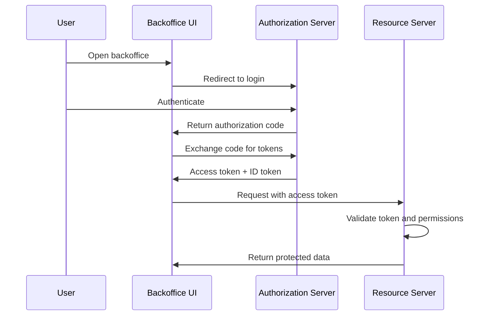

# AGENTS.md — Authorization Server Study

## Mission

This repository is a technical study for an internal backoffice authorization server. The final study should help decide later whether to use a self-hosted open-source IAM solution, a managed identity provider, a minimal internal authorization server built with existing libraries, or a hybrid approach.

The expected outcome is **documentation and evidence-backed recommendations**, not a production-ready authorization server.

## Current Phase

`Phase 1 — IAM Documentation Wiki`

Phase 1 is documentation-only. Create a clear, citation-backed wiki that teaches IAM, OAuth2, OpenID Connect, JWTs, RBAC, token validation, service authentication, administration APIs, and security basics to senior engineers who are not IAM experts.

Do **not** recommend a final vendor, product, architecture, or implementation during Phase 1.

## Non-Negotiable Rules

During Phase 1:

1. Only create or edit Markdown files under `docs/wiki/`.
2. Do not add application code, dependencies, package managers, Docker files, databases, migrations, CI files, generated artifacts, or deployment files.
3. Do not make final vendor, product, architecture, or production recommendations.
4. Do not invent citations, RFC numbers, standards, specification names, URLs, or product behavior.
5. Every wiki page must include a `References` section.
6. Prefer official specifications, standards bodies, and reputable security guidance over blogs or marketing pages.
7. Keep Mermaid diagrams simple and directly related to the explanation.
8. Cross-reference overlapping topics instead of duplicating large sections.
9. Check for an existing suitable file before creating a new one.
10. Before finishing, compare the result with the checklists in this file.

## Instruction Priority

If instructions conflict:

1. Follow the user's explicit request for the current task.
2. Follow this `AGENTS.md`.
3. Follow existing repository conventions.
4. Follow general best practices.

A user request only overrides the Phase 1 boundary if it explicitly says to change phase or expand scope.

## Target Files

Create Phase 1 documentation under:

```text
docs/wiki/
```

Recommended structure:

```text
docs/wiki/
├── README.md
├── 01-authentication-vs-authorization.md
├── 02-oauth2.md
├── 03-openid-connect.md
├── 04-tokens-and-jwt.md
├── 05-rbac.md
├── 06-oauth2-flows.md
├── 07-service-to-service-authentication.md
├── 08-admin-api.md
└── 09-security-best-practices.md
```

Use these names unless the repository already has a clearly better convention.

## Project Context

The study concerns an internal backoffice authorization server for fewer than 1,000 users.

The system must eventually address:

- OAuth2 authorization flows;
- OpenID Connect authentication and identity flows;
- authentication of users, applications, and services;
- RBAC;
- member and user management;
- internal administrator-only administration;
- REST administration APIs for users, roles, permissions, clients, and service access;
- access control for internal backoffice services.

The administration API should support at least:

- creating, reading, updating, disabling, and deleting members;
- creating and listing roles;
- assigning and removing roles from members;
- listing members;
- checking whether a member has a required role or permission for a backoffice service.

Project constraints:

- keep the solution simple, efficient, maintainable, understandable, and operable by the internal team;
- compare self-hosted and managed options later, not during Phase 1;
- prefer open-source components where relevant;
- if self-hosted, prefer SQLite where realistic;
- do not expose public account registration;
- users must be created and managed by administrators;
- RBAC is required;
- avoid unnecessary enterprise IAM complexity;
- avoid over-engineering for the expected scale.

## Required Topics

The wiki must cover:

- authentication vs authorization;
- OAuth2;
- OpenID Connect;
- JWTs;
- access tokens, ID tokens, and refresh tokens;
- OAuth2 clients;
- authorization server, identity provider, and resource server;
- scopes and claims;
- RBAC;
- ABAC as comparison only;
- users, members, roles, and permissions;
- service-to-service authentication;
- Authorization Code Flow;
- Authorization Code Flow with PKCE;
- Client Credentials Flow;
- Refresh Token Flow;
- token validation;
- API protection;
- administration APIs;
- common security risks;
- minimum security best practices.

Do not recommend deprecated or unsafe flows such as Implicit Flow for new applications.

## Big-Picture Requirement

Do not explain concepts only in isolation. The wiki must show how these parts interact:

- users;
- administrators;
- OAuth2 clients;
- authorization servers;
- identity providers;
- tokens;
- roles;
- permissions;
- resource servers;
- backend services;
- administration APIs.

The reader should understand how a user logs in, how tokens are issued, how APIs validate requests, how permissions are checked, and how administrators manage users, roles, permissions, clients, and service accounts.

## Terminology

Use these terms consistently:

- **Authentication**: verifying who a user, service, or application is.
- **Authorization**: deciding what an authenticated subject may access.
- **Member**: a user account managed by the company.
- **User**: a human actor using the system.
- **Administrator**: a privileged user managing IAM data.
- **Role**: a business-level access group, such as `admin`, `support`, `manager`, or `viewer`.
- **Permission**: a granular capability, such as `members:read` or `billing:write`.
- **Client**: an OAuth2/OIDC application registered with the authorization server.
- **Scope**: delegated access requested by a client.
- **Claim**: a piece of information inside a token.
- **Backoffice service**: an internal service protected by the authorization system.
- **Authorization server**: OAuth2 component that issues tokens and manages authorization flows.
- **Identity provider**: component that authenticates users and provides identity information.
- **Resource server**: API or backend service that validates tokens and enforces access control.

Avoid confusing authentication with authorization, OAuth2 with OIDC, access tokens with ID tokens, scopes with permissions, or claims with roles.

When a concept is subtle or often misunderstood, call that out directly.

## Writing Style

Write for senior software engineers who know backend systems, APIs, databases, distributed systems, security basics, and architecture, but may not know IAM-specific standards.

Be precise, practical, evidence-based, technically rigorous, explicit about assumptions and trade-offs, and focused on real system behavior.

Use clear definitions, short sections, practical examples, tables where useful, Mermaid diagrams, common mistakes, security notes, and references.

Avoid marketing language, unsupported claims, vendor bias, unexplained acronyms, beginner-level oversimplification, and claims that one architecture is always correct.

Preferred page structure:

```md
## What it is

## Why it matters

## How it works

## Example

## Common mistakes

## References
```

Adapt when useful, but keep pages consistent and easy to scan.

Suggested page size: 800–1,500 words for core concept pages, shorter for narrow topics. Avoid filler and repeated explanations.

## Engineering Decision Focus

Connect concepts to practical decisions, such as:

- JWTs vs opaque tokens;
- what belongs in an access token;
- where authorization checks should happen;
- how roles and permissions should be modeled;
- when to use scopes versus application permissions;
- how resource servers validate tokens;
- what can be delegated to an identity provider;
- risks of custom administration APIs.

Explain trade-offs when multiple approaches are valid.

## Citation Rules

Every page should include useful citations.

Prioritize:

1. official specifications;
2. standards bodies;
3. official security guidance;
4. official product documentation;
5. reputable technical sources.

Preferred sources include IETF RFCs, OpenID Foundation specifications, OAuth Working Group documents, OWASP guidance, NIST guidance, and official documentation from identity providers such as Keycloak, Auth0, Okta, Microsoft Entra ID, AWS, or similar vendors.

Rules:

- Verify RFC numbers, specification names, and URLs before including them.
- Cite only sources that support the relevant statement.
- Do not add references as decoration.
- If a source cannot be verified, omit it.
- Prefer stable official URLs.
- Avoid relying mainly on blogs, informal tutorials, or marketing pages.

Baseline references:

- [RFC 6749 — OAuth 2.0 Authorization Framework](https://www.rfc-editor.org/rfc/rfc6749)
- [RFC 6750 — OAuth 2.0 Bearer Token Usage](https://www.rfc-editor.org/rfc/rfc6750)
- [RFC 7009 — OAuth 2.0 Token Revocation](https://www.rfc-editor.org/rfc/rfc7009)
- [RFC 7519 — JSON Web Token](https://www.rfc-editor.org/rfc/rfc7519)
- [RFC 7636 — Proof Key for Code Exchange](https://www.rfc-editor.org/rfc/rfc7636)
- [RFC 7662 — OAuth 2.0 Token Introspection](https://www.rfc-editor.org/rfc/rfc7662)
- [RFC 8414 — OAuth 2.0 Authorization Server Metadata](https://www.rfc-editor.org/rfc/rfc8414)
- [RFC 9700 — Best Current Practice for OAuth 2.0 Security](https://www.rfc-editor.org/rfc/rfc9700)
- [OpenID Connect Core 1.0](https://openid.net/specs/openid-connect-core-1_0.html)
- [OpenID Connect Discovery 1.0](https://openid.net/specs/openid-connect-discovery-1_0.html)
- [OWASP API Security Top 10](https://owasp.org/API-Security/)
- [OWASP Authentication Cheat Sheet](https://cheatsheetseries.owasp.org/cheatsheets/Authentication_Cheat_Sheet.html)
- [OWASP Authorization Cheat Sheet](https://cheatsheetseries.owasp.org/cheatsheets/Authorization_Cheat_Sheet.html)
- [NIST SP 800-63-4 — Digital Identity Guidelines](https://pages.nist.gov/800-63-4/)

## Page Guidance

`README.md`: purpose, audience, page map, big-picture IAM architecture, end-to-end login/API flow, glossary.

`01-authentication-vs-authorization.md`: difference between authentication and authorization with internal backoffice examples.

`02-oauth2.md`: OAuth2 as an authorization framework. Include resource owner, client, authorization server, resource server, scopes, access tokens, delegated access.

`03-openid-connect.md`: OIDC as identity layer on OAuth2. Include login, ID tokens, claims, UserInfo, discovery, OAuth2 vs OIDC.

`04-tokens-and-jwt.md`: access tokens, ID tokens, refresh tokens, JWT structure, claims, signatures, expiration, issuer, audience, opaque tokens vs JWTs.

`05-rbac.md`: users, members, roles, permissions, role assignment, permission checks, RBAC limits, short ABAC comparison only.

`06-oauth2-flows.md`: Authorization Code Flow, Authorization Code Flow with PKCE, Client Credentials Flow, Refresh Token Flow, appropriate use cases, common mistakes. Do not recommend Implicit Flow for new apps.

`07-service-to-service-authentication.md`: machine-to-machine authentication, backend services as OAuth2 clients, Client Credentials Flow, service accounts, client secrets, private key JWT or mTLS where relevant, service permissions, operational risks.

`08-admin-api.md`: administration APIs for user, role, permission, client, and service account management. Include audit logs, admin authorization checks, and privileged API risks.

`09-security-best-practices.md`: short-lived access tokens, refresh token rotation where appropriate, PKCE, secure client secret storage, issuer/audience/signature validation, least privilege, audit logging, rate limiting, secure password handling, avoiding custom cryptography, avoiding frontend-only authorization, and compliance/security requirements such as auditability, password policy, access reviews, logging, data retention, and regulatory constraints.

## Cross-Reference Rules

When topics overlap:

- link to the more detailed page instead of duplicating explanations;
- use relative Markdown links;
- keep each page focused on its primary topic.

Example:

```md
See [Tokens and JWTs](./04-tokens-and-jwt.md) for access token validation details.
```

## Diagram Guidance

Use Mermaid diagrams when helpful.

Example:



## Security Rules

Security guidance must be conservative and evidence-based.

Do not recommend:

- plain-text password storage;
- custom cryptography;
- unsigned JWTs;
- skipping issuer validation;
- skipping audience validation;
- long-lived access tokens without justification;
- exposing admin APIs without strong authorization;
- relying only on frontend authorization checks;
- Implicit Flow for new browser-based applications.

When describing risks, explain what can go wrong and how to reduce the risk.

## Proof-of-Concept Boundary

Phase 1 allows Markdown documentation, simple diagrams, short pseudocode, and short illustrative examples.

Do not add runnable applications, production authorization server code, dependencies, databases, migrations, Docker files, deployment files, or CI configuration unless explicitly requested.

Code examples must be short, illustrative, and clearly non-production.

## Repository Hygiene

When modifying the repository:

- read this file first;
- inspect existing docs before creating files;
- keep Phase 1 docs under `docs/wiki/`;
- use Markdown;
- preserve project conventions;
- prefer small, focused changes;
- avoid generated files;
- use targeted edits instead of replacing whole files unless the current content is clearly wrong or incomplete.

## Per-Page Completion Checklist

A page is complete when it has:

- a clear definition;
- why the concept matters for this internal backoffice study;
- how it works in practice;
- at least one relevant example;
- common mistakes, risks, or trade-offs where relevant;
- links to related wiki pages where useful;
- a `References` section with official or reputable sources.

## Phase 1 Quality Checklist

Phase 1 is complete when:

- all required files exist;
- all required topics are covered;
- README explains the big picture;
- OAuth2 and OIDC are clearly distinguished;
- access tokens, ID tokens, and refresh tokens are clearly distinguished;
- RBAC is explained through users, roles, and permissions;
- ABAC appears only as a comparison;
- service-to-service authentication is covered;
- administration APIs are covered;
- security risks and best practices are covered;
- every page includes references where possible;
- official specifications and reputable sources are prioritized;
- examples are relevant to an internal backoffice authorization server;
- no final vendor, product, or architecture recommendation is made;
- no implementation files or unnecessary dependencies were added.
