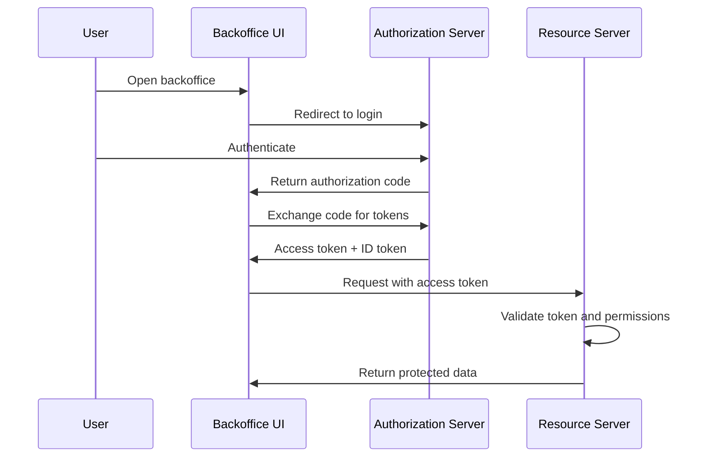

# AGENTS.md - Agent Instructions

## Source Of Truth

Read this file before modifying the repository.

The root [README.md](./README.md) is a final-review-facing project brief. It must stay straight and concise: project goal, business and technical requirements, constraints, scope, roadmap, and documentation links.

Do not use `README.md` as a project tracker. Do not add current status, working notes, open questions, detailed terminology, comparison matrices, option analysis, evaluation scoring, or phase-by-phase progress there. Put working study documents under `docs/`.

Keep the project's historical record in root `CHANGELOG.md`. Use it for dated, project-level history such as phase changes, scope changes, requirement-baseline changes, documentation-structure changes, evaluation-artifact changes, and PoC-planning changes.

This file is only for agent operating instructions, rules, boundaries, and repository hygiene.

## Current Operating Phase

The current phase is `Phase 2 - Requirements Definition`.

During this phase, default work is business, technical, security, and operational requirements definition; requirements traceability; open-question resolution; service and permission inventory refinement; candidate-evaluation preparation; lightweight PoC planning; and other Markdown study artifacts.

Markdown study artifacts may be created or edited under `docs/`. The conceptual IAM wiki remains under `docs/wiki/`.

The wiki is for general IAM concepts, terminology, protocol explanations, security concepts, and references. Do not use `docs/wiki/` for project scope debate, requirements refinement, option analysis, candidate evaluation, PoC planning, implementation notes, phase status, or final recommendations. Put those project-specific study materials in top-level `docs/` files.

Do not make a final vendor, product, architecture, or production implementation recommendation unless the user explicitly asks to move into a decision phase or requests a final recommendation.

## Instruction Priority

If instructions conflict:

1. Follow the user's explicit request for the current task.
2. Follow this `AGENTS.md`.
3. Follow `README.md` for project goal, requirements, constraints, scope, roadmap, and documentation links.
4. Follow existing repository conventions.
5. Follow general best practices.

A user request overrides the Phase 2 boundary only when it explicitly changes phase, expands scope, asks for project-instruction changes, asks for project-brief changes, or asks for a proof of concept.

## Non-Negotiable Rules

During Phase 2:

1. Create or edit Markdown study artifacts under `docs/` by default.
2. Keep conceptual IAM wiki pages under `docs/wiki/`. Keep project-specific study, scope, debate, evaluation, and implementation-oriented documents under top-level `docs/`, not `docs/wiki/`.
3. `AGENTS.md` may be edited when the user's current task is to refine agent instructions.
4. `README.md` may be edited when the user's current task is to refine the final-review project brief: goal, requirements, constraints, scope, roadmap, or documentation links.
5. Root `ABSTRACT.md` and `CHANGELOG.md` may be edited when the user's current task asks for project summary, project history, phase movement, or release-style documentation.
6. Record meaningful project history in `CHANGELOG.md`, not in `README.md` or ad hoc working notes. Keep entries dated, concise, and focused on what changed.
7. Do not add application code, dependencies, package managers, Docker files, databases, migrations, CI files, generated artifacts, or deployment files unless the user explicitly expands the phase or asks for a proof of concept.
8. Do not make final vendor, product, architecture, or production recommendations unless the user explicitly asks for a final decision or changes the project phase.
9. Do not invent citations, RFC numbers, standards, specification names, URLs, or product behavior.
10. Every conceptual wiki topic page must include a `References` section. The wiki index may omit page-level references because baseline references are maintained in this file.
11. Prefer official specifications, standards bodies, and reputable security guidance over blogs or marketing pages.
12. Keep Mermaid diagrams simple and directly related to the explanation.
13. Cross-reference overlapping topics instead of duplicating large sections.
14. Check for an existing suitable file before creating a new one.
15. Before finishing, compare the result with this file and the project requirements in `README.md`.

## Documentation Rules

All project study documents under `docs/` must:

- use lowercase `kebab-case`
- use `.md`
- start with an approved prefix

Allowed prefixes:

- `requirements-`
- `architecture-`
- `security-`
- `operational-`
- `evaluation-`
- `candidate-`
- `poc-plan-`
- `poc-results-`
- `decision-`

Examples:

```text
requirements-auth.md
architecture-api.md
security-session-policy.md
decision-use-postgresql.md
```

Keep the conceptual IAM wiki under:

```text
docs/wiki/
```

Use the conceptual wiki index as an agent-facing reading path only. Project-facing documentation should link directly to the specific wiki page that supports the surrounding text instead of linking to the wiki index.

Recommended wiki structure:

```text
docs/wiki/
|-- README.md
|-- 01-authentication-vs-authorization.md
|-- 02-oauth2.md
|-- 03-openid-connect.md
|-- 04-tokens-and-jwt.md
|-- 05-rbac.md
|-- 06-oauth2-flows.md
|-- 07-service-to-service-authentication.md
|-- 08-admin-api.md
`-- 09-security-best-practices.md
```

Use these names unless the repository already has a clearly better convention.

Additional study documents may be created under `docs/` when useful. Prefer updating existing documents over creating near-duplicates. If a document debates project scope, records trade-offs, evaluates options, plans a PoC, or describes implementation-oriented behavior, place it under `docs/` rather than `docs/wiki/`.

When topics overlap, link to the more detailed page instead of duplicating large explanations. Use relative Markdown links.

## Changelog Rules

Use root `CHANGELOG.md` as the project's historical record.

Record meaningful project-level changes, including phase movement, project-scope changes, requirement-baseline changes, documentation-structure changes, evaluation artifacts, candidate-evaluation milestones, PoC-planning changes, and final-review documentation changes.

Do not use `README.md` for project history, progress tracking, or phase-by-phase status. Keep `README.md` as a concise final-review project brief.

Keep changelog entries dated, concise, and factual. Prefer common headings such as `Added`, `Changed`, `Deprecated`, `Removed`, `Fixed`, and `Security` when they fit.

## Writing Style

Write for senior software engineers who know backend systems, APIs, databases, distributed systems, security basics, and architecture, but may not know IAM-specific standards.

Be precise, practical, evidence-based, technically rigorous, explicit about assumptions and trade-offs, and focused on real system behavior.

Use clear definitions, short sections, practical examples, tables where useful, Mermaid diagrams, common mistakes, security notes, and references.

Avoid marketing language, unsupported claims, vendor bias, unexplained acronyms, beginner-level oversimplification, and claims that one architecture is always correct.

Avoid filler and repeated explanations.

## Citation Rules

Every wiki page should include useful citations.

Prioritize:

1. official specifications;
2. standards bodies;
3. official security guidance;
4. official product documentation;
5. reputable technical sources.

Preferred sources include IETF RFCs, OpenID Foundation specifications, OAuth Working Group documents, OWASP guidance, NIST guidance, and official documentation from identity providers such as Keycloak, Auth0, Okta, Microsoft Entra ID, AWS, or similar vendors.

Rules:

- Verify RFC numbers, specification names, and URLs before including them.
- Cite only sources that support the relevant statement.
- Do not add references as decoration.
- If a source cannot be verified, omit it.
- Prefer stable official URLs.
- Avoid relying mainly on blogs, informal tutorials, or marketing pages.

Baseline references:

- [RFC 6749 - OAuth 2.0 Authorization Framework](https://www.rfc-editor.org/rfc/rfc6749)
- [RFC 6750 - OAuth 2.0 Bearer Token Usage](https://www.rfc-editor.org/rfc/rfc6750)
- [RFC 7009 - OAuth 2.0 Token Revocation](https://www.rfc-editor.org/rfc/rfc7009)
- [RFC 7519 - JSON Web Token](https://www.rfc-editor.org/rfc/rfc7519)
- [RFC 7636 - Proof Key for Code Exchange](https://www.rfc-editor.org/rfc/rfc7636)
- [RFC 7662 - OAuth 2.0 Token Introspection](https://www.rfc-editor.org/rfc/rfc7662)
- [RFC 8414 - OAuth 2.0 Authorization Server Metadata](https://www.rfc-editor.org/rfc/rfc8414)
- [RFC 9700 - Best Current Practice for OAuth 2.0 Security](https://www.rfc-editor.org/rfc/rfc9700)
- [OpenID Connect Core 1.0](https://openid.net/specs/openid-connect-core-1_0.html)
- [OpenID Connect Discovery 1.0](https://openid.net/specs/openid-connect-discovery-1_0.html)
- [OWASP API Security Top 10](https://owasp.org/API-Security/)
- [OWASP Authentication Cheat Sheet](https://cheatsheetseries.owasp.org/cheatsheets/Authentication_Cheat_Sheet.html)
- [OWASP Authorization Cheat Sheet](https://cheatsheetseries.owasp.org/cheatsheets/Authorization_Cheat_Sheet.html)
- [NIST SP 800-63-4 - Digital Identity Guidelines](https://pages.nist.gov/800-63-4/)

## Diagram Rules

Use Mermaid diagrams when helpful.

Keep diagrams simple and directly related to the explanation. Avoid decorative diagrams.

Example:



## Security Rules

Security guidance must be conservative and evidence-based.

Do not recommend:

- plain-text password storage;
- custom cryptography;
- unsigned JWTs;
- skipping issuer validation;
- skipping audience validation;
- long-lived access tokens without justification;
- exposing admin APIs without strong authorization;
- relying only on frontend authorization checks;
- Implicit Flow for new browser-based applications.

When describing risks, explain what can go wrong and how to reduce the risk.

## Proof-Of-Concept Boundary

Phase 2 allows Markdown study artifacts, simple diagrams, short pseudocode, short illustrative examples, requirements notes, requirements traceability, evaluation criteria, comparison matrices, candidate evaluation records, risk notes, and proof-of-concept planning.

Do not add runnable applications, production authorization server code, dependencies, databases, migrations, Docker files, deployment files, or CI configuration unless explicitly requested.

If the user asks for a proof of concept, keep it scoped to the requested learning goal and document assumptions, limits, and non-production status.

Code examples must be short, illustrative, and clearly non-production.

## Repository Hygiene

When modifying the repository:

- read this file first;
- read `README.md` before changing project requirements, scope, roadmap, or documentation links;
- keep `README.md` final-review-facing; do not use it for tracking work in progress;
- keep project history in root `CHANGELOG.md`;
- inspect existing docs before creating files;
- keep Phase 2 Markdown study artifacts under `docs/`;
- keep conceptual IAM wiki pages under `docs/wiki/`;
- use Markdown for study documents;
- preserve project conventions;
- prefer small, focused changes;
- avoid generated files;
- use targeted edits instead of replacing whole files unless the current content is clearly wrong or incomplete.

## Completion Checks

Before finishing:

- confirm the work follows the current user request;
- confirm project facts align with `README.md`;
- confirm no forbidden implementation files or unnecessary dependencies were added;
- confirm no final recommendation was made unless explicitly requested;
- confirm meaningful project history has been recorded in `CHANGELOG.md` when the task changes project phase, scope, requirements, documentation structure, evaluation artifacts, or PoC planning;
- confirm every edited conceptual wiki topic page has a useful `References` section;
- confirm citations are real, relevant, and from appropriate sources;
- confirm overlapping topics are cross-referenced instead of heavily duplicated;
- run an appropriate lightweight validation, such as `git diff --check`, when files were edited.
