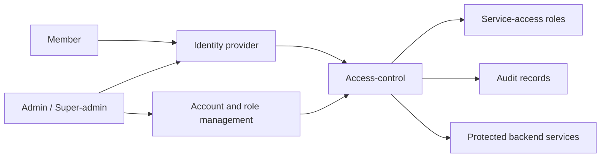

# EDRLab Backoffice Access-Control Study

This repository is the study and approved MVP workspace for the EDRLab backoffice access-control solution. It defines the project scope, captures the consolidated feature requirements, frames security and operational risks, records the accepted Keycloak IAM Control Plane API direction, and now carries the authorized Phase 6 production MVP boundary.

> https://www.notion.so/edrlab/Member-s-back-office-2eca1ca5712f806b9594dd987b5af9e1

## Core Features

The project is organized around the following essential capabilities:

- Manage backoffice accounts, lifecycle states, and stable account identifiers.
- Authenticate backoffice users through an identity provider while keeping access-control decisions in the backoffice capability.
- Keep fixed account types separate from independently managed service-access roles.
- Authorize protected backend services from account state, account type, and member service-access role assignments.
- Audit privileged and security-relevant actions.

## Project Goal

The project goal is to define a simple, secure, and auditable access-control model for selected EDRLab backoffice users.

The model must support account lifecycle management, identity-provider authentication, protected backend service authorization, and auditability without expanding into public customer identity or a company-wide IAM replacement.

The project keeps two concepts separate:

- account types define backoffice responsibilities: `super-admin`, `admin`, and `member`;
- service-access roles describe protected backend service access for admins and super-admins automatically and for members through assignment.

The expected scale is fewer than 1,000 users. Operational complexity must be justified by concrete security, compliance, maintainability, or product needs.

## Actors and Role Types

The account types are application account categories in the company system, not only study labels. `super-admin`, `admin`, and `member` accounts are separated account types. An account type is fixed when the account is created and cannot be changed later. A `member` account must never become an `admin` account.

Service-access roles are separate from account types. They are managed by super-admins and assigned to `member` accounts by admins or super-admins. Active admins automatically receive access to every protected backend service covered by any service-access role, and active super-admins receive the same access through inherited admin capabilities. A service-access role must not grant account-management responsibilities.

A `super-admin` is a high-level administration superset of `admin`: it inherits every admin capability and adds high-level administration capabilities. An `admin` does not inherit super-admin capabilities, and the admin limits below apply to admin accounts only.

### Super-admin

High-level management account.

- Inherits every `admin` capability.
- Can manage `admin` accounts where lifecycle policy allows.
- Can manage the service-access-role catalog.
- Can consult audit records.

### Admin

Operational management account for `member` accounts.

- Can manage `member` accounts where lifecycle policy allows.
- Automatically receives access to every protected backend service covered by any service-access role.
- Can assign or remove service-access roles for `member` accounts.
- Cannot manage `admin` or `super-admin` accounts.
- Cannot create service-access roles or consult audit records.

### Member

Internal company user account.

- Can view their own profile in read-only mode.
- Can access protected backend services only when active and authorized by assigned service-access roles.
- Cannot modify their own profile, manage accounts, create or assign service-access roles, or consult audit records.

Privilege escalation must be controlled. An account type must not be changed, merged, or elevated after account creation. An admin must not be able to grant themselves a super-admin account type, create service-access roles, assign service-access roles to privileged account types, or bypass auditability for privileged actions.

## Feature Requirements Source

The former `Minimum Feature Requirements` (`FS-*`) table has been retired. The single feature-requirements source for the access-control capability is [FEATURE-REQUIREMENTS.md](./FEATURE-REQUIREMENTS.md).

This README summarizes the project purpose, actor model, scope, roadmap, and documentation entry points. Concrete requirement changes should be made in `FEATURE-REQUIREMENTS.md` and recorded in [CHANGELOG.md](./CHANGELOG.md).

## Initial Scope

In scope for the study and approved MVP:

- backoffice account lifecycle and profile-management boundaries for `super-admin`, `admin`, and `member` accounts;
- identity-provider authentication boundary and stable authenticated-subject linkage;
- service-access-role catalog management, member role assignment and removal, and protected backend service access decisions;
- auditability of privileged and security-relevant operations;
- Phase 2 requirements and risk framing, Phase 3 solution choice, Phase 4 targeted non-production Proof of Concept, Phase 5 review and decision, and Phase 6 production MVP implementation within the scope authorized by [ADR 0005](./docs/decisions/0005-authorize-phase-6-production-mvp.md).

Out of scope for the initial specification:

- public signup, public customer identity, social login, and consumer marketing account flows;
- a complete company-wide workforce IAM replacement;
- final vendor, product, architecture, hosting, database, implementation-stack, token-format, session, or browser-storage decisions;
- production high availability or multi-replica operation as a minimum initial requirement;
- a complete custom cryptographic or IAM implementation.

## Open Study Questions

These topics remain open for Phase 6 implementation detail or post-MVP study. They are not feature requirements until explicitly adopted in [FEATURE-REQUIREMENTS.md](./FEATURE-REQUIREMENTS.md).

- MVP implementation boundary: Phase 6 is authorized by [ADR 0005](./docs/decisions/0005-authorize-phase-6-production-mvp.md) only for the accepted MVP scope in [MVP scope](./docs/evaluation/mvp-scope.md).
- Privileged account protection: OTP safeguards follow the accepted Keycloak built-in mechanisms for the MVP; passwordless login, hardware-backed authenticator policy, broader fallback authenticators, super-admin recovery, and break-glass remain post-MVP unless explicitly added.
- Access evidence and revocation: exact token lifetime, refresh behavior, session handling, and browser storage remain Phase 6 implementation details constrained by the accepted API and `authorization/check` behavior.
- Audit and operations: the MVP audit storage choice is accepted, but Phase 6 still needs exact file path, rotation, permissions, backup/restore evidence, confidentiality controls, monitoring, upgrades, and operational runbooks.
- Post-MVP governance: formal direct Keycloak admin governance is deferred post-MVP; the MVP still forbids routine direct Keycloak business administration and treats unmanaged mutation as drift.

## Roadmap

1. Phase 1 - Conceptual IAM Foundation.
2. Phase 2 - Requirements and Risk Framing.
3. Phase 3 - Solution Choice.
4. Phase 4 - Proof of Concept.
5. Phase 5 - Review and Decision.
6. Phase 6 - Production MVP.

## Documentation

| Need | Entry point |
| --- | --- |
| Project summary | [Abstract](./ABSTRACT.md) |
| Consolidated feature requirements | [Feature requirements](./FEATURE-REQUIREMENTS.md) |
| Phase boundaries and study rules | [Project governance](./PROJECT-GOVERNANCE.md) |
| Project study documents | [Documentation map](./docs/README.md) |
| Production MVP authorization | [ADR 0005](./docs/decisions/0005-authorize-phase-6-production-mvp.md) |
| General IAM concepts and references | [Conceptual IAM wiki](./docs/wiki/README.md) |
| Project history | [Changelog](./CHANGELOG.md) |
| Agent working instructions | [Agent instructions](./AGENTS.md) |
