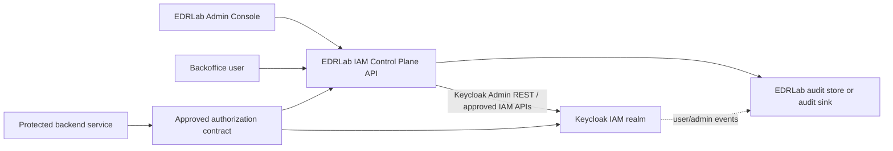

# Keycloak IAM Control Plane API Scope

Status: Review
Phase: Phase 4 - Proof of Concept
Scope: Architecture
Last reviewed: 2026-06-25

## Contents

- [Purpose](#purpose)
- [Pivot Summary](#pivot-summary)
- [Target Boundary](#target-boundary)
- [State Ownership](#state-ownership)
- [Administration Flow](#administration-flow)
- [Protected-Service Authorization](#protected-service-authorization)
- [Audit Boundary](#audit-boundary)
- [Validation Questions](#validation-questions)
- [References](#references)

## Purpose

This document records the new Phase 4 architecture direction selected on 2026-06-23: validate Keycloak as the IAM source for the EDRLab backoffice access-control model, while exposing a dedicated EDRLab Admin Console and EDRLab IAM Control Plane API for business administration and authorization checks. This supersedes the earlier local-access-control-authority boundary for the next validation direction, but it does not approve production adoption or Phase 6 implementation ([ADR 0002](../decisions/0002-validate-keycloak-iam-bff.md), [Project governance - Phase 4](../../PROJECT-GOVERNANCE.md#phase-4---proof-of-concept), [Project governance - Phase 6](../../PROJECT-GOVERNANCE.md#phase-6---production-mvp)).

`EDRLab IAM Control Plane API` is the canonical name for the controlled server-side component in this validation direction. It may expose an admin endpoint for the EDRLab Admin Console and an authorization endpoint for protected backend services. The term `BFF` is reserved for the narrower browser-facing Backend-for-Frontend pattern and should not name the whole IAM control component in new project-facing text.

## Pivot Summary

The previous accepted boundary was "Keycloak authenticates; local EDRLab access-control remains authoritative." The new boundary to validate is "Keycloak stores and evaluates selected IAM state; EDRLab controls the business administration and authorization path through its own IAM Control Plane API."

This means `FR-038` is revised from a blanket rejection of IdP role/group/claim authority into an anti-bypass rule. Keycloak IAM state may become authoritative only when it is mediated by a controlled server-side EDRLab path; browser clients, protected services, unmanaged Keycloak Admin Console edits, and raw token claims must not bypass that path (`FR-038`; [Feature requirements](../../FEATURE-REQUIREMENTS.md#feature-requirements), [OWASP Authorization Cheat Sheet](https://cheatsheetseries.owasp.org/cheatsheets/Authorization_Cheat_Sheet.html)).

## Target Boundary

The EDRLab Admin Console remains the business UI. The IAM Control Plane API is the policy guard for account creation, lifecycle changes, account-type rules, service-access role assignment, protected-service authorization evidence, and audit. Keycloak is the IAM product underneath that exposes users, roles, groups, attributes, authentication flows, sessions, events, Admin REST APIs, and possibly Authorization Services ([Keycloak Server Administration Guide](https://www.keycloak.org/docs/latest/server_admin/), [Keycloak Admin REST API](https://www.keycloak.org/docs-api/latest/rest-api/index.html), [Keycloak Authorization Services](https://www.keycloak.org/docs/latest/authorization_services/)).

Direct Keycloak Admin Console access must be limited to technical operators and treated as a privileged operational surface. Keycloak documents server administrators, realm administrators, and delegated realm administrators, and warns that server and realm administrators are not affected by fine-grained realm-resource permissions; this makes direct admin grants a drift and privilege-escalation risk for an EDRLab business-IAM model ([Keycloak managing access to realm resources](https://www.keycloak.org/docs/latest/server_admin/#managing-access-to-realm-resources), `FR-026`, `FR-038`; [Feature requirements](../../FEATURE-REQUIREMENTS.md#feature-requirements)).

## State Ownership

| State | Candidate Keycloak representation to validate | IAM Control Plane API responsibility | Source |
| --- | --- | --- | --- |
| Account identity and profile | Keycloak user with stable `sub`, profile attributes, and required actions. | Enforce account creation workflow, invited-state semantics, immutable identity mapping rules, and safe onboarding. | [OpenID Connect Core](https://openid.net/specs/openid-connect-core-1_0.html), `FR-009`, `FR-010`, `FR-039`, `FR-043`; [Feature requirements](../../FEATURE-REQUIREMENTS.md#feature-requirements) |
| Account type | Keycloak role, group, attribute, or constrained mapper pattern to validate. | Prevent account-type mutation, member-to-admin elevation, self-grant, and unmanaged reassignment. | [Keycloak roles and groups](https://www.keycloak.org/docs/latest/server_admin/#assigning-permissions-using-roles-and-groups), `FR-001`, `FR-026`, `FR-038`; [Feature requirements](../../FEATURE-REQUIREMENTS.md#feature-requirements) |
| Lifecycle state | Keycloak `enabled` plus attributes, groups, or required actions to validate. | Preserve `invited`, `active`, `disabled`, and `archived` semantics, including no return to `invited` and no protected-service access outside `active`. | `FR-011` through `FR-016`, `FR-031`; [Feature requirements](../../FEATURE-REQUIREMENTS.md#feature-requirements) |
| Service-access roles | Keycloak roles, groups, client roles, or Authorization Services resources/scopes/policies to validate. | Ensure service-access roles do not grant account-management responsibility, are assigned only to members where allowed, and inactive roles cannot authorize access. | [Keycloak Authorization Services](https://www.keycloak.org/docs/latest/authorization_services/), `FR-002`, `FR-005`, `FR-022`, `FR-032`; [Feature requirements](../../FEATURE-REQUIREMENTS.md#feature-requirements) |
| Privileged authentication | Keycloak authentication flow with ACR/LoA step-up and OTP MFA accepted for the current direction. | Verify explicit evidence before privileged onboarding or any accepted privileged workflow. | [Keycloak authentication flows](https://www.keycloak.org/docs/latest/server_admin/#creating-flows), `FR-034`, `FR-043`, `FR-044`; [Feature requirements](../../FEATURE-REQUIREMENTS.md#feature-requirements), [ADR 0003](../decisions/0003-accept-otp-for-privileged-authentication.md) |
| Project audit | Keycloak user/admin events plus local EDRLab audit records where needed. | Record business decisions, denied operations, audit reads/exports, and correlation IDs that Keycloak events alone do not prove. | [Keycloak admin events](https://www.keycloak.org/docs/latest/server_admin/#auditing-admin-events), `FR-027`, `FR-028`, `FR-035`; [Feature requirements](../../FEATURE-REQUIREMENTS.md#feature-requirements) |

## Administration Flow

The target administration flow is:

1. A business administrator uses the EDRLab Admin Console.
2. The Admin Console calls the EDRLab IAM Control Plane API admin endpoint.
3. The IAM Control Plane API authenticates the actor and authorizes the operation server-side.
4. The IAM Control Plane API validates EDRLab invariants before mutating Keycloak state.
5. The IAM Control Plane API calls Keycloak Admin REST API or approved Keycloak policy APIs.
6. The IAM Control Plane API records an EDRLab audit event for the business decision and stores Keycloak event references when useful.

This preserves a branded EDRLab administration experience while using Keycloak as the IAM backing product. It also prevents a dangerous shortcut: letting business administrators directly edit roles, groups, attributes, or users in Keycloak Admin Console without EDRLab workflow checks (`FR-024`, `FR-026`, `FR-027`, `FR-033`, `FR-038`; [Feature requirements](../../FEATURE-REQUIREMENTS.md#feature-requirements), [OWASP Authorization Cheat Sheet](https://cheatsheetseries.owasp.org/cheatsheets/Authorization_Cheat_Sheet.html)).

## Protected-Service Authorization

The new validation must choose one protected-service authorization contract. Viable candidates are:

| Contract | What to validate | Main risk |
| --- | --- | --- |
| IAM Control Plane API-mediated authorization | Protected services ask the IAM Control Plane API authorization endpoint for a fresh allow/deny decision. | IAM Control Plane API availability and latency become part of protected-service access. |
| Keycloak Authorization Services | Keycloak models resources, scopes, permissions, and policies, and protected services use the approved Keycloak authorization flow. | The EDRLab model may become more complex than the current service-access-role needs justify. |
| Token claims with strict constraints | Protected services consume claims that the IAM Control Plane API and Keycloak mapping intentionally produce. | Claims can become stale; access-stop delay, revocation, cache behavior, and claim scope must be explicit. |
| Introspection-style contract | Protected services validate current access evidence through a server-side endpoint before allowing access. | Availability, caching, and failure behavior must be designed to fail closed. |

Protected services must still enforce authorization server-side and deny when the result cannot be determined safely (`FR-020`, `FR-021`; [OWASP Authorization Cheat Sheet](https://cheatsheetseries.owasp.org/cheatsheets/Authorization_Cheat_Sheet.html)). The previous `WP-006` next-fresh-check access-stop target remains a useful baseline, but it must be revalidated against the chosen Keycloak-IAM contract ([Keycloak WP-006 result](../poc/keycloak-wp006-result.md)).

## Audit Boundary

Keycloak events are useful provider-side evidence, but the IAM Control Plane API must decide which EDRLab business events need local audit records. Keycloak documents user events and admin events, including administrator actions through the Admin Console or API, but those events do not automatically prove EDRLab business authorization rationale, protected-service denial reasons, or audit-read authorization ([Keycloak admin events](https://www.keycloak.org/docs/latest/server_admin/#auditing-admin-events), `FR-027`, `FR-028`, `FR-035`; [Feature requirements](../../FEATURE-REQUIREMENTS.md#feature-requirements)).

The likely production shape is still at least two logical persistence responsibilities:

- Keycloak database for Keycloak realm, users, credentials, sessions, roles, groups, policies, and product configuration.
- EDRLab audit and possibly application metadata storage for business audit events, correlation, review notes, or data that should not live as Keycloak realm state.

This is a logical boundary, not a physical database-server decision. Production database topology remains out of scope until Phase 5 review or Phase 6 implementation ([Project governance - Phase 5](../../PROJECT-GOVERNANCE.md#phase-5---review-and-decision), [Project governance - Phase 6](../../PROJECT-GOVERNANCE.md#phase-6---production-mvp)).

## Validation Questions

| ID | Question | Why it matters |
| --- | --- | --- |
| `OQ-KIB-001` | How exactly are `super-admin`, `admin`, and `member` represented in Keycloak? | This is the core replacement for the local account-type store, and it must prevent mutation, merging, and self-elevation (`FR-001`, `FR-026`). |
| `OQ-KIB-002` | How are `invited`, `active`, `disabled`, and `archived` represented and enforced? | Keycloak `enabled` alone may not represent the full lifecycle semantics; disabled/archived access-stop behavior must be measurable (`FR-011` through `FR-016`). |
| `OQ-KIB-003` | Are service-access roles modeled as realm roles, client roles, groups, Authorization Services resources/scopes, or another constrained pattern? | The model must remain understandable and must not turn service roles into account-management privileges (`FR-002`, `FR-022`, `FR-030`). |
| `OQ-KIB-004` | What direct Keycloak Admin Console access is allowed, and how is drift detected? | Unmanaged console edits could bypass IAM Control Plane API invariants and audit (`FR-026`, `FR-027`, `FR-038`). |
| `OQ-KIB-005` | What protected-service authorization contract will be validated first? | The choice controls stale access, outage behavior, audit correlation, and service integration cost (`FR-016`, `FR-020`, `FR-021`). |
| `OQ-KIB-006` | What local audit remains required even if Keycloak is the IAM source? | Keycloak events may not cover EDRLab business rationale, denied local decisions, audit-read authorization, or compliance retention needs (`FR-027`, `FR-028`, `FR-035`). |
| `OQ-KIB-007` | How is privileged-authentication evidence exposed for privileged onboarding? | Closed for the current direction by `WP-013` and ADR 0003: Keycloak ACR/LoA step-up with OTP MFA provides the first accepted evidence path (`FR-034`, `FR-043`, `FR-044`). |

## References

- [ADR 0002 - Validate Keycloak IAM With EDRLab IAM Control Plane API](../decisions/0002-validate-keycloak-iam-bff.md)
- [ADR 0003 - Accept OTP for Privileged Authentication](../decisions/0003-accept-otp-for-privileged-authentication.md)
- [ADR 0001 - Choose Keycloak for Validation](../decisions/0001-choose-keycloak-for-validation.md)
- [Feature Requirements Specification](../../FEATURE-REQUIREMENTS.md)
- [Keycloak WP-006 Result](../poc/keycloak-wp006-result.md)
- [Project Governance - Phase 4](../../PROJECT-GOVERNANCE.md#phase-4---proof-of-concept)
- [Project Governance - Phase 5](../../PROJECT-GOVERNANCE.md#phase-5---review-and-decision)
- [Project Governance - Phase 6](../../PROJECT-GOVERNANCE.md#phase-6---production-mvp)
- [Keycloak Server Administration Guide](https://www.keycloak.org/docs/latest/server_admin/)
- [Keycloak Roles and Groups](https://www.keycloak.org/docs/latest/server_admin/#assigning-permissions-using-roles-and-groups)
- [Keycloak Admin REST API](https://www.keycloak.org/docs-api/latest/rest-api/index.html)
- [Keycloak Authorization Services](https://www.keycloak.org/docs/latest/authorization_services/)
- [Keycloak Managing Access to Realm Resources](https://www.keycloak.org/docs/latest/server_admin/#managing-access-to-realm-resources)
- [Keycloak Authentication Flows](https://www.keycloak.org/docs/latest/server_admin/#creating-flows)
- [Keycloak Admin Events](https://www.keycloak.org/docs/latest/server_admin/#auditing-admin-events)
- [OpenID Connect Core 1.0](https://openid.net/specs/openid-connect-core-1_0.html)
- [OWASP Authorization Cheat Sheet](https://cheatsheetseries.owasp.org/cheatsheets/Authorization_Cheat_Sheet.html)
