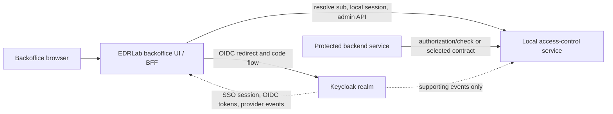

# Keycloak Integration Scope

Status: Review
Phase: Phase 4 - Proof of Concept
Scope: Architecture
Last reviewed: 2026-06-05

## Contents

- [Purpose](#purpose)
- [Operating Boundary](#operating-boundary)
- [Development Block](#development-block)
- [Configuration Block](#configuration-block)
- [SSO Session Flow](#sso-session-flow)
- [User Session Management Boundary](#user-session-management-boundary)
- [Validated Browser Pattern](#validated-browser-pattern)
- [Validated Access-Stop Delay](#validated-access-stop-delay)
- [Validated Privileged-Authentication Evidence Approach](#validated-privileged-authentication-evidence-approach)
- [Validated Session Administration Boundary](#validated-session-administration-boundary)
- [Validation Questions](#validation-questions)
- [References](#references)

## Purpose

This document explains the concrete split between what EDRLab should develop locally and what should be configured in Keycloak for the accepted Keycloak candidate. It also records the expected SSO session behavior for Phase 4 validation. It is an architecture study artifact, not implementation approval or production deployment approval ([Project governance - Phase 3](../../PROJECT-GOVERNANCE.md#phase-3---solution-choice), [Project governance - Phase 4](../../PROJECT-GOVERNANCE.md#phase-4---proof-of-concept), [ADR 0001](../decisions/0001-choose-keycloak-for-validation.md)).

The accepted candidate is self-hosted Keycloak plus local EDRLab access-control. Keycloak provides authentication, OIDC/OAuth2 runtime behavior, SSO session behavior, realm administration, and provider-side evidence. The local EDRLab access-control capability remains authoritative for account type, lifecycle, subject link, service-access roles, protected-service authorization, and project audit (`FR-001`, `FR-002`, `FR-020`, `FR-027`, `FR-036` through `FR-039`; [Feature requirements specification](../../FEATURE-REQUIREMENTS.md#feature-requirements), [Solution choice](../evaluation/solution-choice.md#selected-candidate)).

## Operating Boundary

OpenID Connect defines an OpenID Provider as an OAuth 2.0 authorization server that authenticates the end user and provides claims to a relying party; it also defines the subject identifier as a locally unique identifier for the end user within the issuer ([OpenID Connect Core](https://openid.net/specs/openid-connect-core-1_0.html)). In this project, Keycloak is the OpenID Provider and the EDRLab backoffice is the relying party.

Keycloak documents OIDC endpoints for authorization, token exchange, user info, logout, JWK certificates, introspection, and token revocation ([Keycloak OIDC endpoints](https://www.keycloak.org/securing-apps/oidc-layers)). Those endpoints are integration inputs. They do not make Keycloak roles, groups, token claims, or Admin Console state authoritative for EDRLab account type, lifecycle, service-access roles, or audit (`FR-038`; [Feature requirements specification](../../FEATURE-REQUIREMENTS.md#feature-requirements), [Solution choice - Keycloak Web Admin Boundary](../evaluation/solution-choice.md#keycloak-web-admin-boundary)).

## Development Block

These parts are developed in the EDRLab system boundary. They are local business capabilities, not Keycloak realm configuration.

| Part to develop | Main responsibility | Source |
| --- | --- | --- |
| Local access-control domain model | Store and enforce backoffice account type, lifecycle state, local account identifier, immutable Keycloak `sub` link after onboarding, profile metadata needed by the feature, and service-access role assignments. | `FR-001`, `FR-002`, `FR-009` through `FR-016`, `FR-036` through `FR-039` ([Feature requirements specification](../../FEATURE-REQUIREMENTS.md#feature-requirements)) |
| Onboarding and activation flow | Resolve a Keycloak authenticated subject into exactly one invited local account, require verified matching email, create the subject link once, activate only when conditions are safe, and fail closed otherwise. | `FR-036`, `FR-037`, `FR-039`, `FR-043`, `FR-044` ([Feature requirements specification](../../FEATURE-REQUIREMENTS.md#feature-requirements)); [OpenID Connect Core](https://openid.net/specs/openid-connect-core-1_0.html) |
| Local administration API | Expose server-side operations for account management, service-access-role catalog management, member assignment and removal, protected-service checks, and audit-supporting operations. | `FR-017`, `FR-018`, `FR-024`, `FR-032`, `FR-033`; [OWASP Authorization Cheat Sheet](https://cheatsheetseries.owasp.org/cheatsheets/Authorization_Cheat_Sheet.html) |
| EDRLab Access Control Manager UI | Provide the business UI for local accounts, lifecycle actions, invitations/onboarding review, service-access roles, assignments, and audit access. This UI must call the local access-control API; it is not replaced by Keycloak Web Admin. | `FR-024`, `FR-028`, `FR-033`; [Solution choice - Keycloak Web Admin Boundary](../evaluation/solution-choice.md#keycloak-web-admin-boundary) |
| Protected-service authorization contract | Define how protected backend services ask whether a subject can access a service: local `authorization/check`, local introspection-style endpoint, BFF-mediated session, short-lived token plus local lookup, or another validated contract. | `FR-016`, `FR-020`, `FR-021`, `FR-022`; [Architecture options - Shared design questions](./options.md#shared-design-questions); [RFC 7662](https://www.rfc-editor.org/rfc/rfc7662) |
| Local application session handling | If the backoffice uses a BFF or server-side browser session, create and expire the local application session, protect the cookie, clear it on logout, and bind it to the resolved local account. | `FR-020`, `FR-021`; [Web sessions, cookies, and BFF pattern](../wiki/24-web-sessions-cookies-and-bff.md); [OWASP Authorization Cheat Sheet](https://cheatsheetseries.owasp.org/cheatsheets/Authorization_Cheat_Sheet.html) |
| Local audit records and correlation | Record local append-only audit events for lifecycle changes, role changes, onboarding success/failure, protected-service denials, audit reads/exports, and subject-link attempts; correlate Keycloak events only as supporting evidence. | `FR-027`, `FR-028`, `FR-035`; [Keycloak admin events](https://www.keycloak.org/docs/latest/server_admin/#auditing-admin-events) |
| Logout integration | Clear any local application session and use the selected OIDC logout behavior when the user signs out. Keycloak documents a logout endpoint and recommends using protocol-standard logout, Admin Console/API, or Account Console/API rather than the legacy direct logout format. | [Keycloak OIDC logout endpoint](https://www.keycloak.org/securing-apps/oidc-layers); `FR-020`, `FR-021` |

## Configuration Block

These parts are configured or operated in Keycloak. They are IAM product configuration, not EDRLab business access-control development.

| Part to configure | Main responsibility | Source |
| --- | --- | --- |
| Realm and OIDC clients | Create the validation realm, configure OIDC clients, redirect URIs, client credentials or public-client settings, and allowed endpoints for the backoffice integration. | [Keycloak Server Administration Guide](https://www.keycloak.org/docs/latest/server_admin/), [Keycloak OIDC endpoints](https://www.keycloak.org/securing-apps/oidc-layers) |
| Authorization Code flow | Use the browser redirect flow in which Keycloak authenticates the user, returns an authorization code, and the application exchanges the code for tokens. Keycloak describes this as targeted toward web applications. | [Keycloak Authorization Code flow](https://www.keycloak.org/securing-apps/oidc-layers); [OpenID Connect Core](https://openid.net/specs/openid-connect-core-1_0.html) |
| Avoid unsafe browser/login shortcuts | Do not use Implicit Flow for new browser applications and do not use Resource Owner Password Credentials / Direct Grant for this backoffice login path. Keycloak cites OAuth 2.0 Security BCP guidance against those flows. | [Keycloak supported grant types](https://www.keycloak.org/securing-apps/oidc-layers); [RFC 9700](https://www.rfc-editor.org/rfc/rfc9700) |
| Authentication flows and privileged authentication | Configure required authentication behavior for production `admin` and `super-admin` onboarding, including the chosen MFA, WebAuthn, OTP, or passwordless path to validate. | `FR-034`, `FR-043`, `FR-044`; [Keycloak WebAuthn](https://www.keycloak.org/docs/latest/server_admin/#_webauthn) |
| Session and token timeouts | Configure SSO session idle/max, client session idle/max, refresh-token behavior, and access-token lifespan at realm or client level. Keycloak documents session, cookie, and token timeout controls under realm settings. | [Keycloak session and token timeouts](https://www.keycloak.org/docs/latest/server_admin/#session-and-token-timeouts); `FR-016` |
| Key material and token validation inputs | Expose the realm JWK/certificate endpoint and discovery metadata needed by the application to validate tokens and discover endpoints. | [Keycloak certificate endpoint](https://www.keycloak.org/securing-apps/oidc-layers); [OpenID Connect Discovery](https://openid.net/specs/openid-connect-discovery-1_0.html) |
| User and session administration | Use Keycloak Admin Console or Admin REST API for Keycloak-side user/session viewing, user session logout, global revocation, and realm administration. This does not replace local access-control management. | [Keycloak managing user sessions](https://www.keycloak.org/docs/latest/server_admin/#managing-user-sessions); [Keycloak Admin REST API](https://www.keycloak.org/docs-api/latest/rest-api/index.html); [Solution choice - Keycloak Web Admin Boundary](../evaluation/solution-choice.md#keycloak-web-admin-boundary) |
| Admin and authentication events | Enable and retain the Keycloak event evidence needed for authentication and provider-administration correlation. Keycloak can record administrator actions in the Admin Console because the console invokes the Keycloak REST interface. | [Keycloak admin events](https://www.keycloak.org/docs/latest/server_admin/#auditing-admin-events); `FR-027`, `FR-035` |
| Operational configuration evidence | Review import/export, backup/restore expectations, configuration sources, key rotation, event retention, and upgrade responsibility before production adoption. | [Keycloak importing and exporting realms](https://www.keycloak.org/server/importExport), [Keycloak configuration](https://www.keycloak.org/server/configuration), `FR-030` |

## SSO Session Flow

The target SSO flow is a Keycloak OIDC Authorization Code flow with local EDRLab authorization after authentication. OpenID Connect describes the relying party asking the OpenID Provider to authenticate the user and receiving an ID Token, usually with an Access Token; Keycloak documents the authorization endpoint, token endpoint, userinfo endpoint, logout endpoint, certificates endpoint, introspection endpoint, and token revocation endpoint for this integration ([OpenID Connect Core](https://openid.net/specs/openid-connect-core-1_0.html), [Keycloak OIDC endpoints](https://www.keycloak.org/securing-apps/oidc-layers)).

1. The user opens the EDRLab backoffice.
2. The backoffice detects that no valid local application session exists and starts an OIDC authorization request.
3. The browser is redirected to the Keycloak authorization endpoint.
4. Keycloak authenticates the user and maintains the Keycloak SSO session according to realm/client session settings.
5. Keycloak redirects the browser back to the backoffice callback with an authorization code.
6. The backoffice backend exchanges the code at the Keycloak token endpoint for OIDC tokens.
7. The backoffice validates the token issuer, audience, signature, expiry, and any required authentication evidence using the configured issuer metadata and JWK/certificate data.
8. The backoffice reads the stable Keycloak `sub` and resolves it to exactly one local backoffice account.
9. The local access-control service checks lifecycle, account type, service-access roles, and fail-closed rules before granting local access.
10. The backoffice creates a local application session if the chosen browser integration uses a server-side session or BFF pattern.
11. Later requests use the local session or selected protected-service authorization contract; protected services must not authorize directly from Keycloak roles, groups, or claims.
12. If the user opens another application integrated with the same Keycloak realm and a compatible SSO session still exists, that application can redirect to Keycloak and receive authentication without asking the user to re-enter credentials, subject to Keycloak session and client policy.

This SSO flow proves authentication. It does not, by itself, create, activate, or authorize a local backoffice account (`FR-036`, `FR-037`, `FR-038`, `FR-043`; [Feature requirements specification](../../FEATURE-REQUIREMENTS.md#feature-requirements)).

## User Session Management Boundary

Keycloak owns SSO sessions, Keycloak cookies, refresh-token behavior, Keycloak-side user sessions, client sessions, and SSO logout/revocation controls. Keycloak documents viewing client sessions, viewing user sessions, signing out active sessions, revoking active sessions, and configuring session/token timeouts ([Keycloak managing user sessions](https://www.keycloak.org/docs/latest/server_admin/#managing-user-sessions), [Keycloak session and token timeouts](https://www.keycloak.org/docs/latest/server_admin/#session-and-token-timeouts)).

EDRLab does not need to build a full user-session-management UI for the initial validation target. The local system should build only the session behavior it owns: local application session creation, local logout, local session expiration, audit of relevant local actions, and fail-closed local authorization. A local account disablement, archival, or service-access-role removal must stop protected-service access through the local authorization contract within the accepted delay even if a Keycloak SSO session still exists (`FR-016`, `FR-020`, `FR-021`, `FR-032`; [Feature requirements specification](../../FEATURE-REQUIREMENTS.md#feature-requirements)).

If a future requirement asks EDRLab administrators to view or terminate Keycloak SSO sessions from the EDRLab Access Control Manager, that should be treated as a later integration feature using Keycloak Admin REST APIs, not as a replacement for the local access-control model ([Keycloak Admin REST API](https://www.keycloak.org/docs-api/latest/rest-api/index.html), [Solution choice - Keycloak Web Admin Boundary](../evaluation/solution-choice.md#keycloak-web-admin-boundary)).

## Validated Browser Pattern

`OQ-KIS-001` is closed for Phase 4 validation. The first browser pattern to validate is a BFF or server-side local application session, accepted by user direction on 2026-06-05. This is a Phase 4 validation choice, not a final production architecture decision ([Project governance - Phase 4](../../PROJECT-GOVERNANCE.md#phase-4---proof-of-concept)).

The accepted validation flow is:

1. The browser uses the EDRLab backoffice entry point.
2. The backoffice backend starts the OIDC Authorization Code flow with Keycloak.
3. Keycloak authenticates the user and maintains the Keycloak SSO session.
4. The backoffice backend exchanges the authorization code for tokens and validates issuer, audience, signature, and expiry using Keycloak metadata and keys.
5. The backoffice backend resolves the Keycloak `sub` to exactly one local account.
6. The local access-control service checks lifecycle, account type, service-access roles, and fail-closed rules.
7. The backoffice backend creates a local application session only after local resolution and authorization.
8. The browser stores only the local session cookie for the backoffice validation path; Keycloak tokens remain server-side.
9. Protected backend access is decided through the local access-control contract, not from Keycloak roles, groups, or token claims.

This choice keeps browser token exposure small and keeps authorization server-side. It also makes local logout, local session expiry, CSRF protection, and cookie hardening explicit EDRLab responsibilities for the validation slice, while Keycloak remains responsible for SSO authentication, Keycloak session behavior, and OIDC endpoints ([Web sessions, cookies, and BFF pattern](../wiki/24-web-sessions-cookies-and-bff.md), [Keycloak OIDC endpoints](https://www.keycloak.org/securing-apps/oidc-layers), [OWASP Authorization Cheat Sheet](https://cheatsheetseries.owasp.org/cheatsheets/Authorization_Cheat_Sheet.html)).

Direct OIDC client behavior in the browser remains a deferred alternative. It is not selected first because it would move token-handling concerns into the browser validation path and make the authorization boundary harder to review for this internal backoffice use case ([Web sessions, cookies, and BFF pattern](../wiki/24-web-sessions-cookies-and-bff.md), `FR-020`, `FR-021`, `FR-038`; [Feature requirements specification](../../FEATURE-REQUIREMENTS.md#feature-requirements)).

## Validated Access-Stop Delay

`OQ-KIS-002` is closed for Phase 4 validation. The accepted access-stop target is immediate server-side denial on the next fresh protected-service authorization check after a relevant local state change. This is a Phase 4 validation target, not a production cache, token, or session architecture decision ([Project governance - Phase 4](../../PROJECT-GOVERNANCE.md#phase-4---proof-of-concept)).

For the PoC, "immediate" means:

- when a local account is disabled or archived, a member service-access role is removed, or a service-access role is disabled or archived, the local access-control state changes first;
- the next protected-service request that checks current local state through the selected authorization contract must deny access;
- no positive authorization cache is allowed in the protected service, BFF, or local application session for the validation path;
- a still-active Keycloak SSO session or still-valid Keycloak token must not grant EDRLab protected-service access by itself;
- if the local access-control service cannot answer, protected-service access fails closed;
- requests that were already in-flight before the local state change should be recorded as a PoC observation, not used as evidence that the access-stop target passed or failed.

This target keeps `FR-016` measurable while preserving the accepted authentication/authorization split. Keycloak session and token timeout settings remain relevant configuration evidence, but they do not replace the local authorization check for stopping business access after local lifecycle or role changes ([Keycloak session and token timeouts](https://www.keycloak.org/docs/latest/server_admin/#session-and-token-timeouts), `FR-016`, `FR-020`, `FR-021`, `FR-032`; [Feature requirements specification](../../FEATURE-REQUIREMENTS.md#feature-requirements)).

The production review may later accept a short positive cache or a different token/session strategy only if the delay, failure mode, audit impact, and protected-service risk are explicitly documented. That later decision belongs to Phase 5 review or Phase 6 implementation scope, not to this Phase 4 validation target ([Project governance - Phase 5](../../PROJECT-GOVERNANCE.md#phase-5---review-and-decision), [Project governance - Phase 6](../../PROJECT-GOVERNANCE.md#phase-6---production-mvp)).

## Validated Privileged-Authentication Evidence Approach

`OQ-KIS-003` is closed for Phase 4 validation. The first evidence path to validate is a Keycloak OIDC `amr` claim populated from authenticator reference values in the configured authentication flow. If that is not explicit enough for the EDRLab onboarding rule, the PoC may use clear Keycloak event/configured-flow evidence. If neither is explicit enough, production `admin` and `super-admin` activation must be recorded as blocked for review rather than accepted by assumption.

This is a validation approach, not a guarantee that Keycloak will emit the exact evidence in the required shape. Keycloak documents authenticator reference values and an Authentication Method Reference protocol mapper for OIDC tokens; Keycloak also documents WebAuthn/passwordless/two-factor authentication flow configuration ([Keycloak authentication flows](https://www.keycloak.org/docs/latest/server_admin/#creating-flows), [Keycloak WebAuthn](https://www.keycloak.org/docs/latest/server_admin/#_webauthn), [RFC 8176](https://www.rfc-editor.org/rfc/rfc8176), `FR-034`, `FR-043`, `FR-044`; [Feature requirements specification](../../FEATURE-REQUIREMENTS.md#feature-requirements)).

## Validated Session Administration Boundary

`OQ-KIS-004` is closed for Phase 4 validation. The EDRLab Access Control Manager should expose no Keycloak SSO-session administration action in the first runtime PoC. The PoC may use Keycloak Web Admin or Keycloak Admin REST evidence for Keycloak-side session inspection, sign-out, revocation, and realm administration, but that remains Keycloak technical administration and does not replace local access-control management.

The EDRLab validation slice owns only local application session creation, expiration, logout, audit correlation, and fail-closed authorization. Adding an EDRLab UI action to view or terminate Keycloak SSO sessions is deferred until a later requirement justifies it, because Keycloak already documents user-session viewing, sign-out, revocation, and session/token timeout controls ([Keycloak managing user sessions](https://www.keycloak.org/docs/latest/server_admin/#managing-user-sessions), [Keycloak Admin REST API](https://www.keycloak.org/docs-api/latest/rest-api/index.html), `FR-030`).

## Validation Questions

| ID | Question | Why it matters |
| --- | --- | --- |
| OQ-KIS-001 | Closed for Phase 4: validate BFF/server-side local application session first. | This determines token exposure, cookie handling, CSRF controls, logout behavior, and local session storage for the validation slice ([Validated Browser Pattern](#validated-browser-pattern)). |
| OQ-KIS-002 | Closed for Phase 4: immediate denial on the next fresh protected-service authorization check after local lifecycle or role changes. | This sets the PoC target for `FR-016`: current local state is decisive, no positive authorization cache is used, and Keycloak SSO/token validity does not grant business access ([Validated Access-Stop Delay](#validated-access-stop-delay)). |
| OQ-KIS-003 | Closed for Phase 4: validate Keycloak `amr` first, then explicit event/configured-flow evidence, otherwise block privileged activation. | This gives the PoC a concrete evidence path while preserving the rule that production privileged activation must not be accepted on generic login alone ([Validated Privileged-Authentication Evidence Approach](#validated-privileged-authentication-evidence-approach)). |
| OQ-KIS-004 | Closed for Phase 4: expose no Keycloak SSO-session administration action in the EDRLab UI. | Keycloak-side session inspection or revocation remains technical Keycloak administration during the PoC; local UI scope stays limited to local session behavior and local authorization ([Validated Session Administration Boundary](#validated-session-administration-boundary)). |

## References

- [ADR 0001 - Choose Keycloak for Validation](../decisions/0001-choose-keycloak-for-validation.md)
- [Solution Choice](../evaluation/solution-choice.md)
- [Solution Choice - Keycloak Web Admin Boundary](../evaluation/solution-choice.md#keycloak-web-admin-boundary)
- [Keycloak Validation Plan](../poc/keycloak-validation-plan.md)
- [Feature Requirements Specification](../../FEATURE-REQUIREMENTS.md)
- [Architecture Options](./options.md)
- [Web Sessions, Cookies, and BFF Pattern](../wiki/24-web-sessions-cookies-and-bff.md)
- [Project Governance - Phase 3](../../PROJECT-GOVERNANCE.md#phase-3---solution-choice)
- [Project Governance - Phase 4](../../PROJECT-GOVERNANCE.md#phase-4---proof-of-concept)
- [Project Governance - Phase 5](../../PROJECT-GOVERNANCE.md#phase-5---review-and-decision)
- [Project Governance - Phase 6](../../PROJECT-GOVERNANCE.md#phase-6---production-mvp)
- [Keycloak Server Administration Guide](https://www.keycloak.org/docs/latest/server_admin/)
- [Keycloak OIDC Endpoints and Grant Types](https://www.keycloak.org/securing-apps/oidc-layers)
- [Keycloak Authentication Flows](https://www.keycloak.org/docs/latest/server_admin/#creating-flows)
- [Keycloak Admin REST API](https://www.keycloak.org/docs-api/latest/rest-api/index.html)
- [Keycloak Session and Token Timeouts](https://www.keycloak.org/docs/latest/server_admin/#session-and-token-timeouts)
- [Keycloak Managing User Sessions](https://www.keycloak.org/docs/latest/server_admin/#managing-user-sessions)
- [Keycloak Admin Events](https://www.keycloak.org/docs/latest/server_admin/#auditing-admin-events)
- [Keycloak Importing and Exporting Realms](https://www.keycloak.org/server/importExport)
- [Keycloak Configuration](https://www.keycloak.org/server/configuration)
- [OpenID Connect Core 1.0](https://openid.net/specs/openid-connect-core-1_0.html)
- [OpenID Connect Discovery 1.0](https://openid.net/specs/openid-connect-discovery-1_0.html)
- [RFC 7662 - OAuth 2.0 Token Introspection](https://www.rfc-editor.org/rfc/rfc7662)
- [RFC 8176 - Authentication Method Reference Values](https://www.rfc-editor.org/rfc/rfc8176)
- [RFC 9700 - Best Current Practice for OAuth 2.0 Security](https://www.rfc-editor.org/rfc/rfc9700)
- [OWASP Authorization Cheat Sheet](https://cheatsheetseries.owasp.org/cheatsheets/Authorization_Cheat_Sheet.html)
