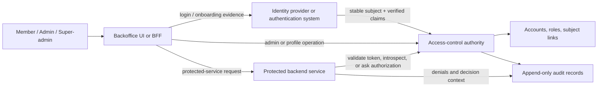

# Architecture Options

Status: Review
Phase: Phase 2 - Requirements and Risk Framing
Scope: Architecture
Last reviewed: 2026-05-08

## Contents

- [Purpose](#purpose)
- [Source Inputs](#source-inputs)
- [Current Project Shape](#current-project-shape)
- [Architecture Drivers](#architecture-drivers)
- [Logical Responsibility Model](#logical-responsibility-model)
- [Shared Design Questions](#shared-design-questions)
- [Architecture Options](#architecture-options)
- [Cross-Option Comparison](#cross-option-comparison)
- [Threat Fit Review](#threat-fit-review)
- [PoC and Evaluation Implications](#poc-and-evaluation-implications)
- [Open Questions](#open-questions)
- [Document Review](#document-review)
- [References](#references)

## Purpose

This document proposes Phase 2 architecture options from the consolidated feature requirements and the current threat model. It is an option-framing artifact, not an architecture decision, vendor decision, implementation plan, or production recommendation. Architecture selection remains out of scope for Phase 2 unless the project is explicitly moved into solution choice or review ([Project governance](../../PROJECT-GOVERNANCE.md#phase-2---requirements-and-risk-framing), [README - Open Study Questions](../../README.md#open-study-questions)).

The useful question is not "which product wins?" yet. The useful question is which architecture shapes are plausible enough to carry into solution-choice evaluation or a focused non-production PoC without violating the feature model or hiding security risk ([Project governance](../../PROJECT-GOVERNANCE.md#phase-3---solution-choice), [Project governance](../../PROJECT-GOVERNANCE.md#phase-4---proof-of-concept)).

## Source Inputs

| Source | How this document uses it |
| --- | --- |
| Project brief | Defines the project goal: a simple, secure, auditable access-control model for fewer than 1,000 backoffice users, with account types separate from service-access roles ([README](../../README.md#project-goal)). |
| Feature requirements | Defines the mandatory behavior for account lifecycle, immutable account types, IdP subject linking, automatic onboarding, protected-service authorization, auditability, and out-of-scope boundaries ([Feature requirements specification](../../FEATURE-REQUIREMENTS.md#feature-requirements)). |
| Threat model | Supplies the main architecture pressures: privilege escalation, broken object/function authorization, stale access, wrong-signal trust, onboarding takeover, IdP claim override, token replay, audit gaps, unsafe failure modes, and operational bypass ([Threat model](../risks/threat-model.md#threat-scenarios)). |
| Conceptual IAM wiki | Provides vocabulary for IAM control plane/data plane split, IAM architecture families, PDP/PEP terminology, token lifecycle, and BFF/browser session trade-offs ([IAM control plane vs data plane](../wiki/14-iam-control-plane-vs-data-plane.md), [IAM architecture](../wiki/15-iam-architecture.md), [PDP, PEP, PIP, and PAP](../wiki/17-pdp-pep-pip-pap.md), [Web sessions, cookies, and BFF pattern](../wiki/24-web-sessions-cookies-and-bff.md)). |
| OAuth2, OIDC, and security guidance | Supports protocol and security claims around protected resources, bearer access evidence, token introspection, JWT access tokens, authorization server metadata, OIDC identity claims, server-side authorization, privileged authentication, and threat modeling ([RFC 6749](https://www.rfc-editor.org/rfc/rfc6749), [RFC 6750](https://www.rfc-editor.org/rfc/rfc6750), [RFC 7662](https://www.rfc-editor.org/rfc/rfc7662), [RFC 9068](https://www.rfc-editor.org/rfc/rfc9068), [RFC 8414](https://www.rfc-editor.org/rfc/rfc8414), [OpenID Connect Core](https://openid.net/specs/openid-connect-core-1_0.html), [OWASP Authorization Cheat Sheet](https://cheatsheetseries.owasp.org/cheatsheets/Authorization_Cheat_Sheet.html), [NIST SP 800-63B](https://pages.nist.gov/800-63-4/sp800-63b.html), [OWASP Threat Modeling Process](https://owasp.org/www-community/Threat_Modeling_Process)). |

## Current Project Shape

The access-control capability is a logical authority, not yet a selected deployment architecture. It must own backoffice account state, fixed account types, lifecycle state, service-access role catalog and assignments, protected-service authorization rules, and audit-supporting operations ([Feature requirements specification](../../FEATURE-REQUIREMENTS.md#feature-requirements)).

Authentication is deliberately separated from the local access-control model. The identity provider or authentication system owns credentials, MFA, login sessions, IdP account recovery, invitation delivery, and authentication for invited accounts. The access-control capability consumes a stable authenticated subject and verified email evidence only through a documented integration boundary ([Feature requirements specification](../../FEATURE-REQUIREMENTS.md#definitions), `FR-010`, `FR-036`, `FR-042`, `FR-043`; [OpenID Connect Core](https://openid.net/specs/openid-connect-core-1_0.html)).

Protected backend services must authorize server-side from active account state and account type or member service-access role rules. They must deny access when the result cannot be safely determined. OWASP authorization guidance supports deny-by-default, validating permissions on every request, placing checks in the right location, safe failure behavior, and logging ([Feature requirements specification](../../FEATURE-REQUIREMENTS.md#feature-requirements), `FR-020`, `FR-021`, `FR-033`; [OWASP Authorization Cheat Sheet](https://cheatsheetseries.owasp.org/cheatsheets/Authorization_Cheat_Sheet.html)).

## Architecture Drivers

| ID | Driver | Requirement and threat basis | Architecture implication |
| --- | --- | --- | --- |
| AD-001 | Local authorization source of truth | Account type, lifecycle, roles, and audit requirements belong to the backoffice access-control capability, and IdP claims must not override them (`FR-001`, `FR-002`, `FR-036` through `FR-038`; [Threat model TS-006 and TS-008](../risks/threat-model.md#threat-scenarios)). | Every option needs an explicit local authority for account state and authorization facts, even when login is delegated. |
| AD-002 | Safe onboarding and immutable subject link | Automatic onboarding can link and activate only one invited account with no existing subject link, verified matching email, and privileged-authentication evidence for privileged accounts in production (`FR-039` through `FR-044`; [Threat model TS-007](../risks/threat-model.md#threat-scenarios); [OpenID Connect Core](https://openid.net/specs/openid-connect-core-1_0.html)). | Options must show where onboarding matching, subject-link creation, activation, failure handling, and audit events happen. |
| AD-003 | Server-side admin and object authorization | Admin/super-admin operations and object-level account access must be enforced server-side (`FR-017` through `FR-019`, `FR-024`, `FR-026`, `FR-033`; [Threat model TS-002 and TS-003](../risks/threat-model.md#threat-scenarios); [OWASP API1:2023](https://owasp.org/API-Security/editions/2023/en/0xa1-broken-object-level-authorization/), [OWASP API5:2023](https://owasp.org/API-Security/editions/2023/en/0xa5-broken-function-level-authorization/)). | Options must identify the Policy Enforcement Point for admin APIs and protected services. |
| AD-004 | Access-stop behavior must be explainable | The system must stop already-issued access after account disablement, archival, member role removal, or service-access role disablement or archival, but the acceptable delay is not selected yet (`FR-016`, `FR-032`; [Threat model TS-005 and RC-003](../risks/threat-model.md#requirement-refinement-candidates)). | Options must make token/session/cache staleness visible rather than burying it in implementation detail. |
| AD-005 | Token and session replay risk | Bearer access evidence can be replayed by whoever possesses it unless protected and validated. RFC 6750 defines bearer-token use, and RFC 7662 defines token introspection as a way for a protected resource to query token state and metadata ([RFC 6750](https://www.rfc-editor.org/rfc/rfc6750), [RFC 7662](https://www.rfc-editor.org/rfc/rfc7662), [Threat model TS-010](../risks/threat-model.md#threat-scenarios)). | Options must compare browser exposure, token validation, introspection or authorization lookup, logging redaction, and revocation behavior. |
| AD-006 | Privileged account protection | Production admin and super-admin authentication requires MFA or phishing-resistant passwordless authentication, with exact methods deferred (`FR-034`; [Threat model TS-009](../risks/threat-model.md#threat-scenarios); [NIST SP 800-63B](https://pages.nist.gov/800-63-4/sp800-63b.html)). | Options must show how privileged-authentication evidence is obtained, consumed during onboarding, and possibly reused for later sensitive operations. |
| AD-007 | Audit evidence and integrity | Audit events cover lifecycle, subject links, roles, protected-service denials, audit reads/exports, recovery/login reset, and onboarding failures; audit records are append-only and retained indefinitely in the initial policy (`FR-027`, `FR-028`, `FR-035`; [Threat model TS-011](../risks/threat-model.md#threat-scenarios)). | Options must identify audit ownership, event correlation, export handling, and how provider-side events are reconciled with local audit. |
| AD-008 | Operability at small internal scale | The expected scale is fewer than 1,000 users and added complexity must be justified by security, compliance, maintainability, or product need ([README - Project Goal](../../README.md#project-goal), `FR-030`). | Options that add many services, policy engines, or runtime dependencies need clear justification and failure-mode analysis. |
| AD-009 | No final vendor or implementation decision | Final vendor, product, architecture, hosting, database, token/session strategy, browser storage, and implementation stack are out of scope for Phase 2 ([README - Initial Scope](../../README.md#initial-scope), [Project governance](../../PROJECT-GOVERNANCE.md#phase-2---requirements-and-risk-framing)). | This document should frame choices and evaluation questions, not select the final target solution. |

## Logical Responsibility Model

These responsibilities are required regardless of physical deployment. The conceptual wiki distinguishes the IAM control plane that owns identity and access state from the application data plane that enforces protected work ([IAM control plane vs data plane](../wiki/14-iam-control-plane-vs-data-plane.md)).

The diagram is logical. A managed provider, self-hosted product, library, custom service, BFF, and protected API may collapse or split these boxes differently. The architecture must still preserve the authorization boundary: successful authentication is not enough to create, activate, or authorize a backoffice account except through the controlled onboarding activation flow (`FR-037`, `FR-043`, `FR-044`; [Feature requirements specification](../../FEATURE-REQUIREMENTS.md#feature-requirements)).

## Shared Design Questions

These questions apply to every option and should become solution-choice criteria before a solution is chosen.

| Question | Why it matters | Source |
| --- | --- | --- |
| Where is the source of truth for account type, lifecycle state, subject link, role catalog, member assignments, and audit records? | Prevents IdP roles, groups, claims, or provider dashboards from silently overriding the project authorization model. | `FR-001`, `FR-002`, `FR-036` through `FR-039`; [Threat model TS-008](../risks/threat-model.md#threat-scenarios) |
| What is the protected-service authorization contract? | Protected services must know whether they validate a JWT locally, introspect an opaque token, call an authorization API, use a server-side session, or combine patterns. | `FR-020`, `FR-021`, `FR-022`; [RFC 6750](https://www.rfc-editor.org/rfc/rfc6750), [RFC 7662](https://www.rfc-editor.org/rfc/rfc7662), [RFC 9068](https://www.rfc-editor.org/rfc/rfc9068) |
| How fast must access changes take effect? | JWT claims, session caches, introspection responses, and authorization lookups have different staleness and outage behavior. | `FR-016`, `FR-032`; [Threat model RC-003](../risks/threat-model.md#requirement-refinement-candidates) |
| Which component is the PEP for each operation? | A frontend or BFF can improve UX and browser security, but protected backend services and admin APIs still need server-side enforcement. | `FR-020`, `FR-033`; [PDP, PEP, PIP, and PAP](../wiki/17-pdp-pep-pip-pap.md), [OWASP Authorization Cheat Sheet](https://cheatsheetseries.owasp.org/cheatsheets/Authorization_Cheat_Sheet.html) |
| How is privileged-authentication evidence represented? | Admin and super-admin onboarding requires production evidence that the privileged-authentication requirement was satisfied. | `FR-034`, `FR-043`, `FR-044`; [NIST SP 800-63B](https://pages.nist.gov/800-63-4/sp800-63b.html) |
| Where do audit events originate and correlate? | Audit reads/exports, role changes, subject-link attempts, onboarding failures, and protected-service denials need attributable evidence. | `FR-027`, `FR-028`, `FR-035`; [Threat model TS-011](../risks/threat-model.md#threat-scenarios) |
| What fails closed during dependency outage? | IdP, authorization lookup, introspection, session store, audit sink, or policy engine outage must not silently grant access. | `FR-021`, `FR-029`, `FR-030`; [Threat model TS-012](../risks/threat-model.md#threat-scenarios) |
| How are support exports, backups, restores, and migrations controlled? | Operational paths can expose or mutate account state, subject links, roles, or audit records outside normal admin flows. | `FR-014`, `FR-029`, `FR-035`; [Threat model TS-013](../risks/threat-model.md#threat-scenarios) |

## Architecture Options

### Option A - Local Modular Access-Control Service with External IdP

The project owns a local access-control service, likely deployed as one modular service at first. The external identity provider or authentication system owns credentials, MFA, invitation delivery, login sessions, and account recovery. The local service owns backoffice accounts, account types, lifecycle state, subject links, service-access roles, admin APIs, protected-service authorization checks, and audit events ([Feature requirements specification](../../FEATURE-REQUIREMENTS.md#definitions), `FR-024`, `FR-042`).

This option keeps the project authorization model local while delegating commodity authentication behavior. OpenID Connect can supply authenticated-subject and claim evidence, but OIDC authentication claims must be resolved into one linked local account before authorization is evaluated ([OpenID Connect Core](https://openid.net/specs/openid-connect-core-1_0.html), `FR-036`, `FR-038`).

**Best fit signals**

- The team wants the simplest local authority for the custom account-type and service-access-role model.
- Protected-service access can be checked through a local authorization API, local middleware backed by the access-control service, or short-lived access evidence with explicit staleness rules.
- The IdP can provide verified email and privileged-authentication evidence needed by onboarding without becoming the source of local roles (`FR-043`, `FR-044`).

**Main risks to review**

- The integration can accidentally treat IdP groups, roles, or claims as authoritative local roles unless this is explicitly forbidden and tested (`FR-038`; [Threat model TS-008](../risks/threat-model.md#threat-scenarios)).
- If protected services call the access-control service at runtime, outage behavior, cache behavior, and fail-closed behavior must be documented (`FR-021`; [Threat model TS-012](../risks/threat-model.md#threat-scenarios)).
- Append-only audit and indefinite retention remain local responsibilities (`FR-035`).

### Option B - Managed Identity Platform plus Local Authorization Layer

A managed identity platform owns hosted login, credential handling, MFA or passwordless authentication, invitation/authentication flows, OIDC/OAuth2 endpoints, and possibly user or organization administration. The project still owns local backoffice account state, immutable account types, service-access roles, protected-service authorization, and project audit evidence ([Feature requirements specification](../../FEATURE-REQUIREMENTS.md#feature-requirements), [IAM architecture](../wiki/15-iam-architecture.md)).

This is a hybrid model. It may reduce custom protocol and authentication ownership, but the candidate must be evaluated rather than assumed. OAuth authorization server metadata and OIDC discovery can describe issuer endpoints and capabilities, but product-specific role semantics, management APIs, audit export, limits, and privileged-authentication evidence need direct verification later ([RFC 8414](https://www.rfc-editor.org/rfc/rfc8414), [OpenID Connect Discovery](https://openid.net/specs/openid-connect-discovery-1_0.html), [Project governance](../../PROJECT-GOVERNANCE.md#evidence-standard)).

**Best fit signals**

- The project wants strong authentication and protocol operations without building credentials, MFA, hosted login, recovery, and token endpoints.
- Local service-access roles are product-specific enough that they should remain outside provider groups or global directory roles.
- Audit evidence can combine provider events with local access-control events without losing the local append-only audit requirement (`FR-027`, `FR-035`).

**Main risks to review**

- Vendor roles, groups, scopes, or claims can look like a shortcut but may not match the fixed account-type and member-only service-role assignment model (`FR-001` through `FR-005`, `FR-038`).
- Management API limits, data export, audit retention, privileged-authentication evidence, outage behavior, and lock-in are solution-choice topics, not assumptions ([Project governance](../../PROJECT-GOVERNANCE.md#phase-3---solution-choice)).
- Already-issued access stop behavior can be constrained by provider token lifetime, revocation, introspection, and session behavior (`FR-016`; [RFC 7009](https://www.rfc-editor.org/rfc/rfc7009), [RFC 7662](https://www.rfc-editor.org/rfc/rfc7662)).

### Option C - Self-Hosted Identity Platform plus Project-Specific Access-Control Layer

A self-hosted identity platform owns OIDC/OAuth2 runtime behavior, users or federated identities, MFA where supported, clients, keys, and some admin/audit surfaces. A project-specific layer still owns the backoffice account model, immutable account types, service-access roles, subject-link lifecycle, protected-service authorization contract, and project audit requirements ([IAM architecture](../wiki/15-iam-architecture.md), [Feature requirements specification](../../FEATURE-REQUIREMENTS.md#feature-requirements)).

This option trades provider dependency for operational ownership. It can be attractive when deployment control, data control, or customization matters, but it moves upgrades, backups, hardening, monitoring, key rotation, and incident response into the project or infrastructure team. That extra burden must be justified by concrete project needs at this scale (`FR-030`; [README - Project Goal](../../README.md#project-goal)).

**Best fit signals**

- The project needs more control over identity infrastructure than a managed provider can offer.
- The team can operate an identity system as a security-critical dependency, including backup, restore, upgrades, keys, and monitoring.
- The platform's role/group model can be kept subordinate to the local backoffice authorization model or mapped safely with tests (`FR-038`).

**Main risks to review**

- Self-hosted identity operations can outgrow the project if ownership is unclear (`FR-030`; [Threat model TS-013](../risks/threat-model.md#threat-scenarios)).
- Product roles, groups, or admin UI features may encourage model drift unless the local account-type and role invariants are enforced (`FR-001`, `FR-002`, `FR-026`).
- Audit events split across product logs and local logs need correlation and retention rules (`FR-027`, `FR-035`).

### Option D - Authorization-Server Library inside a Modular Monolith

The project builds a custom modular service and uses an authorization-server library for OAuth2/OIDC protocol endpoints, token issuance, metadata, JWKS, revocation, introspection, or client handling. OAuth2 defines authorization server and resource server roles, RFC 8414 defines authorization server metadata, RFC 7662 defines introspection, and RFC 9068 defines a JWT access-token profile when JWT access tokens are selected ([RFC 6749](https://www.rfc-editor.org/rfc/rfc6749), [RFC 8414](https://www.rfc-editor.org/rfc/rfc8414), [RFC 7662](https://www.rfc-editor.org/rfc/rfc7662), [RFC 9068](https://www.rfc-editor.org/rfc/rfc9068)).

This option gives high customization and can keep the product model internally coherent. It also means the team owns much more security-critical IAM behavior around login integration, clients, token lifetime, refresh, revocation, signing keys, audit, admin APIs, and operations. RFC 9700 updates OAuth security guidance and should be treated as a required evaluation source if this path is considered ([RFC 9700](https://www.rfc-editor.org/rfc/rfc9700)).

**Best fit signals**

- The project needs a highly customized IAM runtime and has the engineering/security capacity to own it.
- A single deployable modular service is preferred, but protocol endpoints must still be standards-aware and testable.
- The team wants to compare JWT, opaque token introspection, and authorization-check API behavior inside one controlled non-production PoC.

**Main risks to review**

- A protocol library is not a complete IAM product. Account lifecycle, MFA evidence, role management, audit retention, admin UI/API behavior, and operational hardening remain project work ([IAM architecture](../wiki/15-iam-architecture.md), `FR-024`, `FR-027`, `FR-034`, `FR-035`).
- Custom token/session behavior can create stale access or bearer replay windows if lifetimes, revocation, storage, and validation are not designed explicitly (`FR-016`; [Threat model TS-005 and TS-010](../risks/threat-model.md#threat-scenarios)).
- Signing-key rotation and issuer/audience validation are architecture responsibilities, not incidental library configuration ([RFC 9068](https://www.rfc-editor.org/rfc/rfc9068), [RFC 9700](https://www.rfc-editor.org/rfc/rfc9700)).

### Option E - Split IAM Control Plane with Protected-Service Authorization Contract

The access-control authority is a separate IAM control-plane service, and protected backend services are resource servers or application data-plane services. The BFF or client authenticates through the IdP/authentication system. Protected services then enforce authorization using one of these contracts: local JWT validation plus operation checks, opaque token introspection, a central authorization-check API, or a server-side session-mediated request path ([RFC 6750](https://www.rfc-editor.org/rfc/rfc6750), [RFC 7662](https://www.rfc-editor.org/rfc/rfc7662), [RFC 9068](https://www.rfc-editor.org/rfc/rfc9068), [IAM control plane vs data plane](../wiki/14-iam-control-plane-vs-data-plane.md)).

This option is useful because the project explicitly includes protected backend services. It forces a concrete answer to `FR-020`, `FR-021`, and `FR-022`: what does a protected service trust, what does it check, and what happens when it cannot safely determine access?

**Best fit signals**

- There are multiple protected backend services, or the first PoC must prove the protected-service boundary before choosing a product.
- The team wants a precise integration contract for active state, account type inheritance, member role assignment, active service-access roles, and fail-closed behavior.
- Runtime authorization freshness matters enough to compare JWT staleness, introspection, and authorization-check APIs.

**Main risks to review**

- Central introspection or authorization-check APIs add runtime dependency, latency, caching, and outage questions (`FR-021`, `FR-030`; [Threat model TS-012](../risks/threat-model.md#threat-scenarios)).
- JWT-only protected-service validation can be fast, but role or lifecycle changes may remain effective until token expiry unless additional lookup or revocation-aware behavior is added (`FR-016`; [RFC 9068](https://www.rfc-editor.org/rfc/rfc9068)).
- Audit responsibility is split: the IAM side can log state changes and authorization checks, while protected services may also need denial and decision-context logs (`FR-027`; [Threat model TS-011](../risks/threat-model.md#threat-scenarios)).

### Option F - Externalized Policy Decision or Microservice Decomposition

The authorization decision logic is externalized to a policy decision service or policy engine, or IAM responsibilities are decomposed into multiple independently deployed services. PDP/PEP terminology is useful here: the backend API is still the Policy Enforcement Point, while a policy engine or authorization service may become the Policy Decision Point ([PDP, PEP, PIP, and PAP](../wiki/17-pdp-pep-pip-pap.md)).

This option is intentionally a complexity benchmark for the current scope. Microservice architecture can provide independent deployment and autonomy, but Microsoft notes that microservices introduce complexity around service discovery, data consistency, communication, testing, and governance ([Microsoft - Microservices architecture style](https://learn.microsoft.com/en-us/azure/architecture/guide/architecture-styles/microservices)). For fewer than 1,000 internal users and coarse service-access roles, that complexity needs a stronger driver than "it is more scalable" (`FR-030`; [README - Project Goal](../../README.md#project-goal)).

**Best fit signals**

- Authorization grows beyond simple service-access roles into object, organization, relationship, or policy-heavy decisions.
- Several independent applications need a shared decision service with governed policy lifecycle.
- Candidate evaluation shows that local RBAC or central authorization lookup cannot express required decisions safely.

**Main risks to review**

- Policy engines do not replace authentication, account lifecycle, OIDC token issuance, admin workflows, or audit ownership ([IAM architecture](../wiki/15-iam-architecture.md)).
- More deployable services create more secrets, service authentication, network authorization, monitoring, failure modes, and support procedures ([Threat model TS-012 and TS-013](../risks/threat-model.md#threat-scenarios)).
- For the current feature set, this may solve a future problem at the cost of present operability (`FR-030`).

## Cross-Option Comparison

| Criterion | Option A: local AC + external IdP | Option B: managed identity + local authz | Option C: self-hosted identity + local authz | Option D: library-based modular monolith | Option E: split IAM/control-plane contract | Option F: policy engine or microservices |
| --- | --- | --- | --- | --- | --- | --- |
| Local feature-model control | High. Local service owns account type, lifecycle, roles, and audit. | High if provider claims stay subordinate. | High if product roles/groups are mapped safely. | Highest, but the team owns more IAM behavior. | High if IAM authority is explicit. | Depends on policy data ownership. |
| Authentication burden | Lower, delegated to external IdP. | Lowest if provider satisfies privileged auth and recovery needs. | Medium to high because platform operations are local. | High unless authentication is still delegated. | Depends on chosen IdP/runtime. | Does not solve authentication by itself. |
| Protected-service integration clarity | Medium unless a contract is defined. | Medium unless provider/local token boundary is explicit. | Medium unless product/local token boundary is explicit. | Medium to high in a PoC. | Highest because the contract is the option's purpose. | High for authorization decisions, but wider operational burden. |
| Access-stop fit | Good with live authorization lookup; weaker with long-lived cached access. | Depends on provider token/session behavior plus local checks. | Depends on platform token/session behavior plus local checks. | Fully controllable but fully owned. | Good for introspection/authorization API; JWT-only needs staleness design. | Good if decision service is fresh and available. |
| IdP claim override risk | Medium and testable. | High unless provider roles/groups are carefully scoped. | High unless product roles/groups are carefully scoped. | Lower if claims are designed locally, but still possible. | Medium across service boundary. | Medium if policy inputs include IdP claims without local resolution. |
| Audit fit | Strong local path, with provider auth evidence linked. | Needs provider/local audit correlation. | Needs product/local audit correlation and operations logs. | Strong local path if implemented well. | Split IAM and service logs need correlation. | Policy decision logs plus local audit need correlation. |
| Operational burden | Low to medium. | Low to medium, with integration and vendor governance. | Medium to high. | Medium to high. | Medium. | High. |
| Phase 2 role | Plausible baseline shape. | Plausible hybrid candidate family. | Candidate family if control/self-hosting matters. | Build-own benchmark and PoC path. | Protected-service integration benchmark. | Complexity benchmark or later option if authorization grows. |

## Threat Fit Review

| Threat pressure | Stronger-fitting options | Watch-outs |
| --- | --- | --- |
| `TS-001` account-type mutation or self-elevation | A, B, C, D, and E can fit if the local account model is authoritative and tested. | B and C must not map provider/product roles directly to account types without local invariants. |
| `TS-002` and `TS-003` broken function/object authorization | A, D, E, and F make custom server-side enforcement visible. | Any option can fail if admin routes or account IDs are protected only by UI checks. |
| `TS-005` access continues after lifecycle or role change | E is clearest for comparing introspection, authorization lookup, and JWT staleness; D can PoC both token formats. | B and C depend on provider/product token and session behavior; A still needs an explicit protected-service contract. |
| `TS-006` protected service trusts wrong signal | E is strongest because it centers the trust contract; A and D can be strong if service checks are local and testable. | JWT claims, IdP groups, mutable email, or frontend state must not become decisive authorization facts. |
| `TS-007` onboarding takeover | A, B, C, and D can fit if onboarding matching and subject-link creation remain local and audited. | Managed or self-hosted product invitations must be verified against the local invited account rules, not accepted as automatic authorization. |
| `TS-008` IdP claim override | A and D have the most local control; B and C need strongest solution-choice checks. | Provider/product roles may be useful for login UX or app assignment but cannot override local access-control state. |
| `TS-009` weak privileged authentication | B and C may provide mature MFA/passwordless features; A and D need delegated evidence or custom integration. | The architecture still needs a machine-readable way to prove privileged-authentication satisfaction during onboarding. |
| `TS-010` token/session replay | BFF-style A/B/C/E variants can reduce browser token exposure; E clarifies resource-server validation. | Bearer tokens in browser-readable storage, logs, URLs, traces, or exports remain high risk. |
| `TS-011` audit gap or tampering | A and D give the clearest single local audit path; E can be strong with correlation IDs. | B and C must reconcile provider/product audit with local append-only audit requirements. |
| `TS-012` unsafe outage behavior | A and D can keep more decisions local; E and F require explicit dependency handling. | Introspection, authorization APIs, policy engines, audit sinks, and session stores must not fail open. |
| `TS-013` operational bypass | A and B may keep operations simpler; C, D, E, and F need more operational controls. | Backup/restore/support/export paths must preserve subject-link, lifecycle, role, and audit invariants. |
| `TS-014` silent permission growth | A, D, and E can enforce a narrow service-access catalog; F becomes useful only if richer policies are justified. | Do not adopt a policy engine just to avoid defining role and service coverage clearly. |

## PoC and Evaluation Implications

No PoC is started by this document. If the user later asks for a non-production PoC, the highest-value PoC questions are architecture-neutral and can be tested without choosing a final vendor or product ([Project governance](../../PROJECT-GOVERNANCE.md#phase-4---proof-of-concept)).

| Evaluation question | Why it matters | Candidate options to exercise |
| --- | --- | --- |
| Can an authenticated subject be linked to exactly one invited account only under `FR-043` conditions? | This tests onboarding takeover resistance and IdP claim handling. | A, B, C, D |
| Can protected services deny access when the account, role, or authorization lookup is unavailable or unsafe? | This tests fail-closed behavior and wrong-signal trust. | A, D, E |
| How quickly does access stop after disablement or role removal under JWT, opaque introspection, or authorization-check API patterns? | This makes staleness measurable instead of theoretical. | D, E, and provider-backed B/C variants |
| Can admin and super-admin operations enforce function-level and object-level authorization server-side? | This tests privilege escalation and broken authorization risks. | A, B, C, D |
| Can privileged-authentication evidence be consumed during admin/super-admin onboarding? | This tests `FR-034`, `FR-043`, and `FR-044` before implementation. | A, B, C, D |
| Can audit events be correlated across local access-control, protected services, and any provider/product logs? | This tests audit completeness and operational evidence. | All options |

## Open Questions

| ID | Question | Why it remains open |
| --- | --- | --- |
| OQ-AO-001 | What is the acceptable access-stop delay after account disablement, archival, member role removal, or service-access role disablement/archival? | `FR-016` requires the capability, but token/session/cache strategy is still undecided. |
| OQ-AO-002 | Should protected services call a central authorization API, introspect opaque tokens, validate JWTs locally, or combine patterns? | This is the core protected-service integration choice and affects latency, outage behavior, audit, and staleness. |
| OQ-AO-003 | What exact evidence proves production privileged authentication for invited admin and super-admin activation? | `FR-034` and `FR-043` require evidence, but authenticator method and claim shape are deferred. |
| OQ-AO-004 | Is a BFF session model required for the backoffice browser, or only a candidate pattern? | A BFF can reduce browser token exposure, but it adds session, CSRF, scaling, and failure behavior to operate ([Web sessions, cookies, and BFF pattern](../wiki/24-web-sessions-cookies-and-bff.md)). |
| OQ-AO-005 | What is the minimum audit event schema and correlation model across access-control, provider/product logs, and protected services? | `FR-027` defines event coverage, but schema, correlation IDs, export, privacy, and integrity controls still need refinement. |
| OQ-AO-006 | Which operational artifacts are in scope for evaluation: backups, restore tests, support exports, migration, provider export, and key rotation? | Threat model `TS-013` shows these can bypass normal authorization if ignored. |
| OQ-AO-007 | Is a policy engine needed soon, or should it remain a future option until permissions outgrow service-access roles? | Current requirements are service-access-role oriented, and `FR-030` requires justified complexity. |

## Document Review

This review checks whether the document is fit for Phase 2 architecture-option discussion. It is not a production design review or final recommendation.

| Check | Result | Notes |
| --- | --- | --- |
| Uses the right source documents | Pass | The options are derived from `FEATURE-REQUIREMENTS.md`, `docs/risks/threat-model.md`, project governance, and conceptual IAM wiki pages. |
| Preserves Phase 2 boundaries | Pass | The document does not choose a final architecture, vendor, product, token/session strategy, hosting model, database, or implementation stack. |
| Keeps authorization local to the feature model | Pass | Every option requires local authority over account type, lifecycle, subject link, service-access roles, and audit evidence. |
| Addresses threat-model pressure | Pass | The review maps options against all current threat scenarios `TS-001` through `TS-014`. |
| Uses inline citations near material claims | Pass | Project claims cite project artifacts; protocol/security claims cite official specifications or official security guidance. |
| Avoids implementation artifacts | Pass | No code, dependencies, package managers, Docker files, databases, migrations, CI files, generated artifacts, or deployment files are introduced. |
| Remaining review gaps | Open | Access-stop delay, protected-service contract, privileged-authentication evidence, audit schema/integrity, BFF/browser strategy, and operational artifacts still need stakeholder or solution-choice input. |

Review outcome: this document is ready for stakeholder and architecture review as an option-framing artifact. The main follow-up is to convert the open questions into solution-choice criteria before choosing a solution or running a PoC.

## References

- [README - Project Goal](../../README.md#project-goal)
- [README - Initial Scope](../../README.md#initial-scope)
- [README - Open Study Questions](../../README.md#open-study-questions)
- [Feature Requirements Specification](../../FEATURE-REQUIREMENTS.md)
- [Threat Model](../risks/threat-model.md)
- [Project Governance - Evidence Standard](../../PROJECT-GOVERNANCE.md#evidence-standard)
- [Project Governance - Phase 2](../../PROJECT-GOVERNANCE.md#phase-2---requirements-and-risk-framing)
- [IAM Control Plane vs Data Plane](../wiki/14-iam-control-plane-vs-data-plane.md)
- [IAM Architecture](../wiki/15-iam-architecture.md)
- [PDP, PEP, PIP, and PAP](../wiki/17-pdp-pep-pip-pap.md)
- [Web Sessions, Cookies, and BFF Pattern](../wiki/24-web-sessions-cookies-and-bff.md)
- [RFC 6749 - OAuth 2.0 Authorization Framework](https://www.rfc-editor.org/rfc/rfc6749)
- [RFC 6750 - OAuth 2.0 Bearer Token Usage](https://www.rfc-editor.org/rfc/rfc6750)
- [RFC 7009 - OAuth 2.0 Token Revocation](https://www.rfc-editor.org/rfc/rfc7009)
- [RFC 7662 - OAuth 2.0 Token Introspection](https://www.rfc-editor.org/rfc/rfc7662)
- [RFC 8414 - OAuth 2.0 Authorization Server Metadata](https://www.rfc-editor.org/rfc/rfc8414)
- [RFC 9068 - JWT Profile for OAuth 2.0 Access Tokens](https://www.rfc-editor.org/rfc/rfc9068)
- [RFC 9700 - Best Current Practice for OAuth 2.0 Security](https://www.rfc-editor.org/rfc/rfc9700)
- [OpenID Connect Core 1.0](https://openid.net/specs/openid-connect-core-1_0.html)
- [OpenID Connect Discovery 1.0](https://openid.net/specs/openid-connect-discovery-1_0.html)
- [OWASP Authorization Cheat Sheet](https://cheatsheetseries.owasp.org/cheatsheets/Authorization_Cheat_Sheet.html)
- [OWASP API1:2023 Broken Object Level Authorization](https://owasp.org/API-Security/editions/2023/en/0xa1-broken-object-level-authorization/)
- [OWASP API5:2023 Broken Function Level Authorization](https://owasp.org/API-Security/editions/2023/en/0xa5-broken-function-level-authorization/)
- [OWASP Threat Modeling Process](https://owasp.org/www-community/Threat_Modeling_Process)
- [NIST SP 800-63B - Authentication and Authenticator Management](https://pages.nist.gov/800-63-4/sp800-63b.html)
- [Microsoft - Microservices architecture style](https://learn.microsoft.com/en-us/azure/architecture/guide/architecture-styles/microservices)
