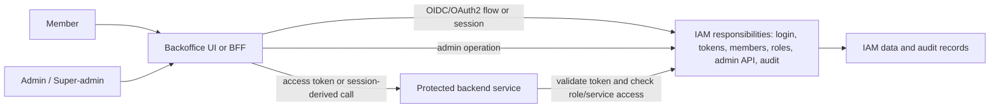

# Architecture Options

Status: Draft
Phase: Phase 2 - Requirements and Risk Framing
Scope: Architecture
Last reviewed: 2026-05-06

## Contents

- [Purpose](#purpose)
- [Current Project Shape](#current-project-shape)
- [Logical Responsibilities](#logical-responsibilities)
- [Options](#options)
- [Comparison Matrix](#comparison-matrix)
- [Phase 2 Evaluation Posture](#phase-2-evaluation-posture)
- [PoC Implications](#poc-implications)
- [Open Questions](#open-questions)
- [References](#references)

## Purpose

This document frames possible architecture shapes for the internal backoffice auth server study. It answers the current architecture question at Phase 2 level: monolithic, modular monolithic, split control-plane, microservices, or hybrid. It does not make a final architecture recommendation, as final architecture selection is explicitly out of scope until later decision phases ([README](../../README.md#phase-2-debate-topics), [Project governance](../../PROJECT-GOVERNANCE.md#phase-2---requirements-and-risk-framing)).

## Current Project Shape

| Input | Architecture consequence | Source |
| --- | --- | --- |
| Starts from zero | There is no legacy decomposition to preserve. Architecture options can be evaluated by fitness, simplicity, and security instead of migration constraints. | User-provided answer, 2026-05-06. |
| Fewer than 1,000 internal users | Scale alone does not justify distributed complexity unless security, maintainability, deployment, or ownership requirements create that need. | [README](../../README.md#company-goal). |
| Human users only for initial scope | Service-to-machine flows are not a baseline deployment driver, though protected backend services still need server-side access checks. | User-provided answer, 2026-05-06; [README](../../README.md#minimum-feature-requirements). |
| Fixed roles | The first authorization model can use simple RBAC rather than externalized fine-grained policy by default. | User-provided answer, 2026-05-06; [RBAC](../wiki/05-rbac.md). |
| Security is the main risk | Options must be judged on token validation, admin safety, auditability, credential/key management, revocation behavior, and operational ownership. | User-provided answer, 2026-05-06; [README](../../README.md#minimum-feature-requirements). |
| PoC targets OAuth2/OIDC, RBAC, backoffice integration, and admin/API | The useful PoC boundary is a login or token flow, an admin mutation path, and at least one protected backend authorization check. | User-provided answer, 2026-05-06; [RFC 6749](https://www.rfc-editor.org/rfc/rfc6749); [OpenID Connect Core 1.0](https://openid.net/specs/openid-connect-core-1_0.html). |
| PoC service boundary | The first PoC should use one protected backend service. It should prove the authorization boundary once before testing multi-service behavior. | User-provided answer, 2026-05-06; [README](../../README.md#minimum-feature-requirements). |

## Logical Responsibilities

These responsibilities exist regardless of deployment shape. The wiki calls the central authority the IAM Control Plane when it owns identity, token issuance, access administration, IAM data, and auditability ([IAM Control Plane vs Data Plane](../wiki/14-iam-control-plane-vs-data-plane.md)).

The architecture decision is how many deployable units own these responsibilities, not whether the responsibilities exist.

## Options

### Option A - All-in-one Monolith

One deployable application owns the backoffice UI or BFF, member lifecycle, authentication, OAuth2/OIDC behavior, fixed roles, admin API, protected-service access checks, and audit storage. A monolithic application is typically self-contained and deployed as a single unit, even if it calls databases or other services during execution ([Microsoft - Common web application architectures](https://learn.microsoft.com/en-us/dotnet/architecture/modern-web-apps-azure/common-web-application-architectures)).

Best Phase 2 fit:

- Useful as the simplest conceptual baseline for a from-zero internal system.
- Low deployment overhead.
- Clear single ownership for audit and admin behavior.

Main security and study risks:

- If OAuth2/OIDC protocol behavior is custom-built, the team owns a high-risk security surface including flows, redirects, tokens, keys, clients, revocation, and validation behavior ([RFC 6749](https://www.rfc-editor.org/rfc/rfc6749), [RFC 9700](https://www.rfc-editor.org/rfc/rfc9700)).
- If the UI, admin API, and protected resources are too tightly coupled, frontend-only authorization mistakes can hide weak server-side enforcement; OWASP guidance treats server-side authorization as mandatory ([OWASP Authorization Cheat Sheet](https://cheatsheetseries.owasp.org/cheatsheets/Authorization_Cheat_Sheet.html)).
- Scaling, deployment, and incident isolation happen for the whole application rather than per capability.

### Option B - Modular Monolith

One deployable service is internally split into modules such as identity, OAuth2/OIDC, RBAC, admin API, audit, and protected-service integration. Microsoft distinguishes logical layers from physical deployment tiers: an application can be internally layered while still deployed as one unit ([Microsoft - Common web application architectures](https://learn.microsoft.com/en-us/dotnet/architecture/modern-web-apps-azure/common-web-application-architectures)).

Best Phase 2 fit:

- Preserves simple deployment while making security boundaries visible.
- Helps test the IAM domain without forcing network calls between every responsibility.
- Keeps a future path open if one module later needs to become a separate service.

Main security and study risks:

- Module boundaries can be ignored unless enforced by tests, code ownership, and clear contracts.
- A single deployable still means a failure or bad release can affect the full IAM capability.
- Protocol correctness remains a major responsibility unless delegated to a mature product or library.

### Option C - Split IAM Control Plane and Protected Backend API

The IAM capability is one deployable authority, while protected backend services are separate resource servers. The backoffice UI or BFF authenticates through the IAM side, then calls protected APIs with an access token or trusted server-side session-derived request. Resource servers validate tokens and enforce role or service-access decisions server-side ([RFC 6750](https://www.rfc-editor.org/rfc/rfc6750), [IAM Control Plane vs Data Plane](../wiki/14-iam-control-plane-vs-data-plane.md)).

Best Phase 2 fit:

- Directly tests the required boundary between admin/IAM state and protected backend services.
- Makes token validation and authorization-check behavior visible.
- Avoids splitting every IAM subdomain into separate services.

Main security and study risks:

- Requires clear failure behavior when the IAM service is unavailable.
- Requires careful token audience, issuer, key, and permission-check contracts.
- May introduce runtime dependency on introspection or authorization lookup if permissions are not carried in short-lived tokens.

### Option D - Microservices

IAM responsibilities are decomposed into independently deployed services, for example identity, token service, member lifecycle, role assignment, audit, admin API, and authorization checks. Microsoft describes microservices as small, autonomous services that communicate through well-defined APIs and can be deployed independently, but also notes that microservices add complexity around service discovery, data consistency, communication, testing, and governance ([Microsoft - Microservices architecture style](https://learn.microsoft.com/en-sg/azure/architecture/guide/architecture-styles/microservices)).

Best Phase 2 fit:

- Useful as a stress-test option for independent ownership, independent scaling, and service-boundary questions.
- May fit later if IAM becomes a shared platform across many independent backoffice products.
- Can isolate high-risk audit or token responsibilities if the team has the operational maturity to run them.

Main security and study risks:

- More network boundaries create more authentication, authorization, secret-management, observability, and failure-mode work.
- Distributed IAM state makes consistency and revocation behavior harder to explain.
- For fewer than 1,000 internal users and fixed roles, operational complexity may outweigh benefits unless later requirements justify it ([README](../../README.md#company-goal), [Microsoft - Architecture styles](https://learn.microsoft.com/en-us/azure/architecture/guide/architecture-styles/)).

### Option E - Product-backed or Hybrid IAM

A managed provider, self-hosted identity product, or authorization-server library owns some IAM responsibilities, while the project owns product-specific roles, admin workflows, protected-service integration, and audit requirements. The conceptual wiki treats this as a common hybrid IAM architecture pattern rather than a final product choice ([IAM Architecture](../wiki/15-iam-architecture.md)).

Best Phase 2 fit:

- Keeps OAuth2/OIDC protocol, login, MFA, and client-management responsibilities open for evidence-based evaluation.
- Allows the project to compare "build less IAM" against "own more IAM" before selecting candidates.
- Can be combined with Option B or Option C as the local deployment shape.

Main security and study risks:

- Provider roles, groups, scopes, and claims may not match the project's operation-level RBAC needs.
- Vendor or product audit behavior, API limits, data export, and role-removal latency must be verified later, not assumed.
- A library-based approach can solve token endpoints while still leaving member lifecycle, admin API, MFA, audit, and operations to the team.

## Comparison Matrix

| Criterion | Option A: all-in-one monolith | Option B: modular monolith | Option C: split IAM/API | Option D: microservices | Option E: product-backed or hybrid |
| --- | --- | --- | --- | --- | --- |
| Deployment simplicity | Highest. | High. | Medium. | Low. | Depends on provider/product and local pieces. |
| Security boundary clarity | Low unless carefully designed. | Medium to high through internal modules. | High between IAM and protected APIs. | High in theory, but more boundaries to secure. | Depends on integration contracts. |
| OAuth2/OIDC learning value | Medium if implemented or integrated locally. | Medium to high. | High because token validation at a resource server is explicit. | High but potentially noisy. | High if provider/library behavior is part of the PoC. |
| RBAC fit | Good for fixed roles. | Good for fixed roles. | Good for fixed roles plus service checks. | Often excessive for fixed roles alone. | Depends on product role/permission model. |
| Auditability | Simple single audit path. | Simple audit path with clearer domains. | Clear IAM audit plus resource-service denial logs. | Harder because audit events cross services. | Must verify provider and local audit evidence. |
| Operational burden | Lowest. | Low. | Medium. | Highest. | Provider-backed can lower protocol burden but may add integration burden. |
| Fit for current scale | Plausible baseline. | Plausible baseline. | Plausible baseline if protected APIs are separate. | Needs specific justification. | Plausible if protocol/security burden should be delegated. |

## Phase 2 Evaluation Posture

No final architecture is selected here. For the next Phase 2 work, the useful comparison set is:

1. Option B as the simplest internally structured build shape.
2. Option C as the clearest way to study protected backend-service integration.
3. Option E as the way to keep managed, self-hosted, and library-backed IAM possibilities open without naming candidates yet.
4. Option D as a complexity benchmark, not a default assumption.

This posture follows the feature specification's simplicity requirement and the current fixed-role, human-only scope, while still leaving OAuth2/OIDC, token strategy, product choice, and deployment architecture open for later evidence ([README](../../README.md#minimum-feature-requirements), [README](../../README.md#phase-2-debate-topics)).

## PoC Implications

The future PoC should stay minimal with one protected backend service. It can still answer the important architecture questions before any later multi-service test is justified by evidence or scope change:

| PoC question | Why it matters | Source |
| --- | --- | --- |
| Can a member complete an OIDC login or OAuth2 authorization flow and call a protected API? | Tests the login-to-resource-server path without choosing production architecture. | User-provided answer, 2026-05-06; [OpenID Connect Core 1.0](https://openid.net/specs/openid-connect-core-1_0.html); [RFC 6749](https://www.rfc-editor.org/rfc/rfc6749). |
| Can the protected API validate issuer, audience, lifetime, and token integrity or introspection result? | A resource server must validate a bearer token before trusting it. | [RFC 6750](https://www.rfc-editor.org/rfc/rfc6750); [RFC 9700](https://www.rfc-editor.org/rfc/rfc9700). |
| Can fixed roles answer "may this active member access this service?" | FS-008 and FS-011 require role-based service access and protected-service access checks. | [README](../../README.md#minimum-feature-requirements); [RBAC](../wiki/05-rbac.md). |
| Can admin operations change members and roles with audit events? | FS-006, FS-007, FS-015, and FS-016 require member/role administration and auditable privileged operations. | [README](../../README.md#minimum-feature-requirements). |
| How quickly does disabled or removed access stop working? | FS-005 requires access removal for already-issued access to be documented and evaluated. | [README](../../README.md#minimum-feature-requirements); [Token Lifecycle](../wiki/12-token-lifecycle.md). |
| Can the same minimal service prove the service-access check without introducing multi-service orchestration? | FS-017 requires simplicity, and the stakeholder confirmed a one-service PoC boundary. | [README](../../README.md#minimum-feature-requirements); user-provided answer, 2026-05-06. |

## Open Questions

1. Should the first architecture study assume a BFF for browser sessions, or a pure SPA calling APIs directly?
2. Should authentication be local for PoC simplicity, or should the PoC immediately use an external OIDC provider or product?
3. Should the single protected PoC backend service be a member-management API, a synthetic demo API, or an existing internal API?
4. What access-removal delay is acceptable after a member is disabled or a role is removed?
5. Which audit events must be produced by the IAM authority, and which must be produced by protected backend services?
6. Is there a future requirement for service-to-machine access, or should service accounts stay outside the study until explicitly requested?

## References

- [README - Immutable Feature Specification](../../README.md#immutable-feature-specification)
- [Project Governance - Phase 2](../../PROJECT-GOVERNANCE.md#phase-2---requirements-and-risk-framing)
- [Wiki - IAM Control Plane vs Data Plane](../wiki/14-iam-control-plane-vs-data-plane.md)
- [Wiki - IAM Architecture](../wiki/15-iam-architecture.md)
- [Wiki - RBAC and Permission Modeling](../wiki/05-rbac.md)
- [Wiki - Token Lifecycle](../wiki/12-token-lifecycle.md)
- [Microsoft - Common web application architectures](https://learn.microsoft.com/en-us/dotnet/architecture/modern-web-apps-azure/common-web-application-architectures)
- [Microsoft - Microservices architecture style](https://learn.microsoft.com/en-sg/azure/architecture/guide/architecture-styles/microservices)
- [Microsoft - Architecture styles](https://learn.microsoft.com/en-us/azure/architecture/guide/architecture-styles/)
- [RFC 6749 - The OAuth 2.0 Authorization Framework](https://www.rfc-editor.org/rfc/rfc6749)
- [RFC 6750 - The OAuth 2.0 Authorization Framework: Bearer Token Usage](https://www.rfc-editor.org/rfc/rfc6750)
- [RFC 9700 - Best Current Practice for OAuth 2.0 Security](https://www.rfc-editor.org/rfc/rfc9700)
- [OpenID Connect Core 1.0](https://openid.net/specs/openid-connect-core-1_0.html)
- [OWASP Authorization Cheat Sheet](https://cheatsheetseries.owasp.org/cheatsheets/Authorization_Cheat_Sheet.html)
