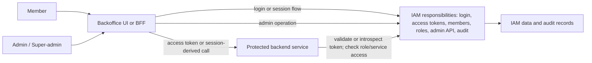

# Architecture Options

Status: Draft
Phase: Phase 2 - Requirements and Risk Framing
Scope: Architecture
Last reviewed: 2026-05-06

## Contents

- [Purpose](#purpose)
- [Current Project Shape](#current-project-shape)
- [Baseline Alignment](#baseline-alignment)
- [Token Format Evaluation](#token-format-evaluation)
- [Logical Responsibilities](#logical-responsibilities)
- [Options](#options)
- [Comparison Matrix](#comparison-matrix)
- [Phase 2 Evaluation Posture](#phase-2-evaluation-posture)
- [PoC Implications](#poc-implications)
- [Open Questions](#open-questions)
- [References](#references)

## Purpose

This document frames possible architecture shapes for the internal backoffice auth server study. It answers the current architecture question at Phase 2 level: monolithic, modular monolithic, split control-plane, microservices, or hybrid. It does not make a final architecture recommendation, as final architecture selection is explicitly out of scope until later decision phases ([README](../../README.md#phase-2-debate-topics), [Project governance](../../PROJECT-GOVERNANCE.md#phase-2---requirements-and-risk-framing)).

## Current Project Shape

| Input | Architecture consequence | Source |
| --- | --- | --- |
| Starts from zero | There is no legacy decomposition to preserve. Architecture options can be evaluated by fitness, simplicity, and security instead of migration constraints. | User-provided answer, 2026-05-06. |
| Fewer than 1,000 internal users | Scale alone does not justify distributed complexity unless security, maintainability, deployment, or ownership requirements create that need. | [README](../../README.md#company-goal). |
| Human users only for initial scope | Service-to-machine flows are not a baseline deployment driver, though protected backend services still need server-side access checks. | User-provided answer, 2026-05-06; [README](../../README.md#minimum-feature-requirements). |
| Role-based service access | The first authorization model uses simple RBAC for service access. Super-admins can create roles; admins can list, assign, and remove roles. | [Requirements baseline](../requirements/baseline.md#administration-and-role-management); [RBAC](../wiki/05-rbac.md). |
| Security is the main risk | Options must be judged on access-token validation, admin safety, auditability, credential/key management, access-removal delay, and operational ownership. | User-provided answer, 2026-05-06; [Requirements baseline](../requirements/baseline.md#security-baseline). |
| PoC targets access-token-backed access, RBAC, backoffice integration, and admin/API | The useful PoC boundary is a login or session path, an admin mutation path, and one protected backend authorization check. The access-token format remains open. | [Requirements baseline](../requirements/baseline.md#assumptions); [Requirements baseline](../requirements/baseline.md#security-baseline). |
| PoC service boundary | The first PoC should use one simple protected backend API whose only purpose is to answer whether a member has access to a demo resource such as `demo:read`. | [Requirements baseline](../requirements/baseline.md#assumptions). |

## Baseline Alignment

The requirements baseline fixes several points while deliberately leaving the access-token format open. Architecture options must treat the fixed points as constraints without turning them into a final deployment recommendation.

| Baseline decision | Architecture implication | Source |
| --- | --- | --- |
| Access tokens are required for protected-service access, but their format is not selected. | Options should compare JWT access tokens, opaque access tokens, and any hybrid pattern before production recommendation. | [Requirements baseline](../requirements/baseline.md#security-baseline), [RFC 7519](https://www.rfc-editor.org/rfc/rfc7519), [RFC 7662](https://www.rfc-editor.org/rfc/rfc7662). |
| Already-issued access removal remains an evaluation point. | Options need to compare whether access removal relies on token expiration, token introspection, authorization lookup, or a combination. Browser token/session storage also remains open. | [Requirements baseline](../requirements/baseline.md#member-lifecycle), [Requirements baseline](../requirements/baseline.md#simplicity-and-study-constraints). |
| Admins and super-admins require MFA or phishing-resistant passwordless login. | Candidate products, libraries, or custom flows must support strong privileged-user login controls. | [Requirements baseline](../requirements/baseline.md#security-baseline). |
| Audit records are retained indefinitely and audit events are append-only. | Options must account for audit storage growth, export, backup, and restore behavior. | [Requirements baseline](../requirements/baseline.md#operational-baseline). |
| Break-glass access is out of current study scope. | Architecture options should not include break-glass mechanisms as a current evaluation driver. | [Requirements baseline](../requirements/baseline.md#operational-baseline). |

## Token Format Evaluation

The access-token format is now an architecture question. OAuth bearer tokens can be presented to protected resources regardless of whether the token value is structured or opaque ([RFC 6750](https://www.rfc-editor.org/rfc/rfc6750)). JWT gives a structured token format ([RFC 7519](https://www.rfc-editor.org/rfc/rfc7519)); if JWT is selected for OAuth 2.0 access tokens, RFC 9068 defines an access-token profile ([RFC 9068](https://www.rfc-editor.org/rfc/rfc9068)). OAuth token introspection defines how a protected resource can ask an authorization server for token active state and metadata, which is the usual comparison point for opaque access tokens ([RFC 7662](https://www.rfc-editor.org/rfc/rfc7662)).

| Criterion | JWT access token | Opaque access token | Project implication |
| --- | --- | --- | --- |
| Protected-service validation | Can be validated locally when the service has the issuer, audience, lifetime, and signing-key contract. | Requires introspection or another trusted authorization lookup. | JWT favors service autonomy; opaque favors centralized control. |
| Access removal | Already-issued permissions usually remain usable until token expiry unless the service performs an additional lookup. | The authorization server can answer with current active state and metadata during introspection. | Opaque tokens may fit better if disablement or role removal must take effect before normal token expiry. |
| Data exposure | Claims are visible to whoever holds the token unless encryption or minimal claims are used. | Token value does not reveal authorization data by itself. | Opaque tokens reduce accidental claim exposure to browsers, logs, and tools. |
| Operational dependency | Resource servers depend on signing-key distribution and rotation. | Resource servers depend on the availability and latency of the introspection or authorization endpoint. | The study should compare key-management burden against runtime dependency. |
| Auditability | Denials and decisions may be distributed across protected services. | Central introspection or authorization lookup can create a clearer audit point if designed that way. | Opaque tokens may simplify audit correlation, but only if the lookup path is logged. |
| PoC fit | Tests local JWT validation and short-lived token behavior. | Tests central "has access" lookup and current member/role state. | The minimal PoC can compare both without changing the demo API boundary. |

## Logical Responsibilities

These responsibilities exist regardless of deployment shape. The wiki calls the central authority the IAM Control Plane when it owns identity, token issuance, access administration, IAM data, and auditability ([IAM Control Plane vs Data Plane](../wiki/14-iam-control-plane-vs-data-plane.md)).

The architecture decision is how many deployable units own these responsibilities, not whether the responsibilities exist.

## Options

### Option A - All-in-one Monolith

One deployable application owns the backoffice UI or BFF, member lifecycle, authentication, OAuth2/OIDC behavior if used, access-token issuance, role-based service access, admin API, protected-service access checks, and audit storage. A monolithic application is typically self-contained and deployed as a single unit, even if it calls databases or other services during execution ([Microsoft - Common web application architectures](https://learn.microsoft.com/en-us/dotnet/architecture/modern-web-apps-azure/common-web-application-architectures), [Requirements baseline](../requirements/baseline.md#security-baseline)).

Best Phase 2 fit:

- Useful as the simplest conceptual baseline for a from-zero internal system.
- Low deployment overhead.
- Clear single ownership for audit and admin behavior.

Main security and study risks:

- If OAuth2/OIDC protocol behavior is custom-built, the team owns a high-risk security surface including flows, redirects, token issuance, signing keys for JWTs, introspection or lookup contracts for opaque tokens, clients, revocation delay, and validation behavior ([RFC 6749](https://www.rfc-editor.org/rfc/rfc6749), [RFC 7519](https://www.rfc-editor.org/rfc/rfc7519), [RFC 7662](https://www.rfc-editor.org/rfc/rfc7662), [RFC 9700](https://www.rfc-editor.org/rfc/rfc9700)).
- If the UI, admin API, and protected resources are too tightly coupled, frontend-only authorization mistakes can hide weak server-side enforcement; OWASP guidance treats server-side authorization as mandatory ([OWASP Authorization Cheat Sheet](https://cheatsheetseries.owasp.org/cheatsheets/Authorization_Cheat_Sheet.html)).
- Scaling, deployment, and incident isolation happen for the whole application rather than per capability.

### Option B - Modular Monolith

One deployable service is internally split into modules such as identity, OAuth2/OIDC, RBAC, admin API, audit, and protected-service integration. Microsoft distinguishes logical layers from physical deployment tiers: an application can be internally layered while still deployed as one unit ([Microsoft - Common web application architectures](https://learn.microsoft.com/en-us/dotnet/architecture/modern-web-apps-azure/common-web-application-architectures)).

Best Phase 2 fit:

- Preserves simple deployment while making security boundaries visible.
- Helps test the IAM domain without forcing network calls between every responsibility.
- Keeps a future path open if one module later needs to become a separate service.

Main security and study risks:

- Module boundaries can be ignored unless enforced by tests, code ownership, and clear contracts.
- A single deployable still means a failure or bad release can affect the full IAM capability.
- Protocol correctness remains a major responsibility unless delegated to a mature product or library.

### Option C - Split IAM Control Plane and Protected Backend API

The IAM capability is one deployable authority, while protected backend services are separate resource servers. The backoffice UI or BFF authenticates through the IAM side, then calls protected APIs with an access token or trusted server-side session-derived request. Resource servers validate JWTs locally or introspect opaque tokens, then enforce role or service-access decisions server-side ([RFC 6750](https://www.rfc-editor.org/rfc/rfc6750), [RFC 7519](https://www.rfc-editor.org/rfc/rfc7519), [RFC 7662](https://www.rfc-editor.org/rfc/rfc7662), [IAM Control Plane vs Data Plane](../wiki/14-iam-control-plane-vs-data-plane.md)).

Best Phase 2 fit:

- Directly tests the required boundary between admin/IAM state and protected backend services.
- Makes token validation and authorization-check behavior visible.
- Avoids splitting every IAM subdomain into separate services.

Main security and study risks:

- Requires clear failure behavior when the IAM service is unavailable.
- Requires careful token audience, issuer, signing-key or introspection, lifetime, and permission-check contracts.
- May introduce runtime dependency on introspection or authorization lookup if opaque tokens are used or if JWTs do not carry enough current authorization context.

### Option D - Microservices

IAM responsibilities are decomposed into independently deployed services, for example identity, token service, member lifecycle, role assignment, audit, admin API, and authorization checks. Microsoft describes microservices as small, autonomous services that communicate through well-defined APIs and can be deployed independently, but also notes that microservices add complexity around service discovery, data consistency, communication, testing, and governance ([Microsoft - Microservices architecture style](https://learn.microsoft.com/en-sg/azure/architecture/guide/architecture-styles/microservices)).

Best Phase 2 fit:

- Useful as a stress-test option for independent ownership, independent scaling, and service-boundary questions.
- May fit later if IAM becomes a shared platform across many independent backoffice products.
- Can isolate high-risk audit or token responsibilities if the team has the operational maturity to run them.

Main security and study risks:

- More network boundaries create more authentication, authorization, secret-management, observability, and failure-mode work.
- Distributed IAM state makes consistency and revocation behavior harder to explain.
- For fewer than 1,000 internal users and simple service roles, operational complexity may outweigh benefits unless later requirements justify it ([README](../../README.md#company-goal), [Microsoft - Architecture styles](https://learn.microsoft.com/en-us/azure/architecture/guide/architecture-styles/)).

### Option E - Product-backed or Hybrid IAM

A managed provider, self-hosted identity product, or authorization-server library owns some IAM responsibilities, while the project owns product-specific roles, admin workflows, protected-service integration, and audit requirements. The conceptual wiki treats this as a common hybrid IAM architecture pattern rather than a final product choice ([IAM Architecture](../wiki/15-iam-architecture.md)).

Best Phase 2 fit:

- Keeps OAuth2/OIDC protocol, login implementation, MFA or phishing-resistant passwordless support, and client-management responsibilities open for evidence-based evaluation.
- Allows the project to compare "build less IAM" against "own more IAM" before selecting candidates.
- Can be combined with Option B or Option C as the local deployment shape.

Main security and study risks:

- Provider roles, groups, scopes, and claims may not match the project's operation-level RBAC needs.
- Vendor or product audit behavior, API limits, data export, append-only audit support, token introspection, role-removal latency, and token lifetime policy must be verified later, not assumed.
- A library-based approach can solve token endpoints while still leaving member lifecycle, admin API, privileged login controls, audit, and operations to the team.

## Comparison Matrix

| Criterion | Option A: all-in-one monolith | Option B: modular monolith | Option C: split IAM/API | Option D: microservices | Option E: product-backed or hybrid |
| --- | --- | --- | --- | --- | --- |
| Deployment simplicity | Highest. | High. | Medium. | Low. | Depends on provider/product and local pieces. |
| Security boundary clarity | Low unless carefully designed. | Medium to high through internal modules. | High between IAM and protected APIs. | High in theory, but more boundaries to secure. | Depends on integration contracts. |
| OAuth2/OIDC learning value | Medium if implemented or integrated locally. | Medium to high. | High because token validation at a resource server is explicit. | High but potentially noisy. | High if provider/library behavior is part of the PoC. |
| RBAC fit | Good for simple service roles. | Good for simple service roles. | Good for simple service roles plus protected-service checks. | Often excessive for simple service roles alone. | Depends on product role/permission model. |
| Auditability | Simple single audit path. | Simple audit path with clearer domains. | Clear IAM audit plus resource-service denial logs. | Harder because audit events cross services. | Must verify provider and local append-only audit evidence. |
| Operational burden | Lowest. | Low. | Medium. | Highest. | Provider-backed can lower protocol burden but may add integration burden. |
| Fit for current scale | Plausible baseline. | Plausible baseline. | Plausible baseline if protected APIs are separate. | Needs specific justification. | Plausible if protocol/security burden should be delegated. |

## Phase 2 Evaluation Posture

No final architecture is selected here. For the next Phase 2 work, the useful comparison set is:

1. Option B as the simplest internally structured build shape.
2. Option C as the clearest way to study protected backend-service integration.
3. Option E as the way to keep managed, self-hosted, and library-backed IAM possibilities open without naming candidates yet.
4. Option D as a complexity benchmark, not a default assumption.

This posture follows the feature specification's simplicity requirement and the current human-only, role-based scope. Access tokens are now a baseline requirement; JWT versus opaque access-token format, token lifetime policy, OAuth2/OIDC usage, browser token storage, product choice, and deployment architecture remain open for later evidence ([README](../../README.md#minimum-feature-requirements), [Requirements baseline](../requirements/baseline.md#security-baseline), [Requirements baseline](../requirements/baseline.md#simplicity-and-study-constraints)).

## PoC Implications

The future PoC should stay minimal with one protected backend service. The baseline now frames this service as a simple "has access" demo API that answers whether a member can access a demo resource such as `demo:read` ([Requirements baseline](../requirements/baseline.md#assumptions)). It can still answer the important architecture questions before any later multi-service test is justified by evidence or scope change:

| PoC question | Why it matters | Source |
| --- | --- | --- |
| Can a member complete a login or session flow and call a protected API with an access token? | Tests the login-to-resource-server path without choosing production architecture, access-token format, or browser token storage. | [Requirements baseline](../requirements/baseline.md#security-baseline); [RFC 6750](https://www.rfc-editor.org/rfc/rfc6750). |
| Can the protected API validate a JWT locally or introspect an opaque token before trusting it? | A resource server must validate a bearer token before using it for authorization; introspection is the standard comparison path for opaque token metadata and active state. | [Requirements baseline](../requirements/baseline.md#security-baseline); [RFC 6750](https://www.rfc-editor.org/rfc/rfc6750); [RFC 7519](https://www.rfc-editor.org/rfc/rfc7519); [RFC 7662](https://www.rfc-editor.org/rfc/rfc7662); [RFC 9700](https://www.rfc-editor.org/rfc/rfc9700). |
| Can a simple role such as `demo:read` answer "may this active member access this demo resource?" | FS-008 and FS-011 require role-based service access and protected-service access checks. | [Requirements baseline](../requirements/baseline.md#assumptions); [README](../../README.md#minimum-feature-requirements); [RBAC](../wiki/05-rbac.md). |
| Can admin and super-admin operations change members, roles, and audit records according to their separate responsibilities? | The baseline separates admin role assignment from super-admin role creation, audit access, and recovery-sensitive operations. | [Requirements baseline](../requirements/baseline.md#administration-and-role-management); [Requirements baseline](../requirements/baseline.md#auditability). |
| Does access removal follow the documented behavior after disablement, archival, or role-access removal? | The baseline requires comparing JWT expiration delay with opaque-token introspection or authorization lookup behavior. | [Requirements baseline](../requirements/baseline.md#member-lifecycle). |

## Open Questions

1. Should protected services use JWT access tokens, opaque access tokens with introspection or authorization lookup, or a hybrid pattern ([Requirements baseline](../requirements/baseline.md#open-questions))?
2. Which browser token or session storage model should the architecture use: BFF server-side session, HttpOnly cookies, in-memory access tokens, or another pattern ([Requirements baseline](../requirements/baseline.md#simplicity-and-study-constraints))?
3. Should authentication be local for PoC simplicity, or should the PoC immediately use an external OIDC provider or product ([README](../../README.md#phase-2-debate-topics))?
4. Which audit events must be produced by the IAM authority, and which must be produced by protected backend services ([Requirements baseline](../requirements/baseline.md#auditability))?
5. Do role creation, audit export, recovery, or login-factor reset require recent authentication or step-up beyond the baseline MFA or phishing-resistant passwordless login ([README](../../README.md#phase-2-debate-topics), [Requirements baseline](../requirements/baseline.md#security-baseline))?
6. Is there a future requirement for service-to-machine access, or should service accounts stay outside the study until explicitly requested ([README](../../README.md#initial-scope))?

## References

- [README - Immutable Feature Specification](../../README.md#immutable-feature-specification)
- [Project Governance - Phase 2](../../PROJECT-GOVERNANCE.md#phase-2---requirements-and-risk-framing)
- [Requirements Baseline](../requirements/baseline.md)
- [Wiki - IAM Control Plane vs Data Plane](../wiki/14-iam-control-plane-vs-data-plane.md)
- [Wiki - IAM Architecture](../wiki/15-iam-architecture.md)
- [Wiki - RBAC and Permission Modeling](../wiki/05-rbac.md)
- [Microsoft - Common web application architectures](https://learn.microsoft.com/en-us/dotnet/architecture/modern-web-apps-azure/common-web-application-architectures)
- [Microsoft - Microservices architecture style](https://learn.microsoft.com/en-sg/azure/architecture/guide/architecture-styles/microservices)
- [Microsoft - Architecture styles](https://learn.microsoft.com/en-us/azure/architecture/guide/architecture-styles/)
- [RFC 6749 - The OAuth 2.0 Authorization Framework](https://www.rfc-editor.org/rfc/rfc6749)
- [RFC 6750 - The OAuth 2.0 Authorization Framework: Bearer Token Usage](https://www.rfc-editor.org/rfc/rfc6750)
- [RFC 7519 - JSON Web Token](https://www.rfc-editor.org/rfc/rfc7519)
- [RFC 7662 - OAuth 2.0 Token Introspection](https://www.rfc-editor.org/rfc/rfc7662)
- [RFC 9068 - JSON Web Token (JWT) Profile for OAuth 2.0 Access Tokens](https://www.rfc-editor.org/rfc/rfc9068)
- [RFC 9700 - Best Current Practice for OAuth 2.0 Security](https://www.rfc-editor.org/rfc/rfc9700)
- [OWASP Authorization Cheat Sheet](https://cheatsheetseries.owasp.org/cheatsheets/Authorization_Cheat_Sheet.html)
