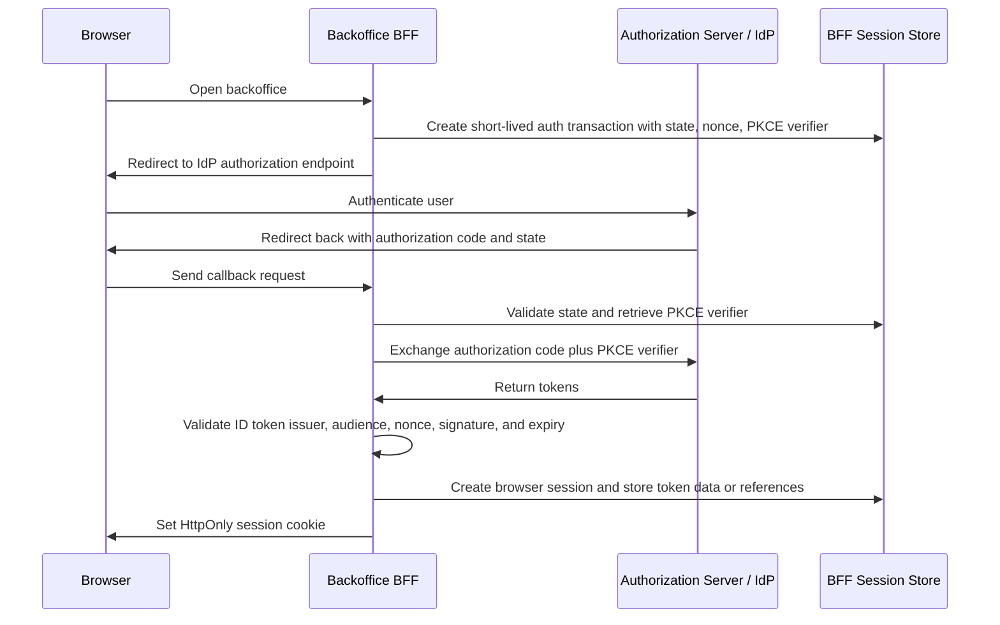
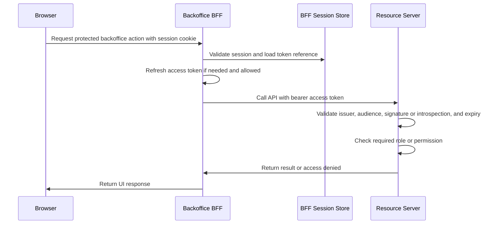

# BFF Sessions and Token Handling

This page explains why the selected architecture uses a Backoffice BFF (Backend-for-Frontend), what that BFF should own, how browser sessions relate to OAuth2/OIDC tokens, and which questions a later PoC or implementation must answer.

This is Phase 1 study material. It does not choose a web framework, session store, token vault, identity provider, deployment topology, or production implementation.

The architecture-level service and database boundaries are summarized in [Minimal Backoffice IAM Architecture Notes](./minimal-backoffice-iam-architecture.md). This page is the detailed study note for BFF browser sessions, server-side token handling, CSRF, refresh, and logout behavior.

## Why this exists

The backoffice is used through a browser, but OAuth2/OIDC tokens are security-sensitive credentials. If access tokens or refresh tokens are exposed directly to browser JavaScript, a cross-site scripting issue can become token theft, offline token replay, or long-lived access after the user closes the page.

The BFF pattern exists to reduce that browser-side token exposure. The browser keeps an opaque session cookie. The BFF handles OIDC redirects, stores OAuth tokens or token references server-side, and calls backend APIs with access tokens. Backend APIs still validate those access tokens and enforce permissions.

In this project, the BFF is a browser security boundary and integration layer. It is not the IAM authority.

```text
Browser
  - receives HTML/JS
  - stores HttpOnly session cookie
  - does not store OAuth tokens

Backoffice BFF
  - owns browser session
  - handles OIDC callback
  - stores token data or token references server-side
  - calls IdP/Admin API and backend APIs

IdP / Authorization Server / Admin Control Plane
  - authenticates users
  - issues tokens
  - owns members, roles, permissions, clients, and audit events

Backend APIs
  - validate access tokens
  - enforce operation-level permissions
```

## Responsibility boundary

| Area | BFF should do | BFF should not do |
| --- | --- | --- |
| Browser session | Issue and validate an opaque session cookie. | Put OAuth access tokens or refresh tokens in browser storage. |
| OIDC login | Start Authorization Code Flow with PKCE, store transaction state, validate the callback, and create a local session. | Authenticate passwords directly unless the project explicitly chooses a local-login implementation later. |
| Token handling | Store tokens or token references server-side, refresh tokens when needed, and redact credentials from logs. | Treat token claims as a substitute for server-side API authorization checks. |
| API calls | Call backend APIs with access tokens issued by the IdP/authorization server. | Let backend APIs trust only the BFF session cookie. |
| Administration | Call the central IAM Admin API on behalf of the signed-in administrator. | Enforce administrator permissions only in the UI or only in BFF route handlers. |
| Authorization data | Pass identity and request context to the central IAM component and backend APIs. | Become a second source of truth for members, roles, permissions, or service accounts. |
| Audit context | Preserve useful request context for privileged operations. | Log passwords, access tokens, refresh tokens, authorization codes, client secrets, or session IDs. |

The BFF can make the browser safer, but it also becomes security-critical infrastructure. A compromised BFF can access server-side sessions and tokens, so it needs conservative session handling, secret storage, logging, dependency, and operational controls.

## Session model baseline

The browser-facing session should be represented by an opaque, high-entropy session identifier, not by OAuth tokens or user profile data.

Example cookie shape:

```text
Set-Cookie: __Host-bff_session=<opaque-random-value>;
  Path=/;
  HttpOnly;
  Secure;
  SameSite=Lax
```

The exact cookie attributes depend on deployment and login behavior, but the baseline intent is:

| Attribute | Why it matters |
| --- | --- |
| `HttpOnly` | Browser JavaScript cannot read the session cookie through `document.cookie`. |
| `Secure` | The browser sends the cookie only over HTTPS. |
| `SameSite=Lax` or `SameSite=Strict` | Reduces cross-site request risk. `Lax` is often easier for ordinary top-level navigation and login callbacks; `Strict` is tighter but can break some cross-site entry flows. |
| `Path=/` | Keeps the cookie scoped to the application path. |
| no `Domain` attribute with `__Host-` prefix | Prevents subdomains from setting or overriding the cookie when browser support and deployment allow the prefix rules. |
| opaque value | Prevents the browser from carrying readable identity, roles, permissions, or tokens. |

A simple server-side session record could contain:

```text
bff_sessions
- id
- session_id_hash
- user_subject
- idp_issuer
- created_at
- expires_at
- last_seen_at
- csrf_secret
- token_reference or encrypted_access_token
- access_token_expires_at
- encrypted_refresh_token or refresh_token_reference
- revoked_at
```

The BFF should store only a hash of the browser session identifier. If the session store is leaked, hashed session identifiers are less immediately reusable than raw session IDs.

## Login flow

For browser-based backoffice login, the baseline is Authorization Code Flow with PKCE through the BFF.



The `state`, `nonce`, and PKCE verifier are not decoration. They protect different parts of the redirect-based login flow:

| Value | Purpose |
| --- | --- |
| `state` | Links the callback to a login transaction started by this browser session and helps defend against CSRF-style login callback attacks. |
| `nonce` | Links the ID token to this authentication request and helps prevent replay of an ID token in OIDC. |
| PKCE verifier/challenge | Ties the authorization-code exchange to the client instance that started the flow. |

The BFF should validate the issuer it expected to use. This matters if the system ever supports multiple identity providers or environments, because mix-up between issuers can turn a valid response from the wrong system into a security bug.

## API call flow

After login, the browser calls the BFF with its session cookie. The BFF calls backend APIs with access tokens.



The BFF session proves that the browser has an active local session with the BFF. It does not prove that the caller may perform every backend operation. Backend APIs remain responsible for validating access tokens and enforcing permissions server-side.

## Token storage options

The project should keep browser tokens out of `localStorage`, `sessionStorage`, readable cookies, URLs, and logs. The useful storage options are server-side:

| Option | Where it fits | Trade-off |
| --- | --- | --- |
| Encrypted tokens in BFF session store | Simple first PoC or small deployment. | Session store compromise becomes sensitive; encryption and key rotation matter. |
| Token vault table | Stronger separation between session records and token material. | Adds implementation and operational complexity. |
| Reference-only session | The BFF stores only an internal reference and obtains tokens from a separate secure service or provider mechanism. | Depends on provider or platform support. |
| In-memory token storage | Local development only. | Sessions disappear on restart and do not work across BFF replicas. |
| Encrypted browser cookie | Usually a poor fit for OAuth tokens. | Token size, revocation, exposure, replay, and rotation are harder to control. |

For the first study and minimal PoC, the important question is not which storage product to use. The important question is whether the design proves that OAuth tokens stay server-side and that the browser only carries an opaque session cookie.

## Refresh, expiry, and access removal

The current study baseline allows removed access to expire at access-token expiry rather than requiring immediate revocation. That baseline only works if access tokens are short-lived and privileged changes are audited.

The BFF needs explicit behavior for:

- access-token expiry;
- refresh-token storage;
- refresh-token rotation if the provider supports it;
- token refresh failure;
- member disablement;
- role removal;
- logout;
- incident response.

| Event | First baseline behavior | Later stronger option |
| --- | --- | --- |
| Access token expires | BFF refreshes the token if the session and refresh token are valid. | Require step-up or re-authentication for sensitive operations. |
| Refresh token expires or is rejected | BFF ends the local session or asks the user to sign in again. | Record a security event if reuse detection or suspicious behavior is reported. |
| User logs out | BFF revokes local session, deletes cookie, and revokes refresh token if supported. | Also use OIDC RP-Initiated Logout where provider support and UX fit. |
| Member is disabled | New sessions should be blocked; existing access remains only until token/session expiry unless revocation is implemented. | Revoke sessions and refresh tokens immediately; use introspection or authorization lookup for high-risk APIs. |
| Role is removed | Existing JWT claims may remain effective until access-token expiry. | Use shorter token lifetimes, introspection, or a permission lookup for sensitive operations. |

Refresh tokens are more sensitive than short-lived access tokens because they can be used to obtain new access tokens. If the BFF stores refresh tokens, it should treat them like credentials: encrypt or vault them, restrict access, rotate when possible, and never log them.

## CSRF and browser request protection

Because the browser authenticates to the BFF with a cookie, the BFF must handle CSRF risk for state-changing requests. `HttpOnly` protects confidentiality of the cookie from JavaScript, but it does not stop the browser from sending the cookie on a request.

The baseline controls are:

- use `SameSite=Lax` or `SameSite=Strict` where compatible with the login flow;
- require CSRF tokens for state-changing browser-to-BFF requests;
- validate `Origin` or `Referer` headers where practical;
- keep unsafe operations on non-GET methods;
- avoid CORS configurations that allow arbitrary origins with credentials;
- separate OAuth login `state` from application CSRF tokens.

OAuth login callback protection and application request CSRF protection are related but not identical. `state` protects the redirect callback transaction. A CSRF token protects application operations such as disabling a member or assigning a role.

## Logout semantics

Logout can mean several different things:

| Logout layer | Meaning |
| --- | --- |
| Browser logout | The browser stops presenting the BFF session cookie. |
| BFF session logout | The BFF marks the local session revoked and deletes the cookie. |
| OAuth token revocation | The authorization server invalidates a refresh token or access token if supported. |
| IdP logout | The identity provider ends its own login session, often through OIDC logout mechanisms if supported. |
| Backend authorization expiry | Existing access tokens stop working when they expire, are revoked, or fail introspection. |

A user clicking "logout" should at minimum revoke the local BFF session and remove the browser cookie. Whether it also logs the user out of the IdP is a product and UX decision. In a future production design, the project should document the expected behavior clearly because "logout" often surprises teams when local sessions, IdP sessions, refresh tokens, and access tokens do not end at exactly the same time.

## Security properties and trade-offs

| Property | Benefit | Cost or risk |
| --- | --- | --- |
| Tokens stay server-side | Reduces direct token theft through browser storage. | BFF and session store become sensitive infrastructure. |
| Browser uses opaque cookie | Simpler browser model and less token logic in frontend code. | Cookie-based sessions require CSRF defenses. |
| BFF centralizes OIDC logic | Fewer places to implement redirect handling, PKCE, token exchange, and refresh. | Bugs in one BFF can affect the whole backoffice UI. |
| Backend APIs still validate tokens | Authorization remains enforceable outside frontend UI behavior. | Every API must implement token validation and permission checks correctly. |
| Short-lived access tokens | Limits stale permissions and stolen-token value. | Requires refresh behavior and good failure handling. |

The BFF pattern reduces some browser-side risk, but it does not remove the need for XSS prevention, CSRF protection, secure cookies, token validation, least privilege, audit logging, dependency hygiene, and operational monitoring.

## Minimal PoC checks

A useful first PoC should prove the BFF and token boundary rather than becoming a production backoffice.

| Check | Success condition |
| --- | --- |
| OIDC login | Browser can complete Authorization Code Flow with PKCE through the BFF. |
| Browser storage | No access token, refresh token, authorization code, or ID token appears in `localStorage`, `sessionStorage`, readable cookies, URLs after callback handling, or frontend logs. |
| Session cookie | Browser receives an opaque `HttpOnly`, `Secure`, SameSite-aware cookie. |
| Token validation | Demonstration API validates issuer, audience, signature or introspection result, expiry, and required permission. |
| Token refresh | BFF can refresh an expired access token or force re-login on refresh failure. |
| Role removal latency | Removed access stops working within the documented access-token lifetime or through a stronger revocation/introspection mechanism. |
| Logout | Local BFF session is revoked and the browser cookie is deleted. |
| CSRF | State-changing BFF endpoints reject requests without valid CSRF protection. |
| Logging | Tokens, secrets, authorization codes, session IDs, and refresh tokens are redacted. |

## Common mistakes

Do not store access tokens or refresh tokens in browser `localStorage` or `sessionStorage` for this architecture.

Do not let backend APIs trust a BFF session cookie instead of validating access tokens intended for those APIs.

Do not skip `state`, `nonce`, PKCE, issuer validation, redirect URI validation, or ID token validation because the application is internal.

Do not use a readable cookie or signed user profile cookie as the authorization source of truth.

Do not make the BFF a second IAM database with its own permanent roles and permissions.

Do not log bearer tokens, refresh tokens, authorization codes, client secrets, raw session IDs, passwords, or recovery codes.

Do not assume logout immediately invalidates every access token unless the design uses revocation, introspection, or another documented immediate-control mechanism.

## Open study questions

- What should the BFF session lifetime be?
- Should the BFF use sliding sessions, absolute sessions, or both?
- Should the first PoC use refresh tokens, or should it force re-login when access tokens expire?
- Where should token material be stored: encrypted session store, token vault, provider reference, or another server-side mechanism?
- Which SameSite setting is compatible with the chosen login callback behavior?
- Which state-changing routes need CSRF tokens and Origin checks?
- What should logout mean for local session, provider session, refresh token, and access tokens?
- How quickly must disabled members and removed roles lose effective access?
- How will BFF sessions work if the BFF has multiple replicas?
- Which events should be recorded for session creation, logout, refresh failure, token revocation, and denied admin actions?

## Related documents

- [Minimal Backoffice IAM Architecture Notes](./minimal-backoffice-iam-architecture.md)
- [OAuth2](./wiki/02-oauth2.md)
- [OpenID Connect](./wiki/03-openid-connect.md)
- [Tokens and JWTs](./wiki/04-tokens-and-jwt.md)
- [OAuth2 Flows](./wiki/06-oauth2-flows.md)
- [Administration APIs](./wiki/08-admin-api.md)
- [Security Best Practices](./wiki/09-security-best-practices.md)
- [Auditability, Access Reviews, and Operational Ownership](./wiki/10-auditability-access-reviews-operational-ownership.md)

## References

- [RFC 6265 - HTTP State Management Mechanism](https://www.rfc-editor.org/rfc/rfc6265)
- [RFC 6749 - The OAuth 2.0 Authorization Framework](https://www.rfc-editor.org/rfc/rfc6749)
- [RFC 6750 - The OAuth 2.0 Authorization Framework: Bearer Token Usage](https://www.rfc-editor.org/rfc/rfc6750)
- [RFC 7009 - OAuth 2.0 Token Revocation](https://www.rfc-editor.org/rfc/rfc7009)
- [RFC 7636 - Proof Key for Code Exchange by OAuth Public Clients](https://www.rfc-editor.org/rfc/rfc7636)
- [RFC 9700 - Best Current Practice for OAuth 2.0 Security](https://www.rfc-editor.org/rfc/rfc9700)
- [OpenID Connect Core 1.0](https://openid.net/specs/openid-connect-core-1_0.html)
- [OpenID Connect RP-Initiated Logout 1.0](https://openid.net/specs/openid-connect-rpinitiated-1_0.html)
- [OWASP Session Management Cheat Sheet](https://cheatsheetseries.owasp.org/cheatsheets/Session_Management_Cheat_Sheet.html)
- [OWASP Cross-Site Request Forgery Prevention Cheat Sheet](https://cheatsheetseries.owasp.org/cheatsheets/Cross-Site_Request_Forgery_Prevention_Cheat_Sheet.html)
- [IETF OAuth Working Group - OAuth 2.0 for Browser-Based Applications](https://datatracker.ietf.org/doc/draft-ietf-oauth-browser-based-apps/) (active Internet-Draft, work in progress)
