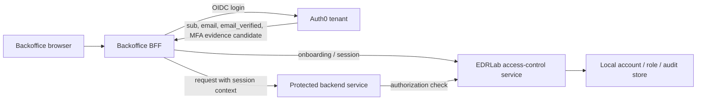
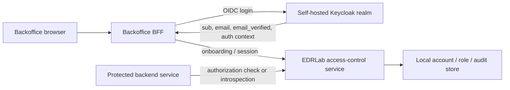
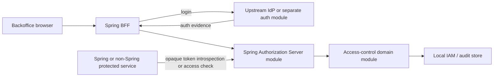

# Concrete Technical Solution Candidates

Status: Superseded
Phase: Phase 2 - Requirements and Risk Framing
Scope: Evaluation
Last reviewed: 2026-06-23

## Contents

- [Purpose](#purpose)
- [Supersession Note](#supersession-note)
- [Selection Basis](#selection-basis)
- [Shared Non-Negotiables](#shared-non-negotiables)
- [Solution 1 - Auth0 Managed Login with Local Access-Control Service](#solution-1---auth0-managed-login-with-local-access-control-service)
- [Solution 2 - Self-Hosted Keycloak with Local Access-Control Service](#solution-2---self-hosted-keycloak-with-local-access-control-service)
- [Solution 3 - Spring-Based Local IAM Control Plane](#solution-3---spring-based-local-iam-control-plane)
- [Comparison](#comparison)
- [Evaluation Questions](#evaluation-questions)
- [Review Notes](#review-notes)
- [References](#references)

## Purpose

This document proposes three concrete technical solution candidates for the EDRLab backoffice access-control capability. It translates the current feature requirements and threat model into implementable solution shapes while preserving the current study boundary: this is not a final recommendation, not a vendor decision, not a production architecture decision, and not an implementation plan ([Project governance](../../PROJECT-GOVERNANCE.md#phase-2---requirements-and-risk-framing), [README - Initial Scope](../../README.md#initial-scope)).

The three candidates are deliberately concrete enough to evaluate:

1. Auth0 managed login with a local access-control service.
2. Self-hosted Keycloak with a local access-control service.
3. Spring-based local IAM control plane with Spring Authorization Server and Spring Security.

Each candidate keeps the project-specific authorization model local. The identity provider or authentication runtime may authenticate the user, but backoffice account type, lifecycle state, service-access roles, subject-linking rules, protected-service authorization, and project audit evidence remain owned by the backoffice access-control capability (`FR-001` through `FR-005`, `FR-036` through `FR-039`; [Feature requirements specification](../../FEATURE-REQUIREMENTS.md#feature-requirements), [Threat model TS-006 and TS-008](../risks/threat-model.md#threat-scenarios)).

## Supersession Note

This candidate catalogue is superseded for the active validation direction. It remains the historical Phase 2 shortlist that led to the original Keycloak-plus-local-access-control choice. On 2026-06-23, user direction selected a new validation boundary: Keycloak as the IAM source with an EDRLab BFF/Admin API facade. Use [ADR 0002](../decisions/0002-validate-keycloak-iam-bff.md) and [Keycloak IAM BFF scope](../architecture/keycloak-iam-bff-scope.md) for the active direction.

## Selection Basis

These candidates come from the architecture option framing, not from a product ranking. The option document identifies managed-provider, self-hosted-product, library-based, and split-control-plane shapes as useful evaluation families without selecting a winner ([Architecture options](../architecture/options.md#architecture-options)).

| Candidate | Why it is concrete enough to evaluate | Why it is not a final decision |
| --- | --- | --- |
| Auth0 managed login plus local access-control | Exercises a managed OIDC/MFA/login provider while keeping EDRLab authorization local. Auth0 documents RBAC management, MFA factors, and tenant logs, which are relevant evidence inputs ([Auth0 RBAC roles](https://auth0.com/docs/manage-users/access-control/configure-core-rbac/roles), [Auth0 MFA](https://auth0.com/docs/secure/multi-factor-authentication), [Auth0 logs](https://auth0.com/docs/logs)). | Pricing, plan limits, data residency, export behavior, retention, outage behavior, and privileged-authentication evidence still need solution-choice evaluation. |
| Keycloak self-hosted plus local access-control | Exercises a self-hosted OIDC/OAuth2 product with admin APIs, WebAuthn/2FA options, and event auditing ([Keycloak Server Administration Guide](https://www.keycloak.org/docs/latest/server_admin/), [Keycloak Admin REST API](https://www.keycloak.org/docs-api/26.5.2/rest-api/)). | Operating Keycloak is a real security and operations responsibility; the project has not accepted that burden. |
| Spring-based local IAM control plane | Exercises a build-own protocol/control-plane path using Spring Authorization Server endpoints and Spring Security resource-server support ([Spring Authorization Server overview](https://docs.spring.io/spring-authorization-server/reference/overview.html), [Spring Authorization Server configuration](https://docs.spring.io/spring-authorization-server/reference/configuration-model.html), [Spring Security opaque token resource server](https://docs.spring.io/spring-security/reference/servlet/oauth2/resource-server/opaque-token.html)). | This owns the most IAM behavior and therefore needs the strongest justification under the simplicity and operability requirement (`FR-030`). |

## Shared Non-Negotiables

These rules apply to all three candidates.

| Rule | Concrete design consequence | Source |
| --- | --- | --- |
| The backoffice account model is local and authoritative. | Store `account_id`, `account_type`, `lifecycle_state`, immutable `authenticated_subject`, profile fields, service-access role assignments, and audit metadata in the access-control service. Do not use provider roles or groups as the account type or service-access role source of truth. | `FR-001`, `FR-002`, `FR-009`, `FR-036`, `FR-038` ([Feature requirements specification](../../FEATURE-REQUIREMENTS.md#feature-requirements)) |
| Onboarding is a local access-control operation. | On first backoffice onboarding, accept provider evidence only if there is exactly one invited local account with no subject link and a verified matching email; otherwise deny and keep the account invited. | `FR-039` through `FR-044` ([Feature requirements specification](../../FEATURE-REQUIREMENTS.md#feature-requirements)) |
| Protected services enforce server-side authorization. | A protected service must call an authorization-check API, introspect an opaque token, or validate a token and then check local operation authorization. Frontend or provider login state is never decisive. | `FR-020`, `FR-021`, `FR-033`; [OWASP Authorization Cheat Sheet](https://cheatsheetseries.owasp.org/cheatsheets/Authorization_Cheat_Sheet.html) |
| Access-stop behavior is explicit. | Disablement, archival, member role removal, or role disablement/archival must stop protected-service access through session invalidation, token introspection, live authorization checks, short token lifetimes, or a documented combination. | `FR-016`, `FR-032`; [Threat model TS-005](../risks/threat-model.md#threat-scenarios) |
| Privileged authentication evidence is required in production. | For admin and super-admin onboarding, the local onboarding flow must receive enough evidence that MFA or phishing-resistant passwordless authentication was satisfied. NIST SP 800-63B describes MFA and phishing-resistant authenticator concepts used by `FR-034` ([NIST SP 800-63B](https://pages.nist.gov/800-63-4/sp800-63b.html)). | `FR-034`, `FR-043`, `FR-044` |
| Audit is project-owned. | Provider or framework logs can supplement evidence, but the access-control service still writes append-only project audit records for the `FR-027` event set. | `FR-027`, `FR-028`, `FR-035`; [Threat model TS-011](../risks/threat-model.md#threat-scenarios) |

## Solution 1 - Auth0 Managed Login with Local Access-Control Service

### Shape

Use Auth0 for hosted authentication, OIDC login, MFA/passwordless policy, invitation/authentication handling, and provider-side authentication logs. Use a custom EDRLab access-control service for the complete project authorization model.

Auth0 is treated as an authentication provider, not as the source of EDRLab authorization. Auth0 documents RBAC roles and permissions for APIs, but this solution uses those capabilities only as provider-side evidence or optional coarse app-assignment support; local account types and service-access roles remain in the EDRLab access-control service to satisfy `FR-038` ([Auth0 RBAC roles](https://auth0.com/docs/manage-users/access-control/configure-core-rbac/roles), [Auth0 RBAC permissions](https://auth0.com/docs/manage-users/access-control/configure-core-rbac/manage-permissions), [Feature requirements specification](../../FEATURE-REQUIREMENTS.md#feature-requirements)).

### Concrete Components

| Component | Responsibility |
| --- | --- |
| Auth0 tenant | Hosted login, OIDC identity result, MFA/passwordless configuration, account recovery owned by the provider boundary, and authentication/tenant logs. Auth0 documents MFA factors including OTP, WebAuthn security keys, WebAuthn device biometrics, and recovery codes; factor availability depends on plan ([Auth0 MFA factors](https://auth0.com/docs/secure/multi-factor-authentication/multi-factor-authentication-factors)). |
| Backoffice BFF | Handles OIDC redirect/callback, stores provider tokens server-side, issues a secure backoffice session cookie, protects state-changing requests with CSRF controls, and calls the local access-control service. This follows the BFF/session pattern already documented in the conceptual wiki ([Web sessions, cookies, and BFF pattern](../wiki/24-web-sessions-cookies-and-bff.md)). |
| Local access-control service | Owns backoffice accounts, immutable account type, lifecycle state, subject link, service-access role catalog, member assignments, admin API, authorization-check endpoint, and append-only audit records. |
| Protected backend services | Do not read Auth0 roles or groups for EDRLab access. They call `POST /authorization/check` with `account_id`, `service_id`, action, and correlation ID; the local service returns allow/deny and audit context. |
| Audit pipeline | Local audit is authoritative for `FR-027`. Auth0 logs can be imported or cross-referenced for tenant-admin actions, Management API operations, and authentications; Auth0 documents log retrieval and `X-Correlation-ID` correlation for Management API events ([Auth0 logs](https://auth0.com/docs/logs)). |

### Runtime Flows

| Flow | Concrete behavior |
| --- | --- |
| Account creation | Admin or super-admin creates a local backoffice account in `invited` state with `email`, `organization`, and `name`; the access-control service emits an audit event (`FR-040`, `FR-027`). |
| Invitation/authentication | Auth0 handles the authentication and invitation/authentication side. The local system never treats successful Auth0 login as automatic backoffice authorization (`FR-037`, `FR-042`). |
| Automatic onboarding activation | BFF receives the OIDC result and sends provider `sub`, verified email evidence, and privileged-authentication evidence candidate to the local access-control service. The local service links and activates only if `FR-043` is satisfied; otherwise it denies and audits failure (`FR-044`). |
| Admin operations | BFF calls local admin APIs. Local APIs enforce account-type, lifecycle, object-level, and function-level authorization server-side (`FR-017`, `FR-018`, `FR-033`). |
| Protected-service access | Protected service calls the local authorization-check endpoint on each request or with a short cache. A conservative candidate cache target is 0 to 60 seconds, pending explicit acceptance of `FR-016` latency. |
| Access stop | Disablement, archival, role removal, and role disablement invalidate local sessions and make the local authorization-check endpoint deny immediately; any protected-service cache must expire within the accepted staleness window. |

### Fit

| Area | Fit |
| --- | --- |
| Strong fit | Low local authentication/protocol burden; good path for MFA/passwordless; clear local authorization ownership; useful provider logs for correlation. |
| Main gaps | Auth0 plan limits, data residency, log retention, Management API limits, export behavior, and exact privileged-authentication evidence need formal evaluation. |
| Threat pressure | Strong against custom-authentication risk and token exposure when paired with BFF; must be tested against IdP claim override (`TS-008`) and access-stop behavior (`TS-005`). |

## Solution 2 - Self-Hosted Keycloak with Local Access-Control Service

### Shape

Use Keycloak as a self-hosted OIDC/OAuth2 identity platform for login, MFA/WebAuthn flows, client management, and provider-side events. Use a custom EDRLab access-control service for project-specific accounts, subject linking, service roles, authorization checks, and audit.

Keycloak supports OpenID Connect and OAuth2, and its Admin Console can centrally manage users, roles, clients, and configuration ([Keycloak Server Administration Guide](https://www.keycloak.org/docs/latest/server_admin/)). This solution still treats Keycloak roles as provider-side configuration, not as EDRLab account types or service-access roles, because the local model must remain authoritative (`FR-001`, `FR-002`, `FR-038`).

### Concrete Components

| Component | Responsibility |
| --- | --- |
| Keycloak realm | Owns user authentication, OIDC clients, login flows, WebAuthn/OTP configuration, user events, and admin events. Keycloak documents WebAuthn administration and policy configuration ([Keycloak WebAuthn administration](https://www.keycloak.org/docs/latest/server_admin/#_webauthn)), user event storage, and admin-event auditing ([Keycloak user events](https://www.keycloak.org/docs/latest/server_admin/#auditing-user-events), [Keycloak admin events](https://www.keycloak.org/docs/latest/server_admin/#auditing-admin-events)). |
| Backoffice BFF | Handles OIDC login with Keycloak, keeps tokens out of browser-readable storage, and passes only validated authentication evidence to the local access-control service. |
| Local access-control service | Owns the EDRLab account lifecycle, immutable subject link, service-access-role catalog, assignments, authorization checks, and append-only audit records. |
| Protected backend services | Either call `POST /authorization/check` or use an opaque-token/introspection pattern exposed by the local access-control service. They do not authorize from Keycloak roles alone. |
| Operations | The team owns Keycloak deployment, upgrade, backup, restore testing, realm configuration, key rotation, event retention, monitoring, and incident response. This is the major cost of this solution under `FR-030`. |

### Runtime Flows

| Flow | Concrete behavior |
| --- | --- |
| Account creation | Local admin API creates the backoffice account in `invited`. Keycloak may hold the authentication identity or invitation state, but local account activation still follows `FR-043`. |
| Login and onboarding | Keycloak authenticates the user and returns OIDC claims to the BFF. The local access-control service verifies exactly one invited account, no existing subject link, verified matching email, and privileged-authentication evidence where required (`FR-043`). |
| Privileged authentication | Configure Keycloak browser flows so admin and super-admin users must satisfy OTP or WebAuthn/passwordless policy. The local service must still receive or derive evidence sufficient for `FR-034`; this exact claim or assurance signal is an evaluation question. |
| Protected-service access | Prefer local authorization check or local introspection rather than direct Keycloak role trust. This keeps access-stop behavior tied to current local lifecycle and role state. |
| Audit | Local audit records are authoritative. Keycloak user/admin events are retained and exported or correlated where they support authentication and provider-administration evidence. |

### Fit

| Area | Fit |
| --- | --- |
| Strong fit | Good when self-hosting, configuration control, and avoiding SaaS identity dependency matter. Provides a concrete product to test OIDC, WebAuthn/OTP, admin APIs, events, and local-role separation. |
| Main gaps | Operational burden is substantial: upgrades, backups, restores, hardening, realm configuration drift, event retention, and incident response become project responsibilities. |
| Threat pressure | Strong if local authorization remains authoritative; risky if Keycloak roles/groups start drifting into the local account-type or service-role model (`TS-008`, `TS-013`). |

## Solution 3 - Spring-Based Local IAM Control Plane

### Shape

Build a local modular IAM control-plane service using Spring Authorization Server for OAuth2/OIDC protocol endpoints and Spring Security for BFF/resource-server integration. The same local system owns the access-control domain model and exposes an introspection or authorization-check contract to protected services.

Spring Authorization Server is a framework for building OAuth2 authorization server and OpenID Connect provider products, and its default configuration includes endpoints such as authorization, token, introspection, revocation, authorization-server metadata, and JWK Set when configured ([Spring Authorization Server overview](https://docs.spring.io/spring-authorization-server/reference/overview.html), [Spring Authorization Server configuration](https://docs.spring.io/spring-authorization-server/reference/configuration-model.html)). Spring Security supports resource-server opaque-token introspection, which is useful when revocation or current-state checks are required ([Spring Security opaque token resource server](https://docs.spring.io/spring-security/reference/servlet/oauth2/resource-server/opaque-token.html), [RFC 7662](https://www.rfc-editor.org/rfc/rfc7662)).

This is the highest-control and highest-ownership candidate. It is acceptable as an evaluation candidate only if the team wants to own a local OAuth/OIDC runtime; it must not become a hidden production implementation during Phase 2 ([Project governance](../../PROJECT-GOVERNANCE.md#phase-2---requirements-and-risk-framing)).

### Concrete Components

| Component | Responsibility |
| --- | --- |
| Spring BFF | Handles browser session, OAuth/OIDC callback with the upstream IdP or separate authentication module, CSRF controls, and calls into the local IAM control plane. |
| Upstream IdP or separate authentication module | Owns credentials, MFA/passwordless, invitation delivery, and account recovery so the access-control domain does not become a password/MFA owner (`FR-042`). If this piece is also built in-house, that is a major scope expansion. |
| Spring Authorization Server module | Issues internal access tokens, publishes metadata/JWKS, supports revocation and introspection endpoints, and maps authenticated subject evidence to local account state. |
| Access-control domain module | Owns accounts, lifecycle, immutable account types, subject links, service-access roles, admin APIs, authorization decisions, and append-only audit records. |
| Protected services | Use opaque bearer tokens and introspection, or call `POST /authorization/check`. For current requirements, opaque introspection is the more directly testable pattern because it can consult current lifecycle and role state before returning `active: true`. |
| Data store | A local relational store or equivalent durable store holds IAM domain state and append-only audit records. The database product remains an evaluation detail, not selected here. |

### Runtime Flows

| Flow | Concrete behavior |
| --- | --- |
| Onboarding | The Spring BFF receives authenticated-subject evidence from the upstream IdP/authentication module. The access-control domain applies `FR-043` exactly and emits subject-link creation or failed-onboarding audit events. |
| Token issuance | After local account activation and authorization, the Spring Authorization Server module issues short-lived internal access tokens. Avoid embedding mutable role/lifecycle truth as long-lived token claims; use introspection or local authorization check for current state. |
| Protected-service access | Resource servers call the introspection endpoint or authorization-check API. Spring Security opaque-token support can query an introspection endpoint and check `active` status before creating an authenticated principal ([Spring Security opaque token resource server](https://docs.spring.io/spring-security/reference/servlet/oauth2/resource-server/opaque-token.html)). |
| Access stop | Disablement or role removal updates local state. Introspection returns inactive or insufficient-authority responses immediately for new checks; cache behavior must be bounded by the accepted `FR-016` delay. |
| Audit | Because this solution owns most local IAM behavior, it can write one strongly correlated audit stream for lifecycle, role, onboarding, token/introspection, authorization denial, and audit-read/export events. |

### Fit

| Area | Fit |
| --- | --- |
| Strong fit | Maximum control over token lifetime, introspection, revocation, local audit, and protected-service contract. Good PoC candidate for measuring access-stop behavior. |
| Main gaps | Highest engineering and security ownership. The team must design protocol configuration, client handling, key rotation, security updates, operational monitoring, recovery, and authentication-provider integration. |
| Threat pressure | Strong on access-stop and audit correlation if done well; weak if it becomes a custom IAM build without mature operational ownership (`TS-010`, `TS-012`, `TS-013`). |

## Comparison

| Criterion | Solution 1: Auth0 + local AC | Solution 2: Keycloak + local AC | Solution 3: Spring local IAM |
| --- | --- | --- | --- |
| Authentication ownership | Lowest local burden. Auth0 owns hosted login and MFA capabilities. | Medium to high. Product provides features, team operates them. | Highest unless paired with an upstream IdP that truly owns credentials/MFA. |
| Local authorization fit | Strong if Auth0 roles/claims stay non-authoritative. | Strong if Keycloak roles/groups stay non-authoritative. | Strong, because the local domain model and protocol runtime are integrated. |
| Access-stop control | Good through local authorization check and session invalidation; provider token/session behavior still matters. | Good through local authorization check or local introspection; Keycloak token/session behavior still matters. | Strongest if opaque introspection checks current local state. |
| Audit fit | Local audit plus Auth0 logs; must validate retention/export and correlation. | Local audit plus Keycloak events; team controls storage but owns retention/operations. | Single local audit stream is possible, but must be implemented and operated. |
| Operational burden | Low to medium. Integration and vendor governance dominate. | Medium to high. Self-hosted identity operations dominate. | High. Protocol, code, security, and operations dominate. |
| Main evaluation risk | Plan limits, lock-in, evidence shape, log retention, and provider outage behavior. | Operations, upgrades, realm drift, backup/restore, event retention, and role-model drift. | Underestimating the cost of owning an authorization server and IAM runtime. |
| Best PoC question | Can managed login feed safe local onboarding and local authorization without claim override? | Can self-hosted OIDC plus local authorization remain operable and auditable? | Can local introspection enforce immediate access-stop and clean audit correlation? |

## Evaluation Questions

| ID | Question | Applies to |
| --- | --- | --- |
| EQ-001 | What exact provider or framework signal proves MFA or phishing-resistant passwordless authentication for admin/super-admin onboarding? | All |
| EQ-002 | Can the solution deny access within the accepted `FR-016` delay after disablement, archival, member role removal, or role disablement? | All |
| EQ-003 | Can protected services enforce authorization without trusting provider groups, roles, email, or frontend state? | All |
| EQ-004 | Can audit evidence correlate local account changes, provider authentication events, protected-service denials, and audit reads/exports? | All |
| EQ-005 | Can the team export, back up, restore, and migrate the identity and access data without breaking subject-link immutability or audit retention? | All |
| EQ-006 | What happens when the IdP, BFF session store, authorization-check endpoint, introspection endpoint, or audit sink is unavailable? | All |
| EQ-007 | Which solution keeps complexity justified for fewer than 1,000 backoffice users? | All |

## Review Notes

This document has been checked against the current project rules:

| Check | Result |
| --- | --- |
| No final recommendation | Pass. The document proposes three candidates and comparison questions only. |
| No implementation artifact | Pass. No code, dependencies, Docker files, databases, migrations, or CI files are added. |
| Feature requirements preserved | Pass. `FEATURE-REQUIREMENTS.md` was not changed. |
| Threat model used | Pass. The candidate risks map to `TS-005`, `TS-006`, `TS-008`, `TS-010`, `TS-011`, `TS-012`, and `TS-013`. |
| Citation rules followed | Pass. Product claims cite official product documentation; normative OAuth/OIDC/security claims cite official specifications or guidance. |
| Remaining risk | Open. These candidates still require evaluation evidence before any target architecture or vendor decision. |

## References

- [README - Project Goal](../../README.md#project-goal)
- [README - Initial Scope](../../README.md#initial-scope)
- [Feature Requirements Specification](../../FEATURE-REQUIREMENTS.md)
- [Threat Model](../risks/threat-model.md)
- [Architecture Options](../architecture/options.md)
- [Project Governance - Phase 2](../../PROJECT-GOVERNANCE.md#phase-2---requirements-and-risk-framing)
- [Auth0 - Manage Role-Based Access Control Roles](https://auth0.com/docs/manage-users/access-control/configure-core-rbac/roles)
- [Auth0 - Manage Role-Based Access Control Permissions](https://auth0.com/docs/manage-users/access-control/configure-core-rbac/manage-permissions)
- [Auth0 - Multi-Factor Authentication](https://auth0.com/docs/secure/multi-factor-authentication)
- [Auth0 - Multi-Factor Authentication Factors](https://auth0.com/docs/secure/multi-factor-authentication/multi-factor-authentication-factors)
- [Auth0 - Logs](https://auth0.com/docs/logs)
- [Keycloak - Server Administration Guide](https://www.keycloak.org/docs/latest/server_admin/)
- [Keycloak - Admin REST API](https://www.keycloak.org/docs-api/26.5.2/rest-api/)
- [Spring Authorization Server - Overview](https://docs.spring.io/spring-authorization-server/reference/overview.html)
- [Spring Authorization Server - Configuration Model](https://docs.spring.io/spring-authorization-server/reference/configuration-model.html)
- [Spring Security - OAuth 2.0 Resource Server Opaque Token](https://docs.spring.io/spring-security/reference/servlet/oauth2/resource-server/opaque-token.html)
- [RFC 7662 - OAuth 2.0 Token Introspection](https://www.rfc-editor.org/rfc/rfc7662)
- [OWASP Authorization Cheat Sheet](https://cheatsheetseries.owasp.org/cheatsheets/Authorization_Cheat_Sheet.html)
- [NIST SP 800-63B - Authentication and Authenticator Management](https://pages.nist.gov/800-63-4/sp800-63b.html)
- [Web Sessions, Cookies, and BFF Pattern](../wiki/24-web-sessions-cookies-and-bff.md)
