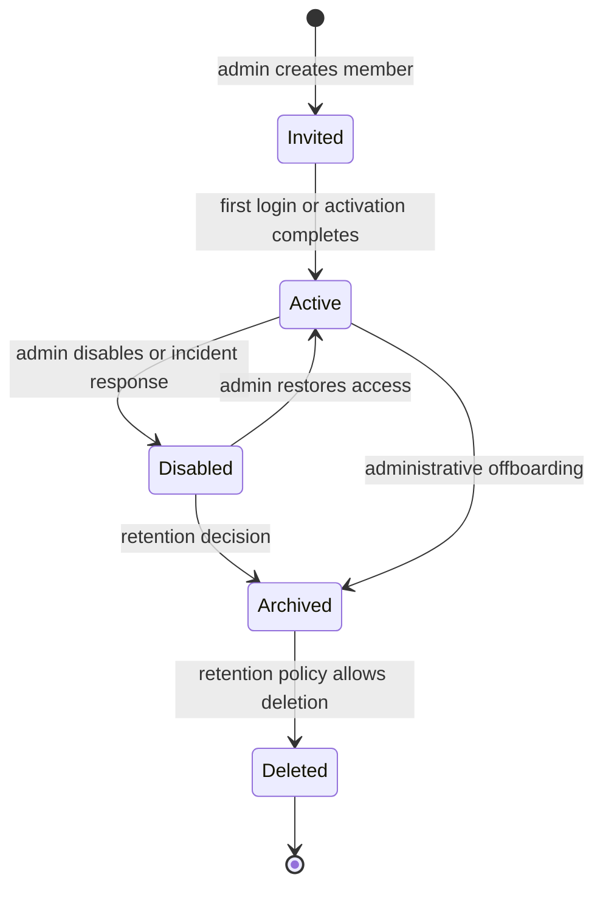

# Member Lifecycle

This page explains the lifecycle of a backoffice member account: how a member is created, activated, updated, disabled, optionally restored, and eventually deleted or archived.

This is Phase 1 conceptual study material. It does not choose a final data model, identity provider, deletion policy, recovery policy, or production implementation.

## Why this exists

Member lifecycle is the operational side of identity. Authentication answers whether a user can prove control of an account. Authorization answers what that authenticated subject may do. Member lifecycle decides whether the account should exist, whether it should be usable, which access assignments it may carry, and what evidence must remain after changes.

For this project, lifecycle matters because members are created and managed by administrators. There is no public registration baseline. A backoffice administrator must be able to create a member, assign roles, remove access, disable the member, and later explain what happened.

If lifecycle is vague, several security and operations failures become likely:

- a disabled employee keeps using a valid session or access token;
- a deleted member loses audit history needed for incident review;
- a new person receives a recycled identifier that still has old permissions;
- a role assignment survives longer than intended;
- account recovery or MFA reset becomes an unreviewed privilege escalation path;
- support engineers cannot answer who had access to which service at a given time.

## Core terms

| Term | Meaning in this study |
| --- | --- |
| Member | A company-managed backoffice account. Members are created and managed by administrators. |
| User | A human actor using the system. A user may authenticate as a member. |
| Subject | The stable identifier used in tokens, audit events, role assignments, and API decisions. |
| Credential | A password, passkey, authenticator, external IdP link, recovery code, or other means to authenticate. |
| Lifecycle state | The operational status of a member, such as invited, active, disabled, or deleted. |
| Role assignment | A grant connecting a member to a role. See [RBAC](./wiki/05-rbac.md). |
| Access removal | The process of making existing or future access stop working. This can involve status changes, role removal, session invalidation, token revocation, or token expiry. |

A member record should have a stable internal identifier that is not reused. Email, display name, job title, and username are mutable attributes; they should not be the only durable link between tokens, role assignments, audit events, and member history.

## Minimal lifecycle states

The exact state names can change later, but the project needs explicit semantics. A small baseline is easier to reason about than many vague statuses.

| State | Meaning | Can authenticate? | Can receive roles? | Notes |
| --- | --- | --- | --- | --- |
| `invited` | An administrator created the account, but the member has not completed first login or credential setup. | Not yet, or only through an invitation flow. | Usually yes, but privileged roles may require caution until activation. | Optional for the first PoC if invitations are out of scope. |
| `active` | The member can authenticate and use granted access. | Yes. | Yes. | Normal usable state. |
| `disabled` | The member is blocked from new authentication and should not receive new effective access. | No. | Existing assignments may be retained for review, but should not grant access. | Useful for offboarding, incident response, lockout, or temporary suspension. |
| `deleted` | The member is removed from ordinary administration views or hard-deleted according to policy. | No. | No. | Deletion must be reconciled with audit, retention, recovery, and identifier reuse rules. |
| `archived` | The member is not usable, but historical record remains intentionally retained. | No. | No effective roles. | Often safer than hard delete when audit evidence matters. |

The first study can treat `disabled` as the most important non-active state. Whether `invited`, `deleted`, `archived`, or `suspended` are separate states is a later design question.

## State transitions



This diagram is conceptual. A later product or provider may expose different state names. The important requirement is that each transition has clear authorization, validation, audit, and access-effect semantics.

## Lifecycle operations

| Operation | Purpose | Key controls |
| --- | --- | --- |
| Create member | Add a company-managed account. | Admin-only; no public registration; validate uniqueness; assign stable ID; audit actor and target. |
| Activate member | Allow first usable login or complete credential setup. | Confirm invitation or credential setup; avoid activating the wrong identity; audit activation. |
| Update member | Change mutable profile attributes. | Do not change stable ID; validate email or username uniqueness; audit sensitive changes. |
| Disable member | Stop new authentication and future effective access. | Admin-only; block self-disable if it would lock out the system; consider session and token effects. |
| Restore member | Re-enable a disabled member. | Require sufficient admin permission; review roles before restoration; audit reason. |
| Delete or archive member | Remove account from active use or retain it as history. | Preserve audit evidence; prevent identifier reuse mistakes; define retention policy. |
| Assign role | Grant access. | Check admin authority; prevent self-escalation; audit grant. |
| Remove role | Remove access. | Define whether removal takes effect immediately or at token expiry; audit removal. |
| Reset authenticator or recovery path | Help a member regain access. | Treat as sensitive; verify admin authority; notify or audit where appropriate. |

Lifecycle operations belong behind the [Administration APIs](./wiki/08-admin-api.md). UI checks can improve usability, but the admin API must enforce permissions server-side.

## Access effects

Changing a lifecycle state is not the same thing as invalidating every possible access path.

| Change | New login | Existing BFF session | Existing access token | Refresh token or long-lived session |
| --- | --- | --- | --- | --- |
| Role removed | Usually allowed if member remains active. | Session may remain valid. | May keep old role claims until token expiry if JWTs are used. | Should receive reduced access on refresh or after reauthorization. |
| Member disabled | Should be blocked. | Should be ended or allowed to expire based on documented policy. | May remain valid until expiry unless revocation, introspection, or lookup is used. | Should be revoked or rejected on next use. |
| Member archived or deleted | Should be blocked. | Should be ended. | Should not be accepted after expiry or revocation window. | Should be revoked or invalid. |

The current study baseline allows removed access to expire at access-token expiry for the first version. That trade-off requires short-lived access tokens and clear audit evidence. Higher-risk operations may justify immediate session invalidation, token revocation, token introspection, or a runtime authorization lookup.

See [BFF Sessions and Token Handling](./bff-sessions-and-token-handling.md) and [Tokens and JWTs](./wiki/04-tokens-and-jwt.md) for the token-specific trade-offs.

## Role and permission behavior

Member lifecycle state and RBAC answer different questions:

- lifecycle state answers whether the member account is usable;
- roles and permissions answer what an active member may do;
- token validation answers whether this request carries a valid credential for this API.

The authorization layer should treat non-active members conservatively. If a member is `disabled`, `archived`, or `deleted`, role assignments should not produce effective access even if they remain stored for review.

Practical rules to evaluate:

- only `active` members can receive effective backoffice access;
- role assignments can be retained for disabled members so administrators can review prior access;
- restoring a disabled member should trigger a review of current role assignments;
- deleting or archiving a member should not delete audit records for past privileged changes;
- administrative role changes should be audited separately from profile changes.

## Stable identifiers and mutable attributes

Use stable identifiers for durable links:

- member primary key;
- OIDC subject value if using an external or managed IdP;
- audit actor and target IDs;
- role assignment references;
- local resource ownership references.

Avoid using mutable attributes as durable identifiers:

- email;
- username;
- display name;
- job title;
- department;
- manager.

Email and username can still be unique login or display attributes. The warning is that changing an email should not break audit history, orphan role assignments, or accidentally transfer access to another person.

SCIM is not required for this project, but it is a useful reference model because it distinguishes stable resource identifiers from user-facing attributes and includes an `active` attribute for administrative status.

## Audit and review

Lifecycle changes are security-relevant events. Audit records should be able to answer:

- who created the member;
- who changed the member status;
- who assigned or removed roles;
- who reset authentication or recovery material;
- which member was affected;
- what changed before and after;
- whether the operation succeeded or failed;
- when it happened;
- which request or session initiated it;
- why the change was made, if a reason is required by policy.

Minimal audit event examples:

```text
member.created
member.activated
member.updated
member.disabled
member.restored
member.archived
member.deleted
role.assigned
role.removed
credential.reset
recovery.changed
```

Audit logs should store identifiers and safe metadata, not secrets. Passwords, recovery codes, bearer tokens, refresh tokens, client secrets, and raw session IDs should not appear in lifecycle audit records.

See [Auditability, Access Reviews, and Operational Ownership](./wiki/10-auditability-access-reviews-operational-ownership.md).

## Data model sketch

This is illustrative only, not a production schema.

```text
members
- id
- status
- email
- display_name
- created_at
- created_by
- updated_at
- disabled_at
- disabled_by
- archived_at
- deleted_at

role_assignments
- id
- member_id
- role_id
- assigned_at
- assigned_by
- removed_at
- removed_by

member_audit_events
- id
- actor_member_id
- target_member_id
- action
- result
- before_summary
- after_summary
- reason
- request_id
- created_at
```

The model should support historical questions without requiring live access to remain granted. For example, a removed role assignment can have `removed_at` rather than disappearing entirely if access-review evidence is required.

## Common mistakes

Do not treat deletion and disablement as the same operation. Disablement blocks access while preserving a recoverable and reviewable account. Deletion may remove or hide the record and needs a retention decision.

Do not reuse stable member IDs, even if an email address is reused by another person later.

Do not let a disabled member keep refreshing access indefinitely.

Do not remove audit records when deleting or archiving a member unless a documented retention policy explicitly requires it and the security impact is understood.

Do not allow administrators to grant themselves stronger roles, reset their own recovery path, or restore their own disabled privileges without explicit policy.

Do not rely only on frontend checks to hide lifecycle actions.

Do not assume that role removal is immediate when using self-contained JWT access tokens.

## Minimal PoC checks

| Check | Success condition |
| --- | --- |
| Create member | Admin can create a member with a stable ID and initial status. |
| Disable member | Disabled member cannot start a new login. |
| Role assignment | Admin can assign and remove a role, and the change is auditable. |
| Effective access | Non-active members do not receive effective access. |
| Token staleness | Role removal or disablement stops access within the documented token lifetime or through a stronger mechanism. |
| Audit events | Create, update, disable, restore, role assignment, and role removal create audit records. |
| Identifier safety | Email changes do not change stable member ID or break audit history. |
| Self-protection | The system prevents unsafe self-disablement or self-escalation according to policy. |

## Open study questions

- Which states are required for the first PoC: only `active` and `disabled`, or also `invited`?
- Should deletion be a hard delete, soft delete, archive, or policy-dependent operation?
- What member attributes are required beyond email, display name, status, and role assignments?
- How long should disabled, archived, and deleted member records be retained?
- Can an administrator restore a disabled member without a second approval?
- What access-token lifetime is acceptable for removed access to remain effective?
- Should member disablement revoke BFF sessions and refresh tokens immediately?
- Which lifecycle events require a reason field?
- Which lifecycle events should be included in access reviews?
- How should authenticator reset, MFA reset, and account recovery be modeled and audited?

## Related documents

- [Authentication vs Authorization](./wiki/01-authentication-vs-authorization.md)
- [OpenID Connect](./wiki/03-openid-connect.md)
- [Tokens and JWTs](./wiki/04-tokens-and-jwt.md)
- [RBAC](./wiki/05-rbac.md)
- [Administration APIs](./wiki/08-admin-api.md)
- [Security Best Practices](./wiki/09-security-best-practices.md)
- [Auditability, Access Reviews, and Operational Ownership](./wiki/10-auditability-access-reviews-operational-ownership.md)
- [MFA, 2FA, Passwordless, and One-Time Passwords](./wiki/11-mfa-2fa-passwordless-and-otp.md)
- [BFF Sessions and Token Handling](./bff-sessions-and-token-handling.md)

## References

- [RFC 7643 - System for Cross-domain Identity Management: Core Schema](https://www.rfc-editor.org/rfc/rfc7643)
- [RFC 7644 - System for Cross-domain Identity Management: Protocol](https://www.rfc-editor.org/rfc/rfc7644)
- [OpenID Connect Core 1.0](https://openid.net/specs/openid-connect-core-1_0.html)
- [RFC 7009 - OAuth 2.0 Token Revocation](https://www.rfc-editor.org/rfc/rfc7009)
- [RFC 7662 - OAuth 2.0 Token Introspection](https://www.rfc-editor.org/rfc/rfc7662)
- [OWASP Authorization Cheat Sheet](https://cheatsheetseries.owasp.org/cheatsheets/Authorization_Cheat_Sheet.html)
- [OWASP Authentication Cheat Sheet](https://cheatsheetseries.owasp.org/cheatsheets/Authentication_Cheat_Sheet.html)
- [NIST SP 800-63B - Authentication and Authenticator Management](https://pages.nist.gov/800-63-4/sp800-63b.html)
