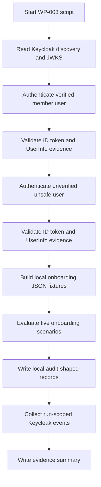

# Keycloak WP-003 Result

Status: Review
Phase: Phase 4 - Proof of Concept
Scope: PoC
Last reviewed: 2026-06-23

## Contents

- [Summary](#summary)
- [How To Read This Test](#how-to-read-this-test)
- [Real Vs Simulated](#real-vs-simulated)
- [Script Flow](#script-flow)
- [Scenario Matrix](#scenario-matrix)
- [Success Criteria](#success-criteria)
- [Scenario Added](#scenario-added)
- [Commands Verified](#commands-verified)
- [Runtime Execution Status](#runtime-execution-status)
- [Local Execution Status](#local-execution-status)
- [Observed Result](#observed-result)
- [Evidence Map](#evidence-map)
- [Evidence Collected](#evidence-collected)
- [Limitations](#limitations)
- [References](#references)

## Summary

`WP-003` was executed against the scripted [Keycloak PoC runtime](../../poc/keycloak/README.md) on 2026-06-23. The scenario targets the accepted safe-onboarding question: Keycloak supplies authenticated-subject and verified-email evidence, while the local EDRLab access-control side decides whether to create the immutable subject link, activate the account, deny unsafe cases, and record local audit-shaped evidence (`FR-039`, `FR-043`, `FR-044`; [Feature requirements](../../FEATURE-REQUIREMENTS.md#feature-requirements), [Keycloak validation plan - WP-003](./keycloak-validation-plan.md#work-packages)).

Result: pass for the safe and unsafe onboarding validation. Keycloak authenticated the verified member user and the unverified unsafe user through Authorization Code flow, returned token evidence that passed local validation, and exposed UserInfo subject evidence. The PoC local side activated exactly one safe invited `member` account, denied the no-invitation, duplicate-invitation, unverified-email, and pre-linked-subject cases, left denied local fixtures unchanged, and created no local session for denied cases.

## How To Read This Test

Read `WP-003` as a security validation of the onboarding rule, not as a production implementation. The question is: after Keycloak authenticates a user, does the local access-control side activate only one safe invited account and fail closed for unsafe matches? That is the behavior required by `FR-039`, `FR-043`, and `FR-044`, and the fixture-based local evaluator stays inside the Phase 4 non-production PoC boundary ([Feature requirements](../../FEATURE-REQUIREMENTS.md#feature-requirements), [Keycloak validation plan - WP-003](./keycloak-validation-plan.md#work-packages), [Project governance - Phase 4](../../PROJECT-GOVERNANCE.md#phase-4---proof-of-concept)).

The Bash script is long because it does three jobs in one reproducible runtime check:

1. Get real authenticated identity evidence from Keycloak.
2. Validate the OIDC token and UserInfo evidence before trusting it.
3. Apply a PoC-only local onboarding evaluator to five local account fixtures.

The important business result is in `wp-003-onboarding-decisions.json`: one `allow`, four `deny`.

## Real Vs Simulated

| Area | Real in this runtime | Simulated for this PoC |
| --- | --- | --- |
| Authentication | Keycloak container, realm, users, Authorization Code flow, token endpoint, UserInfo endpoint, JWKS, and Keycloak events. Keycloak documents these OIDC endpoints as the normal integration surface for clients ([Keycloak OIDC endpoints](https://www.keycloak.org/securing-apps/oidc-layers)). | No real browser UI or production BFF framework. The script uses `curl` and a cookie jar as the browser-like client. |
| Identity evidence | ID token signature, issuer, audience, nonce, email, `email_verified`, `sub`, and UserInfo `sub` match are checked. OpenID Connect defines ID token subject behavior and requires UserInfo `sub` to match the ID token `sub` before UserInfo values are used ([OpenID Connect Core](https://openid.net/specs/openid-connect-core-1_0.html)). | No production token/session storage, JWKS cache policy, or framework middleware. |
| Local accounts | The local rule mirrors the accepted access-control requirement: link and activate only when one invited account has no subject link and matches a verified authenticated email (`FR-043`; [Feature requirements](../../FEATURE-REQUIREMENTS.md#feature-requirements)). | Local accounts are JSON fixtures, not a database, transaction, repository, or production service. |
| Local audit | The script emits audit-shaped records for activation and denial cases because `FR-027` requires audit coverage for account activation, subject-link creation, and failed onboarding ([Feature requirements](../../FEATURE-REQUIREMENTS.md#feature-requirements)). | The records are shape evidence only, not persisted, tamper-resistant, retained, exported, or correlated through a production audit store. |

## Script Flow



## Scenario Matrix

| Scenario | Authenticated identity | Local account fixture | Expected decision | Why |
| --- | --- | --- | --- | --- |
| `safe-invited-member` | `kc-member-poc`, verified email | Exactly one invited `member`, matching email, no subject link | `allow` | This is the only case satisfying `FR-043` ([Feature requirements](../../FEATURE-REQUIREMENTS.md#feature-requirements)). |
| `no-local-invitation` | `kc-member-poc`, verified email | No invited account with the authenticated email | `deny` | Authentication alone must not create, activate, or authorize a backoffice account (`FR-037`, `FR-044`; [Feature requirements](../../FEATURE-REQUIREMENTS.md#feature-requirements)). |
| `duplicate-local-invitations` | `kc-member-poc`, verified email | Two invited accounts with the authenticated email | `deny` | The match is ambiguous, so it is not exactly one safe local account (`FR-043`, `FR-044`; [Feature requirements](../../FEATURE-REQUIREMENTS.md#feature-requirements)). |
| `unverified-authenticated-email` | `kc-unsafe-poc`, unverified email | One invited account with the same email | `deny` | `FR-043` requires a verified matching email before automatic activation ([Feature requirements](../../FEATURE-REQUIREMENTS.md#feature-requirements)). |
| `pre-linked-local-account` | `kc-member-poc`, verified email | One invited account with the same email but an existing subject link | `deny` | Subject-link creation is allowed only through the safe onboarding path and links are immutable after creation (`FR-039`, `FR-043`, `FR-044`; [Feature requirements](../../FEATURE-REQUIREMENTS.md#feature-requirements)). |

## Success Criteria

`WP-003` passes only if all of these are true:

- Keycloak authenticates both test identities through Authorization Code flow.
- ID token signature, issuer, audience, nonce, email, email verification state, time claims, and UserInfo `sub` match are validated.
- The local evaluator records exactly one `allow` and four `deny` decisions.
- The allowed case changes the fixture from `invited` to `active` and writes the Keycloak issuer and subject link.
- Every denied case leaves local account fixtures unchanged and creates no local session.
- Denial audit records do not invent a single target when no local account matched or multiple accounts matched; they carry candidate and matching account IDs instead.
- Keycloak `LOGIN` and `CODE_TO_TOKEN` events are collected inside the run window for both authenticated subjects.

## Scenario Added

The script [verify-onboarding.sh](../../poc/keycloak/scripts/verify-onboarding.sh) adds a narrow, non-production WP-003 check:

| Step | Validation target | Source |
| --- | --- | --- |
| Authenticate verified member identity | Run Authorization Code flow with PKCE for the non-production member user and validate ID token signature, issuer, audience, nonce, time claims, verified email, and `sub`. | Keycloak documents the OIDC authorization, token, userinfo, logout, and certificate/JWKS endpoints; OpenID Connect defines ID token and subject behavior; RFC 7636 defines PKCE ([Keycloak OIDC endpoints](https://www.keycloak.org/securing-apps/oidc-layers), [OpenID Connect Core](https://openid.net/specs/openid-connect-core-1_0.html), [RFC 7636](https://www.rfc-editor.org/rfc/rfc7636)). |
| Authenticate unverified unsafe identity | Run the same Authorization Code flow for the unsafe user and assert that the ID token email is unverified. | `FR-043` requires a verified matching email before automatic onboarding activation; OIDC defines the `email_verified` claim semantics ([Feature requirements](../../FEATURE-REQUIREMENTS.md#feature-requirements), [OpenID Connect Core](https://openid.net/specs/openid-connect-core-1_0.html)). |
| Check UserInfo subject | Confirm UserInfo `sub` matches the ID token `sub` for both identities. | OpenID Connect says UserInfo `sub` must exactly match the ID token `sub` before UserInfo values are used ([OpenID Connect Core](https://openid.net/specs/openid-connect-core-1_0.html)). |
| Safe activation fixture | Use a PoC-only local account fixture with exactly one invited `member`, matching verified email, and no existing subject link; expect activation and subject-link creation. | Automatic onboarding may link and activate only under the exact safe-match conditions in `FR-043` ([Feature requirements](../../FEATURE-REQUIREMENTS.md#feature-requirements)). |
| Unsafe denial fixtures | Evaluate no-invitation, duplicate-invitation, unverified-email, and pre-linked-subject cases; expect deny, no local session, and unchanged local accounts. | Unsafe onboarding must fail closed, keep accounts invited, deny access, and require administrative intervention under `FR-044` ([Feature requirements](../../FEATURE-REQUIREMENTS.md#feature-requirements)). |
| Local audit-shaped evidence | Emit local audit-shaped records for the safe activation and each denial. | `FR-027` requires audit coverage for activation, subject-link creation, rejected subject-link changes, and failed automatic onboarding activation ([Feature requirements](../../FEATURE-REQUIREMENTS.md#feature-requirements)). |

## Commands Verified

From a clean Linux checkout with Docker running:

```bash
cp poc/keycloak/.env.example poc/keycloak/.env.local
# Edit poc/keycloak/.env.local for local non-production secrets.

bash poc/keycloak/scripts/start.sh
bash poc/keycloak/scripts/bootstrap.sh
bash poc/keycloak/scripts/verify.sh
bash poc/keycloak/scripts/verify-onboarding.sh
bash poc/keycloak/scripts/stop.sh
```

For placeholder-only validation, the same path can use:

```bash
ENV_FILE=poc/keycloak/.env.example bash poc/keycloak/scripts/start.sh
ENV_FILE=poc/keycloak/.env.example bash poc/keycloak/scripts/bootstrap.sh
ENV_FILE=poc/keycloak/.env.example bash poc/keycloak/scripts/verify.sh
ENV_FILE=poc/keycloak/.env.example bash poc/keycloak/scripts/verify-onboarding.sh
ENV_FILE=poc/keycloak/.env.example bash poc/keycloak/scripts/stop.sh
```

## Runtime Execution Status

| Check | Result |
| --- | --- |
| `verify-onboarding.sh` added | Pass |
| Bash syntax validation for `verify-onboarding.sh` | Pass |
| Docker Compose model resolution with `.env.example` | Pass |
| Keycloak container startup | Pass |
| WP-001 realm/client/user/event verification before WP-003 | Pass |
| Full WP-003 runtime assertions, including run-scoped Keycloak event assertions | Pass |
| Runtime stopped after verification | Pass |

## Local Execution Status

```text
bash -n poc/keycloak/scripts/verify-onboarding.sh
docker compose --env-file poc/keycloak/.env.example -f poc/keycloak/compose.yaml config
```

The first WP-003 runtime attempt authenticated both Keycloak users successfully, then failed inside the local `jq` onboarding evaluator because the filter used bare field names and comma-separated function arguments. The script was corrected to use explicit field access and jq's semicolon function-argument syntax.

A review pass then tightened the evidence quality: Keycloak event collection is filtered to the current run window and asserted for both subjects, and local audit-shaped records now use `target_id: null` for absent or ambiguous matches while carrying `candidate_account_ids` and `matching_account_ids`. The corrected script passed the full WP-003 runtime validation, and the Keycloak runtime was stopped after verification.

## Observed Result

| Check | Result |
| --- | --- |
| Keycloak login form reached for verified member identity | Pass |
| Authorization Code returned for verified member identity | Pass |
| Token exchange completed for verified member identity | Pass |
| Verified member ID token signature, issuer, audience, nonce, email, email verification state, and time claims validated | Pass |
| Verified member UserInfo `sub` matched ID token `sub` | Pass |
| Keycloak login form reached for unverified unsafe identity | Pass |
| Authorization Code returned for unverified unsafe identity | Pass |
| Token exchange completed for unverified unsafe identity | Pass |
| Unverified unsafe ID token signature, issuer, audience, nonce, email, email verification state, and time claims validated | Pass |
| Unverified unsafe UserInfo `sub` matched ID token `sub` | Pass |
| Safe invited member fixture activated and linked to the authenticated subject | Pass |
| No-invitation case denied | Pass |
| Duplicate-invitation case denied | Pass |
| Unverified-email case denied | Pass |
| Pre-linked-subject case denied | Pass |
| Denied cases left local account fixtures unchanged | Pass |
| Denied cases did not create local sessions | Pass |
| Run-scoped Keycloak `LOGIN` and `CODE_TO_TOKEN` events collected for both subjects | Pass |

## Evidence Map

Use these files first when reviewing the test:

| Evidence file | What to look for |
| --- | --- |
| `wp-003-evidence.md` | Human-readable summary of the run, pass status, residual risk, production gap, and decision impact. |
| `wp-003-onboarding-decisions.json` | The five business decisions. This is the clearest proof that exactly one scenario allowed activation and four denied. |
| `wp-003-local-audit.json` | Audit-shaped records for activation and denial. For no-match and duplicate-match denials, `target_id` is `null` and `matching_account_ids` explains why. |
| `wp-003-safe-member-id-token-claims.json` | Sanitized claims for the verified member identity. Check `email_verified: true`, `email`, `iss`, and `sub`. |
| `wp-003-unverified-user-id-token-claims.json` | Sanitized claims for the unsafe identity. Check `email_verified: false`. |
| `wp-003-safe-member-userinfo.json` and `wp-003-unverified-user-userinfo.json` | UserInfo subject evidence. `sub` must match the corresponding ID token subject before values are used ([OpenID Connect Core](https://openid.net/specs/openid-connect-core-1_0.html)). |
| `wp-003-event-window.json` | Start marker used to keep Keycloak event evidence scoped to this run. |
| `wp-003-keycloak-events.json` | Supplemental Keycloak events for the current run. It should contain `LOGIN` and `CODE_TO_TOKEN` events for both subjects. |

## Evidence Collected

The scripted evidence collector wrote local generated evidence to:

```text
poc/keycloak/evidence/20260623T143207Z
```

Generated evidence is ignored by Git by default. The evidence directory contained:

- `wp-003-safe-member-token-response.json`
- `wp-003-safe-member-id-token-claims.json`
- `wp-003-safe-member-id-token-signature.txt`
- `wp-003-safe-member-userinfo.json`
- `wp-003-unverified-user-token-response.json`
- `wp-003-unverified-user-id-token-claims.json`
- `wp-003-unverified-user-id-token-signature.txt`
- `wp-003-unverified-user-userinfo.json`
- `wp-003-local-onboarding-inputs.json`
- `wp-003-onboarding-decisions.json`
- `wp-003-local-audit.json`
- `wp-003-event-window.json`
- `wp-003-keycloak-events.json`
- `wp-003-evidence.md`

The script intentionally stores sanitized token-response metadata, token claims, local fixture inputs, onboarding decisions, audit-shaped local records, the Keycloak event-window marker, and supplemental run-scoped Keycloak events. It does not write raw access tokens, refresh tokens, or ID tokens to evidence.

## Limitations

- The local onboarding evaluator is a PoC-only JSON fixture, not production onboarding code, persistent storage, concurrency handling, email normalization policy, or an administrator intervention workflow.
- The scenario covers `member` onboarding only. Production `admin` and `super-admin` activation remains blocked on `WP-004` privileged-authentication evidence (`FR-034`, `FR-043`, `FR-044`; [Keycloak validation plan - WP-004](./keycloak-validation-plan.md#work-packages)).
- The generated local audit records are shape evidence only. They do not prove production audit persistence, tamper resistance, retention, export, or correlation behavior; those remain later validation and review topics (`FR-027`, `FR-035`; [Keycloak validation plan - WP-007](./keycloak-validation-plan.md#work-packages)).

## References

- [Keycloak Validation Plan](./keycloak-validation-plan.md)
- [Keycloak PoC Runtime](../../poc/keycloak/README.md)
- [Feature Requirements Specification](../../FEATURE-REQUIREMENTS.md)
- [Project Governance - Phase 4](../../PROJECT-GOVERNANCE.md#phase-4---proof-of-concept)
- [Keycloak OIDC Endpoints and Grant Types](https://www.keycloak.org/securing-apps/oidc-layers)
- [OpenID Connect Core 1.0](https://openid.net/specs/openid-connect-core-1_0.html)
- [RFC 7636 - Proof Key for Code Exchange](https://www.rfc-editor.org/rfc/rfc7636)
