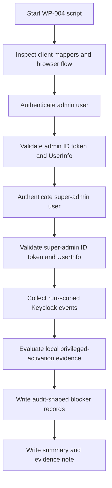

# Keycloak WP-004 Result

Status: Review
Phase: Phase 4 - Proof of Concept
Scope: PoC
Last reviewed: 2026-06-23

## Contents

- [Summary](#summary)
- [How To Read This Test](#how-to-read-this-test)
- [Conclusion](#conclusion)
- [Script Flow](#script-flow)
- [Scenario Matrix](#scenario-matrix)
- [Commands Verified](#commands-verified)
- [Runtime Execution Status](#runtime-execution-status)
- [Observed Result](#observed-result)
- [Evidence Map](#evidence-map)
- [Evidence Collected](#evidence-collected)
- [Limitations](#limitations)
- [References](#references)

## Summary

`WP-004` was executed against the scripted [Keycloak PoC runtime](../../poc/keycloak/README.md) on 2026-06-23. The scenario targets the accepted privileged-authentication evidence question: production `admin` and `super-admin` onboarding activation must not proceed unless the local access-control side can verify evidence that `FR-034` has been satisfied (`FR-034`, `FR-043`, `FR-044`; [Feature requirements](../../FEATURE-REQUIREMENTS.md#feature-requirements), [Keycloak validation plan - WP-004](./keycloak-validation-plan.md#work-packages)).

Result: blocked for privileged onboarding activation in the current default PoC configuration. Keycloak authenticated both non-production privileged users through Authorization Code flow, returned verifiable ID token and UserInfo subject evidence, and emitted run-scoped `LOGIN` and `CODE_TO_TOKEN` events. The token evidence contained no `amr` values, the backoffice client had no AMR protocol mapper, and the bound browser flow exposed no configured authenticator reference values. Keycloak documents that authenticator executions can carry reference values used by an AMR protocol mapper to populate the OIDC `amr` claim; OpenID Connect defines `amr` as optional authentication-method evidence ([Keycloak authentication flows](https://www.keycloak.org/docs/latest/server_admin/#creating-flows), [OpenID Connect Core](https://openid.net/specs/openid-connect-core-1_0.html)).

## How To Read This Test

Read `WP-004` as a blocker validation, not as an MFA implementation. The question is not whether Keycloak can generally support MFA or passwordless authentication. The question is whether this PoC runtime currently produces explicit evidence that the local EDRLab access-control side can use before linking and activating invited `admin` or `super-admin` accounts (`FR-043`, `FR-044`; [Feature requirements](../../FEATURE-REQUIREMENTS.md#feature-requirements)).

The script treats a blocker as a valid result. This follows the validation plan: test `amr` first, then explicit event or configured-flow evidence, and keep privileged onboarding blocked if neither path is explicit enough ([Keycloak validation plan - Accepted Validation Decisions](./keycloak-validation-plan.md#accepted-validation-decisions)).

## Conclusion

The conclusion from `WP-004` is narrow and important: the current Keycloak PoC runtime proves successful authentication for the non-production `admin` and `super-admin` users, but it does not prove that the production privileged-authentication requirement is satisfied. Therefore, automatic onboarding activation for invited `admin` and `super-admin` accounts must remain blocked in the local access-control decision path (`FR-034`, `FR-043`, `FR-044`; [Feature requirements](../../FEATURE-REQUIREMENTS.md#feature-requirements)).

This does not reject Keycloak as the validation candidate. It means the current PoC configuration is incomplete for privileged activation evidence. Keycloak supports authenticator reference values and an AMR protocol mapper path, but this PoC run found no AMR mapper on the backoffice client, no configured browser-flow reference values, and empty `amr` arrays in the privileged users' ID tokens ([Keycloak authentication flows](https://www.keycloak.org/docs/latest/server_admin/#creating-flows), [OpenID Connect Core](https://openid.net/specs/openid-connect-core-1_0.html)).

For Phase 4 review, treat `WP-004` as a blocker on privileged onboarding, not as a blocker on ordinary member onboarding. `WP-003` remains the evidence for safe `member` onboarding; `WP-004` says that `admin` and `super-admin` onboarding needs a follow-up validation pass with a scripted privileged-authentication policy, explicit token or flow evidence, and local enforcement before those account types can be activated (`FR-043`, `FR-044`; [Keycloak validation plan - WP-004](./keycloak-validation-plan.md#work-packages)).

The next validation pass should answer one concrete question: after the chosen privileged authenticator policy is configured, can the local access-control side verify an explicit, agreed evidence value before creating the subject link and activating an invited `admin` or `super-admin` account? If the answer is still no, privileged onboarding remains blocked and must go to Phase 5 review as a residual risk or required adjustment ([Project governance - Phase 5](../../PROJECT-GOVERNANCE.md#phase-5---review-and-decision)).

## Script Flow



## Scenario Matrix

| Scenario | Expected result | Observed result | Why |
| --- | --- | --- | --- |
| `admin-activation-privileged-authentication-evidence` | Candidate evidence or explicit blocker | `blocked` | The admin token had no `amr`, the client had no AMR mapper, and browser-flow reference values were empty. Without explicit privileged-authentication evidence, `FR-044` requires no subject link, no activation, no authorization, and administrative intervention ([Feature requirements](../../FEATURE-REQUIREMENTS.md#feature-requirements)). |
| `super-admin-activation-privileged-authentication-evidence` | Candidate evidence or explicit blocker | `blocked` | Same evidence gap as the admin case. The authenticated subject was valid, but authentication alone is not enough to activate a backoffice account (`FR-037`, `FR-043`, `FR-044`; [Feature requirements](../../FEATURE-REQUIREMENTS.md#feature-requirements)). |

## Commands Verified

From a clean Linux checkout with Docker running:

```bash
cp poc/keycloak/.env.example poc/keycloak/.env.local
# Edit poc/keycloak/.env.local for local non-production secrets.

bash poc/keycloak/scripts/start.sh
bash poc/keycloak/scripts/bootstrap.sh
bash poc/keycloak/scripts/verify.sh
bash poc/keycloak/scripts/verify-privileged-auth.sh
bash poc/keycloak/scripts/stop.sh
```

For placeholder-only validation, the same path can use:

```bash
ENV_FILE=poc/keycloak/.env.example bash poc/keycloak/scripts/start.sh
ENV_FILE=poc/keycloak/.env.example bash poc/keycloak/scripts/bootstrap.sh
ENV_FILE=poc/keycloak/.env.example bash poc/keycloak/scripts/verify.sh
ENV_FILE=poc/keycloak/.env.example bash poc/keycloak/scripts/verify-privileged-auth.sh
ENV_FILE=poc/keycloak/.env.example bash poc/keycloak/scripts/stop.sh
```

## Runtime Execution Status

| Check | Result |
| --- | --- |
| `verify-privileged-auth.sh` added | Pass |
| Bash syntax validation for `verify-privileged-auth.sh` | Pass |
| WP-001 realm/client/user/event verification before WP-004 | Pass |
| Full WP-004 runtime assertions, including run-scoped Keycloak event assertions | Pass |
| Privileged onboarding activation decision | Blocked |

## Observed Result

| Check | Result |
| --- | --- |
| Keycloak login form reached for admin identity | Pass |
| Authorization Code returned for admin identity | Pass |
| Admin ID token signature, issuer, audience, nonce, verified email, `sub`, and time claims validated | Pass |
| Admin UserInfo `sub` matched ID token `sub` | Pass |
| Keycloak login form reached for super-admin identity | Pass |
| Authorization Code returned for super-admin identity | Pass |
| Super-admin ID token signature, issuer, audience, nonce, verified email, `sub`, and time claims validated | Pass |
| Super-admin UserInfo `sub` matched ID token `sub` | Pass |
| Run-scoped Keycloak `LOGIN` and `CODE_TO_TOKEN` events collected for both privileged subjects | Pass |
| Client AMR mapper present | Blocked: `0` mapper detected |
| Browser-flow reference values present | Blocked: none detected |
| Token `amr` values present | Blocked: empty for both privileged subjects |
| Local admin activation | Blocked: no subject link, activation, authorization, or local session created |
| Local super-admin activation | Blocked: no subject link, activation, authorization, or local session created |

## Evidence Map

Use these files first when reviewing the test:

| Evidence file | What to look for |
| --- | --- |
| `wp-004-privileged-auth-summary.json` | Overall `blocked` result, client AMR mapper count, browser-flow binding, configured reference values, and per-account decisions. |
| `wp-004-privileged-auth-decisions.json` | The two local decisions. Both remain `blocked` with `reason_code: missing_amr_claim_and_client_mapper`. |
| `wp-004-admin-id-token-claims.json` and `wp-004-super-admin-id-token-claims.json` | Sanitized ID token claims. Check `amr: []`, `acr: "1"`, verified email, issuer, audience, and `sub`. |
| `wp-004-client-protocol-mappers.json` | Client protocol mapper inspection. The default PoC client has no AMR mapper. |
| `wp-004-browser-flow-executions.json` | Browser flow execution inspection. The default flow includes password and conditional 2FA executions but no captured reference values. |
| `wp-004-keycloak-events.json` | Supplemental Keycloak events. These prove login/token activity for the run, but not MFA or passwordless satisfaction. |
| `wp-004-local-audit.json` | Audit-shaped records for the local privileged-authentication evidence check. |

## Evidence Collected

The scripted evidence collector wrote local generated evidence to:

```text
poc/keycloak/evidence/20260623T153858Z
```

Generated evidence is ignored by Git by default. The evidence directory contained:

- `wp-004-admin-token-response.json`
- `wp-004-admin-id-token-claims.json`
- `wp-004-admin-id-token-signature.txt`
- `wp-004-admin-userinfo.json`
- `wp-004-super-admin-token-response.json`
- `wp-004-super-admin-id-token-claims.json`
- `wp-004-super-admin-id-token-signature.txt`
- `wp-004-super-admin-userinfo.json`
- `wp-004-client-protocol-mappers.json`
- `wp-004-realm-flow-bindings.json`
- `wp-004-browser-flow-executions.json`
- `wp-004-event-window.json`
- `wp-004-keycloak-events.json`
- `wp-004-privileged-auth-decisions.json`
- `wp-004-local-audit.json`
- `wp-004-privileged-auth-summary.json`
- `wp-004-evidence.md`

The script intentionally stores sanitized token-response metadata, token claims, UserInfo subject evidence, Keycloak configuration inspection, local decisions, local audit-shaped records, the Keycloak event-window marker, and supplemental run-scoped Keycloak events. It does not write raw access tokens, refresh tokens, or ID tokens to evidence.

## Limitations

- This scenario does not configure MFA, WebAuthn, passkeys, or a production privileged-authentication policy. It only proves the current default PoC runtime does not expose enough evidence to activate privileged accounts.
- The script uses `mfa`, `otp`, `hwk`, and `swk` as candidate AMR indicators for PoC inspection because RFC 8176 defines registered authentication-method reference values, but production acceptance of any value remains a security-review decision ([RFC 8176](https://www.rfc-editor.org/rfc/rfc8176)).
- Keycloak `LOGIN` and `CODE_TO_TOKEN` events are supplemental. They do not prove which authenticator methods satisfied `FR-034` unless supported by explicit token, flow, or configuration evidence.
- No admin or super-admin account is activated by this script. The PoC local decision deliberately leaves subject-link creation, activation, authorization, and local session creation as `false`.
- A later privileged-authentication validation pass should add scripted Keycloak flow and mapper configuration for the chosen authenticator policy before Phase 5 review. That would still be PoC evidence, not production approval ([Project governance - Phase 4](../../PROJECT-GOVERNANCE.md#phase-4---proof-of-concept), [Project governance - Phase 5](../../PROJECT-GOVERNANCE.md#phase-5---review-and-decision)).

## References

- [Keycloak Validation Plan](./keycloak-validation-plan.md)
- [Keycloak PoC Runtime](../../poc/keycloak/README.md)
- [Feature Requirements Specification](../../FEATURE-REQUIREMENTS.md)
- [Project Governance - Phase 4](../../PROJECT-GOVERNANCE.md#phase-4---proof-of-concept)
- [Project Governance - Phase 5](../../PROJECT-GOVERNANCE.md#phase-5---review-and-decision)
- [Keycloak OIDC Endpoints and Grant Types](https://www.keycloak.org/securing-apps/oidc-layers)
- [Keycloak Authentication Flows](https://www.keycloak.org/docs/latest/server_admin/#creating-flows)
- [OpenID Connect Core 1.0](https://openid.net/specs/openid-connect-core-1_0.html)
- [RFC 8176 - Authentication Method Reference Values](https://www.rfc-editor.org/rfc/rfc8176)
