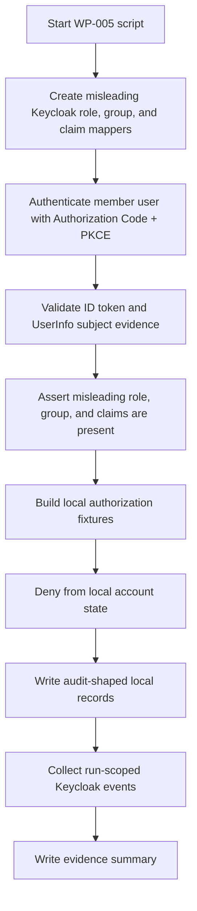

# Keycloak WP-005 Result

Status: Review
Phase: Phase 4 - Proof of Concept
Scope: PoC
Last reviewed: 2026-06-23

## Contents

- [Summary](#summary)
- [How To Read This Test](#how-to-read-this-test)
- [Conclusion](#conclusion)
- [Script Flow](#script-flow)
- [Scenario Matrix](#scenario-matrix)
- [Commands Prepared](#commands-prepared)
- [Execution Status](#execution-status)
- [Observed Result](#observed-result)
- [Expected Evidence Map](#expected-evidence-map)
- [Evidence Collected](#evidence-collected)
- [Limitations](#limitations)
- [References](#references)

## Summary

`WP-005` is prepared as a scripted runtime validation for claim override rejection. The goal is to prove that Keycloak roles, groups, or token/UserInfo claims that look privileged do not grant EDRLab account type, lifecycle state, service-access roles, protected-service authorization, or audit bypass authority (`FR-038`; [Feature requirements](../../FEATURE-REQUIREMENTS.md#feature-requirements), [Keycloak validation plan - WP-005](./keycloak-validation-plan.md#work-packages)).

The script [verify-claim-override.sh](../../poc/keycloak/scripts/verify-claim-override.sh) intentionally creates misleading PoC-only Keycloak evidence for the non-production member user: realm roles that look like an account-management role and a service-access role, a group that looks privileged, and hardcoded OIDC claims for `edrlab_account_type`, `edrlab_lifecycle_state`, and `edrlab_audit_bypass`. Keycloak's Admin REST API is the official administration surface used by the script for this PoC setup ([Keycloak Admin REST API](https://www.keycloak.org/docs-api/latest/rest-api/index.html)).

`WP-005` was executed against the scripted [Keycloak PoC runtime](../../poc/keycloak/README.md) on 2026-06-23. Result: pass. Keycloak emitted the intentionally misleading roles, group, and claims, and the PoC-only local authorization evaluator denied every override attempt from local account state while recording local audit-shaped denial evidence (`FR-020`, `FR-021`, `FR-027`, `FR-038`; [Feature requirements](../../FEATURE-REQUIREMENTS.md#feature-requirements), [Threat model TS-008](../risks/threat-model.md#threat-scenarios)).

## How To Read This Test

Read `WP-005` as a hostile-claim boundary test, not as a production authorization implementation. The test deliberately makes Keycloak emit data that would be dangerous if a protected service trusted it directly. The expected local result is denial from local account state, plus audit-shaped evidence showing the Keycloak role, group, and claim inputs were ignored (`FR-020`, `FR-021`, `FR-027`, `FR-038`; [Feature requirements](../../FEATURE-REQUIREMENTS.md#feature-requirements), [Threat model TS-008](../risks/threat-model.md#threat-scenarios)).

The Keycloak side is real when executed: realm roles, group membership, client protocol mappers, Authorization Code flow, token endpoint, UserInfo endpoint, and Keycloak events. Keycloak documents the OIDC authorization, token, UserInfo, logout, certificate, introspection, and revocation endpoints as integration surfaces for clients ([Keycloak OIDC endpoints](https://www.keycloak.org/securing-apps/oidc-layers)). OpenID Connect defines the subject claim and requires UserInfo `sub` to match the ID token `sub` before UserInfo values are used ([OpenID Connect Core](https://openid.net/specs/openid-connect-core-1_0.html)). The script validates the access token signature and core issuer, subject, client, and time claims before using access-token role evidence.

The local side is simulated for Phase 4: JSON fixtures evaluate whether local account type, lifecycle state, service-access-role assignments, and audit policy remain authoritative. This stays within the Phase 4 PoC boundary and is not production application code ([Project governance - Phase 4](../../PROJECT-GOVERNANCE.md#phase-4---proof-of-concept)).

## Conclusion

`WP-005` supports the accepted boundary in [Keycloak integration scope](../architecture/keycloak-integration-scope.md#role-and-group-boundary): Keycloak roles, groups, and claims may exist and may be inspected as non-authoritative evidence, but they must not decide EDRLab account type, lifecycle state, service-access-role assignment, protected-service access, or audit behavior (`FR-038`; [Feature requirements](../../FEATURE-REQUIREMENTS.md#feature-requirements)).

The practical implementation rule is: validate Keycloak token/UserInfo evidence, resolve the stable subject to one local account, and then authorize from local state. If a future implementation wants to consume Keycloak roles or groups for business access, that would be a scope and architecture change requiring review, not an implementation shortcut.

## Script Flow



## Scenario Matrix

| Scenario | Misleading Keycloak evidence | Local fixture | Expected decision | Why |
| --- | --- | --- | --- | --- |
| `account-type-claim-does-not-grant-admin-management` | `edrlab_account_type: super-admin`, privileged-looking role and group | Active local `member` | `deny` | Account type is local and immutable; IdP claims must not override it (`FR-001`, `FR-038`; [Feature requirements](../../FEATURE-REQUIREMENTS.md#feature-requirements)). |
| `lifecycle-claim-does-not-activate-disabled-account` | `edrlab_lifecycle_state: active` | Disabled local `member` with a local service role | `deny` | Protected-service access requires an active local account; an IdP claim must not activate it (`FR-015`, `FR-038`; [Feature requirements](../../FEATURE-REQUIREMENTS.md#feature-requirements)). |
| `keycloak-role-does-not-create-service-access` | Keycloak realm role named `protected-service-consultation-poc` | Active local `member` with no local service-access role | `deny` | Service-access role assignments are local and member access requires a local assignment (`FR-005`, `FR-020`, `FR-038`; [Feature requirements](../../FEATURE-REQUIREMENTS.md#feature-requirements)). |
| `audit-bypass-claim-does-not-suppress-denial-audit` | `edrlab_audit_bypass: true` | Active local `member` attempting audit read | `deny` and local audit record | Audit access and audit recording are local requirements; token claims must not bypass them (`FR-027`, `FR-028`, `FR-038`; [Feature requirements](../../FEATURE-REQUIREMENTS.md#feature-requirements)). |

## Commands Prepared

From a clean Linux checkout with Docker running:

```bash
cp poc/keycloak/.env.example poc/keycloak/.env.local
# Edit poc/keycloak/.env.local for local non-production secrets.

bash poc/keycloak/scripts/start.sh
bash poc/keycloak/scripts/bootstrap.sh
bash poc/keycloak/scripts/verify.sh
bash poc/keycloak/scripts/verify-claim-override.sh
bash poc/keycloak/scripts/stop.sh
```

`WP-005` intentionally mutates the throwaway realm with misleading roles, group membership, and protocol mappers. Run the reset command before later work packages that need the baseline `WP-001` realm configuration:

```bash
RESET_CONFIRM=delete-poc-state bash poc/keycloak/scripts/reset.sh
```

For placeholder-only validation, the same path can use:

```bash
ENV_FILE=poc/keycloak/.env.example bash poc/keycloak/scripts/start.sh
ENV_FILE=poc/keycloak/.env.example bash poc/keycloak/scripts/bootstrap.sh
ENV_FILE=poc/keycloak/.env.example bash poc/keycloak/scripts/verify.sh
ENV_FILE=poc/keycloak/.env.example bash poc/keycloak/scripts/verify-claim-override.sh
ENV_FILE=poc/keycloak/.env.example bash poc/keycloak/scripts/stop.sh
```

## Execution Status

| Check | Result |
| --- | --- |
| `verify-claim-override.sh` added | Pass |
| Bash syntax validation with Git Bash | Pass |
| Runtime documentation updated | Pass |
| Docker Compose model resolution with `.env.example` | Pass |
| WP-001 realm/client/user/event verification before WP-005 | Pass |
| Full WP-005 runtime assertions | Pass |
| Runtime stopped after verification | Pass |
| WP-005 pass/fail decision | Pass |

The current Codex host is Windows, so the runtime scripts were executed from a temporary Alpine Linux container on the same Docker network as the Keycloak PoC service. The container supplied Bash, `curl`, `jq`, `openssl`, `python3`, and Docker CLI without adding dependencies to the repository. The project runbook remains Linux-first as required by the repository instructions ([Keycloak PoC runtime - Prerequisites](../../poc/keycloak/README.md#prerequisites), [AGENTS - User runtime environment](../../AGENTS.md#current-operating-phase)).

## Observed Result

| Check | Result |
| --- | --- |
| Keycloak login form reached for member identity | Pass |
| Authorization Code returned for member identity | Pass |
| ID token signature, issuer, audience, nonce, verified email, `sub`, and time claims validated | Pass |
| Access token signature, issuer, subject, authorized party, and time claims validated | Pass |
| UserInfo `sub` matched ID token `sub` | Pass |
| Misleading Keycloak roles, group, and hardcoded claims present in evidence | Pass |
| Account-type claim did not grant admin-management authority | Pass: denied with `local_account_type_not_authorized` |
| Lifecycle claim did not activate a disabled local account | Pass: denied with `local_account_not_active` |
| Keycloak realm role did not create local service access | Pass: denied with `missing_local_service_access_role` |
| Audit-bypass claim did not suppress local denial audit | Pass: denied with `local_account_type_not_authorized` and local audit-shaped evidence |
| Denied decisions left local account fixtures unchanged | Pass |
| Run-scoped Keycloak `LOGIN` and `CODE_TO_TOKEN` events collected | Pass |

## Expected Evidence Map

When executed successfully, the script writes generated evidence under:

```text
poc/keycloak/evidence/<timestamp>
```

Expected files:

| Evidence file | What to look for |
| --- | --- |
| `wp-005-keycloak-override-setup.json` | PoC-only Keycloak role, group, and mapper setup used to create misleading claim evidence. |
| `wp-005-member-id-token-claims.json` | ID token claims, including hardcoded `edrlab_account_type`, `edrlab_lifecycle_state`, `edrlab_audit_bypass`, and group evidence. |
| `wp-005-member-access-token-claims.json` | Access token claims, including the misleading Keycloak realm roles and group evidence, after access-token validation. |
| `wp-005-member-access-token-signature.txt` | Access token signature verification output. |
| `wp-005-member-userinfo.json` | UserInfo subject evidence; `sub` must match the ID token subject before values are used ([OpenID Connect Core](https://openid.net/specs/openid-connect-core-1_0.html)). |
| `wp-005-local-authorization-inputs.json` | PoC-only local fixtures used to test account type, lifecycle, service-access-role, and audit-boundary decisions. |
| `wp-005-claim-override-decisions.json` | The local decisions. All scenarios should be `deny` and should show that Keycloak claims were ignored. |
| `wp-005-local-audit.json` | Audit-shaped local denial records, including ignored Keycloak claim details. |
| `wp-005-claim-override-summary.json` | Overall result. `pass` means misleading Keycloak evidence was present but all local override attempts were denied. |
| `wp-005-keycloak-events.json` | Supplemental run-scoped Keycloak `LOGIN` and `CODE_TO_TOKEN` events for the member subject. |

## Evidence Collected

The scripted evidence collector wrote local generated evidence to:

```text
poc/keycloak/evidence/20260623T160856Z
```

Generated evidence is ignored by Git by default. The evidence directory contained:

- `wp-005-claim-override-decisions.json`
- `wp-005-claim-override-summary.json`
- `wp-005-event-window.json`
- `wp-005-evidence.md`
- `wp-005-keycloak-events.json`
- `wp-005-keycloak-override-setup.json`
- `wp-005-local-audit.json`
- `wp-005-local-authorization-inputs.json`
- `wp-005-member-access-token-claims.json`
- `wp-005-member-access-token-signature.txt`
- `wp-005-member-id-token-claims.json`
- `wp-005-member-id-token-signature.txt`
- `wp-005-member-token-response.json`
- `wp-005-member-userinfo.json`

## Limitations

- The script intentionally mutates the throwaway PoC realm by adding misleading roles, group membership, and protocol mappers. The runtime remains non-production and resettable through [reset.sh](../../poc/keycloak/scripts/reset.sh).
- The local authorization evaluator is a PoC-only JSON fixture, not production middleware, a BFF, a protected backend service, persistent storage, or audit persistence.
- A later production implementation still needs tests that prevent future coupling from Keycloak roles, groups, or token claims into local account type, lifecycle, service-access-role assignment, protected-service authorization, or audit behavior.

## References

- [Keycloak Validation Plan](./keycloak-validation-plan.md)
- [Keycloak PoC Runtime](../../poc/keycloak/README.md)
- [Keycloak Integration Scope](../architecture/keycloak-integration-scope.md)
- [Feature Requirements Specification](../../FEATURE-REQUIREMENTS.md)
- [Threat Model](../risks/threat-model.md)
- [Project Governance - Phase 4](../../PROJECT-GOVERNANCE.md#phase-4---proof-of-concept)
- [AGENTS - Current Operating Phase](../../AGENTS.md#current-operating-phase)
- [Keycloak Admin REST API](https://www.keycloak.org/docs-api/latest/rest-api/index.html)
- [Keycloak OIDC Endpoints and Grant Types](https://www.keycloak.org/securing-apps/oidc-layers)
- [OpenID Connect Core 1.0](https://openid.net/specs/openid-connect-core-1_0.html)
- [RFC 7636 - Proof Key for Code Exchange](https://www.rfc-editor.org/rfc/rfc7636)
