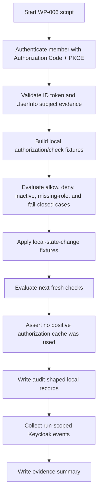

# Keycloak WP-006 Result

Status: Review
Phase: Phase 4 - Proof of Concept
Scope: PoC
Last reviewed: 2026-06-23

## Contents

- [Summary](#summary)
- [How To Read This Test](#how-to-read-this-test)
- [Conclusion](#conclusion)
- [Script Flow](#script-flow)
- [Scenario Matrix](#scenario-matrix)
- [Commands Prepared](#commands-prepared)
- [Execution Status](#execution-status)
- [Observed Result](#observed-result)
- [Expected Evidence Map](#expected-evidence-map)
- [Evidence Collected](#evidence-collected)
- [Limitations](#limitations)
- [References](#references)

## Summary

`WP-006` is prepared as a scripted runtime validation for the local protected-service authorization contract and access-stop target. The goal is to prove that a protected service can call local `authorization/check`, receive allow/deny decisions from current local account and service-access-role state, fail closed when authorization cannot be safely determined, and deny on the next fresh check after local state changes (`FR-015`, `FR-016`, `FR-020`, `FR-021`, `FR-022`, `FR-032`; [Feature requirements](../../FEATURE-REQUIREMENTS.md#feature-requirements), [Keycloak validation plan - WP-006](./keycloak-validation-plan.md#work-packages)).

The script [verify-authorization-access-stop.sh](../../poc/keycloak/scripts/verify-authorization-access-stop.sh) authenticates the non-production member user through the scripted Keycloak Authorization Code flow and then evaluates PoC-only local `authorization/check` fixtures. Keycloak documents OIDC authorization, token, UserInfo, logout, certificate, introspection, and revocation endpoints as client integration surfaces ([Keycloak OIDC endpoints](https://www.keycloak.org/securing-apps/oidc-layers)). OpenID Connect defines the `sub` subject identifier and requires UserInfo `sub` to match the ID token `sub` before UserInfo values are used ([OpenID Connect Core](https://openid.net/specs/openid-connect-core-1_0.html)).

`WP-006` was executed against the scripted [Keycloak PoC runtime](../../poc/keycloak/README.md) on 2026-06-23. Result: pass. The script validated Keycloak subject evidence, allowed the active linked member with a current local service-access role, denied unresolved, unavailable, inactive, and missing-role cases, and denied all four next-fresh-check access-stop cases without using a positive authorization cache (`FR-016`, `FR-020`, `FR-021`, `FR-032`; [Feature requirements](../../FEATURE-REQUIREMENTS.md#feature-requirements), [Keycloak integration scope - Validated Access-Stop Delay](../architecture/keycloak-integration-scope.md#validated-access-stop-delay)).

## How To Read This Test

Read `WP-006` as a protected-service contract test, not as production authorization middleware. The Keycloak side is real when executed: browser-like login, Authorization Code flow with PKCE, token exchange, ID token validation, UserInfo subject check, and run-scoped Keycloak event collection. The local side is simulated with JSON fixtures so Phase 4 can validate the decision rule without creating production application code ([Project governance - Phase 4](../../PROJECT-GOVERNANCE.md#phase-4---proof-of-concept)).

The rule under test is intentionally local: resolve the authenticated Keycloak `iss` + `sub` to one linked local account, check that the local account is active, and authorize from active local service-access-role coverage. Protected services must enforce authorization server-side and deny when they cannot safely determine the result (`FR-020`, `FR-021`, `FR-036`; [Feature requirements](../../FEATURE-REQUIREMENTS.md#feature-requirements), [OWASP Authorization Cheat Sheet](https://cheatsheetseries.owasp.org/cheatsheets/Authorization_Cheat_Sheet.html)).

The access-stop target is the accepted Phase 4 target from the integration scope: after local account disablement, account archival, member role removal, or service-access-role disablement, the next fresh protected-service authorization check must deny, and no positive authorization cache is allowed in the validation path (`FR-016`, `FR-032`; [Keycloak integration scope - Validated Access-Stop Delay](../architecture/keycloak-integration-scope.md#validated-access-stop-delay)).

## Conclusion

`WP-006` should support the accepted boundary that Keycloak authenticates the subject while local EDRLab access control decides protected-service access from current local state. It should not be read as production approval for the fixture evaluator, cache model, data store, API surface, or distributed-service behavior ([Project governance - Phase 6](../../PROJECT-GOVERNANCE.md#phase-6---production-mvp)).

## Script Flow



## Scenario Matrix

| Scenario | Expected decision | Why |
| --- | --- | --- |
| `allow-active-member-with-service-role` | `allow` | Active `member` access is allowed only when a local active service-access role covers the protected service (`FR-005`, `FR-020`, `FR-022`; [Feature requirements](../../FEATURE-REQUIREMENTS.md#feature-requirements)). |
| `deny-unresolved-local-subject` | `deny` | The authenticated identity must resolve to exactly one linked local account before authorization (`FR-036`; [Feature requirements](../../FEATURE-REQUIREMENTS.md#feature-requirements)). |
| `deny-authorization-check-unavailable` | `deny` | Protected services must fail closed when the authorization result cannot be determined safely (`FR-021`; [OWASP Authorization Cheat Sheet](https://cheatsheetseries.owasp.org/cheatsheets/Authorization_Cheat_Sheet.html)). |
| `deny-disabled-account` | `deny` | Protected-service access requires an active local account (`FR-015`, `FR-020`; [Feature requirements](../../FEATURE-REQUIREMENTS.md#feature-requirements)). |
| `deny-active-member-missing-service-role` | `deny` | Active members do not receive protected-service access from account type alone; they need a local service-access-role assignment (`FR-005`; [Feature requirements](../../FEATURE-REQUIREMENTS.md#feature-requirements)). |
| `access-stop-after-account-disable` | `deny` on next fresh check | Account disablement must stop already-issued protected-service access within the accepted validation target (`FR-016`; [Keycloak integration scope](../architecture/keycloak-integration-scope.md#validated-access-stop-delay)). |
| `access-stop-after-account-archive` | `deny` on next fresh check | Archived accounts must not obtain protected-service access (`FR-015`, `FR-016`; [Feature requirements](../../FEATURE-REQUIREMENTS.md#feature-requirements)). |
| `access-stop-after-member-role-removal` | `deny` on next fresh check | Removing the member's local service-access role removes the local rule that allowed access (`FR-005`, `FR-016`; [Feature requirements](../../FEATURE-REQUIREMENTS.md#feature-requirements)). |
| `access-stop-after-service-role-disable` | `deny` on next fresh check | Disabled service-access roles must not be used for protected-service access decisions (`FR-032`; [Feature requirements](../../FEATURE-REQUIREMENTS.md#feature-requirements)). |

## Commands Prepared

From a clean Linux checkout with Docker running:

```bash
cp poc/keycloak/.env.example poc/keycloak/.env.local
# Edit poc/keycloak/.env.local for local non-production secrets.

bash poc/keycloak/scripts/start.sh
bash poc/keycloak/scripts/bootstrap.sh
bash poc/keycloak/scripts/verify.sh
bash poc/keycloak/scripts/verify-authorization-access-stop.sh
bash poc/keycloak/scripts/stop.sh
```

If `WP-005` has just been run and a clean Keycloak realm is desired for review, reset before rerunning setup:

```bash
RESET_CONFIRM=delete-poc-state bash poc/keycloak/scripts/reset.sh
```

For placeholder-only validation, the same path can use:

```bash
ENV_FILE=poc/keycloak/.env.example bash poc/keycloak/scripts/start.sh
ENV_FILE=poc/keycloak/.env.example bash poc/keycloak/scripts/bootstrap.sh
ENV_FILE=poc/keycloak/.env.example bash poc/keycloak/scripts/verify.sh
ENV_FILE=poc/keycloak/.env.example bash poc/keycloak/scripts/verify-authorization-access-stop.sh
ENV_FILE=poc/keycloak/.env.example bash poc/keycloak/scripts/stop.sh
```

## Execution Status

| Check | Result |
| --- | --- |
| `verify-authorization-access-stop.sh` added | Pass |
| Bash syntax validation with Git Bash | Pass |
| Runtime documentation updated | Pass |
| Docker runtime started with `.env.example` | Pass |
| WP-001 realm/client/user/event verification before WP-006 | Pass |
| Full WP-006 runtime assertions | Pass |
| Runtime stopped after verification | Pass |
| WP-006 pass/fail decision | Pass |

The current Codex host is Windows, so the Linux-targeted scripts were executed with Git Bash against the Docker Keycloak PoC runtime. The project runbook remains Linux-first as required by the repository instructions ([Keycloak PoC runtime - Prerequisites](../../poc/keycloak/README.md#prerequisites), [AGENTS - User runtime environment](../../AGENTS.md#current-operating-phase)).

## Observed Result

| Check | Result |
| --- | --- |
| Keycloak login form reached for member identity | Pass |
| Authorization Code returned for member identity | Pass |
| ID token signature, issuer, audience, nonce, verified email, `sub`, and time claims validated | Pass |
| UserInfo `sub` matched ID token `sub` | Pass |
| Active linked member with active covering local service-access role | Pass: `allow` with `service_access_granted` |
| Unresolved local subject | Pass: `deny` with `unresolved_local_subject` |
| Unavailable authorization result | Pass: `deny` with `authorization_result_unavailable` and simulated `503` response |
| Disabled local account | Pass: `deny` with `local_account_not_active` |
| Active member without local service-access role | Pass: `deny` with `missing_local_service_access_role` |
| Access stop after account disablement | Pass: next fresh check denied with no positive cache |
| Access stop after account archival | Pass: next fresh check denied with no positive cache |
| Access stop after member role removal | Pass: next fresh check denied with no positive cache |
| Access stop after service-access-role disablement | Pass: next fresh check denied with no positive cache |
| Run-scoped Keycloak `LOGIN` and `CODE_TO_TOKEN` events collected | Pass |

## Expected Evidence Map

When executed successfully, the script writes generated evidence under:

```text
poc/keycloak/evidence/<timestamp>
```

Expected files:

| Evidence file | What to look for |
| --- | --- |
| `wp-006-member-id-token-claims.json` | Sanitized ID token claims, including issuer, subject, audience, nonce, email verification, and time claims. |
| `wp-006-member-userinfo.json` | UserInfo subject evidence; `sub` must match the ID token subject before values are used ([OpenID Connect Core](https://openid.net/specs/openid-connect-core-1_0.html)). |
| `wp-006-local-authorization-inputs.json` | PoC-only local `authorization/check` fixtures and the accepted no-positive-cache rule. |
| `wp-006-authorization-check-requests.json` | Request examples for protected-service calls into local `authorization/check`. |
| `wp-006-authorization-check-responses.json` | Response examples with `allow`, reason code, local state version, and no-positive-cache evidence. |
| `wp-006-authorization-check-decisions.json` | Full decision trace for allow, denial, fail-closed, and access-stop scenarios. |
| `wp-006-local-state-transitions.json` | Local state-change fixtures that must be reflected by the next fresh check. |
| `wp-006-local-audit.json` | Audit-shaped local authorization decision records; WP-007 remains the dedicated audit-correlation validation. |
| `wp-006-authorization-access-stop-summary.json` | Overall result. `pass` means all expected decisions matched and every access-stop scenario denied without a positive cache. |
| `wp-006-keycloak-events.json` | Supplemental run-scoped Keycloak `LOGIN` and `CODE_TO_TOKEN` events for the member subject, with token/code identifiers reduced to presence flags. |

## Evidence Collected

The scripted evidence collector wrote local generated evidence to:

```text
poc/keycloak/evidence/20260623T163406Z
```

Generated evidence is ignored by Git by default. The evidence directory contained:

- `wp-006-authorization-access-stop-summary.json`
- `wp-006-authorization-check-decisions.json`
- `wp-006-authorization-check-requests.json`
- `wp-006-authorization-check-responses.json`
- `wp-006-event-window.json`
- `wp-006-evidence.md`
- `wp-006-keycloak-events.json`
- `wp-006-local-audit.json`
- `wp-006-local-authorization-inputs.json`
- `wp-006-local-state-transitions.json`
- `wp-006-member-id-token-claims.json`
- `wp-006-member-id-token-signature.txt`
- `wp-006-member-token-response.json`
- `wp-006-member-userinfo.json`

## Limitations

- The local `authorization/check` evaluator is a PoC-only JSON fixture, not production middleware, BFF code, protected-service code, persistent storage, distributed cache behavior, or audit persistence.
- The no-positive-cache result proves only the selected validation path. A future production cache or token strategy would need explicit review of delay, failure mode, audit impact, and protected-service risk ([Keycloak integration scope - Validated Access-Stop Delay](../architecture/keycloak-integration-scope.md#validated-access-stop-delay)).
- `WP-006` does not prove production audit retention, tamper resistance, export, or correlation behavior. Those remain in `WP-007` and later review (`FR-027`, `FR-035`; [Keycloak validation plan - Work Packages](./keycloak-validation-plan.md#work-packages)).
- `WP-006` does not unblock privileged `admin` or `super-admin` onboarding. `WP-004` remains the privileged-authentication evidence blocker until a configured evidence path is validated (`FR-034`, `FR-043`, `FR-044`; [Keycloak WP-004 result](./keycloak-wp004-result.md)).

## References

- [Keycloak Validation Plan](./keycloak-validation-plan.md)
- [Keycloak PoC Runtime](../../poc/keycloak/README.md)
- [Keycloak Integration Scope](../architecture/keycloak-integration-scope.md)
- [Keycloak WP-004 Result](./keycloak-wp004-result.md)
- [Feature Requirements Specification](../../FEATURE-REQUIREMENTS.md)
- [Project Governance - Phase 4](../../PROJECT-GOVERNANCE.md#phase-4---proof-of-concept)
- [Project Governance - Phase 6](../../PROJECT-GOVERNANCE.md#phase-6---production-mvp)
- [Keycloak OIDC Endpoints and Grant Types](https://www.keycloak.org/securing-apps/oidc-layers)
- [OpenID Connect Core 1.0](https://openid.net/specs/openid-connect-core-1_0.html)
- [OWASP Authorization Cheat Sheet](https://cheatsheetseries.owasp.org/cheatsheets/Authorization_Cheat_Sheet.html)
