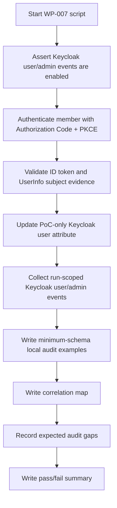

# Keycloak WP-007 Result

Status: Review
Phase: Phase 4 - Proof of Concept
Scope: PoC
Last reviewed: 2026-06-23

## Contents

- [Summary](#summary)
- [How To Read This Test](#how-to-read-this-test)
- [Conclusion](#conclusion)
- [Script Flow](#script-flow)
- [Scenario Matrix](#scenario-matrix)
- [Commands Prepared](#commands-prepared)
- [Execution Status](#execution-status)
- [Observed Result](#observed-result)
- [Expected Evidence Map](#expected-evidence-map)
- [Evidence Collected](#evidence-collected)
- [Limitations](#limitations)
- [References](#references)

## Summary

`WP-007` is prepared as a scripted runtime validation for audit correlation. The goal is to prove that local EDRLab audit remains authoritative for account resolution, protected-service authorization, and audit-read decisions, while Keycloak events remain supplemental provider-side evidence (`FR-027`, `FR-028`, `FR-035`, `FR-036`, `FR-038`; [Feature requirements](../../FEATURE-REQUIREMENTS.md#feature-requirements), [Keycloak validation plan - WP-007](./keycloak-validation-plan.md#work-packages)).

The script [verify-audit-correlation.sh](../../poc/keycloak/scripts/verify-audit-correlation.sh) authenticates the non-production member user through the scripted Keycloak Authorization Code flow, validates the ID token and UserInfo subject evidence, generates a PoC-only Keycloak admin-event probe, collects run-scoped Keycloak user and admin events, and writes local audit examples using the minimum schema accepted in the validation plan ([Keycloak validation plan - Accepted Validation Decisions](./keycloak-validation-plan.md#accepted-validation-decisions)). Keycloak documents OIDC authorization, token, UserInfo, logout, certificate, introspection, and revocation endpoints as client integration surfaces ([Keycloak OIDC endpoints](https://www.keycloak.org/securing-apps/oidc-layers)). Keycloak also describes events as audit streams and distinguishes user events from admin events initiated through the Admin Console or API ([Keycloak admin events](https://www.keycloak.org/docs/latest/server_admin/#auditing-admin-events)).

`WP-007` was executed against the scripted [Keycloak PoC runtime](../../poc/keycloak/README.md) on 2026-06-23. Result: pass. The script produced four minimum-schema local audit records, correlated them with two run-scoped Keycloak user events and one run-scoped Keycloak admin event, and recorded four expected audit gaps where Keycloak cannot prove local EDRLab authorization, audit-read, persistence, or retention behavior.

## How To Read This Test

Read `WP-007` as an audit-boundary test, not as production audit storage. The Keycloak side is real when executed: Authorization Code login, token exchange, ID token validation, UserInfo subject check, Keycloak user events, and a Keycloak admin `UPDATE` event. OpenID Connect requires the UserInfo `sub` value to match the ID token `sub` before UserInfo values are used ([OpenID Connect Core](https://openid.net/specs/openid-connect-core-1_0.html)).

The local audit side is simulated with JSON fixtures so Phase 4 can validate the evidence shape, correlation identifiers, and expected provider-event gaps without creating production application code or durable audit infrastructure ([Project governance - Phase 4](../../PROJECT-GOVERNANCE.md#phase-4---proof-of-concept)).

The rule under test is intentionally strict: Keycloak can support correlation by proving authentication activity and technical Keycloak administration activity, but it does not become the source of truth for EDRLab account state, service-access roles, protected-service authorization decisions, or EDRLab audit-read authorization (`FR-027`, `FR-035`, `FR-038`; [Feature requirements](../../FEATURE-REQUIREMENTS.md#feature-requirements), [Keycloak integration scope - Role and Group Boundary](../architecture/keycloak-integration-scope.md#role-and-group-boundary)).

## Conclusion

`WP-007` supports the accepted Phase 4 audit boundary: local EDRLab audit must remain authoritative for local security decisions, while Keycloak events can be retained as supplemental authentication and technical-administration evidence.

The result does not prove production append-only storage, tamper resistance, retention, export, backup, restore, privacy handling, or reconciliation rules. Those remain Phase 5 review and production-hardening questions (`FR-035`; [Feature requirements](../../FEATURE-REQUIREMENTS.md#feature-requirements), [Project governance - Phase 5](../../PROJECT-GOVERNANCE.md#phase-5---review-and-decision)).

## Script Flow



## Scenario Matrix

| Scenario | Evidence | Expected result | Why |
| --- | --- | --- | --- |
| `authenticated-subject-resolved` | Local audit record plus Keycloak `LOGIN` and `CODE_TO_TOKEN` events | Local record is authoritative; Keycloak events are supplemental | Authentication evidence can support correlation, but local account resolution remains an EDRLab access-control responsibility (`FR-036`; [Feature requirements](../../FEATURE-REQUIREMENTS.md#feature-requirements)). |
| `authorization-check-allow` | Local audit record with `service_access_granted` | Local record is authoritative | Protected services must authorize server-side from local account and role state, not from Keycloak events alone (`FR-020`; [Feature requirements](../../FEATURE-REQUIREMENTS.md#feature-requirements)). |
| `authorization-check-deny` | Local audit record with `missing_local_service_access_role` | Local-only expected gap | Keycloak user events do not prove the local role-denial reason; the local audit record must carry it (`FR-021`, `FR-027`; [Feature requirements](../../FEATURE-REQUIREMENTS.md#feature-requirements)). |
| `audit-read-denied` | Local audit record with `local_account_type_not_authorized` | Local-only expected gap | Audit consultation is super-admin-only and audit reads/exports must themselves be audited (`FR-028`; [Feature requirements](../../FEATURE-REQUIREMENTS.md#feature-requirements)). |
| `keycloak-admin-event-probe` | Keycloak admin `UPDATE` event for a throwaway user attribute | Supplemental technical evidence only | Keycloak admin events can prove provider-side technical activity, but not EDRLab local authorization or audit authority ([Keycloak admin events](https://www.keycloak.org/docs/latest/server_admin/#auditing-admin-events), `FR-038`; [Feature requirements](../../FEATURE-REQUIREMENTS.md#feature-requirements)). |

## Commands Prepared

From a clean Linux checkout with Docker running:

```bash
cp poc/keycloak/.env.example poc/keycloak/.env.local
# Edit poc/keycloak/.env.local for local non-production secrets.

bash poc/keycloak/scripts/start.sh
bash poc/keycloak/scripts/bootstrap.sh
bash poc/keycloak/scripts/verify.sh
bash poc/keycloak/scripts/verify-audit-correlation.sh
bash poc/keycloak/scripts/stop.sh
```

`WP-007` updates a non-authoritative attribute on the throwaway member user to create a Keycloak admin event probe. Run the reset command before later work packages that need the baseline `WP-001` realm configuration:

```bash
RESET_CONFIRM=delete-poc-state bash poc/keycloak/scripts/reset.sh
```

For placeholder-only validation, the same path can use:

```bash
ENV_FILE=poc/keycloak/.env.example bash poc/keycloak/scripts/start.sh
ENV_FILE=poc/keycloak/.env.example bash poc/keycloak/scripts/bootstrap.sh
ENV_FILE=poc/keycloak/.env.example bash poc/keycloak/scripts/verify.sh
ENV_FILE=poc/keycloak/.env.example bash poc/keycloak/scripts/verify-audit-correlation.sh
ENV_FILE=poc/keycloak/.env.example bash poc/keycloak/scripts/stop.sh
```

## Execution Status

| Check | Result |
| --- | --- |
| `verify-audit-correlation.sh` added | Pass |
| Bash syntax validation with Git Bash | Pass |
| Runtime documentation updated | Pass |
| Docker runtime started with `.env.example` | Pass |
| WP-001 realm/client/user/event verification before WP-007 | Pass |
| Full WP-007 runtime assertions | Pass |
| Runtime stopped after verification | Pass |
| WP-007 pass/fail decision | Pass |

The current Codex host is Windows, so the Linux-targeted scripts were executed with Git Bash against the Docker Keycloak PoC runtime. The project runbook remains Linux-first as required by the repository instructions ([Keycloak PoC runtime - Prerequisites](../../poc/keycloak/README.md#prerequisites), [AGENTS - User runtime environment](../../AGENTS.md#current-operating-phase)).

## Observed Result

| Check | Result |
| --- | --- |
| Keycloak user and admin events enabled | Pass |
| Keycloak login form reached for member identity | Pass |
| Authorization Code returned for member identity | Pass |
| ID token signature, issuer, audience, nonce, verified email, `sub`, and time claims validated | Pass |
| UserInfo `sub` matched ID token `sub` | Pass |
| Keycloak admin-event probe updated a non-production member user attribute | Pass |
| Run-scoped Keycloak `LOGIN` and `CODE_TO_TOKEN` events collected | Pass: 2 user events |
| Run-scoped Keycloak admin `UPDATE` event collected | Pass: 1 admin event |
| Local audit examples contained the accepted minimum schema fields | Pass: 4 records |
| Local audit examples carried correlation IDs | Pass |
| Expected local-only audit gaps recorded | Pass: 4 gaps |
| Overall summary | Pass |

## Expected Evidence Map

When executed successfully, the script writes generated evidence under:

```text
poc/keycloak/evidence/<timestamp>
```

Expected files:

| Evidence file | What to look for |
| --- | --- |
| `wp-007-member-id-token-claims.json` | Sanitized ID token claims, including issuer, subject, audience, nonce, email verification, and time claims. |
| `wp-007-member-userinfo.json` | UserInfo subject evidence; `sub` must match the ID token subject before values are used ([OpenID Connect Core](https://openid.net/specs/openid-connect-core-1_0.html)). |
| `wp-007-keycloak-admin-event-probe.json` | The PoC-only Keycloak user-attribute update used to create a run-scoped admin event. |
| `wp-007-keycloak-events.json` | Supplemental run-scoped Keycloak `LOGIN` and `CODE_TO_TOKEN` events for the member subject. |
| `wp-007-keycloak-admin-events.json` | Supplemental run-scoped Keycloak admin `UPDATE` event for the probe. |
| `wp-007-local-audit.json` | Minimum-schema local audit examples for subject resolution, authorization allow/deny, and audit-read denial. |
| `wp-007-audit-correlation-map.json` | Correlation IDs and the relationship between local authoritative audit records and supplemental Keycloak events. |
| `wp-007-audit-gaps.json` | Expected gaps that Keycloak events do not prove: local authorization reasons, local audit-read decisions, production persistence/integrity/retention, and Keycloak technical-admin scope limits. |
| `wp-007-audit-correlation-summary.json` | Overall result. `pass` means minimum-schema local audit, correlation, supplemental Keycloak events, and expected gaps were all recorded. |

## Evidence Collected

The scripted evidence collector wrote local generated evidence to:

```text
poc/keycloak/evidence/20260623T164325Z
```

Generated evidence is ignored by Git by default. The evidence directory contained:

- `wp-007-audit-correlation-map.json`
- `wp-007-audit-correlation-summary.json`
- `wp-007-audit-gaps.json`
- `wp-007-event-window.json`
- `wp-007-evidence.md`
- `wp-007-keycloak-admin-event-probe.json`
- `wp-007-keycloak-admin-events.json`
- `wp-007-keycloak-events.json`
- `wp-007-local-audit.json`
- `wp-007-member-id-token-claims.json`
- `wp-007-member-id-token-signature.txt`
- `wp-007-member-token-response.json`
- `wp-007-member-userinfo.json`

## Limitations

- The local audit records are PoC-only JSON fixtures, not production append-only audit persistence, tamper resistance, retention, export, backup, restore, privacy policy, or reconciliation logic.
- The Keycloak admin event probe updates a throwaway non-authoritative user attribute. It proves provider-side admin event capture for that probe, not EDRLab account lifecycle, service-access-role, protected-service authorization, or audit-read authority.
- The runtime does not prove that every future production code path emits an audit event. A production implementation still needs write-path integration and tests for every audited operation in `FR-027` ([Feature requirements](../../FEATURE-REQUIREMENTS.md#feature-requirements)).
- Keycloak event retention/export and local audit retention/export remain operational review topics for Phase 5 and later hardening (`FR-035`; [Keycloak validation plan - Work Packages](./keycloak-validation-plan.md#work-packages)).
- `WP-007` does not unblock privileged `admin` or `super-admin` onboarding. `WP-004` remains the privileged-authentication evidence blocker until a configured evidence path is validated (`FR-034`, `FR-043`, `FR-044`; [Keycloak WP-004 result](./keycloak-wp004-result.md)).

## References

- [Keycloak Validation Plan](./keycloak-validation-plan.md)
- [Keycloak PoC Runtime](../../poc/keycloak/README.md)
- [Keycloak Integration Scope](../architecture/keycloak-integration-scope.md)
- [Keycloak WP-004 Result](./keycloak-wp004-result.md)
- [Feature Requirements Specification](../../FEATURE-REQUIREMENTS.md)
- [Project Governance - Phase 4](../../PROJECT-GOVERNANCE.md#phase-4---proof-of-concept)
- [Project Governance - Phase 5](../../PROJECT-GOVERNANCE.md#phase-5---review-and-decision)
- [Keycloak OIDC Endpoints and Grant Types](https://www.keycloak.org/securing-apps/oidc-layers)
- [Keycloak Admin Events](https://www.keycloak.org/docs/latest/server_admin/#auditing-admin-events)
- [Keycloak Admin REST API](https://www.keycloak.org/docs-api/latest/rest-api/index.html)
- [OpenID Connect Core 1.0](https://openid.net/specs/openid-connect-core-1_0.html)
- [RFC 7636 - Proof Key for Code Exchange](https://www.rfc-editor.org/rfc/rfc7636)
