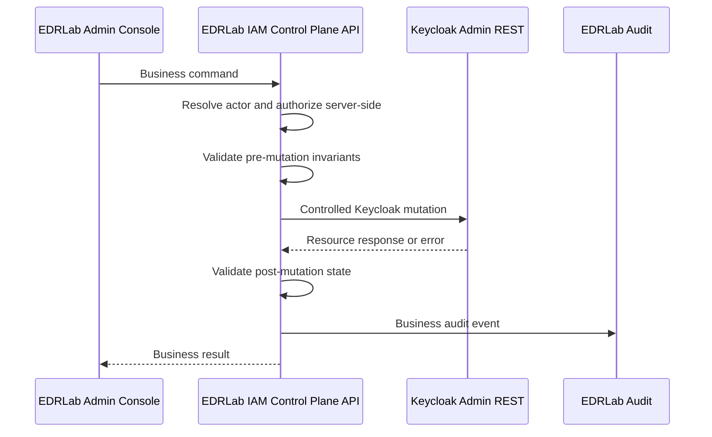

# Keycloak WP-011 Result - IAM Control Plane API Admin Anti-Bypass Path

Status: Review
Phase: Phase 4 - Proof of Concept
Scope: PoC
Last reviewed: 2026-06-25

## Contents

- [Purpose](#purpose)
- [Result](#result)
- [Controlled Administration Path](#controlled-administration-path)
- [Operation Contract](#operation-contract)
- [Anti-Bypass Rules](#anti-bypass-rules)
- [Drift Handling](#drift-handling)
- [Runtime Evidence To Produce](#runtime-evidence-to-produce)
- [Residual Risks](#residual-risks)
- [Decision Impact](#decision-impact)
- [References](#references)

## Purpose

`WP-011` defines the anti-bypass administration path for the Keycloak IAM plus EDRLab IAM Control Plane API validation direction. It uses the `WP-010` mapping as input and describes how the EDRLab Admin Console and IAM Control Plane API must mediate business operations before mutating Keycloak state ([Keycloak WP-010 result](./keycloak-wp010-result.md), [Keycloak IAM Control Plane API validation plan](./keycloak-iam-bff-validation-plan.md), [ADR 0002](../decisions/0002-validate-keycloak-iam-bff.md)).

This is documentation-first PoC evidence. It does not add runtime code, production API contracts, production dependencies, database schema, CI, or deployment artifacts. Runtime validation still needs a Linux-targeted, Docker-based, fully scripted PoC before execution ([Project governance - Phase 4](../../PROJECT-GOVERNANCE.md#phase-4---proof-of-concept), [AGENTS - Current Operating Phase](../../AGENTS.md#current-operating-phase)).

## Result

Use the EDRLab IAM Control Plane API as the only business administration path for Keycloak-backed account and service-access state. The IAM Control Plane API must:

- authenticate the acting backoffice account and resolve it to exactly one active EDRLab account;
- authorize the operation server-side according to account type, lifecycle, and management scope;
- validate `WP-010` invariants before and after every mutation;
- call Keycloak Admin REST only from the controlled technical path;
- write a local EDRLab business audit event for allowed, denied, blocked, and drift-detected operations;
- treat unmanaged Keycloak Admin Console or direct Admin REST edits as drift, not as approved business administration.

This closes the documentation-first part of `WP-011`. Runtime proof remains required before this path can be considered validated.

## Controlled Administration Path

Keycloak Admin REST is the product-side mutation API for this validation slice. Keycloak documents creating users with `POST /admin/realms/{realm}/users`, updating users with `PUT /admin/realms/{realm}/users/{user-id}`, and adding client-level role mappings with `POST /admin/realms/{realm}/users/{user-id}/role-mappings/clients/{client-id}` ([Keycloak Admin REST - create user](https://www.keycloak.org/docs-api/latest/rest-api/index.html#_users_resource), [Keycloak Admin REST - update user](https://www.keycloak.org/docs-api/latest/rest-api/index.html), [Keycloak Admin REST - client role mappings](https://www.keycloak.org/docs-api/latest/rest-api/index.html)). Keycloak `UserRepresentation` includes fields such as `email`, `emailVerified`, `attributes`, `enabled`, `requiredActions`, `realmRoles`, and `clientRoles`, which are the fields used by the `WP-010` mapping ([Keycloak UserRepresentation](https://www.keycloak.org/docs-api/latest/rest-api/index.html#_userrepresentation)).

The business rule is not "who can technically mutate Keycloak." The business rule is "which EDRLab operation was authorized, which Keycloak mutation did it produce, and which audit event proves the business decision." OWASP guidance also says authorization checks must not rely on client-side checks and should be performed server-side or at a gateway ([OWASP Authorization Cheat Sheet](https://cheatsheetseries.owasp.org/cheatsheets/Authorization_Cheat_Sheet.html#verify-that-authorization-checks-are-performed-in-the-right-location)).

## Operation Contract

The first runtime PoC should validate these IAM Control Plane API commands. Endpoint names are PoC labels, not final production API design.

| IAM Control Plane API command | Allowed actor | Keycloak mutation under test | Required IAM Control Plane API checks | Audit event |
| --- | --- | --- | --- | --- |
| `createMemberAccount` | `admin` or `super-admin` | Create Keycloak user with `edrlab.account_id`, `edrlab.lifecycle=invited`, `enabled=true`, profile fields, and exactly one `account-type-member` client role. | Actor active; actor scope allows member creation; email uniqueness and no existing linked subject; no public/self-service creation. | `account.created.member` |
| `createAdminAccount` | `super-admin` only | Create Keycloak user with `account-type-admin`, lifecycle `invited`, and no linked subject. | Actor active super-admin; no account-type mutation path; privileged-authentication evidence deferred to `WP-013` before activation. | `account.created.admin` |
| `createSuperAdminAccount` | Bootstrap or explicit super-admin-only validation path | Create Keycloak user with `account-type-super-admin`, lifecycle `invited`, and no linked subject. | Normal UI path must not allow public/self-service bootstrap; runtime PoC must mark first-super-admin handling as bootstrap or blocked. | `account.created.super_admin` |
| `updateProfile` | `admin` for members; `super-admin` for admins and members | Update mutable Keycloak profile fields and allowed EDRLab attributes. | Preserve `edrlab.account_id`, `edrlab.linked_subject`, account-type role, and lifecycle invariants. | `account.profile_updated` |
| `disableAccount` | `admin` for members; `super-admin` for admins and members | Set `edrlab.lifecycle=disabled`; set `enabled=false`. | Target is active; actor cannot disable itself unless explicitly tested as denied; target scope allowed. | `account.disabled` |
| `restoreAccount` | `admin` for members; `super-admin` for admins and members | Set `edrlab.lifecycle=active`; set `enabled=true`. | Target is disabled; archived target cannot restore; account-type role still valid. | `account.restored` |
| `archiveAccount` | `admin` for disabled members; `super-admin` for disabled admins and members | Set `edrlab.lifecycle=archived`; keep `enabled=false`. | Target is disabled; archived state is terminal for the initial policy. | `account.archived` |
| `assignServiceAccessRole` | `admin` or `super-admin` for members only | Add a client role on `edrlab-protected-services` through Keycloak client-level role mapping. | Target has account type `member`; role is active in PoC catalog; assignment must not activate `invited` users. | `service_role.assigned` |
| `removeServiceAccessRole` | `admin` or `super-admin` for members only | Remove the client role mapping for the protected-service role. | Target has account type `member`; post-change authorization must deny on next fresh check when no applicable role remains. | `service_role.removed` |

The IAM Control Plane API must deny account-type mutation, linked-subject mutation outside onboarding, service-role assignment to admins or super-admins, lifecycle return to `invited`, hard deletion, public registration, frontend-only authorization, and direct protected-service authorization from raw token claims (`FR-001`, `FR-002`, `FR-006`, `FR-007`, `FR-020`, `FR-031`, `FR-038`, `FR-039`; [Feature requirements](../../FEATURE-REQUIREMENTS.md#feature-requirements)).

## Anti-Bypass Rules

| Bypass attempt | Required IAM Control Plane API result | Evidence to collect |
| --- | --- | --- |
| Browser sends a command that the actor cannot perform. | Deny before Keycloak mutation. | IAM Control Plane API decision record and local audit event with reason code. |
| Browser includes account type, lifecycle, service roles, or subject link fields that are not allowed for the command. | Ignore or reject the untrusted field; deny if accepting the request would change an invariant. | Request sample, rejected field list, no Keycloak mutation evidence. |
| Actor tries to change a `member` into an `admin`. | Deny; account type remains unchanged. | Before/after Keycloak role mapping and local denial audit. |
| Actor tries to assign a service-access role to an `admin` or `super-admin`. | Deny; service role remains unassigned. | Keycloak client-role mapping check and local denial audit. |
| Actor tries to create or change `edrlab.linked_subject` outside onboarding. | Deny; subject link remains unchanged. | Before/after user attribute evidence and denial audit. |
| Protected service trusts token role claims instead of IAM Control Plane API authorization. | Reject as unsupported integration in this validation slice. | Contract note and denied shortcut evidence. |
| Keycloak Admin Console directly edits lifecycle, account type, or service roles. | Treat as drift. The IAM Control Plane API must deny or quarantine affected authorization until drift is reviewed. | Keycloak admin event evidence plus local `drift_detected` audit. |

These rules are the operational form of `FR-038`: Keycloak IAM values may back business state only when mediated by the controlled server-side path.

## Drift Handling

The runtime PoC must distinguish between three states:

| State | Meaning | Runtime behavior |
| --- | --- | --- |
| `managed` | The latest business mutation was made through the IAM Control Plane API and current Keycloak state still satisfies all `WP-010` invariants. | The IAM Control Plane API may continue processing normal operations. |
| `invariant_violation` | Current Keycloak state is internally inconsistent, such as zero or multiple account-type roles, invalid lifecycle value, service role on an admin, or changed immutable subject link. | The IAM Control Plane API denies the operation, records local drift evidence, and protected-service authorization fails closed. |
| `unmanaged_change_detected` | Keycloak admin events or state comparison show a direct console/API mutation outside the IAM Control Plane API path, even if the final state still looks internally valid. | The IAM Control Plane API records drift, denies sensitive operations until review, and the PoC records whether protected-service authorization also fails closed. |

Keycloak admin events can record administrator actions from the Admin Console and Admin REST interface, and can include the JSON representation sent through the Admin REST API when configured ([Keycloak admin events](https://www.keycloak.org/docs/latest/server_admin/#auditing-admin-events)). Those events are useful for drift evidence, but `WP-011` still requires local EDRLab audit because Keycloak events do not contain the EDRLab business authorization rationale, denied local decisions, or audit-read/export semantics.

Direct Keycloak administration remains a privileged operational surface. Keycloak documents server administrators, realm administrators, and delegated realm administrators; server and realm administrators can have full administrative access and are not affected by fine-grained realm-resource permissions, so those grants must be reviewed to avoid privilege escalation ([Keycloak managing access to realm resources](https://www.keycloak.org/docs/latest/server_admin/#managing-access-to-realm-resources)).

## Runtime Evidence To Produce

`WP-011` runtime validation should produce:

- IAM Control Plane API request/response samples for each operation in the operation contract;
- Keycloak Admin REST evidence for created users, updated user attributes, `enabled` state, account-type client role mappings, and service-access client role mappings;
- local EDRLab audit events for allowed and denied operations;
- Keycloak admin event samples for IAM Control Plane API-originated changes and at least one unmanaged direct-console or direct-API mutation;
- before/after state comparisons proving account type immutability, lifecycle transition enforcement, and service-role assignment scope;
- fail-closed evidence when Keycloak state cannot be read or violates invariants;
- explicit blocker notes for first-super-admin bootstrap and privileged-authentication evidence, unless those are handled in a separate runtime slice.

The runtime result should use the evidence-record shape from the [Keycloak IAM Control Plane API validation plan](./keycloak-iam-bff-validation-plan.md#evidence-record).

## Residual Risks

- Event-based drift detection may be delayed or incomplete if the runtime does not poll or subscribe to Keycloak admin events before protected-service authorization. The PoC must show whether protected-service checks fail closed on unmanaged-but-valid-looking changes or record this as a residual risk.
- Direct Keycloak administrator grants remain powerful. The PoC must review which technical identities can mutate users, roles, clients, and admin-event settings.
- IAM Control Plane API service-account credentials become high-value operational secrets. Credential storage and rotation stay out of this documentation-first result but must be reviewed before production.
- Local EDRLab audit remains required. This means the design still has at least two logical persistence responsibilities: Keycloak product state and EDRLab business audit/review state.
- `WP-011` does not close privileged-authentication evidence for `admin` and `super-admin`; that remains `WP-013`.

## Decision Impact

`WP-011` is complete at documentation level. The next useful action is a runtime PoC plan or script for this IAM Control Plane API admin anti-bypass path, but that runtime must be Docker-based, Linux-targeted, scripted, and explicitly non-production before execution.

If runtime work is deferred, the next documentation-first step can be `WP-012` onboarding/lifecycle scenario design using the same IAM Control Plane API anti-bypass contract.

## References

- [Keycloak WP-010 Result - IAM Mapping Design](./keycloak-wp010-result.md)
- [Keycloak IAM Control Plane API Validation Plan](./keycloak-iam-bff-validation-plan.md)
- [ADR 0002 - Validate Keycloak IAM With EDRLab IAM Control Plane API](../decisions/0002-validate-keycloak-iam-bff.md)
- [Keycloak IAM Control Plane API Scope](../architecture/keycloak-iam-bff-scope.md)
- [Feature Requirements Specification](../../FEATURE-REQUIREMENTS.md)
- [Project Governance - Phase 4](../../PROJECT-GOVERNANCE.md#phase-4---proof-of-concept)
- [AGENTS - Current Operating Phase](../../AGENTS.md#current-operating-phase)
- [Keycloak Admin REST API](https://www.keycloak.org/docs-api/latest/rest-api/index.html)
- [Keycloak UserRepresentation](https://www.keycloak.org/docs-api/latest/rest-api/index.html#_userrepresentation)
- [Keycloak Managing Access to Realm Resources](https://www.keycloak.org/docs/latest/server_admin/#managing-access-to-realm-resources)
- [Keycloak Admin Events](https://www.keycloak.org/docs/latest/server_admin/#auditing-admin-events)
- [OWASP Authorization Cheat Sheet](https://cheatsheetseries.owasp.org/cheatsheets/Authorization_Cheat_Sheet.html)
