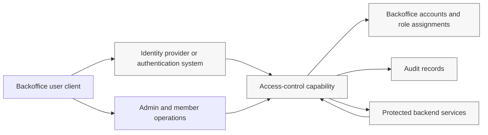

# Threat Model

Status: Review
Phase: Phase 2 - Requirements and Risk Framing
Scope: Risks
Last reviewed: 2026-05-08

## Contents

- [Purpose](#purpose)
- [Scope](#scope)
- [Source Inputs](#source-inputs)
- [Method](#method)
- [Logical System Sketch](#logical-system-sketch)
- [Protected Assets and Security Objectives](#protected-assets-and-security-objectives)
- [Actors and Trust Boundaries](#actors-and-trust-boundaries)
- [External Dependencies](#external-dependencies)
- [Entry Points](#entry-points)
- [Exit Points](#exit-points)
- [Threat Scenarios](#threat-scenarios)
- [Requirement Refinement Candidates](#requirement-refinement-candidates)
- [Review Focus](#review-focus)
- [Assess Your Work](#assess-your-work)
- [References](#references)

## Purpose

This document records the Phase 2 threat model for the internal backoffice access-control study. It is used to review whether the consolidated feature requirements expose the main security risks before candidate evaluation starts ([Project governance](../../PROJECT-GOVERNANCE.md#phase-2---requirements-and-risk-framing), [Feature requirements specification](../../FEATURE-REQUIREMENTS.md#feature-requirements)).

`Status: Review` means the model is complete enough for stakeholder and security review. It does not mean the refinement candidates below are accepted requirements, and it does not select a final product, vendor, architecture, hosting model, token strategy, browser storage model, database, or implementation stack ([Project governance](../../PROJECT-GOVERNANCE.md#phase-2---requirements-and-risk-framing)).

## Scope

The model covers the in-scope study areas from the project brief and the consolidated feature requirements: backoffice account lifecycle, immutable account types, identity-provider authentication boundary, automatic onboarding activation, service-access roles, protected backend service authorization, administrator and super-admin operations, recovery and login reset boundaries, auditability, and already-issued access stop behavior ([README](../../README.md#initial-scope), [Feature requirements specification](../../FEATURE-REQUIREMENTS.md#feature-requirements)).

The model treats the access-control capability as a logical capability, not as a chosen implementation. It may depend on an identity provider or authentication system, protected backend services, audit storage, and a future token or session mechanism, but those choices remain open Phase 2 or later evaluation topics ([README](../../README.md#open-study-questions), [Project governance](../../PROJECT-GOVERNANCE.md#phase-2---requirements-and-risk-framing)).

Out of scope for this threat model:

- public signup, public customer identity, social login, and consumer identity flows ([README](../../README.md#initial-scope), [Feature requirements specification](../../FEATURE-REQUIREMENTS.md#out-of-scope));
- a company-wide IAM replacement ([README](../../README.md#initial-scope), [Feature requirements specification](../../FEATURE-REQUIREMENTS.md#out-of-scope));
- a final vendor, product, architecture, hosting, database, implementation-stack, token-format, session, or browser-storage decision ([Project governance](../../PROJECT-GOVERNANCE.md#phase-2---requirements-and-risk-framing), [Feature requirements specification](../../FEATURE-REQUIREMENTS.md#out-of-scope));
- implementation code, dependencies, generated artifacts, deployment files, or production hardening plans unless the project explicitly moves to a PoC or later implementation phase ([AGENTS](../../AGENTS.md#current-operating-phase), [Project governance](../../PROJECT-GOVERNANCE.md#phase-2---requirements-and-risk-framing)).

## Source Inputs

| Source | How it is used |
| --- | --- |
| Root project brief | Defines the project goal, actor model, initial scope, and open study questions ([README](../../README.md)). |
| Consolidated feature requirements | Provides the current `FR-*` requirement source for account types, lifecycle, identity-provider boundary, service-access roles, protected-service authorization, auditability, onboarding, and out-of-scope boundaries ([Feature requirements specification](../../FEATURE-REQUIREMENTS.md#feature-requirements)). |
| Feature requirements review trail | Provides user-validated requirement decisions and review history for the current `FR-*` list ([Feature requirements review](../requirements/feature-requirements-review.md)). |
| Project governance | Defines Phase 2 boundaries and evidence rules for risk and requirement artifacts ([Project governance](../../PROJECT-GOVERNANCE.md#evidence-standard), [Project governance](../../PROJECT-GOVERNANCE.md#phase-2---requirements-and-risk-framing)). |
| OWASP threat modeling guidance | Structures scoping, entry points, exit points, assets, threat identification, mitigation, and review ([OWASP Threat Modeling Process](https://owasp.org/www-community/Threat_Modeling_Process), [OWASP Threat Modeling Project](https://owasp.org/www-project-threat-modeling/)). |
| OWASP authorization and API guidance | Supports server-side authorization, fail-closed handling, object-level authorization, function-level authorization, and logging concerns ([OWASP Authorization Cheat Sheet](https://cheatsheetseries.owasp.org/cheatsheets/Authorization_Cheat_Sheet.html), [OWASP API1:2023 Broken Object Level Authorization](https://owasp.org/API-Security/editions/2023/en/0xa1-broken-object-level-authorization/), [OWASP API5:2023 Broken Function Level Authorization](https://owasp.org/API-Security/editions/2023/en/0xa5-broken-function-level-authorization/)). |
| OpenID Connect and authentication guidance | Supports the authenticated-subject, verified-email, ID token, UserInfo, and privileged-authentication review topics without choosing a final IdP ([OpenID Connect Core 1.0](https://openid.net/specs/openid-connect-core-1_0.html), [OWASP Authentication Cheat Sheet](https://cheatsheetseries.owasp.org/cheatsheets/Authentication_Cheat_Sheet.html), [NIST SP 800-63B](https://pages.nist.gov/800-63-4/sp800-63b.html)). |
| OAuth bearer-token guidance | Supports the risk that bearer access evidence must be protected because possession can be sufficient for resource access ([RFC 6750](https://www.rfc-editor.org/rfc/rfc6750)). |
| Conceptual wiki | Provides supporting background for token lifecycle, authorization, sessions, auditability, IAM architecture, and policy components; project-specific conclusions stay in this risk artifact, not the wiki ([Token lifecycle](../wiki/12-token-lifecycle.md), [Web sessions, cookies, and BFF pattern](../wiki/24-web-sessions-cookies-and-bff.md), [Security best practices](../wiki/09-security-best-practices.md), [Auditability and operational ownership](../wiki/10-auditability-access-reviews-operational-ownership.md)). |

## Method

This document follows the OWASP four-step threat-modeling process: scope the work, determine threats, determine countermeasures and mitigation, and assess the work ([OWASP Threat Modeling Process](https://owasp.org/www-community/Threat_Modeling_Process)).

| OWASP process step | How this document applies it |
| --- | --- |
| Step 1: Scope your work | Defines Phase 2 scope, logical data flows, protected assets, actors, trust boundaries, external dependencies, entry points, and exit points. |
| Step 2: Determine threats | Records concrete threat scenarios against account lifecycle, identity linking, role assignment, protected-service authorization, access evidence, privileged operations, and auditability. |
| Step 3: Determine countermeasures and mitigation | Converts mitigations into requirement refinement candidates and review questions rather than implementation decisions. |
| Step 4: Assess your work | Checks traceability, citation coverage, Phase 2 boundaries, and readiness for stakeholder/security review. |

Severity labels are intentionally qualitative. They indicate review priority for Phase 2 requirements work, not a production risk score. Production scoring should wait until candidate architecture, token/session behavior, deployment, operational ownership, and protected-service inventory are known ([Project governance](../../PROJECT-GOVERNANCE.md#phase-2---requirements-and-risk-framing)).

## Logical System Sketch

This is a logical sketch for threat-model scoping. It is not a selected architecture.

The key trust changes are: browser/client requests crossing into server-side access-control checks, identity-provider claims crossing into the backoffice account model, administrative operations changing account or role state, protected services relying on authorization decisions, and audit reads or exports exposing accountability records ([Feature requirements specification](../../FEATURE-REQUIREMENTS.md#feature-requirements), [OWASP Threat Modeling Process](https://owasp.org/www-community/Threat_Modeling_Process)).

## Protected Assets and Security Objectives

| ID | Protected asset | Security objective | Source |
| --- | --- | --- | --- |
| PA-001 | Backoffice account records and stable internal identifiers | Keep account identity stable even when mutable profile attributes such as email, organization, or name change; lifecycle state, role assignments, access decisions, and audit records must reference the stable account identifier. | `FR-009`, `FR-040` ([Feature requirements specification](../../FEATURE-REQUIREMENTS.md#feature-requirements)) |
| PA-002 | Account type and responsibility separation | Preserve the fixed account-type model: `super-admin`, `admin`, and `member`; prevent account-type mutation, merging, elevation, or service-access roles granting account-management responsibility. | `FR-001`, `FR-002`, `FR-004`, `FR-026` ([Feature requirements specification](../../FEATURE-REQUIREMENTS.md#feature-requirements)) |
| PA-003 | Authenticated-subject link | Ensure each access attempt resolves to exactly one linked backoffice account, and keep authenticated-subject links immutable after automatic onboarding activation. OIDC subject and UserInfo handling need careful validation because OpenID Connect uses a `sub` subject claim and warns that UserInfo subject values must match the ID token subject before use ([OpenID Connect Core 1.0](https://openid.net/specs/openid-connect-core-1_0.html)). | `FR-010`, `FR-036`, `FR-039`, `FR-043`, `FR-044` ([Feature requirements specification](../../FEATURE-REQUIREMENTS.md#feature-requirements)) |
| PA-004 | Lifecycle state | Ensure only `active` accounts obtain protected backend service access, and ensure already-issued access can stop after disablement, archival, member role removal, or service-access-role disablement or archival. | `FR-011` through `FR-016`, `FR-031`, `FR-032` ([Feature requirements specification](../../FEATURE-REQUIREMENTS.md#feature-requirements)) |
| PA-005 | Service-access role catalog and assignments | Ensure role definitions are super-admin controlled, member role assignments are authorized, inactive roles are not assigned or used, and roles do not become hidden account-management privileges. | `FR-002`, `FR-003`, `FR-004`, `FR-005`, `FR-022`, `FR-032`, `FR-033` ([Feature requirements specification](../../FEATURE-REQUIREMENTS.md#feature-requirements)) |
| PA-006 | Protected backend service access decisions | Require server-side authorization based on active account state and account type or member service-access role rules; fail closed when the result cannot be determined safely. OWASP recommends server-side authorization checks and safe handling of authorization failures ([OWASP Authorization Cheat Sheet](https://cheatsheetseries.owasp.org/cheatsheets/Authorization_Cheat_Sheet.html)). | `FR-020`, `FR-021`, `FR-036`, `FR-038` ([Feature requirements specification](../../FEATURE-REQUIREMENTS.md#feature-requirements)) |
| PA-007 | Access evidence, sessions, and tokens | Protect whatever future access evidence is used because bearer-style tokens can be used by any party that possesses them unless additional proof or validation is required ([RFC 6750](https://www.rfc-editor.org/rfc/rfc6750)). | `FR-016`, `FR-020`, `FR-021`, `FR-029` ([Feature requirements specification](../../FEATURE-REQUIREMENTS.md#feature-requirements)) |
| PA-008 | Audit records | Preserve complete, attributable, append-only audit records for security-relevant events, and restrict audit consultation to super-admins while logging audit reads and exports. OWASP treats logging as an important detective control for access-control failures and investigations ([OWASP Authorization Cheat Sheet](https://cheatsheetseries.owasp.org/cheatsheets/Authorization_Cheat_Sheet.html)). | `FR-027`, `FR-028`, `FR-035` ([Feature requirements specification](../../FEATURE-REQUIREMENTS.md#feature-requirements)) |
| PA-009 | Onboarding activation path | Prevent automatic onboarding from becoming account takeover: activation requires exactly one invited account, no existing subject link, verified matching email, and privileged-authentication evidence for invited admin or super-admin accounts in production. OIDC defines `email_verified` as true only when the provider took affirmative steps to verify email control ([OpenID Connect Core 1.0](https://openid.net/specs/openid-connect-core-1_0.html)). | `FR-012`, `FR-039`, `FR-040`, `FR-041`, `FR-042`, `FR-043`, `FR-044` ([Feature requirements specification](../../FEATURE-REQUIREMENTS.md#feature-requirements)) |
| PA-010 | Recovery and login reset boundaries | Keep recovery and login reset as own-account responsibilities only, and prevent cross-account reset by admins or super-admins. Production privileged accounts require MFA or phishing-resistant passwordless authentication, with exact mechanisms deferred. NIST SP 800-63B describes higher assurance levels and phishing-resistant options for stronger authentication ([NIST SP 800-63B](https://pages.nist.gov/800-63-4/sp800-63b.html)). | `FR-025`, `FR-027`, `FR-034` ([Feature requirements specification](../../FEATURE-REQUIREMENTS.md#feature-requirements)) |
| PA-011 | Operational evidence and support artifacts | Ensure future backups, restores, support exports, upgrades, and operational shortcuts do not bypass access-control state, audit integrity, or retained account history. This remains an evaluation concern because no final operational model has been selected. | `FR-014`, `FR-029`, `FR-030`, `FR-035` ([Feature requirements specification](../../FEATURE-REQUIREMENTS.md#feature-requirements), [Project governance](../../PROJECT-GOVERNANCE.md#phase-2---requirements-and-risk-framing)) |

## Actors and Trust Boundaries

### Actors and System Participants

| Actor or participant | Role in the threat model | Source |
| --- | --- | --- |
| Member | Internal company user who can view their own profile read-only and access protected backend services only when active and authorized by assigned service-access roles. | `FR-005`, `FR-019`, `FR-020`, `FR-021` ([Feature requirements specification](../../FEATURE-REQUIREMENTS.md#feature-requirements)) |
| Admin | Privileged operator who manages member accounts, assigns and removes service-access roles for members, and automatically receives covered protected-service access while active; admins cannot manage admin or super-admin accounts, manage the role catalog, consult audit records, or reset another account. | `FR-003`, `FR-017`, `FR-025`, `FR-028`, `FR-032`, `FR-033` ([Feature requirements specification](../../FEATURE-REQUIREMENTS.md#feature-requirements)) |
| Super-admin | High-level administration superset of admin with inherited admin capabilities plus admin-account management, service-access-role catalog management, and audit consultation. | `FR-004`, `FR-018`, `FR-028`, `FR-032`, `FR-033` ([Feature requirements specification](../../FEATURE-REQUIREMENTS.md#feature-requirements)) |
| Identity provider or authentication system | Authenticates backoffice users, manages invitation delivery and authentication for invited accounts, and provides the stable authenticated subject and verified email evidence consumed by the access-control capability. | `FR-010`, `FR-036`, `FR-042`, `FR-043`, `FR-044` ([Feature requirements specification](../../FEATURE-REQUIREMENTS.md#feature-requirements), [OpenID Connect Core 1.0](https://openid.net/specs/openid-connect-core-1_0.html)) |
| Access-control capability | Logical capability that owns backoffice account state, account-type rules, lifecycle state, service-access role assignments, protected-service authorization checks, and audit-supporting operations. | `FR-024`, `FR-033` ([Feature requirements specification](../../FEATURE-REQUIREMENTS.md#feature-requirements)) |
| Protected backend service | Company-controlled service that must grant or deny access server-side based on active account state and account type or member role assignment rules. | `FR-020`, `FR-021`, `FR-022` ([Feature requirements specification](../../FEATURE-REQUIREMENTS.md#feature-requirements)) |
| Audit reader | Super-admin activity that consults or exports audit records; the read/export action is itself security-relevant and audited. | `FR-027`, `FR-028`, `FR-035` ([Feature requirements specification](../../FEATURE-REQUIREMENTS.md#feature-requirements)) |
| Candidate operator or support actor | Future operational participant who may back up, restore, support, upgrade, or inspect the selected system; this actor is not yet fully specified and must be reviewed during candidate evaluation. | `FR-029`, `FR-030`, `FR-035` ([Feature requirements specification](../../FEATURE-REQUIREMENTS.md#feature-requirements), [Project governance](../../PROJECT-GOVERNANCE.md#phase-2---requirements-and-risk-framing)) |

### Trust Boundaries

| ID | Trust boundary | Why it matters | Source |
| --- | --- | --- | --- |
| TB-001 | User client to access-control capability | Requests from an internal UI or browser cannot be trusted as authorization proof. Administrative authorization must be enforced server-side, not through front-end-only checks. | `FR-020`, `FR-021`, `FR-033` ([Feature requirements specification](../../FEATURE-REQUIREMENTS.md#feature-requirements), [OWASP Authorization Cheat Sheet](https://cheatsheetseries.owasp.org/cheatsheets/Authorization_Cheat_Sheet.html)) |
| TB-002 | Identity provider to access-control capability | Authentication evidence must be resolved to exactly one linked backoffice account and must not let IdP claims, groups, or roles override backoffice authorization state. | `FR-036`, `FR-037`, `FR-038`, `FR-043`, `FR-044` ([Feature requirements specification](../../FEATURE-REQUIREMENTS.md#feature-requirements), [OpenID Connect Core 1.0](https://openid.net/specs/openid-connect-core-1_0.html)) |
| TB-003 | Admin interface to privileged operations | Admin and super-admin operations can change account state, role assignments, role catalog state, or audit visibility; broken function-level authorization is a known API risk for administrative functions ([OWASP API5:2023 Broken Function Level Authorization](https://owasp.org/API-Security/editions/2023/en/0xa5-broken-function-level-authorization/)). | `FR-017`, `FR-018`, `FR-024`, `FR-026`, `FR-027`, `FR-033` ([Feature requirements specification](../../FEATURE-REQUIREMENTS.md#feature-requirements)) |
| TB-004 | Access-control capability to protected backend services | Protected services need trusted authorization results or trusted validation inputs. If they trust stale, client-provided, or incomplete signals, they can grant unauthorized service access. | `FR-020`, `FR-021`, `FR-022`, `FR-036`, `FR-038` ([Feature requirements specification](../../FEATURE-REQUIREMENTS.md#feature-requirements)) |
| TB-005 | Access-control capability to account and role state | Account state, subject links, lifecycle state, account type, and role assignments are security-critical data. Unauthorized reads or writes can become privilege escalation or account takeover. | `FR-001`, `FR-009`, `FR-011` through `FR-016`, `FR-026`, `FR-032`, `FR-039` ([Feature requirements specification](../../FEATURE-REQUIREMENTS.md#feature-requirements)) |
| TB-006 | Access-control capability to audit storage | Audit writes, reads, and exports need integrity and authorization expectations because audit records support accountability and incident review. | `FR-027`, `FR-028`, `FR-035` ([Feature requirements specification](../../FEATURE-REQUIREMENTS.md#feature-requirements), [OWASP Authorization Cheat Sheet](https://cheatsheetseries.owasp.org/cheatsheets/Authorization_Cheat_Sheet.html)) |
| TB-007 | Session or token mechanism to protected services | The final mechanism is not selected, but any access evidence crossing into a protected service must be validated before authorization is trusted; bearer tokens require protection in storage and transport ([RFC 6750](https://www.rfc-editor.org/rfc/rfc6750)). | `FR-016`, `FR-020`, `FR-021`, `FR-029` ([Feature requirements specification](../../FEATURE-REQUIREMENTS.md#feature-requirements)) |
| TB-008 | Operations and support boundary | Backup, restore, support, export, migration, or upgrade access could bypass application-level checks if not constrained. This remains a candidate-evaluation review topic. | `FR-014`, `FR-029`, `FR-030`, `FR-035` ([Feature requirements specification](../../FEATURE-REQUIREMENTS.md#feature-requirements), [Project governance](../../PROJECT-GOVERNANCE.md#phase-2---requirements-and-risk-framing)) |

## External Dependencies

OWASP threat-model scoping includes external dependencies because dependencies outside the immediate application code can introduce security assumptions and failure modes ([OWASP Threat Modeling Process](https://owasp.org/www-community/Threat_Modeling_Process)). The dependencies below are decision-neutral.

| ID | External dependency | Why it matters | Source |
| --- | --- | --- | --- |
| ED-001 | Identity provider or authentication system | The access-control capability depends on stable authenticated-subject evidence, verified email evidence during onboarding, and privileged-authentication evidence for production admin and super-admin activation. | `FR-010`, `FR-034`, `FR-036`, `FR-042`, `FR-043`, `FR-044` ([Feature requirements specification](../../FEATURE-REQUIREMENTS.md#feature-requirements), [OpenID Connect Core 1.0](https://openid.net/specs/openid-connect-core-1_0.html), [NIST SP 800-63B](https://pages.nist.gov/800-63-4/sp800-63b.html)) |
| ED-002 | Token, session, or access-evidence mechanism | The final mechanism is undecided, but it must support server-side validation, fail-closed access decisions, and access-stop behavior after lifecycle or role changes. | `FR-016`, `FR-020`, `FR-021`, `FR-029` ([Feature requirements specification](../../FEATURE-REQUIREMENTS.md#feature-requirements), [RFC 6750](https://www.rfc-editor.org/rfc/rfc6750)) |
| ED-003 | Protected backend services | Each protected service must apply the same access-control rules consistently; authorization failures in APIs commonly lead to unauthorized function or object access ([OWASP API1:2023 Broken Object Level Authorization](https://owasp.org/API-Security/editions/2023/en/0xa1-broken-object-level-authorization/), [OWASP API5:2023 Broken Function Level Authorization](https://owasp.org/API-Security/editions/2023/en/0xa5-broken-function-level-authorization/)). | `FR-020`, `FR-021`, `FR-022` ([Feature requirements specification](../../FEATURE-REQUIREMENTS.md#feature-requirements)) |
| ED-004 | Audit storage, query, and export mechanism | Audit records must be append-only, retained indefinitely in the initial policy, restricted to super-admin consultation, and able to record reads or exports. | `FR-027`, `FR-028`, `FR-035` ([Feature requirements specification](../../FEATURE-REQUIREMENTS.md#feature-requirements)) |
| ED-005 | Invitation and onboarding delivery path | Invitation delivery and authentication are owned by the IdP or authentication system, while the backoffice must activate only a safely matched invited account. | `FR-040`, `FR-041`, `FR-042`, `FR-043`, `FR-044` ([Feature requirements specification](../../FEATURE-REQUIREMENTS.md#feature-requirements)) |
| ED-006 | Operational backup, restore, support, and upgrade process | Candidate evaluation must verify that operational actions preserve account history, audit integrity, retained records, and access-control semantics. | `FR-014`, `FR-029`, `FR-030`, `FR-035` ([Feature requirements specification](../../FEATURE-REQUIREMENTS.md#feature-requirements), [Project governance](../../PROJECT-GOVERNANCE.md#phase-2---requirements-and-risk-framing)) |
| ED-007 | Future protected-service inventory and service-access-role mapping | Threat likelihood depends on which services are protected and how roles map to them; the current requirements define the model but not the final service inventory. | `FR-022`, `FR-023`, `FR-030` ([Feature requirements specification](../../FEATURE-REQUIREMENTS.md#feature-requirements), [README](../../README.md#open-study-questions)) |

## Entry Points

OWASP uses entry points to identify where a potential attacker or legitimate actor can interact with the system or supply data across a trust boundary ([OWASP Threat Modeling Process](https://owasp.org/www-community/Threat_Modeling_Process)). These are logical entry points, not final routes.

| ID | Entry point | Expected actor or participant | Security relevance | Source |
| --- | --- | --- | --- | --- |
| EP-001 | Authentication result or login callback consumption | Identity provider or authentication system, invited or active backoffice user | Unsafe handling can create an account link, activate an account, or authorize access from the wrong subject. | `FR-010`, `FR-036`, `FR-037`, `FR-039`, `FR-043`, `FR-044` ([Feature requirements specification](../../FEATURE-REQUIREMENTS.md#feature-requirements), [OpenID Connect Core 1.0](https://openid.net/specs/openid-connect-core-1_0.html)) |
| EP-002 | Automatic onboarding activation | Invited member, admin, or super-admin account; identity provider | Can activate and link a backoffice account only under strict match conditions; unsafe matches must fail closed. | `FR-012`, `FR-039`, `FR-040`, `FR-042`, `FR-043`, `FR-044` ([Feature requirements specification](../../FEATURE-REQUIREMENTS.md#feature-requirements)) |
| EP-003 | Member self-profile read | Active member | Must return only the member's own profile and must not become a profile update, role assignment, or account-management path. | `FR-009`, `FR-019` ([Feature requirements specification](../../FEATURE-REQUIREMENTS.md#feature-requirements), [OWASP API1:2023 Broken Object Level Authorization](https://owasp.org/API-Security/editions/2023/en/0xa1-broken-object-level-authorization/)) |
| EP-004 | Admin member-management operations | Admin, super-admin | Can create, read, update, disable, archive, or restore member accounts; authorization scope and audit coverage are required. | `FR-017`, `FR-018`, `FR-027`, `FR-033` ([Feature requirements specification](../../FEATURE-REQUIREMENTS.md#feature-requirements)) |
| EP-005 | Admin account-management operations | Super-admin | Can manage admin accounts where lifecycle policy allows; must not be reachable by admin or member accounts. | `FR-004`, `FR-018`, `FR-026`, `FR-033` ([Feature requirements specification](../../FEATURE-REQUIREMENTS.md#feature-requirements), [OWASP API5:2023 Broken Function Level Authorization](https://owasp.org/API-Security/editions/2023/en/0xa5-broken-function-level-authorization/)) |
| EP-006 | Service-access-role catalog management | Super-admin | Role creation, update, disablement, or archival changes the available service-access model and can become privilege expansion if improperly controlled. | `FR-002`, `FR-022`, `FR-027`, `FR-032`, `FR-033` ([Feature requirements specification](../../FEATURE-REQUIREMENTS.md#feature-requirements)) |
| EP-007 | Member service-access-role assignment or removal | Admin, super-admin | Changes member access to protected backend services; only active roles should be assigned or used, and member access should not become effective until the member is active. | `FR-003`, `FR-004`, `FR-005`, `FR-015`, `FR-041` ([Feature requirements specification](../../FEATURE-REQUIREMENTS.md#feature-requirements)) |
| EP-008 | Protected-service authorization check | Protected backend service | Determines whether the current request should be allowed; must validate server-side and fail closed when the decision cannot be made safely. | `FR-020`, `FR-021`, `FR-022`, `FR-036`, `FR-038` ([Feature requirements specification](../../FEATURE-REQUIREMENTS.md#feature-requirements), [OWASP Authorization Cheat Sheet](https://cheatsheetseries.owasp.org/cheatsheets/Authorization_Cheat_Sheet.html)) |
| EP-009 | Own-account recovery or login reset | Member, admin, super-admin | Can recover access to the actor's own account; must not become a cross-account reset path or bypass privileged-authentication requirements. | `FR-025`, `FR-027`, `FR-034` ([Feature requirements specification](../../FEATURE-REQUIREMENTS.md#feature-requirements), [NIST SP 800-63B](https://pages.nist.gov/800-63-4/sp800-63b.html)) |
| EP-010 | Audit read or export | Super-admin | Exposes sensitive accountability records and must itself be audited. | `FR-027`, `FR-028`, `FR-035` ([Feature requirements specification](../../FEATURE-REQUIREMENTS.md#feature-requirements)) |
| EP-011 | Candidate-specific token, session, refresh, revocation, or introspection endpoint | Token/session mechanism, protected backend service, user client | Any future endpoint that issues, validates, refreshes, revokes, or introspects access evidence is security-critical, especially for bearer access evidence. | `FR-016`, `FR-020`, `FR-021`, `FR-029` ([Feature requirements specification](../../FEATURE-REQUIREMENTS.md#feature-requirements), [RFC 6750](https://www.rfc-editor.org/rfc/rfc6750)) |
| EP-012 | Operational backup, restore, support, export, or upgrade action | Candidate operator or support actor | Can expose or change sensitive state outside normal application authorization paths if not controlled and audited. | `FR-014`, `FR-029`, `FR-030`, `FR-035` ([Feature requirements specification](../../FEATURE-REQUIREMENTS.md#feature-requirements)) |

## Exit Points

OWASP uses exit points to identify where data leaves the modeled component or system; weak exit controls can expose sensitive data, authorization results, error details, tokens, or audit data ([OWASP Threat Modeling Process](https://owasp.org/www-community/Threat_Modeling_Process)).

| ID | Exit point | Data or result leaving the capability | Security relevance | Source |
| --- | --- | --- | --- | --- |
| XP-001 | Authorization decision returned to a protected backend service | Allow or deny result, account identifier, account type or service-access context, denial reason if exposed | Incorrect, stale, or over-detailed results can grant unauthorized access or reveal sensitive authorization internals. | `FR-020`, `FR-021`, `FR-022`, `FR-036` ([Feature requirements specification](../../FEATURE-REQUIREMENTS.md#feature-requirements)) |
| XP-002 | Access token, session artifact, or equivalent access evidence | Bearer token, opaque token, session identifier, cookie, or equivalent future artifact | Possession of bearer access evidence can be sufficient for resource access, so disclosure in browser storage, logs, URLs, traces, or transport is a threat ([RFC 6750](https://www.rfc-editor.org/rfc/rfc6750)). | `FR-016`, `FR-020`, `FR-029` ([Feature requirements specification](../../FEATURE-REQUIREMENTS.md#feature-requirements)) |
| XP-003 | Member profile data shown to a member, admin, or super-admin | Profile fields tied to stable account identifiers | Object-level authorization mistakes can disclose or mutate another account's profile data ([OWASP API1:2023 Broken Object Level Authorization](https://owasp.org/API-Security/editions/2023/en/0xa1-broken-object-level-authorization/)). | `FR-009`, `FR-017`, `FR-018`, `FR-019` ([Feature requirements specification](../../FEATURE-REQUIREMENTS.md#feature-requirements)) |
| XP-004 | Audit event written to audit storage | Actor, target, action, result, timestamp, reason/context, and other schema fields to refine | Missing, mutable, or unattributable audit data weakens investigation, access review, and accountability. | `FR-027`, `FR-035` ([Feature requirements specification](../../FEATURE-REQUIREMENTS.md#feature-requirements), [OWASP Authorization Cheat Sheet](https://cheatsheetseries.owasp.org/cheatsheets/Authorization_Cheat_Sheet.html)) |
| XP-005 | Audit records returned to a super-admin or exported | Audit query results, export files, metadata, filters, and read/export event evidence | Audit records can contain sensitive operational and identity information; audit reads and exports must be controlled and logged. | `FR-027`, `FR-028`, `FR-035` ([Feature requirements specification](../../FEATURE-REQUIREMENTS.md#feature-requirements)) |
| XP-006 | Recovery or login-reset result | Reset confirmation, changed login state, recovery decision record, or failure outcome | Reset outcomes must preserve accountability and must not expose clues that allow account enumeration or bypass. | `FR-025`, `FR-027`, `FR-034` ([Feature requirements specification](../../FEATURE-REQUIREMENTS.md#feature-requirements), [OWASP Authentication Cheat Sheet](https://cheatsheetseries.owasp.org/cheatsheets/Authentication_Cheat_Sheet.html)) |
| XP-007 | Onboarding activation result | Account activation outcome, subject-link creation result, failure reason, or administrative-intervention signal | Unsafe or over-detailed activation responses can leak whether an invited account exists or help attackers tune takeover attempts. | `FR-039`, `FR-043`, `FR-044` ([Feature requirements specification](../../FEATURE-REQUIREMENTS.md#feature-requirements)) |
| XP-008 | Operational backup, restore, support, or upgrade artifact | Backup file, restore output, support package, migration log, diagnostic export | Operational artifacts can expose retained account data, role assignments, subject links, or audit records outside normal access controls. | `FR-014`, `FR-029`, `FR-030`, `FR-035` ([Feature requirements specification](../../FEATURE-REQUIREMENTS.md#feature-requirements)) |

## Threat Scenarios

| ID | Review priority | Threat | What can go wrong | Existing coverage | Review focus |
| --- | --- | --- | --- | --- | --- |
| TS-001 | High | Account-type mutation or self-elevation | An actor changes a fixed account type, converts a `member` into an `admin`, gives themselves super-admin capability, or creates an equivalent path through role definitions. | `FR-001`, `FR-002`, `FR-004`, `FR-026`, and `FR-033` require immutable account types, separation from service-access roles, super-admin inheritance rules, escalation prevention, and server-side admin authorization ([Feature requirements specification](../../FEATURE-REQUIREMENTS.md#feature-requirements)). | Confirm review accepts that account-type mutation is never a recovery, support, onboarding, or migration operation. |
| TS-002 | High | Broken function-level authorization on admin or super-admin operations | A member or admin reaches privileged endpoints by URL guessing, HTTP method changes, UI bypass, or misconfigured route authorization; administrative functions are a known target for function-level authorization flaws ([OWASP API5:2023 Broken Function Level Authorization](https://owasp.org/API-Security/editions/2023/en/0xa5-broken-function-level-authorization/)). | `FR-017`, `FR-018`, `FR-024`, `FR-026`, `FR-027`, `FR-028`, `FR-032`, and `FR-033` define management scope, audit coverage, audit access, role catalog ownership, and server-side authorization ([Feature requirements specification](../../FEATURE-REQUIREMENTS.md#feature-requirements)). | Define later acceptance tests for admin/super-admin operation authorization and denied-path audit evidence. |
| TS-003 | High | Broken object-level authorization on account or profile data | A user manipulates account IDs, email values, route parameters, filters, or request payloads to view or update another account's profile or state; OWASP identifies object-level authorization checks as required for endpoints using object IDs from clients ([OWASP API1:2023 Broken Object Level Authorization](https://owasp.org/API-Security/editions/2023/en/0xa1-broken-object-level-authorization/)). | `FR-009`, `FR-017`, `FR-018`, `FR-019`, and `FR-033` require stable identifiers, scoped admin management, member self-profile read-only access, and server-side admin authorization ([Feature requirements specification](../../FEATURE-REQUIREMENTS.md#feature-requirements)). | Add review attention to object-level checks for member self-read, admin member-management filters, and super-admin admin-management filters. |
| TS-004 | High | Service-access-role catalog or assignment abuse | A role is created, updated, disabled, archived, assigned, or removed by the wrong actor; a disabled role remains assignable; a role grants management responsibility; or roles are assigned to privileged account types instead of members. | `FR-002`, `FR-003`, `FR-004`, `FR-005`, `FR-022`, `FR-027`, `FR-032`, and `FR-033` separate service roles from account types, limit assignment, require active roles for access use, and audit role lifecycle and assignment events ([Feature requirements specification](../../FEATURE-REQUIREMENTS.md#feature-requirements)). | Confirm review wants service-access roles to remain service-scope only, not permission bundles for account management. |
| TS-005 | High | Access continues after lifecycle or role change | A disabled, archived, or de-authorized account keeps using already-issued access evidence; a disabled or archived role remains effective in existing access. | `FR-015`, `FR-016`, `FR-020`, `FR-021`, and `FR-032` require active accounts, access-stop capability, server-side protected-service authorization, fail-closed denial, and active roles for access decisions ([Feature requirements specification](../../FEATURE-REQUIREMENTS.md#feature-requirements)). | Define acceptable revocation or staleness delay during later architecture evaluation; do not hide it as an implementation detail. |
| TS-006 | High | Protected service trusts the wrong signal | A protected service grants access from front-end state, unvalidated token claims, stale embedded roles, IdP groups, mutable email, or incomplete authorization checks. OWASP says client-side checks must not be decisive for access decisions ([OWASP Authorization Cheat Sheet](https://cheatsheetseries.owasp.org/cheatsheets/Authorization_Cheat_Sheet.html)). | `FR-020`, `FR-021`, `FR-036`, `FR-037`, and `FR-038` require server-side authorization, fail-closed denial, exact account resolution, no implicit IdP authorization, and no IdP claim override ([Feature requirements specification](../../FEATURE-REQUIREMENTS.md#feature-requirements)). | Define the minimum protected-service integration contract before candidate evaluation: trusted source, account state, service coverage, failure behavior, and stale-data tolerance. |
| TS-007 | High | Automatic onboarding account takeover | An attacker with access to an email, duplicate invited records, mismatched subject data, or ambiguous IdP claims activates and links the wrong backoffice account. | `FR-012`, `FR-039`, `FR-040`, `FR-042`, `FR-043`, and `FR-044` require invited-state onboarding, immutable subject link creation only through automatic activation, exactly one invited account, no existing link, verified matching email, privileged-authentication evidence for privileged accounts, and fail-closed unsafe matches ([Feature requirements specification](../../FEATURE-REQUIREMENTS.md#feature-requirements)). | Review exact onboarding failure messages, duplicate-email handling, verified-email trust assumptions, and administrative intervention workflow. |
| TS-008 | High | IdP claim, group, or role override | A claim from the IdP is treated as an account type, service-access role, lifecycle state, or audit bypass signal, so external identity data silently replaces backoffice authorization state. | `FR-036`, `FR-037`, and `FR-038` require exact linked-account resolution, state that authentication alone does not create or authorize access, and forbid IdP claims/groups/roles from overriding the backoffice model ([Feature requirements specification](../../FEATURE-REQUIREMENTS.md#feature-requirements)). | Make candidate evaluation verify how each option maps IdP claims into local account state without granting authority to the claim source. |
| TS-009 | High | Weak privileged authentication or recovery abuse | A compromised password, weak MFA fallback, recovery path, or login-reset flow allows takeover of an admin or super-admin account; higher assurance authentication reduces attack feasibility, and NIST SP 800-63B defines AAL2/AAL3 and phishing-resistant options ([NIST SP 800-63B](https://pages.nist.gov/800-63-4/sp800-63b.html)). | `FR-025`, `FR-027`, and `FR-034` require own-account recovery/reset, audit coverage, and production MFA or phishing-resistant passwordless authentication for admins and super-admins ([Feature requirements specification](../../FEATURE-REQUIREMENTS.md#feature-requirements)). | Define privileged-authentication evidence for onboarding and whether sensitive admin operations require recent authentication or step-up. |
| TS-010 | High | Token or session artifact leakage and replay | Bearer access evidence leaks through browser storage, logs, support exports, URLs, traces, or proxy headers and is replayed against a protected backend service. RFC 6750 notes that possession of a bearer token can be enough to access protected resources unless it is protected and validated ([RFC 6750](https://www.rfc-editor.org/rfc/rfc6750)). | `FR-016`, `FR-020`, `FR-021`, and `FR-029` require access-stop capability, server-side authorization, fail-closed behavior, and a production-grade security posture ([Feature requirements specification](../../FEATURE-REQUIREMENTS.md#feature-requirements)). | During architecture evaluation, compare token/session storage, refresh, revocation, introspection, logging redaction, and browser exposure behavior. |
| TS-011 | Medium | Audit gap, audit tampering, or overexposed audit access | Privileged changes, denied access, onboarding failures, subject-link attempts, recovery/reset events, or audit reads are missing, mutable, not attributable, or visible to admins/members. | `FR-027`, `FR-028`, and `FR-035` require broad audit coverage, super-admin-only audit consultation, logging of audit reads/exports, append-only records, and indefinite initial retention ([Feature requirements specification](../../FEATURE-REQUIREMENTS.md#feature-requirements)). | Define minimum audit event schema, integrity controls, export handling, review ownership, and privacy constraints before production-readiness review. |
| TS-012 | Medium | Unsafe failure mode during dependency outage | If the IdP, access-control lookup, protected-service integration, audit sink, token introspection, or session store is unavailable, a service might fail open, skip audit writes, or accept stale state beyond the intended tolerance. | `FR-021`, `FR-029`, and `FR-030` require fail-closed protected-service behavior, production-grade posture, and justified operational complexity ([Feature requirements specification](../../FEATURE-REQUIREMENTS.md#feature-requirements)). | Candidate evaluation should document fail-open/fail-closed behavior for authentication, authorization lookup, audit write failure, and token/session validation. |
| TS-013 | Medium | Operational backup, restore, support, or migration bypass | Backup files, restore operations, support exports, migration scripts, or upgrade procedures expose or mutate account state, subject links, roles, or audit records outside normal authorization and audit paths. | `FR-014`, `FR-029`, `FR-030`, and `FR-035` require retained account records, production-grade posture, operability, and append-only audit retention ([Feature requirements specification](../../FEATURE-REQUIREMENTS.md#feature-requirements)). | Add candidate-evaluation criteria for backup encryption/access, restore testing, support export minimization, and audit preservation. |
| TS-014 | Medium | Overly broad service-access model grows silently | The minimal consultation-style member access expands into stronger operations without explicit protected-service need, review, or audit coverage. | `FR-022`, `FR-023`, `FR-027`, and `FR-030` require explicit service-access-role coverage, consultation-style minimal member access, audit coverage, and justified complexity ([Feature requirements specification](../../FEATURE-REQUIREMENTS.md#feature-requirements)). | Review future permission additions as requirement changes tied to real protected-service needs, not as role-name edits only. |

## Requirement Refinement Candidates

These candidates are not accepted requirements. They are review outputs from the threat model and should either be promoted into `FEATURE-REQUIREMENTS.md`, converted into candidate-evaluation criteria, recorded as open questions, or rejected with rationale.

| ID | Source threats | Candidate refinement | Proposed disposition |
| --- | --- | --- | --- |
| RC-001 | `TS-001`, `TS-002`, `TS-004` | Define explicit negative requirements for account-type mutation, self-grant, role-catalog misuse, privileged-role assignment targets, and admin/super-admin operation scoping. | Review for promotion if current `FR-001`, `FR-002`, `FR-026`, and `FR-033` are judged too implicit. |
| RC-002 | `TS-003`, `TS-006` | Add object-level and function-level authorization acceptance criteria for member self-read, admin member management, super-admin admin management, role assignment, role catalog management, and audit consultation. | Likely candidate-evaluation or test-planning criteria; may not need new feature requirements. |
| RC-003 | `TS-005`, `TS-010`, `TS-012` | Define acceptable access-stop delay after account disablement, archival, member service-access-role removal, and service-access-role disablement or archival. Include token/session/cache/introspection failure behavior. | Keep as Phase 2 architecture/evaluation input until a token/session approach is selected. |
| RC-004 | `TS-006`, `TS-008` | Define the protected-service authorization contract: trusted source, active account state, account type inheritance, member role assignment, role active state, issuer or source validation, cache tolerance, and fail-closed behavior. | Strong candidate for evaluation criteria before Phase 3/4 candidate comparison. |
| RC-005 | `TS-007`, `TS-009` | Define onboarding review rules for duplicate invited accounts, verified-email trust assumptions, privileged-authentication evidence, safe failure responses, and administrative intervention. | Review for promotion if `FR-043` and `FR-044` need more testable detail. |
| RC-006 | `TS-009` | Define privileged-operation freshness expectations: whether admin account creation, admin disablement, role-catalog changes, audit export, or recovery/reset requires recent authentication or step-up. | Open security question; do not promote without stakeholder/security validation. |
| RC-007 | `TS-010` | Add candidate-evaluation criteria for browser/session/token storage, refresh-token handling, token redaction, revocation, introspection, logout, key rotation, and already-issued access behavior. | Candidate-evaluation input; avoid choosing a final architecture in this document. |
| RC-008 | `TS-011` | Define minimum audit event schema: actor stable ID, target stable ID, action, result, timestamp, source context, authorization decision context, correlation ID, and before/after metadata where appropriate. | Review for promotion or separate audit requirements refinement. |
| RC-009 | `TS-011`, `TS-013` | Define audit integrity and operational access expectations for append-only retention, export handling, support access, backup/restore, and restore testing. | Candidate-evaluation and production-readiness input. |
| RC-010 | `TS-014` | Define a change-control rule for expanding member service access beyond consultation-style access: real protected-service need, explicit role coverage, audit coverage, and review before adoption. | Review for promotion if future protected-service permission growth is likely soon. |

## Review Focus

The document is ready for review around these questions:

| Review question | Why it matters | Current status |
| --- | --- | --- |
| Are the main Phase 2 assets complete? | Missing protected assets become blind spots in candidate evaluation. | Ready for review |
| Are onboarding and authenticated-subject-link risks captured correctly? | `FR-039` through `FR-044` now make onboarding a critical account-takeover boundary. | Ready for review |
| Is access-stop behavior specific enough for evaluation? | Candidate comparison needs a measurable revocation or staleness expectation, but Phase 2 has not selected a token/session model. | Open for review |
| Should object/function-level authorization become explicit acceptance criteria? | The current requirements require server-side authorization, but later tests may need explicit endpoint/object coverage. | Open for review |
| Is privileged-authentication evidence sufficient for admin/super-admin onboarding? | `FR-034` requires MFA or phishing-resistant passwordless authentication, but exact proof and step-up rules are deferred. | Open for review |
| Is the audit model specific enough? | Audit coverage is broad, but schema, integrity controls, export handling, and review ownership still need refinement. | Open for review |
| Do operational artifacts need stronger Phase 2 requirements? | Backups, restores, support exports, and upgrades may bypass normal paths if ignored until implementation. | Open for candidate evaluation |

## Assess Your Work

This section checks whether the threat model is fit for Phase 2 review. It is not a production security sign-off and does not replace later candidate evaluation, PoC validation, or implementation review ([OWASP Threat Modeling Process](https://owasp.org/www-community/Threat_Modeling_Process), [Project governance](../../PROJECT-GOVERNANCE.md#phase-2---requirements-and-risk-framing)).

| Review check | Assessment | Result |
| --- | --- | --- |
| Scope is clear | The scope is tied to the project brief, the consolidated `FR-*` feature requirements, and Phase 2 boundaries. | Pass |
| Source inputs are explicit | The model identifies project sources, review history, OWASP guidance, OIDC, NIST authentication guidance, OAuth bearer-token guidance, and conceptual wiki support. | Pass |
| Protected assets are identified | The model covers account identity, account type, subject link, lifecycle state, service-access roles, protected-service decisions, access evidence, audit records, onboarding, recovery/reset, and operations. | Pass |
| Actors and trust boundaries are identified | The model identifies legitimate actors, logical participants, and trust boundaries where authorization or evidence can be lost or misapplied. | Pass |
| External dependencies, entry points, and exit points are identified | The model records decision-neutral dependencies and logical interaction points without selecting final routes, token formats, products, or implementation details. | Pass |
| Threat scenarios are concrete | The scenario set covers escalation, function/object authorization failures, role misuse, stale access, wrong-signal trust, onboarding takeover, IdP claim override, privileged auth, bearer replay, audit gaps, unsafe failure modes, operations, and permission growth. | Pass |
| Mitigations are linked to requirements work | Refinements are recorded as review candidates rather than silently changing the consolidated feature requirements. | Pass |
| Citation rules are followed | Material project claims cite project sources; security, protocol, authentication, token, and OWASP claims cite primary or official sources near the relevant content. | Pass |
| Phase 2 boundaries are preserved | The model does not choose a vendor, product, architecture, token/session format, browser storage model, implementation stack, or production design. | Pass |
| Ready for stakeholder/security review | The model is complete enough to review, with open questions clearly marked for requirement refinement or candidate evaluation. | Ready for review |

## References

- [README - Project brief and initial scope](../../README.md)
- [README - Open Study Questions](../../README.md#open-study-questions)
- [Feature Requirements Specification](../../FEATURE-REQUIREMENTS.md)
- [Feature Requirements Review](../requirements/feature-requirements-review.md)
- [Project Governance - Evidence Standard](../../PROJECT-GOVERNANCE.md#evidence-standard)
- [Project Governance - Phase 2](../../PROJECT-GOVERNANCE.md#phase-2---requirements-and-risk-framing)
- [AGENTS - Current Operating Phase](../../AGENTS.md#current-operating-phase)
- [OWASP Threat Modeling Project](https://owasp.org/www-project-threat-modeling/)
- [OWASP Threat Modeling Process](https://owasp.org/www-community/Threat_Modeling_Process)
- [OWASP Authorization Cheat Sheet](https://cheatsheetseries.owasp.org/cheatsheets/Authorization_Cheat_Sheet.html)
- [OWASP Authentication Cheat Sheet](https://cheatsheetseries.owasp.org/cheatsheets/Authentication_Cheat_Sheet.html)
- [OWASP API1:2023 Broken Object Level Authorization](https://owasp.org/API-Security/editions/2023/en/0xa1-broken-object-level-authorization/)
- [OWASP API5:2023 Broken Function Level Authorization](https://owasp.org/API-Security/editions/2023/en/0xa5-broken-function-level-authorization/)
- [OpenID Connect Core 1.0](https://openid.net/specs/openid-connect-core-1_0.html)
- [NIST SP 800-63B - Authentication and Authenticator Management](https://pages.nist.gov/800-63-4/sp800-63b.html)
- [RFC 6750 - OAuth 2.0 Bearer Token Usage](https://www.rfc-editor.org/rfc/rfc6750)
- [Token Lifecycle](../wiki/12-token-lifecycle.md)
- [Web Sessions, Cookies, and BFF Pattern](../wiki/24-web-sessions-cookies-and-bff.md)
- [Security Best Practices](../wiki/09-security-best-practices.md)
- [Auditability, Access Reviews, and Operational Ownership](../wiki/10-auditability-access-reviews-operational-ownership.md)
