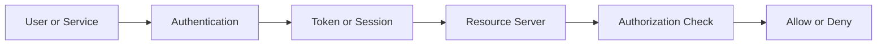

# Authentication vs Authorization

## What it is

Authentication verifies who a user, service, or application is. Authorization decides what an authenticated subject may access.

In this study, a **member** is a company-managed user account, a **user** is the human actor using the system, and an **administrator** is a privileged user who manages IAM data. A user may authenticate successfully as a member and still be unauthorized to perform an operation such as `members:delete` or `billing:write`.

The distinction matters because authentication usually answers "is this subject genuine?", while authorization answers "is this subject allowed to perform this action on this resource right now?" Those questions are related, but they are not interchangeable.

## Why it matters

An internal backoffice system can have sensitive administrative capabilities even when it has fewer than 1,000 users. A successful login cannot be treated as blanket access. Support staff, managers, billing operators, auditors, service clients, and IAM administrators may all authenticate to the same environment while needing different access.

The important design pressure is conceptual: authentication data, identity claims, roles, permissions, API enforcement, and administrative operations need clear boundaries. Architecture choices can vary, but the system still needs a reliable way to authenticate subjects and then authorize each protected operation.

## How it works

Authentication commonly includes credentials or proof of possession, such as passwords, multifactor authenticators, client secrets, private keys, or mutual TLS certificates. For human backoffice users, the identity provider or authorization server typically handles the login ceremony and produces identity information. For services, the authorization server may authenticate an OAuth2 client at the token endpoint.

Authorization commonly uses roles, permissions, scopes, token claims, policy configuration, or authorization lookups. In the backoffice study, RBAC is required: members can be assigned roles such as `admin`, `support`, `manager`, or `viewer`, and those roles can map to granular permissions such as `members:read` or `members:disable`.

The resource server is the API or backend service receiving a request. It should validate the access token and enforce the required permission server-side. The UI can hide buttons for usability, but it cannot be the only authorization boundary.

For OAuth2 and OIDC terminology, see [OAuth2](./02-oauth2.md) and [OpenID Connect](./03-openid-connect.md). For the role and permission model, see [RBAC](./05-rbac.md).

## Example

Alice is a company member. She opens the backoffice UI and signs in. The identity provider authenticates Alice and the client receives tokens through an OAuth2/OIDC flow.

Alice then calls `GET /members`. The members API validates the access token: issuer, audience, signature or introspection result, expiration, and relevant claims. After token validation, the API checks whether Alice has `members:read`, either directly from trusted authorization data or from a trusted token claim whose meaning is defined by the authorization server.

Later, Alice calls `DELETE /members/123`. The API may require `members:delete`. If Alice has only the `support` role with `members:read`, the API denies the operation even though Alice is authenticated.

The same pattern applies to service clients. A backend job may authenticate as a client and receive a token. That token proves the service client authenticated, but each target service still needs to check whether the client has the required service permission.

## Common mistakes

Treating login as access is the classic error. "Alice is logged in" does not mean "Alice can administer IAM."

Treating role names as proof without validation is also risky. A role claim is only useful after the token has been validated and the issuer, audience, signature, expiration, and token semantics are trusted.

Confusing OAuth2 and OIDC causes design mistakes. OAuth2 is an authorization framework. OpenID Connect adds an identity layer on top of OAuth2. If an API accepts an ID token as if it were an access token, the API may be trusting a token intended for a client rather than for the API.

Relying on frontend-only checks gives users a nicer interface but does not protect APIs. Any protected API operation needs server-side authorization.

Mixing human and service access can create excessive privileges. A service account should not inherit broad administrator powers just because it runs in a trusted network.

## References

- [NIST SP 800-63-4 - Digital Identity Guidelines](https://pages.nist.gov/800-63-4/)
- [OWASP Authentication Cheat Sheet](https://cheatsheetseries.owasp.org/cheatsheets/Authentication_Cheat_Sheet.html)
- [OWASP Authorization Cheat Sheet](https://cheatsheetseries.owasp.org/cheatsheets/Authorization_Cheat_Sheet.html)
- [RFC 6749 - The OAuth 2.0 Authorization Framework](https://www.rfc-editor.org/rfc/rfc6749)
- [OpenID Connect Core 1.0](https://openid.net/specs/openid-connect-core-1_0.html)
