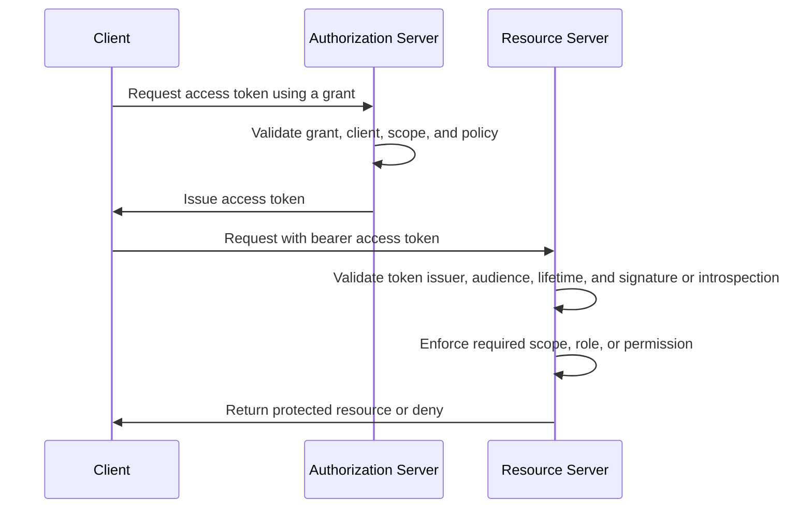

# OAuth2

## What it is

OAuth2 is an authorization framework for delegated access to HTTP APIs. It defines how a client obtains an access token from an authorization server and presents that token to a resource server. The token represents an authorization grant; it is not the user's password and it is not, by itself, a login proof.

OAuth2 can be used in two broad shapes:

| Shape | Practical meaning |
| --- | --- |
| User-delegated access | A client acts with authorization connected to a human resource owner, such as a company member using the backoffice. |
| Client access | A client acts on its own behalf, such as a backend service or scheduled job. |

OAuth2 does not standardize user login, user profile claims, or ID tokens. OpenID Connect adds that identity layer on top of OAuth2. See [OpenID Connect](./03-openid-connect.md) for login, ID tokens, UserInfo, and OIDC discovery.

## Learning goals

After reading this page, an engineer should be able to explain:

- the four OAuth2 roles and how they map to the selected backoffice architecture;
- why OAuth2 access tokens are API credentials, not user sessions or ID tokens;
- how grants, scopes, audiences, claims, roles, and permissions fit together;
- why resource servers must validate tokens and enforce permissions server-side;
- why Authorization Code Flow with PKCE and Client Credentials Flow are the first flows to understand for this study;
- what design questions OAuth2 answers and what it leaves to OIDC, RBAC, and the administration API.

## Why it matters

The future backoffice system needs a standard way for clients and services to call protected APIs without sharing user passwords with those APIs. OAuth2 supplies the vocabulary and protocol boundaries for clients, authorization servers, access tokens, scopes, token endpoints, authorization endpoints, resource servers, and client authentication.

For fewer than 1,000 internal users, OAuth2 still matters because it separates responsibilities:

| Responsibility | Owned by |
| --- | --- |
| Authenticate a human user | Identity provider / OpenID Provider |
| Issue API credentials | Authorization server |
| Register clients and allowed redirect URIs | Authorization server / administration control plane |
| Validate access tokens | Resource server, often using authorization server metadata, keys, or introspection |
| Decide whether an operation is allowed | Resource server using scopes, roles, permissions, policy, or an authorization lookup |
| Manage members, roles, permissions, and clients | Administration API / IAM control plane |

That separation keeps the eventual implementation choices open. A later phase can compare self-hosted products, managed providers, minimal-library approaches, or hybrids, but the conceptual contract remains the same.

## OAuth2 roles in this project

OAuth2 defines four core roles:

| OAuth2 role | Meaning in this study |
| --- | --- |
| Resource owner | Usually the company member whose account or authority is involved. For service-to-service access, there may be no human resource owner in the request. |
| Client | A registered application that requests tokens, such as the Backoffice BFF, a CLI used by internal operators, or a backend service client. |
| Authorization server | The central IAM component that authorizes grants and issues access tokens. In this study it is considered together with the IdP and admin control plane, without choosing an implementation. |
| Resource server | A protected backoffice API or backend service that validates access tokens and enforces access control. |

The phrase "client" can be misleading. It does not necessarily mean a browser. A server-side BFF, backend worker, command-line tool, and single-page application can all be OAuth2 clients, but they have different security properties.

## Client types

OAuth2 distinguishes between clients that can protect credentials and clients that cannot.

| Client type | Examples | Security implication |
| --- | --- | --- |
| Confidential client | Backoffice BFF, backend service, scheduled worker | Can usually protect a client secret, private key, or mTLS credential. Token requests can include client authentication. |
| Public client | Browser-only app, mobile app, desktop app distributed to users | Cannot keep a long-term secret. Must not rely on embedded secrets for trust. PKCE is important for authorization code flows. |

In the selected study architecture, the Backoffice BFF is the natural OAuth2/OIDC client for the browser-facing backoffice. That can keep browser sessions and sensitive tokens server-side if the eventual design chooses that pattern. This page still describes public clients because product evaluation may involve SDKs, admin CLIs, or provider behavior that uses the same terms.

For the dedicated registry, redirect URI, credential, and lifecycle concepts behind clients, see [OAuth Client Management](./13-oauth-client-management.md).

## How OAuth2 works

At a high level:

1. A client is registered with the authorization server.
2. The client requests authorization using a grant type.
3. The authorization server validates the request, authenticates the client where applicable, and issues an access token.
4. The client calls a resource server with the access token.
5. The resource server validates the token and enforces the required authorization rule.



The core OAuth2 specification defines the authorization server and resource server as roles, but it leaves many deployment details open. The authorization server and resource server can be the same system or separate systems, and one authorization server can issue tokens accepted by multiple resource servers.

## Endpoints and metadata

The important OAuth2 endpoints are:

| Endpoint | Purpose |
| --- | --- |
| Authorization endpoint | Starts a user-facing authorization flow through a browser redirect. |
| Token endpoint | Exchanges an authorization grant, client credential, or refresh token for an access token. |
| Revocation endpoint | Lets a client invalidate a refresh token or access token where supported. |
| Introspection endpoint | Lets a resource server or protected caller ask whether an opaque token is active and what it represents. |
| Metadata endpoint | Publishes authorization server configuration such as endpoint URLs, supported grants, supported PKCE methods, and signing metadata references. |

Provider metadata matters for operability. It reduces hard-coded endpoint configuration and supports discovery of provider capabilities, but it does not remove the need for explicit trust configuration. A resource server still needs to know which issuer it trusts and which audience or resource identifier applies to it.

## Grants and flows

An authorization grant is the credential or method the client uses to obtain an access token. The most relevant grant types for this study are:

| Grant / flow | Use in this study |
| --- | --- |
| Authorization Code Flow with PKCE | User-facing backoffice login and API access, especially when browser or public-client behavior is involved. |
| Client Credentials Flow | Service-to-service access where a backend service acts as itself. |
| Refresh Token Flow | Obtaining new access tokens without repeating the full user-facing flow, when refresh tokens are appropriate for the client type. |

The dedicated flow page explains these in more detail: [OAuth2 Flows](./06-oauth2-flows.md).

For new browser-based applications, modern OAuth2 security guidance favors Authorization Code Flow with PKCE over the older Implicit Flow. Resource Owner Password Credentials should not be treated as a convenient internal default because it asks the client to collect user passwords and bypasses the normal login ceremony.

## Access tokens

An access token is a credential for a resource server. The client presents it to the API, usually in the HTTP `Authorization` header as a bearer token:

```text
Authorization: Bearer <access-token>
```

A bearer token is usable by whoever possesses it. That makes storage and logging decisions security decisions. Tokens should not be exposed in frontend logs, browser storage without a deliberate design, crash reports, analytics events, URL query strings, screenshots, support tickets, or application traces.

OAuth2 does not require access tokens to be JWTs. Common token styles are:

| Token style | Resource server behavior |
| --- | --- |
| JWT access token | Validate signature, issuer, audience, lifetime, and claims locally using trusted keys and metadata. |
| Opaque access token | Call introspection or another trusted lookup to learn whether the token is active and what authorization data it carries. |

See [Tokens and JWTs](./04-tokens-and-jwt.md) for token structure, JWT validation, opaque token trade-offs, refresh tokens, and revocation.

## Scopes, audiences, claims, roles, and permissions

These terms often get mixed together:

| Concept | Meaning | Common project use |
| --- | --- | --- |
| Scope | A string naming access requested by a client and granted by the authorization server. | `members:read`, `roles:assign`, `admin-api`, or provider-specific scopes. |
| Audience | The intended recipient of a token. | The members API should not accept a token minted for the billing API. |
| Claim | A field in a token or introspection response. | `iss`, `sub`, `aud`, `exp`, `scope`, `client_id`, roles, or permissions. |
| Role | A business grouping assigned to a member or service account. | `support`, `manager`, `iam-admin`. |
| Permission | A granular operation-level capability. | `members:create`, `members:disable`, `roles:assign`. |

OAuth2 scopes are not a full RBAC model. A scope describes delegated access from the client and authorization server perspective. Roles and permissions are application authorization concepts that the backoffice system must model deliberately. See [RBAC](./05-rbac.md) for the deeper permission model.

For this study, a useful working rule is:

```text
OAuth2 decides how a client gets an API credential.
RBAC and application policy decide what the subject may do with that credential.
```

## Multiple resource servers

The selected architecture has one or more backend API resource servers. Even the first demonstration API should have a clear token audience boundary.

An access token intended for one API should not automatically be valid at every other API. Otherwise a token issued for a low-risk service could be replayed against a high-risk administration endpoint. A later design may handle this with audience claims, resource indicators, per-API scopes, separate clients, token exchange patterns, introspection policy, or a combination. Phase 1 only needs the evaluation criterion: each resource server must be able to tell whether the token was meant for it.

Example:

| Token property | Safer interpretation |
| --- | --- |
| `aud=members-api` | Valid only for the members API, not billing or admin APIs. |
| `scope=members:read` | Allows a read operation only if the members API maps that scope to the requested operation. |
| `role=iam-admin` | Useful only if the API trusts the issuer and has a clear local rule for that role. |

Audience validation is not optional plumbing. It is what prevents token substitution across protected services.

## Backoffice example

A company administrator opens the backoffice. The browser talks to the Backoffice BFF. The BFF starts an OIDC/OAuth2 authorization request with the central IAM component. After the administrator authenticates, the BFF receives an authorization code and exchanges it for tokens.

The BFF keeps the browser session. When it calls `GET /members`, it sends an access token to the members API. The members API validates issuer, audience, lifetime, and token integrity or introspection status. It then checks that the subject has the required access, such as `members:read`.

For `POST /members/{id}/roles`, the same valid token may still be insufficient. The operation should require a stronger permission such as `roles:assign`. A successful login and a valid token are necessary, but they do not replace operation-level authorization.

For a nightly reporting job, there may be no human user. The reporting service can authenticate as an OAuth2 client and use Client Credentials Flow to obtain a service access token. APIs should treat that as service identity and check service-level permissions, not silently borrow a human administrator role.

## What OAuth2 does not decide

OAuth2 leaves several important questions to the system design:

| Question | Where to handle it |
| --- | --- |
| How does a user authenticate? | OIDC provider, identity provider, password policy, SSO, MFA, or other authentication design. |
| What is the durable member identifier? | OIDC subject mapping and local member model. |
| Which roles and permissions exist? | RBAC model and administration API. |
| How are privileged changes audited? | Administration API and auditability design. |
| Are access tokens JWTs or opaque tokens? | Token strategy and resource server validation model. |
| How quickly do role changes take effect? | Token lifetime, introspection, revocation, cache policy, and authorization lookup design. |
| How are service clients credentialed? | Future service-to-service authentication design. |

This boundary is useful during evaluation. A product that supports OAuth2 endpoints may still be weak for local RBAC administration, audit requirements, service account governance, or multi-API audience separation.

## Common mistakes

Using OAuth2 as if it automatically proves user identity is a category error. OAuth2 access tokens are for protected resource access. OIDC ID tokens are for the client to learn about an authenticated user.

Accepting an ID token at an API is a token-purpose mistake. APIs should validate access tokens intended for them, not ID tokens intended for the client.

Skipping audience validation allows tokens minted for one API to be replayed to another API.

Treating scopes as arbitrary frontend feature flags makes authorization hard to review. Scope names should have stable semantics and should map to server-side policy.

Putting broad roles or high-churn permissions into long-lived JWTs can make access changes stale. If roles or permissions are embedded in tokens, token lifetime and revocation behavior matter.

Using Client Credentials Flow for actions that should be attributable to a human administrator damages auditability. Service tokens identify the service client, not the person who approved a business action.

Logging bearer tokens turns logs into credentials. Redaction must cover request headers, error dumps, traces, analytics, and debugging tools.

Using Implicit Flow for new browser-based applications conflicts with modern OAuth2 security guidance. Authorization Code Flow with PKCE is the safer baseline to understand for browser-facing OAuth2.

## Study checklist

When evaluating an OAuth2-capable option later, engineers should be able to answer:

- Which components are OAuth2 clients, authorization servers, and resource servers?
- Which clients are confidential and which are public?
- Which grant types are enabled for each client?
- How are redirect URIs registered and constrained?
- How does each API validate issuer, audience, lifetime, signature, and token status?
- Are access tokens JWTs, opaque tokens, or both?
- How are scopes mapped to roles, permissions, and API operations?
- How are service clients represented and limited?
- How are refresh tokens stored, rotated, revoked, and audited?
- How quickly do disabled members, removed roles, revoked clients, and changed permissions stop working?

## References

- [RFC 6749 - The OAuth 2.0 Authorization Framework](https://www.rfc-editor.org/rfc/rfc6749)
- [RFC 6750 - The OAuth 2.0 Authorization Framework: Bearer Token Usage](https://www.rfc-editor.org/rfc/rfc6750)
- [RFC 7009 - OAuth 2.0 Token Revocation](https://www.rfc-editor.org/rfc/rfc7009)
- [RFC 7636 - Proof Key for Code Exchange by OAuth Public Clients](https://www.rfc-editor.org/rfc/rfc7636)
- [RFC 7662 - OAuth 2.0 Token Introspection](https://www.rfc-editor.org/rfc/rfc7662)
- [RFC 8414 - OAuth 2.0 Authorization Server Metadata](https://www.rfc-editor.org/rfc/rfc8414)
- [RFC 8707 - Resource Indicators for OAuth 2.0](https://www.rfc-editor.org/rfc/rfc8707)
- [RFC 9068 - JSON Web Token (JWT) Profile for OAuth 2.0 Access Tokens](https://www.rfc-editor.org/rfc/rfc9068)
- [RFC 9700 - Best Current Practice for OAuth 2.0 Security](https://www.rfc-editor.org/rfc/rfc9700)
- [OpenID Connect Core 1.0](https://openid.net/specs/openid-connect-core-1_0.html)
