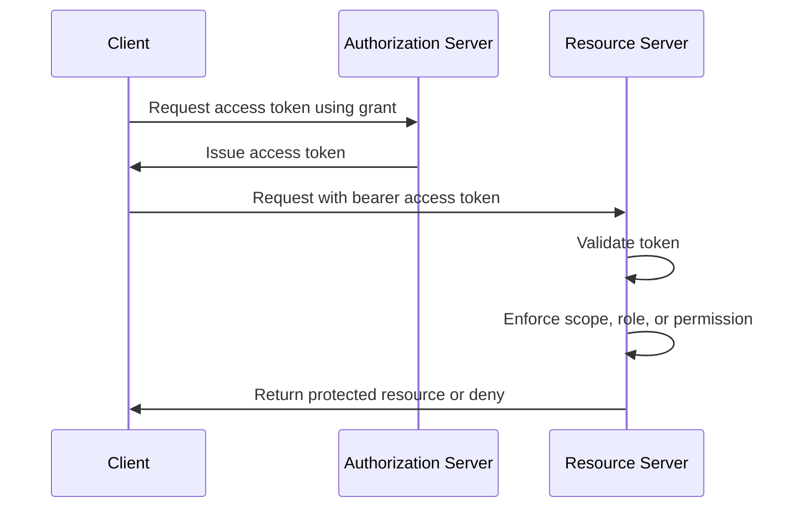

# OAuth2

## What it is

OAuth2 is an authorization framework. It defines how a client obtains an access token from an authorization server and uses that token to access a protected resource. The framework supports delegated access, where a client acts with permission from a resource owner, and client access, where a client acts on its own behalf.

OAuth2 is not, by itself, a login protocol. Login and identity claims are provided by OpenID Connect, which builds on OAuth2. See [OpenID Connect](./03-openid-connect.md) for that identity layer.

Core OAuth2 roles are:

| Role | Meaning in this study |
| --- | --- |
| Resource owner | Usually the member whose protected data or capabilities are involved. |
| Client | A registered application, such as the backoffice UI or a backend service client. |
| Authorization server | The component that authorizes flows and issues access tokens. |
| Resource server | A backoffice API or backend service that validates access tokens and enforces access control. |

## Why it matters

The future backoffice system needs APIs protected by a standard token-based model. OAuth2 provides the common vocabulary for clients, access tokens, scopes, grants, token endpoints, authorization endpoints, resource servers, and client authentication.

For fewer than 1,000 internal users, OAuth2 still matters because it separates concerns. The client does not need to collect API passwords. Resource servers do not need to handle the login ceremony. The authorization server can issue tokens with limited lifetime and defined audience or scope. Later decisions can choose whether those responsibilities live in one product, multiple products, or a smaller internal component, but the conceptual contract remains useful.

## How it works

An OAuth2 client is registered with the authorization server. The registration defines details such as a client identifier, redirect URIs, supported grant types, and client authentication method where applicable. A public browser client cannot safely hold a long-term secret. A confidential server-side client can authenticate with a secret, private key JWT, mTLS, or another supported method.

The client requests authorization through a grant type. In an internal backoffice UI, the usual modern pattern is Authorization Code Flow with PKCE. For backend service clients, Client Credentials Flow is common. These flows are covered in [OAuth2 Flows](./06-oauth2-flows.md).

The authorization server issues an access token. The client sends the access token to a resource server, commonly as a bearer token in the `Authorization` header. A bearer token must be protected because possession of the token is enough to use it unless sender-constrained mechanisms are added.

The resource server validates the token before using it. Validation can involve local JWT signature checks, issuer and audience checks, expiration checks, metadata and JWKS discovery, or token introspection for opaque tokens. See [Tokens and JWTs](./04-tokens-and-jwt.md) for validation details.

## Scopes, claims, roles, and permissions

OAuth2 scopes are strings requested by a client and granted by the authorization server. A scope describes delegated access from the client perspective, such as `members:read` or `offline_access`, depending on the system's conventions.

A claim is a field inside a token. Claims can represent token metadata, subject identity, authentication context, client identity, scopes, roles, permissions, or other assertions. Claims are only trustworthy after token validation.

Roles and permissions are application authorization concepts. A role groups business access, while a permission represents a granular capability. OAuth2 does not require a specific RBAC model. The eventual system must define how scopes relate to roles and permissions so that clients cannot obtain broader access than intended.

## Example

A backoffice UI client starts an authorization request asking for a members API scope. The user authenticates, the authorization server returns an authorization code, and the client exchanges the code for an access token. The UI calls `GET /members` with that token.

The members API validates that the token was issued by the expected authorization server, is intended for the members API audience, is not expired, and contains authorization information that maps to `members:read`. If the token is valid but lacks the required access, the API denies the request.

For a nightly reporting job, no human user may be present. The reporting service can authenticate as an OAuth2 client and use Client Credentials Flow to obtain a service access token. The reporting API still validates the token and checks service-level permissions.

## Common mistakes

Using OAuth2 as if it automatically proves user identity is a common mistake. OAuth2 access tokens are for accessing protected resources. OIDC ID tokens are for identity information about an authenticated user.

Granting scopes too broadly can turn coarse delegation into excessive authorization. Scope names should have stable semantics and should not be treated as arbitrary UI feature flags.

Skipping audience validation can let a token minted for one API be replayed to another API. Resource servers need to check that the token is intended for them.

Treating bearer tokens as harmless strings is dangerous. Logs, browser storage, traces, and error reports can leak tokens.

Using deprecated or unsafe flows for new browser-based applications should be avoided. The OAuth2 security best current practice documents modern guidance that moves away from the Implicit Flow for new applications.

## References

- [RFC 6749 - The OAuth 2.0 Authorization Framework](https://www.rfc-editor.org/rfc/rfc6749)
- [RFC 6750 - The OAuth 2.0 Authorization Framework: Bearer Token Usage](https://www.rfc-editor.org/rfc/rfc6750)
- [RFC 7636 - Proof Key for Code Exchange by OAuth Public Clients](https://www.rfc-editor.org/rfc/rfc7636)
- [RFC 8414 - OAuth 2.0 Authorization Server Metadata](https://www.rfc-editor.org/rfc/rfc8414)
- [RFC 9700 - Best Current Practice for OAuth 2.0 Security](https://www.rfc-editor.org/rfc/rfc9700)
- [OpenID Connect Core 1.0](https://openid.net/specs/openid-connect-core-1_0.html)
