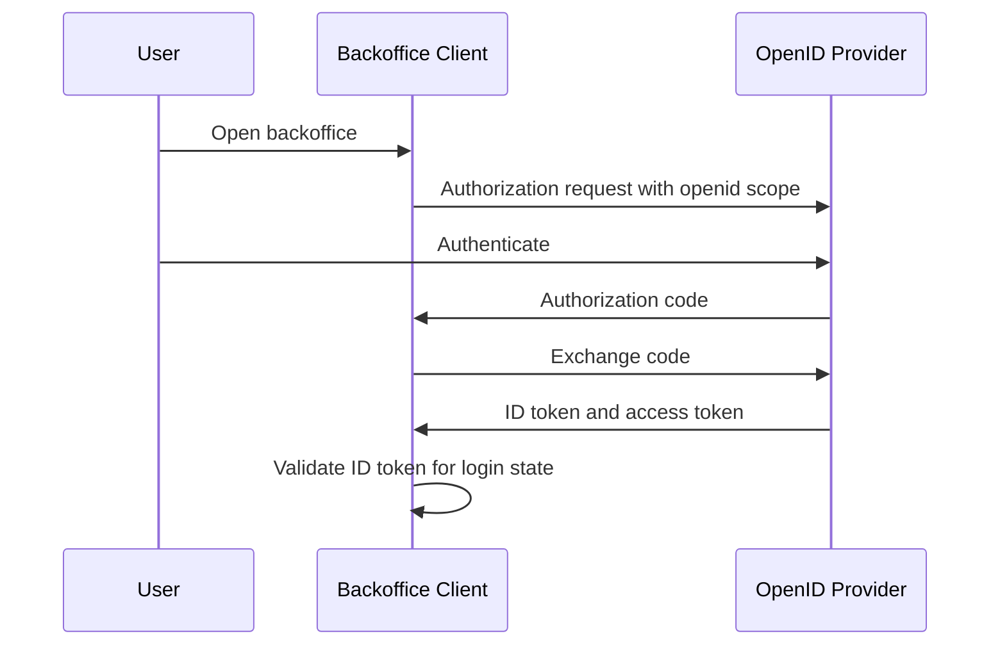

# OpenID Connect

## What it is

OpenID Connect, usually shortened to OIDC, is an identity layer on top of OAuth2. OAuth2 defines authorization flows and access tokens. OIDC adds standardized login behavior, ID tokens, identity claims, the `openid` scope, UserInfo, and provider discovery.

In OIDC terminology, the authorization server that authenticates the user and issues OIDC tokens is also called an OpenID Provider. The client is called a Relying Party when it relies on the provider for user authentication.

OIDC answers a different question from OAuth2. OAuth2 helps a client obtain an access token for an API. OIDC helps a client verify that a user authenticated and learn identity information about that user.

## Why it matters

The backoffice study needs both identity and API authorization. Engineers need to know who signed in, but APIs also need to know what that subject may do. OIDC is the standard way to layer login and identity claims onto OAuth2 without inventing a custom authentication protocol.

For an internal system, OIDC can help standardize how the backoffice client starts login, receives an ID token, validates issuer and audience, discovers provider metadata, and obtains basic user claims. It does not remove the need for API authorization. A user can have a valid ID token and still lack `members:write`.

## How it works

An OIDC client sends an OAuth2 authorization request that includes the `openid` scope. The OpenID Provider authenticates the end user and returns tokens through an OAuth2 flow. With Authorization Code Flow, the client receives an authorization code and exchanges it for tokens at the token endpoint.

OIDC introduces the ID token. An ID token is a JWT containing claims about the authentication event and the end user. Common claims include issuer, subject, audience, expiration, issue time, and authentication-related values. The ID token is intended for the client. It is not the normal token an API should accept for resource access.

The UserInfo endpoint can return claims about the authenticated user when the client presents an access token with appropriate scope. Discovery provides a standard metadata document so clients can find endpoints, supported algorithms, issuer identifiers, and JWKS locations.

For the API side of the same login, see [OAuth2](./02-oauth2.md), [OAuth2 Flows](./06-oauth2-flows.md), and [Tokens and JWTs](./04-tokens-and-jwt.md).

## OAuth2 vs OIDC

| Topic | OAuth2 | OIDC |
| --- | --- | --- |
| Primary purpose | Delegated authorization to protected resources. | User authentication and identity claims. |
| Main token | Access token. | ID token, plus OAuth2 tokens. |
| API access | Resource server validates access tokens. | APIs should not generally rely on ID tokens for access. |
| User identity | Not standardized by OAuth2 alone. | Standardized through ID token claims and UserInfo. |
| Discovery | OAuth2 metadata exists separately. | OIDC Discovery defines provider metadata for OIDC clients. |

The same deployment can support both. A backoffice client can use OIDC to authenticate a user and OAuth2 access tokens to call APIs.

## Example

An administrator opens the backoffice UI. The UI redirects to the OpenID Provider with an authorization request that includes `scope=openid profile`. After authentication, the client receives an authorization code and exchanges it for an ID token and access token.

The client validates the ID token and uses its subject claim to establish the local UI login state. The UI may show the administrator's display name from claims or UserInfo.

When the UI calls `POST /members`, it sends the access token to the administration API. The API validates the access token as an API credential and checks whether the administrator has the required permission. The ID token helped the client know who authenticated; the access token helps the API decide whether the request is authorized.

## Common mistakes

Using an ID token as an API bearer token confuses token audience and purpose. ID tokens are issued to the client. Access tokens are issued for protected resources.

Assuming OIDC solves RBAC is another mistake. OIDC can carry claims, but the system still needs a role and permission model. See [RBAC](./05-rbac.md).

Trusting claims without validation is unsafe. The client must validate issuer, audience, signature, expiration, and other required ID token properties before trusting the token.

Assuming every claim is stable can create account-linking bugs. The OIDC subject claim is the stable identifier within an issuer. Email addresses and display names can change.

Ignoring discovery and key rotation can make clients brittle. OIDC Discovery and JWKS support standardized metadata and signing key lookup.

## References

- [OpenID Connect Core 1.0](https://openid.net/specs/openid-connect-core-1_0.html)
- [OpenID Connect Discovery 1.0](https://openid.net/specs/openid-connect-discovery-1_0.html)
- [RFC 6749 - The OAuth 2.0 Authorization Framework](https://www.rfc-editor.org/rfc/rfc6749)
- [RFC 8414 - OAuth 2.0 Authorization Server Metadata](https://www.rfc-editor.org/rfc/rfc8414)
- [RFC 7519 - JSON Web Token (JWT)](https://www.rfc-editor.org/rfc/rfc7519)
