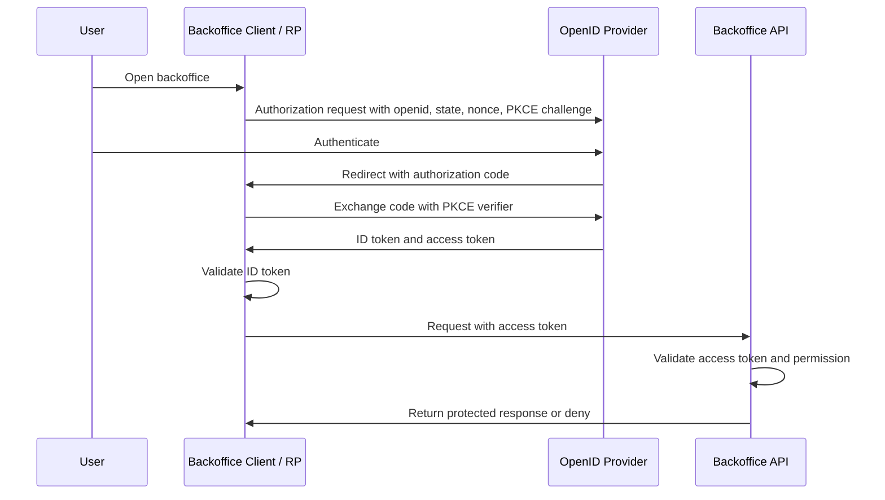

# OpenID Connect

## What it is

OpenID Connect, usually shortened to OIDC, is the standard identity layer built on OAuth2. OAuth2 defines how a client obtains an access token for a protected resource. OIDC adds the login and identity pieces: the `openid` scope, ID tokens, standard identity claims, UserInfo, and provider discovery.

In OIDC terminology, the authorization server that authenticates the user and issues OIDC tokens is also called an OpenID Provider, or OP. The client is called a Relying Party, or RP, when it relies on the provider for user authentication.

The shortest useful distinction is:

| Question | Protocol layer |
| --- | --- |
| How does a client obtain a token for an API? | OAuth2 |
| How does a client know which user authenticated? | OIDC |
| How does an API decide whether the caller can perform an operation? | Application authorization, often using OAuth2 access tokens plus RBAC or permissions |

OIDC does not replace API authorization. It proves authentication to the client. A user can have a valid ID token and still lack `members:write`.

## Learning goals

After reading this page, an engineer should be able to explain:

- why OIDC is not just "OAuth2 login";
- what an ID token proves, who should consume it, and why APIs should not normally accept it as a bearer credential;
- how Authorization Code Flow with PKCE carries an OIDC login;
- what issuer, subject, audience, nonce, and JWKS mean in practical validation;
- where UserInfo, discovery, scopes, claims, roles, and permissions fit in a backoffice system.

## Why it matters

The backoffice study needs both identity and API authorization. Engineers need to know who signed in, while backoffice APIs need to know what that subject may do. OIDC is the standard way to layer login and identity claims onto OAuth2 without inventing a custom authentication protocol.

For an internal system, OIDC can standardize how the backoffice client starts login, receives an ID token, validates issuer and audience, discovers provider metadata, and obtains basic user claims. The administration API still needs server-side authorization checks. The UI learning that `alice@example.com` authenticated is not the same as the members API allowing Alice to create, disable, or assign roles to members.

## Core terms

| Term | Meaning in this study |
| --- | --- |
| End-User | The human user authenticating through the OpenID Provider. Usually a company member or administrator. |
| OpenID Provider | The authorization server or identity provider that authenticates the user and issues OIDC tokens. |
| Relying Party | The OIDC client that relies on the provider to authenticate the user, such as the backoffice UI or a server-side web client. |
| ID token | A JWT for the client. It contains claims about the authentication event and the authenticated user. |
| Access token | An OAuth2 token for a resource server. The backoffice API validates this token before authorizing API operations. |
| UserInfo endpoint | An OIDC endpoint that returns user claims when called with an access token granted for that purpose. |
| Discovery document | Provider metadata published under `.well-known/openid-configuration`, including endpoints, supported features, and the `jwks_uri`. |
| JWKS | A JSON Web Key Set used by clients and resource servers to find public keys for validating signed JWTs. |

For the broader OAuth2 vocabulary, see [OAuth2](./02-oauth2.md). For token structure and validation, see [Tokens and JWTs](./04-tokens-and-jwt.md).

## How it works

An OIDC login is an OAuth2 authorization request that includes the `openid` scope. In a modern browser-based backoffice client, the important flow to understand first is Authorization Code Flow with PKCE. That is flow-level security guidance, not a final product or deployment recommendation.



The ID token establishes the client's login state. The access token is what the client presents to APIs. For the API side of the same login, see [OAuth2 Flows](./06-oauth2-flows.md), [Tokens and JWTs](./04-tokens-and-jwt.md), and [RBAC](./05-rbac.md).

## Request shape

This is an illustrative authorization request, not production-ready code:

```text
GET /authorize?
  response_type=code
  &client_id=backoffice-ui
  &redirect_uri=https%3A%2F%2Fbackoffice.example.test%2Fcallback
  &scope=openid%20profile%20email%20members%3Aread
  &state=<transaction-state>
  &nonce=<id-token-replay-protection>
  &code_challenge=<pkce-code-challenge>
  &code_challenge_method=S256
```

Important parts:

| Parameter | Why it matters |
| --- | --- |
| `response_type=code` | Requests Authorization Code Flow. |
| `scope=openid ...` | The `openid` scope makes the request an OIDC authentication request. Other scopes request profile claims or API access, depending on provider and system conventions. |
| `redirect_uri` | Must match a registered redirect URI. Redirect URI looseness is a common source of token leakage. |
| `state` | Binds the redirect response to the client transaction and helps protect redirect handling. |
| `nonce` | Binds the ID token to the authentication request and helps mitigate replay or token substitution. |
| `code_challenge` | PKCE proof sent before the authorization code is issued. |
| `code_challenge_method=S256` | Uses the current safe PKCE challenge method rather than exposing the verifier. |

Use a maintained OIDC client library for real applications. The point of this example is to make the protocol fields recognizable during study and product evaluation.

## Token purposes

| Token | Intended consumer | Main purpose | Common mistake |
| --- | --- | --- | --- |
| ID token | OIDC client / relying party | Communicate user authentication and identity claims to the client. | Sending it to APIs as if it were an access token. |
| Access token | Resource server / API | Authorize API access. | Treating it as proof of login without understanding issuer, audience, scope, and subject semantics. |
| Refresh token | Authorization server | Obtain fresh access tokens without repeating the full login flow. | Storing it casually or issuing it without rotation and revocation behavior. |

An ID token and an access token can both be JWTs, but they are not interchangeable. The audience and purpose are different.

## ID token claims

An ID token is a JWT containing claims about the authentication event and the end user. The most important claims to recognize are:

| Claim | Practical meaning |
| --- | --- |
| `iss` | Issuer. The provider that issued the token. The client must match this exactly against the expected issuer. |
| `sub` | Subject. Stable identifier for the user within the issuer. Use this as the durable external identity key, not email. |
| `aud` | Audience. Must include the OIDC client ID. This is why an ID token is for the client, not a general API credential. |
| `exp` | Expiration time. The client must not accept the ID token after this time, allowing only small clock skew where appropriate. |
| `iat` | Issued-at time. Useful for token age checks and debugging. |
| `auth_time` | Time of user authentication. Useful when requiring recent authentication for privileged operations. |
| `nonce` | Request-bound value that the client must check when it sent a nonce in the authentication request. |
| `acr` / `amr` | Authentication context or method information, when supported by the provider. Useful for stronger assurance requirements, but provider-specific semantics matter. |
| `email`, `name`, `preferred_username` | Human-friendly profile claims. Useful for display, but not stable authorization identifiers. |

OIDC can also return claims through UserInfo. Do not assume every requested claim is returned; providers may omit claims for privacy or policy reasons.

## ID token validation checklist

Before the client trusts an ID token, it should validate at least:

- the issuer exactly matches the expected OpenID Provider issuer;
- the audience contains the client's registered `client_id`;
- the signature is valid using keys from the issuer, unless a narrowly applicable specification rule and library behavior says otherwise;
- the signing algorithm is expected and not attacker-selected;
- the token is not expired;
- the `iat` value is reasonable for the client policy;
- the `nonce` matches the authorization request when a nonce was sent;
- the `azp` value is understood and checked when the token has multiple audiences or the provider uses it;
- any requested `auth_time`, `acr`, or `amr` semantics are checked before using them for sensitive decisions.

This checklist is intentionally conceptual. Production validation should be delegated to a well-maintained OIDC library configured with the expected issuer, client ID, redirect URIs, algorithms, and provider metadata.

## UserInfo

The UserInfo endpoint can return identity claims about the authenticated user when the client presents a suitable access token. It is useful when the client needs profile data that is not present in the ID token or wants a standard place to retrieve current identity claims.

UserInfo is not an authorization database. It should not become the source of truth for roles and permissions unless the eventual architecture explicitly chooses that and handles staleness, auditability, and enforcement. For this study, treat UserInfo as identity/profile data and keep authorization modeling in [RBAC](./05-rbac.md) and the administration API study.

If a client uses UserInfo, it must verify that the `sub` in the UserInfo response matches the `sub` in the ID token. Otherwise token substitution can make the client attach profile claims to the wrong authenticated subject.

## Discovery and keys

OIDC Discovery lets a client start from an issuer and retrieve provider metadata from `.well-known/openid-configuration`. The metadata can include:

- the issuer identifier;
- authorization, token, and UserInfo endpoints;
- supported scopes, claims, response types, and signing algorithms;
- the `jwks_uri` for token signature validation keys.

Discovery reduces hard-coded configuration and supports key rotation, but it does not remove validation responsibility. Clients still need an expected issuer and registered client metadata. Resource servers validating access tokens may use OIDC discovery, OAuth2 authorization server metadata, JWKS, or introspection depending on the token style and provider.

## OAuth2 vs OIDC

| Topic | OAuth2 | OIDC |
| --- | --- | --- |
| Primary purpose | Delegated authorization to protected resources. | User authentication and identity claims. |
| Main token | Access token. | ID token, plus OAuth2 tokens. |
| API access | Resource server validates access tokens. | APIs should not generally rely on ID tokens for access. |
| User identity | Not standardized by OAuth2 alone. | Standardized through ID token claims and UserInfo. |
| Discovery | OAuth2 metadata exists separately. | OIDC Discovery defines provider metadata for OIDC clients. |

The same deployment can support both. A backoffice client can use OIDC to authenticate a user and OAuth2 access tokens to call APIs.

## Backoffice example

An administrator opens the backoffice UI. The UI redirects to the OpenID Provider with `scope=openid profile email`, a `state` value, a `nonce`, and a PKCE code challenge. After authentication, the provider redirects back with an authorization code. The client exchanges the code for an ID token and access token.

The client validates the ID token and uses `iss` plus `sub` to bind the external identity to the local member record. The UI may show the administrator's display name from ID token claims or UserInfo.

When the UI calls `POST /members`, it sends the access token to the administration API. The API validates the access token as an API credential and checks whether the administrator has the required permission. The ID token helped the client know who authenticated; the access token helps the API decide whether the request is authorized.

## Common mistakes

Using an ID token as an API bearer token confuses token audience and purpose. ID tokens are issued to the client. Access tokens are issued for protected resources.

Assuming OIDC solves RBAC is another mistake. OIDC can carry claims, but the system still needs a role and permission model. See [RBAC](./05-rbac.md).

Trusting claims without validation is unsafe. The client must validate issuer, audience, signature, expiration, nonce where applicable, and other required ID token properties before trusting the token.

Using email as the durable identity key can create account-linking bugs. The OIDC subject claim is the stable identifier within an issuer. Email addresses and display names can change.

Ignoring discovery and key rotation can make clients brittle. OIDC Discovery and JWKS support standardized metadata and signing key lookup, but clients still need correct issuer and client configuration.

Treating successful login as successful authorization is dangerous. The API must enforce permissions server-side even when the user has authenticated correctly.

## References

- [OpenID Connect Core 1.0](https://openid.net/specs/openid-connect-core-1_0.html)
- [OpenID Connect Discovery 1.0](https://openid.net/specs/openid-connect-discovery-1_0.html)
- [RFC 6749 - The OAuth 2.0 Authorization Framework](https://www.rfc-editor.org/rfc/rfc6749)
- [RFC 7519 - JSON Web Token (JWT)](https://www.rfc-editor.org/rfc/rfc7519)
- [RFC 7636 - Proof Key for Code Exchange by OAuth Public Clients](https://www.rfc-editor.org/rfc/rfc7636)
- [RFC 8414 - OAuth 2.0 Authorization Server Metadata](https://www.rfc-editor.org/rfc/rfc8414)
- [RFC 9700 - Best Current Practice for OAuth 2.0 Security](https://www.rfc-editor.org/rfc/rfc9700)
