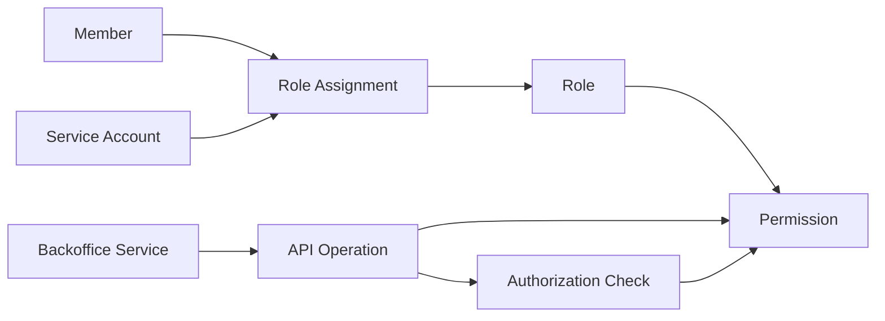

# RBAC and Permission Modeling

## Purpose

Role-Based Access Control, or RBAC, authorizes subjects through roles. A role is a named business-level access group, such as `support_agent`, `iam_operator`, `report_viewer`, or `finance_manager`. A permission is a granular capability, such as `members:read`, `members:disable`, `roles:assign`, or `reports:export`.

For this backoffice study, RBAC is the required baseline model for administrator-managed access. The goal is not to design a large enterprise policy platform during Phase 1. The goal is to define a permission vocabulary that internal services can enforce consistently, administrators can review, and future product or build-vs-buy evaluations can test.

This page complements:

- [Authentication vs Authorization](./01-authentication-vs-authorization.md), for the boundary between login and access decisions.
- [Tokens and JWTs](./04-tokens-and-jwt.md), for token claim and token validation trade-offs.
- [Service-to-Service Authentication](./07-service-to-service-authentication.md), for future machine identities and service permissions.
- [Administration APIs](./08-admin-api.md), for member, role, permission, and assignment management endpoints.
- [Security Best Practices](./09-security-best-practices.md), for least privilege, audit, and token validation guidance.

## Core terms

Use these terms consistently:

| Term | Meaning in this study |
| --- | --- |
| User | A human actor using the system. |
| Member | The company-managed account representing a user in the backoffice IAM system. |
| Service account | A non-human subject used by automation or a backend service. |
| Subject | A member or service account being authorized. |
| Role | A named grouping of permissions assigned to subjects. |
| Permission | A stable capability that an API or service can enforce. |
| Role assignment | The fact that a subject has a role, plus metadata such as who assigned it and why. |
| Resource server | An API or backend service that validates tokens and enforces access control. |
| Authorization check | The runtime decision that compares the subject's effective permissions with the operation's requirement. |
| Claim | A field in a token. A claim may carry identity, roles, permissions, scopes, or other assertions depending on the system design. |
| OAuth2 scope | A scope of delegated access requested by a client and issued by the authorization server. It is not automatically the same thing as an application permission. |

OAuth2 access tokens represent scopes and durations of access granted to a client. The token may self-contain authorization information or reference information held by the authorization server. That makes scopes, roles, permissions, and token claims related, but not interchangeable. A practical backoffice design needs to decide which authorization facts are stored centrally, which are put in tokens, and which facts resource servers enforce locally.

## Backoffice modeling goals

The project requirements imply a simple but explicit authorization model:

- public registration is out of scope;
- administrators create and manage members;
- fewer than 1,000 users are expected;
- RBAC is required;
- internal services need server-side access checks;
- the REST administration API must manage users, roles, permissions, service access, and access checks;
- administrative operations must be auditable.

This favors a small permission catalog with clear ownership over a large hierarchy of special cases. Each permission should answer one question: "May this subject perform this operation against this backoffice capability?"

## Conceptual model

The common RBAC model has four relationships:

- subjects receive role assignments;
- roles include permissions;
- service operations declare required permissions;
- resource servers enforce access by checking effective permissions at runtime.



This model is intentionally small. It does not require role hierarchies, relationship graphs, policy languages, or per-resource ACLs unless later requirements prove they are needed.

## Permission design

A permission should describe an application capability, not a UI button, route name, team name, or implementation detail. Good permission names are stable enough to survive endpoint refactors and precise enough for an administrator to review.

Use a simple form by default:

```text
<resource>:<action>
```

Examples:

- `members:read`
- `members:create`
- `members:update`
- `members:disable`
- `roles:assign`
- `clients:write`
- `reports:export`

If two services own similarly named resources, add a service or domain prefix only where it prevents ambiguity:

```text
<service>.<resource>:<action>
```

Examples:

- `billing.invoices:read`
- `support.tickets:update`

Avoid encoding temporary conditions in permission names. Names like `support_eu_business_hours_manager_approver` are hard to review and usually signal that RBAC is being stretched into an attribute policy. If the condition is real, document it as an authorization rule or future ABAC requirement.

## Permission catalog

For Phase 1, the catalog can be documented as a table. A later implementation may store the same concepts in configuration, database rows, provider-specific role metadata, or code-owned policy declarations.

| Area | Permission | Intended meaning | Does not imply |
| --- | --- | --- | --- |
| Members | `members:read` | List and view member records. | Creating, editing, disabling, deleting, or assigning roles. |
| Members | `members:create` | Create administrator-managed member accounts. | Assigning privileged roles after creation. |
| Members | `members:update` | Edit non-security member attributes. | Disabling accounts or changing roles. |
| Members | `members:disable` | Disable or re-enable member access according to policy. | Deleting member records or assigning roles. |
| Members | `members:delete` | Delete or permanently remove member records where policy allows. | Disabling as a reversible operational action. |
| Roles | `roles:read` | List roles and inspect role definitions. | Assigning or editing roles. |
| Roles | `roles:create` | Create new role definitions. | Assigning the role to anyone. |
| Roles | `roles:update` | Change role metadata or permission membership. | Self-escalation or bypassing review. |
| Roles | `roles:delete` | Retire or delete unused role definitions. | Removing audit history. |
| Roles | `roles:assign` | Assign or remove roles for members or service accounts. | Assigning roles broader than the actor is allowed to grant. |
| Clients | `clients:read` | List OAuth2/OIDC clients and inspect non-secret metadata. | Reading client secrets. |
| Clients | `clients:write` | Create, update, disable, or rotate clients where allowed. | Displaying existing secret values after creation. |
| Service accounts | `service_accounts:read` | List service accounts and view metadata. | Reading credentials. |
| Service accounts | `service_accounts:write` | Create, disable, or update service accounts and credentials. | Granting broad human administrator access. |
| Authorization | `authorization:check` | Ask whether a subject has access to a declared service operation. | Changing authorization state. |
| Audit | `audit:read` | Search security-relevant audit events. | Mutating IAM data. |
| Reports | `reports:read` | View internal reports. | Exporting or sharing report data. |
| Reports | `reports:export` | Export report data where policy allows. | Changing report definitions or source data. |

This table is illustrative. It is a modeling aid, not a final role set or product recommendation.

## Role design

Roles should group permissions around recognizable work, not around technical convenience. A role should have a purpose, owner, permission list, assignment rules, and review cadence.

Useful role categories for this study are:

| Role category | Example role | Purpose |
| --- | --- | --- |
| Operational business role | `support_agent` | Handle ordinary support tasks with narrow member read and account-disable permissions. |
| Read-only oversight role | `security_auditor` | Inspect roles, assignments, clients, service accounts, and audit logs without mutating IAM state. |
| IAM operations role | `iam_operator` | Manage ordinary members and assignments under guardrails. |
| IAM administration role | `iam_admin` | Manage role definitions, clients, service accounts, and high-impact settings. |
| Service role | `reporting_worker` | Let automation read only the data it needs for reporting. |

Role design guidelines:

- Keep the number of roles small enough that administrators understand them.
- Prefer explicit permissions over broad flags such as `admin`.
- Separate read, write, disable, delete, assignment, and credential-management permissions.
- Do not model every endpoint as a role.
- Do not assign ordinary users a catch-all administrator role for daily work.
- Treat service roles separately from human roles.
- Require stronger controls for roles that can grant roles, edit permissions, manage clients, rotate credentials, or read audit logs.
- Avoid role hierarchies unless a later product or operational requirement makes them clearly useful.

## Assignment model

A role assignment should be auditable authorization data, not just a join table. Even if a later implementation uses a provider-specific role system, the study should expect these concepts:

| Field | Why it matters |
| --- | --- |
| Subject type and ID | Distinguishes members from service accounts. |
| Role ID | Identifies the assigned role. |
| Assigned by | Supports accountability and incident review. |
| Assigned at | Supports audit and access review. |
| Reason or ticket | Explains why access was granted. |
| Expiration | Supports temporary access without relying on memory. |
| Status | Allows pending, active, expired, or revoked states if needed. |

Direct permission assignment to a member should be exceptional. It can simplify a rare temporary case, but it makes access review harder because permissions no longer flow through meaningful roles. If direct grants are allowed later, they should be time-bound, audited, and clearly reported alongside role-derived permissions.

## Operation-level enforcement

Each protected API operation should declare the permission it requires. Resource servers then validate the token and enforce the required permission server-side.

Example:

| Operation | Required permission |
| --- | --- |
| `GET /members` | `members:read` |
| `POST /members` | `members:create` |
| `PATCH /members/{id}` | `members:update` |
| `POST /members/{id}/disable` | `members:disable` |
| `POST /members/{id}/roles` | `roles:assign` |
| `DELETE /members/{id}/roles/{role}` | `roles:assign` |
| `POST /authorization/check` | `authorization:check` |

The UI may use permissions to hide unavailable actions, but the API must enforce the rule. Client-side checks improve usability; they do not protect the system.

Sensitive operations often need more than a single permission check:

- A member with `roles:assign` should not necessarily be able to assign every role.
- A subject should not be able to grant themselves broader access without a guardrail.
- A service account should not receive human IAM administrator roles.
- Disabling or deleting a member may need stronger audit data than ordinary profile edits.
- Client secret rotation and service credential creation should be treated as high-impact operations.

These constraints can still fit a simple RBAC model if they are explicit operation rules rather than hidden assumptions.

## Effective permissions

A subject's effective permissions are the union of permissions from active role assignments, minus any explicit restrictions the system defines. For Phase 1, assume additive RBAC unless a later requirement proves that deny rules or complex policy evaluation are needed.

Example:

| Subject | Assigned roles | Effective permissions |
| --- | --- | --- |
| Alice | `support_agent` | `members:read`, `members:disable` |
| Bob | `security_auditor` | `members:read`, `roles:read`, `clients:read`, `service_accounts:read`, `audit:read` |
| Provisioning worker | `member_provisioning_service` | `members:create`, `members:read` |

Alice can list members and disable an account. She cannot assign roles because she lacks `roles:assign`. The provisioning worker can create member records through approved automation, but should not be able to read audit logs, manage clients, or assign broad human roles.

## Token claims, introspection, and lookup

There are several ways a resource server can obtain authorization data. Phase 1 should compare these patterns later rather than assume one now.

| Pattern | Useful when | Main risk | Controls to evaluate |
| --- | --- | --- | --- |
| JWT contains roles or permissions | Services need low-latency local checks. | Role changes can remain effective until token expiry; tokens can grow or leak authorization details. | Short access-token lifetime, minimal claims, audience checks, issuer checks, careful logging. |
| Opaque token plus introspection | Centralized token state and revocation matter. | Resource servers depend on the authorization server at request time. | Introspection availability, caching rules, protected introspection credentials. |
| Local authorization lookup | Permissions change often or need current state. | Adds latency and a runtime dependency. | Caching, timeout behavior, deny-by-default, clear failure handling. |
| Hybrid | Some checks are simple and some are high-risk. | Two sources of truth can drift. | Explicit ownership, audit, tests, and documentation for which checks use which path. |

Whichever pattern is chosen later, a resource server still needs to validate the token's issuer, audience, lifetime, and integrity or introspection result before trusting authorization data.

## Authorization check API

The project brief requires a way to check whether a member has access to a given backoffice service. The important design point is that the check should be phrased in terms of a declared operation or permission, not a vague service name.

Illustrative request:

```json
{
  "subject_type": "member",
  "subject_id": "member_123",
  "service": "members-api",
  "permission": "members:disable"
}
```

Illustrative response:

```json
{
  "allowed": true,
  "matched_permissions": ["members:disable"],
  "source_roles": ["support_agent"],
  "decision_time": "2026-05-04T18:00:00Z"
}
```

This endpoint should be treated as a privileged support function for trusted backoffice services and administration tools. It should not become a way for an untrusted frontend to make final authorization decisions by itself.

## Service-to-service permissions

Service-to-service permissions are a future extension for this project, not part of the first study or minimal PoC scope.

Service accounts are subjects, but they should not inherit human roles by convenience. A reporting job, provisioning worker, or integration service should receive a role named for its purpose and containing only the permissions it needs.

Good examples:

- `reporting_worker` includes `reports:read` and maybe `members:read_summary`.
- `member_provisioning_service` includes `members:create` and `members:read`.
- `audit_exporter` includes `audit:read` and a narrow export capability if required.

Risky examples:

- assigning `iam_admin` to a background worker;
- sharing one service account across unrelated services;
- putting client-management permissions in a service token used by routine automation;
- treating a Client Credentials token as proof that a human approved the request.

See [Service-to-Service Authentication](./07-service-to-service-authentication.md) for the surrounding client authentication and credential lifecycle concerns.

## Permission lifecycle

Permissions need ownership. When a backoffice service adds or changes protected behavior, it should document:

- the operation being protected;
- the required permission;
- the service owner;
- whether the operation reads, mutates, exports, disables, deletes, assigns, or manages credentials;
- whether it affects IAM state or sensitive business data;
- which roles should receive the permission;
- how existing assignments are migrated;
- how audit events will identify the subject and action.

Renaming permissions should be handled like an authorization migration. A stale permission name in a token, service config, provider role, or admin UI can create confusing denials or accidental grants.

## Access review

A usable RBAC model should make these questions easy to answer:

- Which members have the `iam_admin` role?
- Which service accounts can call `members:create`?
- Which roles include `roles:assign`?
- Which API operations require `clients:write`?
- Who granted Alice the `support_agent` role, when, and why?
- Which temporary assignments are expired or close to expiration?
- Which roles have not been reviewed recently?

If the eventual product or implementation cannot answer these questions without manual database queries or tribal knowledge, the model is probably too opaque for the project's maintainability goal.

## RBAC limits and ABAC comparison

RBAC works well when permissions mostly follow job function. It becomes awkward when access depends on dynamic attributes such as department, region, resource owner, resource sensitivity, device posture, time of day, or approval state.

Attribute-Based Access Control, or ABAC, evaluates attributes of the subject, object, action, and environment against policies. Relationship-Based Access Control, or ReBAC, evaluates relationships, such as "the user owns this record" or "the user is assigned to this case." OWASP notes that ABAC and ReBAC are often better fits for fine-grained or object-level authorization.

For this internal backoffice study, RBAC remains a reasonable baseline because the requirements emphasize administrator-managed members, roles, permissions, and service access at a small user scale. The study should still record requirements that do not fit RBAC cleanly. Forcing every condition into a role name usually produces role explosion and weak reviewability.

## Common mistakes

Using one giant `admin` role for ordinary work causes excessive privilege and makes audit review vague.

Encoding every permission as a role creates role explosion. Roles should group business access; permissions should represent enforceable capabilities.

Treating OAuth2 scopes as the complete application permission model can blur client delegation with member authorization. A client may request a scope, but the resource server still needs to know whether the subject is allowed to perform the operation.

Putting high-churn role or permission data into long-lived JWTs creates stale access after role removal. Short token lifetimes, introspection, revocation, or server-side authorization lookups can reduce that window depending on the eventual design.

Checking roles only in the UI leaves APIs exposed. Authorization must be enforced by the API, gateway, service, or trusted authorization layer.

Letting subjects assign roles broader than their own authority creates self-escalation and delegated escalation paths.

Giving service accounts human administrator roles turns automation credentials into broad control-plane credentials.

Using unclear permission names makes reviews and incident response harder. `members:disable` is easier to reason about than `member_admin`.

Skipping negative tests for authorization logic makes regressions likely. Tests should cover denied access, not only successful paths.

## Study questions for later phases

These questions should be used when comparing managed, self-hosted, minimal-library, or hybrid options:

- Can the option model roles and permissions separately, or only roles/groups?
- Can roles be assigned to both human members and service accounts?
- Can resource servers receive or resolve operation-level permissions cleanly?
- Can role removal take effect within an acceptable window?
- Can administrators review who has a role and what permissions the role grants?
- Can sensitive permissions such as `roles:assign`, `clients:write`, and `service_accounts:write` be protected from ordinary administrators?
- Can assignment and permission changes be audited with actor, target, reason, and time?
- Can the model avoid vendor-specific concepts leaking into every backoffice service?
- Can the administration API expose the required member, role, permission, service-account, and access-check operations without overbroad admin credentials?

## References

- [The NIST Model for Role-Based Access Control: Towards a Unified Standard](https://www.nist.gov/publications/nist-model-role-based-access-control-towards-unified-standard)
- [A Revised Model for Role-Based Access Control - NISTIR 6192](https://www.nist.gov/publications/revised-model-role-based-access-control)
- [NIST SP 800-162 - Guide to Attribute Based Access Control (ABAC) Definition and Considerations](https://csrc.nist.gov/pubs/sp/800/162/upd2/final)
- [OWASP Authorization Cheat Sheet](https://cheatsheetseries.owasp.org/cheatsheets/Authorization_Cheat_Sheet.html)
- [RFC 6749 - The OAuth 2.0 Authorization Framework](https://www.rfc-editor.org/rfc/rfc6749)
- [RFC 7662 - OAuth 2.0 Token Introspection](https://www.rfc-editor.org/rfc/rfc7662)
- [RFC 7519 - JSON Web Token](https://www.rfc-editor.org/rfc/rfc7519)
