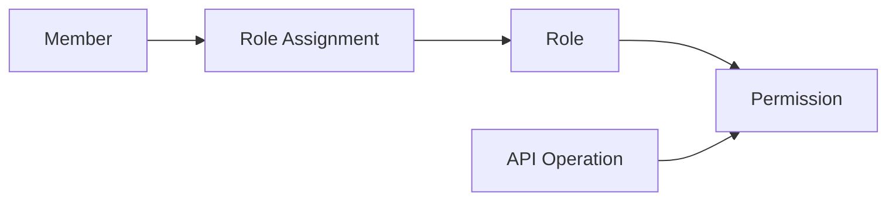

# RBAC

## What it is

Role-Based Access Control, or RBAC, authorizes subjects through roles. A role is a business-level access group, such as `admin`, `support`, `manager`, or `viewer`. A permission is a granular capability, such as `members:read`, `members:disable`, or `billing:write`.

In this study, members are company-managed user accounts. Administrators assign roles to members. Roles map to permissions. Resource servers enforce access by checking whether the authenticated subject has the permission required for the requested operation.

RBAC is not the same as OAuth2 scopes. A scope is delegated access requested by a client. A role is a business grouping assigned to a member or service account. A permission is the application capability ultimately checked by a resource server. A claim is just a field in a token that may carry any of those values if the system defines it that way.

## Why it matters

The backoffice system needs administrator-managed access without public registration. RBAC gives engineers and operators a vocabulary that is usually understandable to business and support teams: "support can read members but cannot delete them" is easier to manage than hundreds of per-user flags.

For fewer than 1,000 users, RBAC can stay simple. The study should still define the conceptual model carefully because unclear role semantics cause privilege creep. If `admin` means everything, then every urgent operational need tends to become an admin assignment. If roles are too granular, administrators cannot reason about them.

## How it works

The common model has four relationships:

- members are assigned roles;
- roles include permissions;
- APIs declare required permissions for operations;
- authorization checks compare the subject's effective permissions with the operation's requirement.

A role assignment can be direct, such as assigning Alice the `support` role. Permissions can be derived from all assigned roles. For example:

| Role | Example permissions |
| --- | --- |
| `viewer` | `members:read`, `roles:read` |
| `support` | `members:read`, `members:disable` |
| `manager` | `members:read`, `roles:read`, `reports:read` |
| `admin` | `members:write`, `roles:write`, `clients:write`, `service_accounts:write` |

This table is illustrative, not a recommended final role set.

Authorization checks should happen in resource servers or in a trusted authorization layer called by resource servers. The UI may use roles and permissions to shape navigation, but the API must enforce the rule.

## Users, members, roles, and permissions

Use terms consistently:

- **User**: a human actor using the system.
- **Member**: the company-managed account representing that human.
- **Administrator**: a privileged user who manages IAM data.
- **Role**: a business-level group assigned to members or service accounts.
- **Permission**: a granular action/resource capability enforced by APIs.

The member record is about account state: identity identifiers, display name, email, disabled status, and maybe authentication metadata depending on the eventual system. Role assignments are authorization data. Permissions describe application capabilities and should be stable enough that APIs and administrators can reason about them.

## Example

The members API defines these requirements:

| Endpoint | Required permission |
| --- | --- |
| `GET /members` | `members:read` |
| `PATCH /members/{id}` | `members:write` |
| `POST /members/{id}/disable` | `members:disable` |
| `POST /members/{id}/roles` | `roles:assign` |

Alice has the `support` role, which includes `members:read` and `members:disable`. She can list members and disable a compromised account. She cannot assign roles because she lacks `roles:assign`.

Bob has a service account for reporting. Its service role includes `reports:read` but not human administration permissions. That separation reduces the chance that a service token can mutate IAM state.

## RBAC limits and ABAC comparison

RBAC is understandable, but it can become awkward when policies depend on attributes such as department, region, resource owner, time, device posture, or environment. Attribute-Based Access Control, or ABAC, evaluates subject, object, action, and environment attributes against policy.

For this study, ABAC is useful as a comparison only. It explains why some systems go beyond roles, but Phase 1 should not turn the backoffice study into an enterprise policy engine design. The important lesson is to avoid forcing every future condition into a role name such as `support_eu_business_hours_manager_approver`.

## Common mistakes

Creating one giant `admin` role for ordinary work causes excessive privilege. Administrative roles should be explicit and limited.

Encoding every permission as a role creates role explosion. Roles should group business access; permissions should represent capabilities.

Assuming token claims are always current can cause stale access after role changes. Short token lifetimes, introspection, revocation, or lookup-based checks can reduce that window depending on the eventual design.

Checking roles only in the UI leaves APIs exposed. API enforcement is mandatory for protected operations.

Using unclear permission names makes audit and review hard. Names like `members:disable` are easier to review than vague names like `member_admin`.

## References

- [The NIST Model for Role-Based Access Control: Towards a Unified Standard](https://www.nist.gov/publications/nist-model-role-based-access-control-towards-unified-standard)
- [A Revised Model for Role-Based Access Control - NISTIR 6192](https://www.nist.gov/publications/revised-model-role-based-access-control)
- [NIST SP 800-162 - Guide to Attribute Based Access Control (ABAC) Definition and Considerations](https://csrc.nist.gov/pubs/sp/800/162/upd2/final)
- [OWASP Authorization Cheat Sheet](https://cheatsheetseries.owasp.org/cheatsheets/Authorization_Cheat_Sheet.html)
- [RFC 6749 - The OAuth 2.0 Authorization Framework](https://www.rfc-editor.org/rfc/rfc6749)
