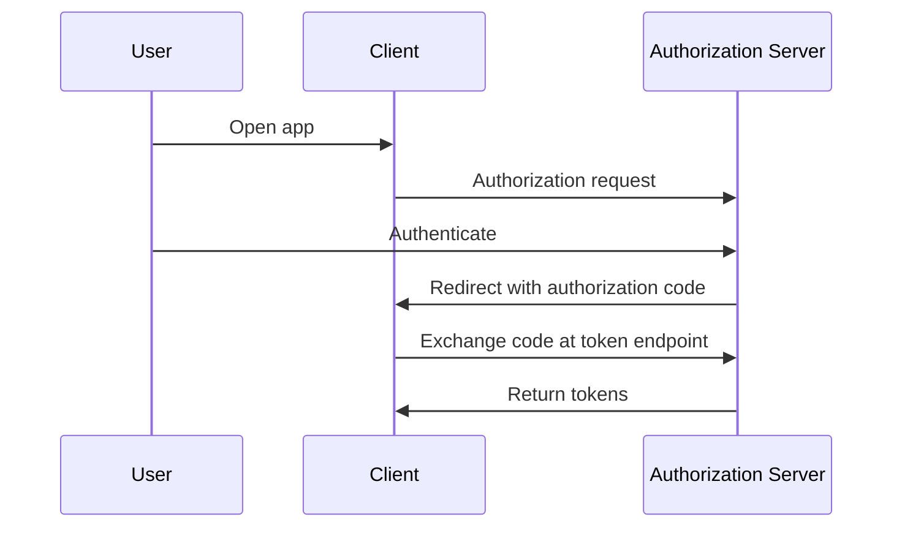
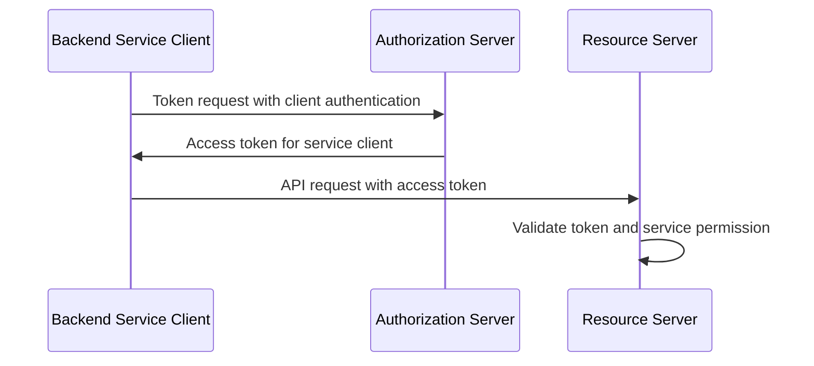

# OAuth2 Flows

## What it is

OAuth2 flows, also called grant types, define how a client obtains tokens from an authorization server. The relevant flows for this study are:

| Flow | Main use |
| --- | --- |
| Authorization Code Flow | User-facing applications where the user authenticates through the authorization server. |
| Authorization Code Flow with PKCE | Authorization Code Flow with proof against authorization code interception, especially important for public clients. |
| Client Credentials Flow | Service-to-service or machine-to-machine access without a human user. |
| Refresh Token Flow | Obtaining a new access token after an earlier authorization without repeating the full flow. |

The Implicit Flow exists in older OAuth2 material, but it should not be used for new browser-based applications. Modern guidance favors Authorization Code Flow with PKCE for public clients.

## Why it matters

The backoffice system has at least two kinds of callers: human-facing backoffice clients and backend services. Those callers have different security properties. A browser client cannot keep a long-term secret. A backend service can usually protect credentials better. OAuth2 flows let the authorization server issue tokens in ways that match those constraints.

Choosing a flow is not the same as choosing a product or architecture. Phase 1 needs engineers to understand the flow shapes and risks so a later phase can evaluate options with the right vocabulary.

## Authorization Code Flow

Authorization Code Flow separates the front-channel redirect from the back-channel token exchange. The client sends the user to the authorization server. After authentication and authorization, the authorization server redirects back with a short-lived authorization code. The client exchanges the code at the token endpoint for tokens.

For confidential web applications, the token exchange may include client authentication. For public clients, PKCE is needed because the client cannot keep a secret.

## Authorization Code Flow with PKCE

PKCE adds a one-time proof to the authorization code flow. The client creates a high-entropy code verifier and sends a derived code challenge in the authorization request. During token exchange, the client sends the original verifier. The authorization server compares it to the earlier challenge.

This reduces the value of a stolen authorization code because the attacker also needs the verifier. PKCE was originally defined for public clients and is now part of modern OAuth2 security guidance.

For an internal browser-based backoffice client, PKCE is the flow shape engineers should understand first. That statement is security guidance about modern OAuth2 usage, not a final product or deployment recommendation.

## Client Credentials Flow

Client Credentials Flow is used when the client acts on its own behalf rather than on behalf of a human resource owner. The client authenticates to the token endpoint and receives an access token representing the client or service account.

Client authentication might use a secret, private key JWT, mTLS, or another supported method. Service permissions should be modeled separately enough that machine clients do not accidentally receive human administrator powers. See [Service-to-Service Authentication](./07-service-to-service-authentication.md).

## Refresh Token Flow

Refresh tokens let a client obtain a new access token without sending the user through the full authorization flow again. The client presents the refresh token to the token endpoint. The authorization server validates it and returns a new access token, and sometimes a new refresh token.

Refresh tokens are powerful credentials. Storage, rotation, replay detection, revocation, and client type matter. Public clients require more caution than confidential server-side clients.

## Example

A backoffice UI uses Authorization Code Flow with PKCE. The user authenticates through the authorization server. The UI receives tokens and calls the members API with an access token.

A billing sync worker uses Client Credentials Flow. It authenticates as a registered service client and receives an access token with only the service permissions needed for billing synchronization.

Both callers use OAuth2, but the flows differ because one involves a user and browser, while the other is machine-to-machine.

## Common mistakes

Using Implicit Flow for new browser applications exposes tokens through the front channel and conflicts with modern OAuth2 security guidance.

Using Resource Owner Password Credentials for internal convenience trains clients to collect user passwords and bypasses the normal login ceremony. It should not be treated as a default approach for new backoffice applications.

Skipping PKCE for public clients leaves authorization codes more exposed to interception.

Using Client Credentials Flow for actions that should be attributable to a human user can damage auditability. Service tokens represent the service client, not an administrator sitting at a keyboard.

Issuing refresh tokens without a storage and rotation strategy increases the blast radius of token theft.

## References

- [RFC 6749 - The OAuth 2.0 Authorization Framework](https://www.rfc-editor.org/rfc/rfc6749)
- [RFC 6750 - The OAuth 2.0 Authorization Framework: Bearer Token Usage](https://www.rfc-editor.org/rfc/rfc6750)
- [RFC 7009 - OAuth 2.0 Token Revocation](https://www.rfc-editor.org/rfc/rfc7009)
- [RFC 7636 - Proof Key for Code Exchange by OAuth Public Clients](https://www.rfc-editor.org/rfc/rfc7636)
- [RFC 9700 - Best Current Practice for OAuth 2.0 Security](https://www.rfc-editor.org/rfc/rfc9700)
- [OpenID Connect Core 1.0](https://openid.net/specs/openid-connect-core-1_0.html)
