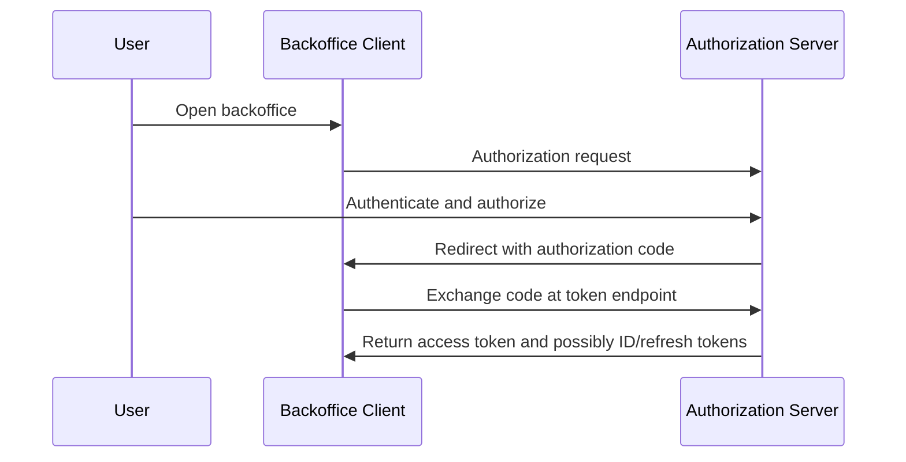
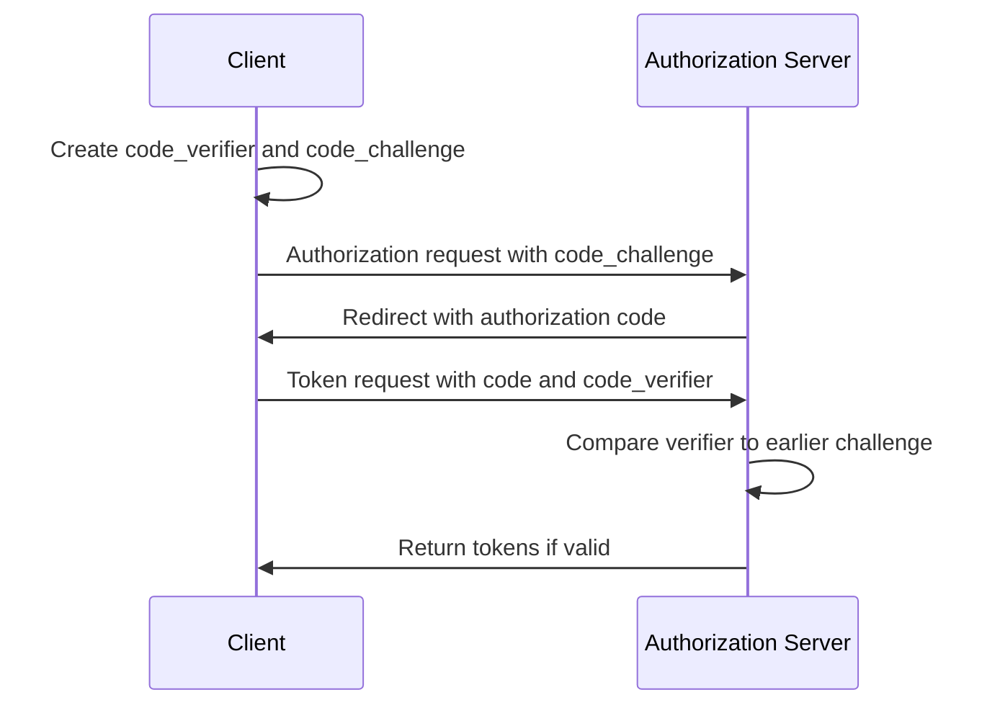
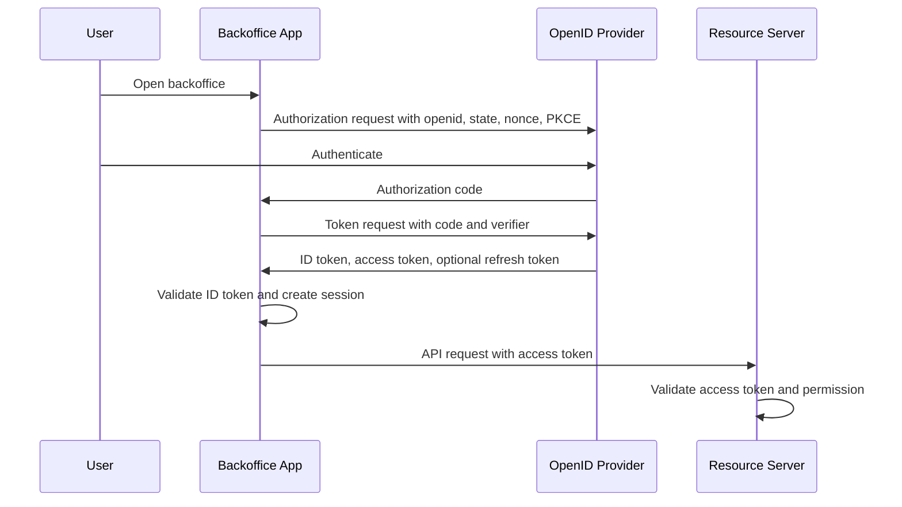
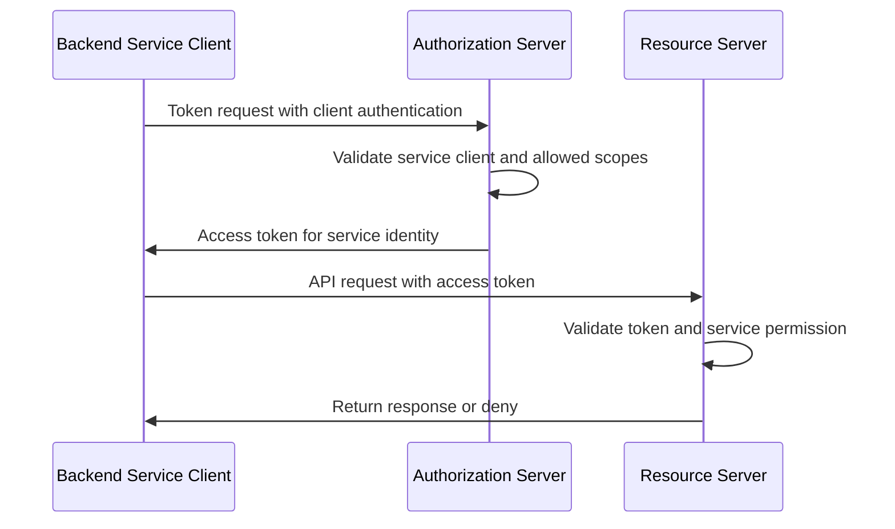
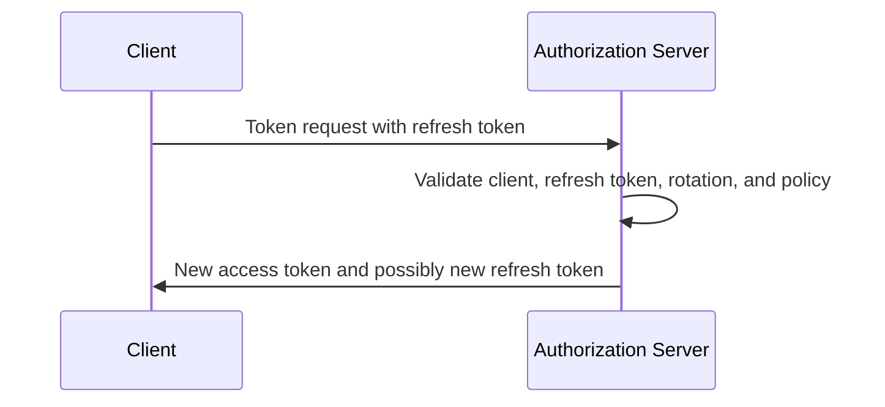

# OAuth2 Flows

## What it is

OAuth2 flows, also called grant types, define how a client obtains tokens from an authorization server. A flow is not just a login screen pattern. It determines which parties interact, which artifacts move through the browser, whether a client authenticates, and what kind of token the authorization server may issue.

The relevant flows for internal backoffice studies are:

| Flow | Main use | First design question |
| --- | --- | --- |
| Authorization Code Flow with PKCE | User-facing backoffice access through the authorization server. | Is this a browser-facing or public-client path, and how is the authorization code protected? |
| Client Credentials Flow | Service-to-service or machine-to-machine access without a human user in the flow. | Which service identity is represented, and what narrow permissions does it need? |
| Refresh Token Flow | Getting a new access token after a previous authorization. | Can this client store refresh tokens safely, and how are rotation and revocation handled? |

For many internal backoffice studies, Client Credentials Flow is educational background and a future extension topic. Initial requirements often focus first on internal user access, role-based service access, auditability, and protected backend services without selecting a final architecture.

Authorization Code Flow without PKCE still exists in older OAuth2 deployments, especially for confidential web clients, but modern security guidance makes PKCE the safer baseline to understand. The Implicit Flow and Resource Owner Password Credentials grant appear in older OAuth2 material, but they should not be default choices for new backoffice applications.

## Learning goals

After reading this page, an engineer should be able to explain:

- why a human-facing backoffice flow should use authorization redirects rather than asking the client to collect passwords;
- how an authorization code differs from an access token;
- what PKCE adds to Authorization Code Flow;
- why Client Credentials Flow represents a service client rather than a human user;
- why refresh tokens are more sensitive than short-lived access tokens;
- which flows are risky or obsolete for new browser-based applications;
- how to evaluate flow support without making a final vendor or architecture recommendation.

## Why it matters

Internal backoffice systems commonly involve human callers first and service callers later:

| Caller | Likely flow family | Reason |
| --- | --- | --- |
| Backoffice user through a UI or server-side web application | Authorization Code Flow with PKCE plus OIDC | The user authenticates at the identity provider, while the client receives tokens without handling the user's password. |
| Backend service or scheduled worker | Client Credentials Flow | Future extension: the service authenticates as itself and receives a service access token. |
| Long-lived user session | Refresh Token Flow or server-side session renewal | The system may need new access tokens without making the user repeat the full redirect flow every few minutes. |

Different callers have different security properties. A browser-only client cannot keep a long-term secret. A server-side web application or backend service can usually protect credentials better, but still needs secret rotation, auditability, and least privilege. OAuth2 flows let the authorization server issue tokens in a way that matches those constraints.

Choosing a flow is not the same as choosing a product, database, or deployment model. The team needs to understand flow mechanics and failure modes so later evaluations can ask precise questions.

## Flow selection map

Use this as a learning map, not a final design decision:

| Scenario | Flow to understand first | Notes |
| --- | --- | --- |
| Internal user opens the backoffice UI | Authorization Code Flow with PKCE, usually with OIDC | OIDC adds ID tokens and login semantics; OAuth2 access tokens protect APIs. |
| Server-side backoffice application calls a resource server for the user | Authorization Code Flow with PKCE and a server-side session | This pattern can keep tokens out of browser JavaScript if it is selected later. |
| Backend job calls a reporting API | Client Credentials Flow | Future extension: the token represents the service client, not a human member. |
| CLI or desktop admin tool calls an API | Authorization Code Flow with PKCE | Treat distributed tools as public clients unless there is a real secure secret store. |
| Access token expires during a session | Refresh Token Flow or reauthorization | Refresh token handling depends heavily on client type and storage. |
| Client asks user for username and password directly | Avoid Resource Owner Password Credentials | This increases credential exposure and does not fit modern authentication ceremonies well. |
| Browser receives access token directly in the redirect URL | Avoid Implicit Flow for new apps | Modern guidance favors code flow with PKCE so access tokens come from the token endpoint. |

## Authorization Code Flow

Authorization Code Flow separates the browser redirect from the token exchange. The client sends the user to the authorization server. After authentication and authorization, the authorization server redirects back with a short-lived authorization code. The client exchanges that code at the token endpoint for tokens.



The important split is:

| Artifact | Where it appears | Purpose |
| --- | --- | --- |
| Authorization code | Front-channel redirect back to the client | Short-lived credential exchanged for tokens. |
| Access token | Token endpoint response | Credential presented to resource servers. |
| ID token | Token endpoint response in OIDC flows | Identity token for the OIDC client. |
| Refresh token | Token endpoint response when issued | Credential used to obtain new access tokens. |

The authorization code is not an API credential. A resource server should never accept it. The client must exchange it for tokens at the token endpoint, and the authorization server must validate the client, redirect URI, code lifetime, and PKCE proof where applicable.

## Authorization Code Flow with PKCE

PKCE, or Proof Key for Code Exchange, binds the authorization request to the token request. The client creates a high-entropy `code_verifier`, derives a `code_challenge`, and sends the challenge in the authorization request. Later, the client sends the original verifier to the token endpoint. The authorization server checks that the verifier matches the earlier challenge before issuing tokens.



PKCE reduces the value of a stolen authorization code. An attacker who sees only the code still needs the verifier. This matters for public clients, browser redirects, native apps, and any path where redirect handling could expose the code.

For study purposes, engineers should recognize these fields:

| Parameter | Where | Why it matters |
| --- | --- | --- |
| `response_type=code` | Authorization request | Requests Authorization Code Flow. |
| `client_id` | Authorization and token requests | Identifies the registered client. |
| `redirect_uri` | Authorization and often token requests | Must match registered redirect URIs; loose matching can leak codes. |
| `scope` | Authorization request | Requests delegated access such as `openid`, `profile`, or API scopes. |
| `state` | Authorization request and response | Binds the redirect response to the client transaction. |
| `nonce` | OIDC authorization request | Binds ID token processing to the authentication request when OIDC is used. |
| `code_challenge` | Authorization request | Sends the derived PKCE challenge before the code is issued. |
| `code_challenge_method=S256` | Authorization request | Uses the SHA-256 challenge method rather than the plain verifier. |
| `code_verifier` | Token request | Proves the token request comes from the party that started the flow. |

This is an illustrative request shape, not production code:

```text
GET /authorize?
  response_type=code
  &client_id=backoffice-web-client
  &redirect_uri=https%3A%2F%2Fbackoffice.example.test%2Foauth%2Fcallback
  &scope=openid%20profile%20members%3Aread
  &state=<transaction-state>
  &nonce=<oidc-nonce>
  &code_challenge=<derived-pkce-challenge>
  &code_challenge_method=S256
```

For a server-side backoffice client, PKCE is still useful defense-in-depth and aligns with modern OAuth2 guidance. Client authentication and PKCE solve different problems: client authentication proves a confidential client at the token endpoint, while PKCE binds a specific authorization request to the code redemption.

## OIDC login through the code flow

OpenID Connect uses OAuth2 flows and adds identity semantics. An OIDC login normally includes the `openid` scope. The token response can include an ID token for the client and an access token for APIs.



The ID token is for the client to establish login state. The access token is for resource servers. The API should validate the access token intended for it and enforce permissions. See [OpenID Connect](./03-openid-connect.md) and [Tokens and JWTs](./04-tokens-and-jwt.md).

## Client Credentials Flow

Client Credentials Flow is used when a client acts on its own behalf rather than on behalf of a human resource owner. The client authenticates to the token endpoint and receives an access token representing the client or service account.



Client authentication might use a client secret, private key JWT, mTLS, or another supported method. The flow itself does not decide how broad the service's access should be. Service permissions should be explicitly modeled so automation does not accidentally receive human administrator powers.

Good uses:

- a reporting job reading report data;
- a billing sync worker calling a billing API;
- an audit exporter writing to an internal audit sink;
- an integration worker calling only the APIs it owns.

Risky uses:

- using one shared service client for unrelated jobs;
- giving a service client a generic administrator role;
- using a service token for operations that should record a human approver;
- treating network location as a substitute for client authentication.

See [Service-to-Service Authentication](./07-service-to-service-authentication.md) for future service identity, service accounts, and client authentication options.

## Refresh Token Flow

Refresh Token Flow lets a client obtain a new access token without repeating the full authorization flow. The client presents a refresh token to the token endpoint. The authorization server validates it and returns a new access token, and sometimes a new refresh token.



Refresh tokens are powerful credentials. A stolen refresh token can often be exchanged for new access tokens until it expires, is revoked, or is detected as reused. For public clients, rotation and reuse detection are important mitigations where refresh tokens are used. For confidential server-side clients, storage can be stronger, but revocation, auditability, and least privilege still matter.

Questions to answer later:

- Which clients are allowed to receive refresh tokens?
- Where are refresh tokens stored?
- Are refresh tokens rotated on each use?
- What happens if an old refresh token is reused?
- How are refresh tokens revoked when a member is disabled, a role is removed, a client is compromised, or a user logs out?
- Does refresh preserve old authorization claims, or does each refresh re-evaluate current roles and permissions?

Token lifetime and revocation behavior are covered more deeply in [Tokens and JWTs](./04-tokens-and-jwt.md).

## Flows to avoid as defaults

Some OAuth2 grants exist for historical or narrow compatibility reasons. Understanding them helps engineers recognize and reject unsafe defaults during product evaluation.

| Flow | Why it is risky for this study |
| --- | --- |
| Implicit Flow | Access tokens are returned through the authorization response, increasing exposure through browser/front-channel paths. Modern guidance recommends using code flow patterns instead for new applications. |
| Resource Owner Password Credentials | The client collects the user's password directly, expanding where credentials can leak and bypassing modern authentication steps such as MFA or WebAuthn ceremonies. |
| Unconstrained refresh token issuance | Long-lived credentials without rotation, reuse detection, revocation, or client-type limits increase the impact of token theft. |

This is not a claim that every legacy system using these patterns is instantly broken. It is a conservative rule for a new internal backoffice study.

## Backoffice examples

An administrator opens the backoffice UI. In one possible design, a server-side backoffice application starts Authorization Code Flow with PKCE and OIDC parameters. After the user authenticates, the application exchanges the code for tokens, validates the ID token, creates a server-side session, and calls the members API with an access token. The members API validates the access token and checks `members:read`, `members:create`, or `roles:assign` depending on the operation.

A billing sync worker runs nightly. It uses Client Credentials Flow to authenticate as `billing-sync-worker`. The authorization server issues a token with an audience for the billing API and only the scopes or permissions needed for synchronization. The billing API records the service identity in audit logs.

A long-running browser session needs a fresh access token. If the eventual design allows refresh tokens for a server-side backoffice client, the client can refresh tokens server-side. If refresh tokens are not allowed for that client, the user may need a new authorization redirect after the access token expires or after the server-side session policy requires it.

## Common mistakes

Skipping PKCE because a client also has a secret confuses two protections. Client authentication identifies the client at the token endpoint; PKCE binds the authorization request to the code exchange.

Treating an authorization code as an access token breaks the flow boundary. Authorization codes are for the token endpoint, not resource servers.

Using Client Credentials Flow for human administrator actions weakens auditability. A service token identifies the service client, not the person who clicked, approved, or requested the action.

Issuing refresh tokens casually increases the blast radius of compromise. Refresh token storage, rotation, reuse detection, revocation, and client eligibility need explicit policy.

Accepting ID tokens at APIs confuses OIDC login with OAuth2 API authorization. APIs should validate access tokens intended for them.

Allowing loose redirect URI matching can leak authorization codes or send users through attacker-controlled redirect paths.

Keeping unused grant types enabled increases attack surface. Each client should be allowed to use only the grant types it actually needs.

## Study checklist

When evaluating OAuth2 flow support later, engineers should be able to answer:

- Which clients use Authorization Code Flow with PKCE?
- Which clients are confidential, and how do they authenticate at the token endpoint?
- Which clients are public, and how are they constrained?
- Which exact redirect URIs are registered for each user-facing client?
- Are Implicit Flow and Resource Owner Password Credentials disabled for new clients?
- Which services use Client Credentials Flow, and who owns each service identity?
- Which scopes, audiences, roles, or permissions can each flow produce?
- Which clients can receive refresh tokens?
- Are refresh tokens rotated, revocable, and audited?
- What happens to active sessions and refresh tokens when a member is disabled or a role is removed?
- How do APIs distinguish user-delegated tokens from service tokens?

## References

- [RFC 6749 - The OAuth 2.0 Authorization Framework](https://www.rfc-editor.org/rfc/rfc6749)
- [RFC 6750 - The OAuth 2.0 Authorization Framework: Bearer Token Usage](https://www.rfc-editor.org/rfc/rfc6750)
- [RFC 7009 - OAuth 2.0 Token Revocation](https://www.rfc-editor.org/rfc/rfc7009)
- [RFC 7636 - Proof Key for Code Exchange by OAuth Public Clients](https://www.rfc-editor.org/rfc/rfc7636)
- [RFC 9700 - Best Current Practice for OAuth 2.0 Security](https://www.rfc-editor.org/rfc/rfc9700)
- [OpenID Connect Core 1.0](https://openid.net/specs/openid-connect-core-1_0.html)
