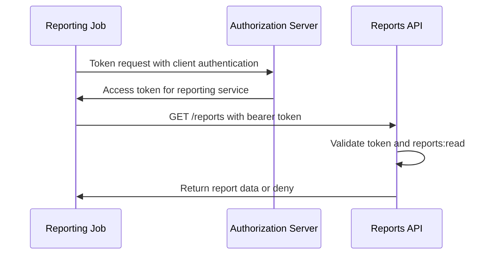

# Service-to-Service Authentication

## What it is

Service-to-service authentication verifies a machine caller rather than a human user. In OAuth2 terms, a backend service can be a client that authenticates to the authorization server and receives an access token for its own service identity.

The common OAuth2 flow for this is Client Credentials Flow. The service authenticates at the token endpoint, receives an access token, and calls a resource server. The resource server validates the token and checks service-level permissions.

Service authentication is not a shortcut around authorization. A service token still needs a defined subject, audience, lifetime, and permissions.

## Scope boundary

In a minimal internal backoffice access-control baseline, service-to-service authentication is often a future extension. Teams usually define human user access, role-based service access, protected backend services, and auditability before giving machine callers their own identities.

This page remains in the wiki because the concepts are useful when evaluating whether a candidate IAM option can grow beyond a human-user backoffice scope without redesigning the control plane.

## Why it matters

Internal backoffice systems rarely consist of only one UI and one API. Reporting jobs, billing syncs, audit exporters, notification workers, provisioning tools, and other backend services may need to call protected APIs.

Those calls should not reuse human administrator credentials. They need their own service identities, least-privilege permissions, audit trail, credential rotation, and revocation behavior. A compromised service credential can be as damaging as a compromised user credential if it carries broad access.

## How it works

A service is registered as an OAuth2 client. Depending on the eventual system, the service may have a client secret, a private key, a certificate, or another authentication method. The authorization server validates the client authentication and issues an access token representing the service.

The service sends the access token to the resource server. The resource server validates issuer, audience, expiration, signature or introspection result, and required permissions. The API should treat the token as the service's authority, not as proof that a human user approved the request at that moment.

For the underlying grant, see [OAuth2 Flows](./06-oauth2-flows.md). For client registration, credential rotation, and lifecycle concepts, see [OAuth Client Management](./13-oauth-client-management.md). For access token validation, see [Tokens and JWTs](./04-tokens-and-jwt.md).

## Client authentication options

Client secrets are shared secrets. They are simple to understand but require secure storage, careful distribution, rotation, and leak handling. They are usually unsuitable for code shipped to browsers or devices where the secret cannot remain confidential.

Private key JWT lets a client authenticate by signing an assertion with a private key. The authorization server verifies the assertion with the registered public key. This avoids sending a reusable shared secret on each token request, but it requires key lifecycle management.

Mutual TLS binds client authentication to certificates and can also support certificate-bound access tokens. It can provide strong client identity, but operational complexity depends on certificate issuance, renewal, trust stores, and service mesh or platform support.

This page does not choose among these methods. The point is to identify the trade-offs and vocabulary for later evaluation.

## Service accounts and permissions

A service account is an identity for a non-human caller. It should have a clear owner, purpose, allowed clients, permissions, and lifecycle. The authorization model should make it possible to answer:

- which service owns this credential;
- which APIs can it call;
- which permissions does it have;
- when was it last used;
- who approved or changed its access;
- how can it be disabled or rotated.

Service permissions should not accidentally mirror administrator roles. For example, a reporting worker might need `reports:read` and `members:read_summary`, but not `members:delete` or `roles:assign`.

## Example

A provisioning worker needs to create member records after HR approval. It authenticates as `provisioning-worker` using Client Credentials Flow. The authorization server issues an access token with an audience for the administration API and permissions such as `members:create` and `members:read`.

The administration API validates the token and checks the required permission for `POST /members`. The audit log records that the service client performed the operation, including request metadata and correlation IDs. If the worker is compromised, an administrator can disable or rotate the service credential without disabling human administrator accounts.

## Common mistakes

Sharing one service credential across many jobs destroys attribution. Each meaningful service identity should be distinguishable.

Granting service accounts broad administrator roles creates high-impact credentials that may be stored in automation systems, CI variables, or runtime environments.

Using network location as the only trust signal is not enough. Internal networks still need authenticated and authorized requests.

Putting client secrets in source code, images, logs, or frontend bundles turns them into public credentials.

Failing to rotate or revoke service credentials makes incident response slower.

Treating service calls as user actions can break auditability. If a service acts on behalf of a user, the system needs an explicit delegation or impersonation model. That is more complex than ordinary Client Credentials Flow and should not be assumed casually.

## References

- [RFC 6749 - The OAuth 2.0 Authorization Framework](https://www.rfc-editor.org/rfc/rfc6749)
- [RFC 6750 - The OAuth 2.0 Authorization Framework: Bearer Token Usage](https://www.rfc-editor.org/rfc/rfc6750)
- [RFC 7523 - JSON Web Token (JWT) Profile for OAuth 2.0 Client Authentication and Authorization Grants](https://www.rfc-editor.org/rfc/rfc7523)
- [RFC 7662 - OAuth 2.0 Token Introspection](https://www.rfc-editor.org/rfc/rfc7662)
- [RFC 8705 - OAuth 2.0 Mutual-TLS Client Authentication and Certificate-Bound Access Tokens](https://www.rfc-editor.org/rfc/rfc8705)
- [RFC 9700 - Best Current Practice for OAuth 2.0 Security](https://www.rfc-editor.org/rfc/rfc9700)
- [OWASP Secrets Management Cheat Sheet](https://cheatsheetseries.owasp.org/cheatsheets/Secrets_Management_Cheat_Sheet.html)
