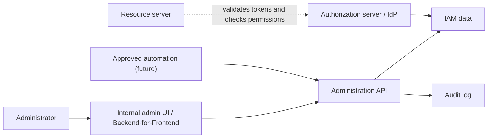

# Administration API

## What it is

An administration API is the privileged management surface for identity and access management data. It is where authorized administrators and approved automation manage members, roles, permissions, clients, service accounts, lifecycle state, credential metadata, and access decisions.

In a central IAM control-plane architecture, the administration API is not just another business API. It changes who can authenticate, which clients can receive tokens, which service accounts can call internal APIs, and which subjects receive privileged access. A mistake in this surface can change the security boundary for many resource servers at once.

This page is conceptual learning material. It explains common responsibilities, risks, and design controls without choosing a product, storage model, endpoint shape, deployment pattern, or vendor API.

## Scope boundary

A minimal backoffice scope may restrict administration API consumers to the internal administration UI at first. Approved automation, service accounts, and machine callers can be treated as later extension topics when their ownership and audit model are clear.

## Why it matters

Public self-service registration and ordinary profile editing are different from IAM administration. Administration operations can create identities, disable identities, grant roles, rotate service credentials, change redirect URIs, and alter the permissions that protect backend services.

For that reason, an administration API should be treated as a high-risk resource server:

- it receives access tokens or other strong credentials;
- it validates the caller and the intended audience;
- it enforces operation-specific authorization server-side;
- it writes audit events for privileged changes;
- it prevents ordinary UI state from becoming the security boundary.

Protecting only the admin UI is not sufficient. The API remains the real control plane. A hidden button does not stop a direct HTTP request.

## Relationship to the IAM control plane

A central IAM control plane commonly combines three responsibilities:

| Responsibility | Main question answered | Example behavior |
| --- | --- | --- |
| Identity provider | Who authenticated? | Login, authenticators, identity claims, user lifecycle. |
| Authorization server | Which tokens can this client receive? | OAuth2/OIDC flows, access tokens, refresh tokens, client metadata. |
| Administration API | Who can change IAM state? | Member management, role assignment, client administration, service-account lifecycle, audit evidence. |

These responsibilities may be implemented by one product, several products, or a custom facade over provider APIs. The design lesson is the same: the component that owns IAM state must enforce administrative permissions itself.



The UI or BFF may provide a convenient workflow, but it should not be the IAM authority. Backend services may validate tokens and enforce permissions, but they should not silently mutate central member, role, client, or service-account records.

## Core resources

The exact resource names vary by product and implementation. A useful conceptual model usually includes:

| Resource | What it represents | Typical operations |
| --- | --- | --- |
| Members | Human identities managed by the organization. | Create, read, update, list, disable, delete where legally and operationally appropriate. |
| Administrators | Members with privileged IAM management duties. | Assign admin roles, review admin access, require stronger controls for sensitive actions. |
| Roles | Named bundles of permissions used for business-level access. | Create, read, update, list, retire. |
| Permissions | Granular capabilities such as `members:read` or `roles:assign`. | List, describe, map to roles, assign ownership. |
| Role assignments | Links between subjects and roles. | Assign, remove, expire, review. |
| Clients | OAuth2/OIDC applications registered with the authorization server. | Register, read metadata, update redirect URIs, disable, rotate credentials. |
| Service accounts | Non-human subjects for machine callers. | Create, disable, assign permissions, rotate credentials, record owner and purpose. |
| Access checks | Queries that answer whether a subject may perform an operation. | Evaluate member or service access for a declared permission or service capability. |
| Audit events | Evidence for privileged behavior. | Record mutations, denials, credential events, admin reads where appropriate. |

See [RBAC](./05-rbac.md) for role, permission, and assignment modeling, [OAuth Client Management](./13-oauth-client-management.md) for client registration and lifecycle concepts, and [Service-to-Service Authentication](./07-service-to-service-authentication.md) for future service accounts and machine callers.

## Example operation map

Endpoint names are examples only. The important part is that each operation maps to an explicit permission and an auditable control-plane action.

| Operation | Example permission | Notes |
| --- | --- | --- |
| `POST /members` | `members:create` | Creates a managed human identity. |
| `GET /members` | `members:read` | Lists members without exposing secrets or credential material. |
| `GET /members/{id}` | `members:read` | Reads a specific member by stable identifier. |
| `PATCH /members/{id}` | `members:write` | Updates safe profile or lifecycle metadata. |
| `POST /members/{id}/disable` | `members:disable` | Stops future access while preserving history. |
| `DELETE /members/{id}` | `members:delete` | May be restricted because deletion affects auditability and retention. |
| `GET /roles` | `roles:read` | Lists roles for review and assignment workflows. |
| `POST /roles` | `roles:create` | Creates a role with owner and purpose metadata. |
| `PATCH /roles/{id}` | `roles:update` | Changes role metadata or permission membership. |
| `POST /members/{id}/roles` | `roles:assign` | Assigns a role, subject to self-escalation controls. |
| `DELETE /members/{id}/roles/{roleId}` | `roles:assign` | Removes a role assignment. |
| `POST /clients` | `clients:create` | Registers a client or starts a controlled registration workflow. |
| `POST /clients/{id}/rotate-secret` | `clients:rotate` | Rotates a client credential and avoids returning old secrets. |
| `POST /service-accounts` | `service_accounts:create` | Creates a non-human identity with owner, purpose, and permissions. |
| `POST /authorization/check` | `authorization:check` | Answers a declared access question for a trusted caller. |

Operation names should reflect domain actions, not frontend buttons. A route can change later; the required permission should still describe the protected capability.

## Authorization model

An administration API should require both authentication and authorization. A token that proves login is not enough. Each privileged operation should check:

| Check | Why it matters |
| --- | --- |
| Caller is authenticated | Anonymous callers cannot manage IAM state. |
| Token is intended for the admin API | Audience validation prevents tokens for another API being reused here. |
| Issuer is trusted | Prevents accepting tokens from an unexpected authorization server. |
| Token is active and unexpired | Expired, revoked, disabled, or inactive sessions should not authorize changes. |
| Caller has the required permission | Read access should not imply mutation access. |
| Caller may act on this target | Prevents self-escalation, unauthorized delegation, or cross-boundary changes. |
| Operation passes business constraints | Prevents invalid state, duplicate assignments, deleting required roles, or orphaning owners. |

Server-side checks should be explicit and operation-specific. Examples:

- `members:read` does not imply `members:disable`;
- `roles:read` does not imply `roles:assign`;
- `clients:read` does not imply `clients:rotate`;
- `authorization:check` does not imply permission to mutate IAM data.

The strongest pattern is to declare the required permission close to each handler or policy rule, then test that denied callers cannot reach the mutation.

## Self-escalation and delegated administration

Administration APIs need controls beyond simple "has permission" checks. Some operations are dangerous because they allow the caller to create future authority.

Common escalation paths include:

- assigning a role to oneself;
- assigning a role that contains permissions the actor is not allowed to grant;
- creating or updating a client so it can receive broader scopes or tokens;
- creating a service account with stronger permissions than the actor holds;
- changing redirect URIs, token lifetimes, or client authentication settings in unsafe ways;
- disabling other administrators to remove oversight;
- changing audit settings or deleting audit evidence.

Useful mitigations include:

| Control | Example |
| --- | --- |
| Grant boundaries | A role manager may grant only roles within an approved set. |
| Separation of duties | A second approval is required for privileged admin roles or service-account credentials. |
| Self-action restrictions | Administrators cannot grant themselves new privileged roles or disable their own last recovery path. |
| Step-up authentication | Sensitive actions require a fresh or stronger authentication event. |
| Break-glass process | Emergency admin access is time-bound, heavily audited, and reviewed afterward. |
| Immutable audit evidence | Audit settings and audit-log exports are themselves privileged and logged. |

These controls do not require a heavy enterprise workflow for every system. They do require a conscious answer to "can this operation let the caller become more powerful?"

## Lifecycle semantics

Identity administration often fails when lifecycle terms are vague. The API should distinguish these actions:

| Action | Meaning | Security and audit implications |
| --- | --- | --- |
| Disable | Prevents future use while preserving identity history. | Good default for offboarding and incident response. Existing sessions and refresh tokens may also need revocation. |
| Delete | Removes or anonymizes the record according to retention rules. | Can break audit trails if stable identifiers and historical references are not preserved. |
| Revoke | Invalidates a token, credential, consent, or assignment. | Useful for immediate response to compromise or access removal. |
| Suspend | Temporarily blocks use pending review. | May preserve a path to restore access after investigation. |
| Expire | Ends a temporary assignment or credential at a known time. | Useful for time-bound elevated access. |
| Rotate | Replaces a secret, key, or credential. | Should preserve attribution and avoid logging secret values. |

Disabling a member is not the same as deleting the member. Revoking a refresh token is not the same as disabling the account. Removing a role assignment is not the same as deleting the role. Keeping these operations distinct makes incident response and access review much easier.

## Token and session effects

Administrative changes often need runtime effects beyond database updates:

- disabling a member should stop new sessions and may require revoking refresh tokens;
- disabling a client should prevent new token grants for that client;
- rotating a client secret should invalidate or retire the old credential;
- removing a high-risk role may need faster effect than waiting for a long-lived access token to expire;
- changing permissions embedded in JWT access tokens may not affect already-issued tokens until they expire;
- opaque tokens with introspection can reflect central state faster but add availability and latency considerations.

The right runtime pattern depends on token lifetime, risk, and operational needs. The key learning point is to design admin mutations together with token validation, introspection, revocation, and cache behavior. See [Tokens and JWTs](./04-tokens-and-jwt.md) for token trade-offs.

## Access-check endpoint

Some systems expose an endpoint that answers whether a subject has access to a service or operation. This can help trusted services, admin tooling, and diagnostics, but it should be designed carefully.

A useful access-check request asks a precise question:

```json
{
  "subject_id": "member_123",
  "subject_type": "member",
  "operation": "billing.reports.read",
  "resource": {
    "type": "service",
    "id": "billing"
  }
}
```

A useful response explains the decision without exposing more than the caller is allowed to know:

```json
{
  "allowed": true,
  "required_permission": "billing:reports:read",
  "matched_roles": ["finance_viewer"],
  "decision_time": "2026-05-05T10:00:00Z"
}
```

The endpoint should be available only to trusted callers with a permission such as `authorization:check`. It should not become a way for an untrusted browser to outsource final API authorization. Resource servers remain responsible for enforcing their own protected operations.

## Audit and accountability

Administration APIs should make privileged behavior explainable. A useful audit event usually includes:

| Field | Example |
| --- | --- |
| Actor | Administrator subject ID or service-account ID. |
| Client | OAuth2 client ID or automation identity. |
| Action | `member.disabled`, `role.assigned`, `client.secret_rotated`. |
| Target | Stable member, role, client, service-account, or permission ID. |
| Result | Success, denial, validation failure, partial failure, rollback. |
| Timestamp | Server-side timestamp with timezone or UTC convention. |
| Request context | Request ID, source network context where appropriate, user agent for human flows. |
| Reason | Optional ticket ID, approval reference, or review record. |
| Change summary | Safe before/after metadata without secrets. |

Do not log passwords, bearer tokens, refresh tokens, client secrets, private keys, one-time recovery codes, or full credential material. Also consider auditing audit-log reads, exports, retention changes, and logging failures. See [Auditability, Access Reviews, and Operational Ownership](./10-auditability-access-reviews-operational-ownership.md) for the deeper governance layer.

## API design considerations

Administration API design should make incorrect use hard:

| Concern | Practical guidance |
| --- | --- |
| Stable identifiers | Use immutable IDs in APIs and audit logs; names and emails can change. |
| Idempotency | Role assignment, disablement, and credential rotation should behave predictably on retries. |
| Concurrency | Prevent lost updates when two admins change the same role or assignment. |
| Validation | Reject duplicate assignments, unknown permissions, unsafe redirect URIs, and invalid lifecycle transitions. |
| Error behavior | Return enough information for legitimate operators without leaking sensitive state to unauthorized callers. |
| Pagination and filtering | List endpoints should be reviewable without exposing unnecessary data. |
| Secret handling | Show generated secrets only at creation or rotation time, never in ordinary reads. |
| Rate and abuse controls | Protect login, token, credential, and admin mutation endpoints from brute force or accidental loops. |
| Versioning | Changes to permission semantics and client behavior should be explicit and reviewable. |

For small systems, these controls can be implemented simply. The important part is that they are deliberately modeled rather than discovered during an incident.

## Standards context

Several standards are useful background even when an implementation does not adopt them directly:

| Standard or guidance | Why it matters for administration APIs |
| --- | --- |
| OAuth2 Token Revocation | Defines a standard way for clients to ask an authorization server to invalidate tokens. |
| OAuth2 Token Introspection | Defines a way for protected resources to query token state and metadata. |
| OAuth2 Dynamic Client Registration | Defines concepts for registering OAuth2 clients, including client metadata. Internal systems may still choose stricter registration controls. |
| SCIM Core Schema and Protocol | Defines standard user and group provisioning concepts. Useful vocabulary for identity lifecycle and group management. |
| OAuth2 Security Best Current Practice | Summarizes modern OAuth2 security guidance relevant to tokens, clients, redirects, and browser-based flows. |
| OWASP API Security and Authorization guidance | Covers common API authorization failures, least privilege, and deny-by-default patterns. |
| OWASP Logging guidance | Helps avoid unsafe logs while preserving useful security evidence. |
| NIST Digital Identity Guidelines | Provides useful terminology for identity lifecycle, authenticators, assurance, and federation. |

The goal is not to copy every standard into a custom API. The goal is to learn the patterns, risks, and vocabulary before evaluating whether a product API, standard protocol, custom facade, or hybrid approach fits.

## Common mistakes

Protecting the admin UI but not the administration API leaves the control plane exposed.

Treating successful login as permission to administer IAM data confuses authentication with authorization.

Using one broad `admin` flag for every operation makes least privilege, testing, and access review harder.

Allowing administrators to grant roles or create service credentials beyond their own grant authority creates escalation paths.

Giving service accounts human administrator roles turns automation credentials into broad privileged credentials.

Returning secrets from read endpoints or writing them to logs turns normal operational tooling into a credential leak.

Treating deletion, disabling, revocation, and rotation as interchangeable creates confusing and sometimes unsafe lifecycle behavior.

Relying on long-lived self-contained tokens for high-risk authorization changes can leave removed access active until token expiry.

Failing to audit denied privileged attempts hides useful incident-response evidence.

## References

- [RFC 7009 - OAuth 2.0 Token Revocation](https://www.rfc-editor.org/rfc/rfc7009)
- [RFC 7591 - OAuth 2.0 Dynamic Client Registration Protocol](https://www.rfc-editor.org/rfc/rfc7591)
- [RFC 7643 - System for Cross-domain Identity Management: Core Schema](https://www.rfc-editor.org/rfc/rfc7643)
- [RFC 7644 - System for Cross-domain Identity Management: Protocol](https://www.rfc-editor.org/rfc/rfc7644)
- [RFC 7662 - OAuth 2.0 Token Introspection](https://www.rfc-editor.org/rfc/rfc7662)
- [RFC 9700 - Best Current Practice for OAuth 2.0 Security](https://www.rfc-editor.org/rfc/rfc9700)
- [OWASP API Security Top 10](https://owasp.org/API-Security/)
- [OWASP Authorization Cheat Sheet](https://cheatsheetseries.owasp.org/cheatsheets/Authorization_Cheat_Sheet.html)
- [OWASP Logging Cheat Sheet](https://cheatsheetseries.owasp.org/cheatsheets/Logging_Cheat_Sheet.html)
- [NIST SP 800-63-4 - Digital Identity Guidelines](https://pages.nist.gov/800-63-4/)
