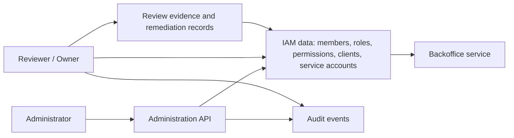

# Auditability, Access Reviews, and Operational Ownership

## What it is

Auditability, access reviews, and operational ownership are the governance and operations layer around the IAM control plane.

**Auditability** means the system can reconstruct security-relevant IAM events with enough reliable evidence to answer who changed access, what changed, when it changed, through which path, and whether the operation succeeded.

**Access review** means a recurring or event-driven process for confirming that members, administrators, service accounts, clients, roles, and permissions still match business need.

**Operational ownership** means named people or teams are responsible for running the IAM system, handling incidents, reviewing access, maintaining configuration, rotating credentials, preserving evidence, and making changes safely.

This page is conceptual. It does not choose a vendor, logging stack, retention period, review frequency, team structure, or final operating model.

## Why it matters

The project brief requires administration operations to be auditable and the future system to remain understandable and operable by the internal team. Those are not secondary concerns. An IAM system is a control plane: role assignments, member disabling, client creation, and service-account credentials can change access to every protected backoffice service.

For fewer than 1,000 users, the process can stay lightweight. The important requirement is not enterprise ceremony. It is that engineers and administrators can answer practical questions after a mistake, incident, audit request, or onboarding/offboarding event:

- Who granted this member access?
- What permissions does this role actually grant?
- Which services can this machine client call?
- When was this administrator's access last reviewed?
- Who owns this service account and credential rotation?
- Can audit data be exported and reviewed outside the provider UI?
- What happens if the IAM service, audit pipeline, or identity provider is unavailable?

## Relationship to other wiki pages

This page depends on the terminology from [RBAC](./05-rbac.md), the privileged control-plane surface in [Admin API](./08-admin-api.md), future service identity concepts from [Service-to-Service Authentication](./07-service-to-service-authentication.md), and the conservative controls in [Security Best Practices](./09-security-best-practices.md).

Do not duplicate all authorization rules here. Treat this page as the operational and evidence layer around those concepts.

## Core model

The useful separation is:

- IAM data is the current state: members, roles, permissions, clients, service accounts, ownership metadata, and assignments.
- Audit events explain how state changed and which privileged checks occurred.
- Access reviews compare current state with business expectations and produce remediation records.
- Operational ownership defines who keeps the system, logs, credentials, and reviews healthy.

## Auditability

Audit logs should make privileged IAM behavior explainable. They should support incident response, access review, troubleshooting, and later compliance analysis without leaking secrets or becoming a second authorization database.

At minimum, audit records for privileged IAM events should be able to answer:

| Question | Example evidence |
| --- | --- |
| Who acted? | Stable actor ID, actor type, administrator member ID, service-account ID, or client ID. |
| What happened? | Action name such as `members.disable`, `roles.assign`, `clients.rotate_secret`, or `access_review.certify`. |
| What was affected? | Target resource type and stable target ID. |
| When did it happen? | UTC timestamp, ideally with consistent server-side time. |
| Where did it come from? | Request ID, source IP or network context where appropriate, client ID, admin API route, and correlation ID. |
| What was the result? | Success, denial, validation failure, partial failure, or rollback. |
| Why was it done? | Optional reason, ticket ID, approval reference, or access-review identifier. |
| What changed? | Safe before/after summary for fields such as status, role assignments, owner, or credential metadata. |

Use stable identifiers instead of mutable names. Email addresses, display names, service names, and role labels can change. Audit trails and access reviews need durable IDs that remain meaningful after renames, offboarding, or deletion.

### Events to consider

This table is a study checklist, not a final logging specification.

| Event family | Examples | Why it matters |
| --- | --- | --- |
| Member lifecycle | Create, update, disable, delete, restore. | Explains who can authenticate or exist as an internal account. |
| Role and permission model | Create, update, delete role; change role-permission mapping. | Changes the meaning of access for many subjects at once. |
| Role assignments | Assign role, remove role, deny attempted self-escalation. | Directly changes effective access. |
| Administrator access | Grant or revoke admin roles, failed privileged authorization checks. | Administrative access has high blast radius. |
| Clients and service accounts | Create, disable, owner change, credential rotation, permission change. | Machine credentials can outlive people and need distinct accountability. |
| Token and credential controls | Refresh-token revocation, client-secret rotation, signing-key rotation metadata. | Supports incident response and credential compromise analysis. |
| Audit system changes | Audit export, audit-log read, retention setting change, logging failure. | Audit data is sensitive and is itself a target. |
| Access reviews | Review started, certification, exception, remediation, overdue review. | Provides evidence that access was examined and corrected. |
| Break-glass access | Activation, use, approval, expiration, post-use review. | Emergency access needs stronger traceability than ordinary administration. |

Not every ordinary protected API read needs to become a high-volume audit event. Later design can decide which data-plane events matter. Control-plane mutations and privileged authorization decisions are the minimum area where auditability should be explicit.

### Log safety and integrity

Auditability fails if logs are missing, unreadable, unsafe, or easy to alter. Later implementation options should be evaluated for:

- redaction of passwords, bearer tokens, refresh tokens, client secrets, private keys, and one-time recovery values;
- consistent timestamps and request correlation across the admin API, authorization server, and protected services;
- protection against unauthorized read, modification, and deletion of audit data;
- audit records for audit-log access and export;
- detection when logging is disabled, broken, delayed, or storage is exhausted;
- practical export to a format that can be reviewed outside a vendor console;
- retention and disposal behavior aligned with legal, privacy, and business requirements;
- enough operational documentation that on-call engineers know where to find the evidence during an incident.

Audit logs often contain personal data and sensitive operational data. Retention should be justified; keeping everything forever can create avoidable privacy, cost, and incident-response risk.

## Access reviews

Access review is the process that turns IAM state and audit data into accountability. It should confirm that actual access still matches current business need, especially for administrators, service accounts, and roles that affect multiple services.

For this project, access review should cover at least:

- members with administrator roles;
- ordinary members assigned to backoffice roles;
- disabled or deleted members with remaining references;
- role definitions and the permissions each role grants;
- future service accounts, machine clients, and their owners if service-to-service access becomes in scope;
- OAuth2/OIDC clients, redirect URIs, secrets, and allowed flows;
- break-glass or emergency access paths if they exist;
- exceptions, temporary grants, and stale assignments.

### Review inputs

A useful review should not depend on screenshots or tribal memory. The system should be able to produce review inputs such as:

| Input | Purpose |
| --- | --- |
| Member export | Shows active, disabled, and privileged members. |
| Role assignment export | Shows who has each role and when it was assigned. |
| Role-permission map | Shows what each role actually allows. |
| Service account inventory | Shows non-human actors, owners, purposes, credentials, and permissions. |
| Client inventory | Shows OAuth2/OIDC clients, owners, allowed flows, redirect URIs, and status. |
| Audit changes since last review | Highlights access changes, failed privileged checks, and review remediations. |
| Business ownership map | Routes review decisions to the right service or role owner. |

The exact review frequency should be selected later from business risk, compliance expectations, and operational capacity. A small internal system might use a lightweight periodic review plus event-driven reviews after incidents, reorganizations, sensitive role changes, or departures.

### Review outcomes

Access review should produce a record that can be audited later:

| Outcome | Meaning |
| --- | --- |
| Certified | Access still matches business need. |
| Removed | Access is no longer needed and was revoked. |
| Reduced | Access remains needed but with fewer permissions. |
| Changed owner | The subject or service account had unclear ownership and was reassigned. |
| Exception approved | Access is broader or longer-lived than normal and has a reason plus expiry. |
| Investigation needed | The reviewer cannot determine whether access is valid. |

Reviews should result in actual IAM changes, not just a report. If a role is too broad, a service account has no owner, or an administrator no longer needs access, the review process should create remediation work and track completion.

## Operational ownership

Operational ownership is where IAM studies often become uncomfortable in a useful way. A managed provider can reduce infrastructure work, but the internal team still owns configuration, access decisions, review evidence, admin procedures, incident response, and provider risk. A self-hosted product shifts more runtime responsibilities to the team. A custom or library-based approach usually means owning much of the IAM behavior directly.

The later decision phase should name owners for at least these responsibilities:

| Responsibility | Ownership question | Evidence to expect |
| --- | --- | --- |
| IAM service ownership | Who decides changes to the IAM control plane? | Architecture notes, change records, roadmap decisions. |
| Day-to-day administration | Who creates members, disables members, assigns roles, and handles requests? | Admin tickets, audit events, standard operating procedure. |
| Role and permission ownership | Who approves the meaning of each role and permission? | Role catalog, service-owner approvals, change history. |
| Service account ownership | Who owns each non-human identity and its credential rotation? | Owner field, purpose, rotation date, disablement path. |
| Security governance | Who defines review criteria, retention expectations, and exception handling? | Review policy, exception records, risk decisions. |
| Runtime operations | Who patches, backs up, monitors, restores, upgrades, and handles outages? | Runbooks, monitoring alerts, backup and restore evidence. |
| Incident response | Who handles token leakage, credential compromise, unauthorized role assignment, or provider outage? | Incident runbook, contacts, tabletop notes, post-incident records. |
| Audit data management | Who can read, export, retain, and dispose of audit data? | Access controls, export records, retention rules. |

For fewer than 1,000 internal users, these responsibilities can be assigned simply. The risk is not that the operating model is too small; the risk is that no one owns it.

## Evaluation implications

Later comparison work should ask each candidate option:

- Can privileged admin operations be audited with actor, action, target, result, timestamp, request context, and stable IDs?
- Can audit events be exported without manual screenshots?
- Can access reviewers see effective access for members, administrators, clients, and service accounts?
- Can service accounts have explicit owners, purposes, expiration or review dates, and narrow permissions?
- Can disabled members, deleted members, and renamed identities remain traceable in audit history?
- Can the team configure retention and protect audit logs from unauthorized access or tampering?
- What operational work remains internal for backups, upgrades, key rotation, incident response, support, monitoring, and recovery?
- Does the product or library make access review easier, or does it force custom reporting and reconciliation?

These questions should inform evaluation. They are not a final recommendation.

## Common mistakes

Logging only successful changes hides denied escalation attempts and failed privileged operations.

Logging mutable names without stable IDs makes later investigation unreliable.

Writing secrets, bearer tokens, refresh tokens, client secrets, or passwords into audit records turns logs into a credential store.

Treating service accounts as anonymous automation breaks accountability. Every machine identity should have an owner and purpose.

Reviewing access from screenshots or UI memory makes the process hard to repeat and hard to trust.

Keeping a broad permanent `admin` role for routine work makes access review less meaningful.

Assuming a managed provider owns everything ignores internal ownership of configuration, role design, review evidence, and incident response.

Failing to audit audit-log reads and exports leaves sensitive evidence unprotected.

## Open study questions

- What retention period is required for IAM audit events, access reviews, and disabled-member records?
- Which events must be retained centrally, and which can remain in provider or application logs?
- Who is allowed to read audit logs, export them, and approve third-party disclosure?
- What is the expected review cadence for administrators, ordinary roles, and service accounts?
- Should temporary access have automatic expiration?
- Does the backoffice need break-glass access, and how should it be approved, monitored, and reviewed?
- Which team owns IAM operations after launch, including backups, restore testing, upgrades, and incident response?
- What evidence will final reviewers need before accepting a vendor, self-hosted product, library, or hybrid option?

## References

- [NIST SP 800-53 Rev. 5 - Security and Privacy Controls for Information Systems and Organizations](https://csrc.nist.gov/pubs/sp/800/53/r5/upd1/final)
- [NIST SP 800-92 - Guide to Computer Security Log Management](https://csrc.nist.gov/pubs/sp/800/92/final)
- [OWASP Logging Cheat Sheet](https://cheatsheetseries.owasp.org/cheatsheets/Logging_Cheat_Sheet.html)
- [OWASP Authorization Cheat Sheet](https://cheatsheetseries.owasp.org/cheatsheets/Authorization_Cheat_Sheet.html)
- [OWASP API Security Top 10](https://owasp.org/API-Security/)
