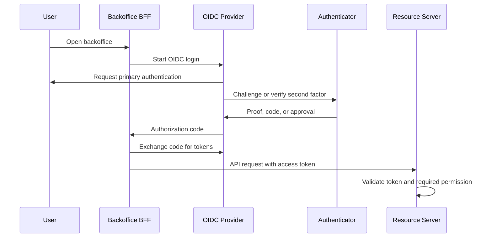

# MFA, 2FA, Passwordless, and One-Time Passwords

## What it is

Multifactor authentication, or MFA, requires a user to prove identity with more than one authentication factor. Two-factor authentication, or 2FA, is a specific MFA case that uses exactly two factors.

The usual factor categories are:

| Factor | Meaning | Examples |
| --- | --- | --- |
| Knowledge | Something the user knows. | Password, PIN, recovery answer. |
| Possession | Something the user has. | Authenticator app, hardware security key, passkey-capable device, smart card, phone number. |
| Inherence | Something the user is or does locally. | Fingerprint, face unlock, other biometric verification. |

An authenticator is not the same thing as a factor. A single authenticator can involve more than one factor. For example, a hardware-backed passkey may require possession of a private key plus local user verification with a PIN or biometric. A password plus a security question is usually not strong MFA because both are knowledge-based secrets.

Passwordless authentication means the user does not enter a reusable password. It does not automatically mean the login is stronger, phishing-resistant, or multifactor. A WebAuthn passkey, an email magic link, and an SMS login code can all be marketed as passwordless, but they have very different security properties.

One-time passwords, or OTPs, are short-lived or single-use authentication values. They can be generated by an authenticator, such as HOTP or TOTP, or delivered out of band, such as by SMS. The phrase "one-time" only describes replay behavior; it does not describe phishing resistance, recovery quality, enrollment security, or operational fit.

## Why it matters

For an internal backoffice IAM control plane, account takeover can lead to member creation, role assignment, permission changes, client changes, audit-log access, and service access changes. The expected user count is below 1,000, but administrator accounts still have high impact.

This wiki does not choose a final MFA product, passwordless strategy, or authenticator policy. The goal is to understand the authenticator families well enough to compare managed providers, self-hosted products, minimal-library implementations, and hybrid approaches later.

The study should especially separate:

- ordinary member authentication from administrator authentication;
- initial login from step-up authentication for high-risk actions;
- phishing-resistant authenticators from code-based authenticators;
- strong daily authentication from emergency recovery;
- factor support from the operational burden of enrollment, reset, audit, and lost-device handling.

For administrator-specific policy questions, see [Administrator Authentication Policy](../security-administrator-authentication-policy.md). For the login protocol layer, see [OpenID Connect](./03-openid-connect.md). For token validation and API authorization, see [Tokens and JWTs](./04-tokens-and-jwt.md) and [Admin API](./08-admin-api.md).

## Core terms

| Term | Meaning | Study note |
| --- | --- | --- |
| MFA | Authentication using more than one factor. | Stronger than password-only only if the factors are independent enough and enrollment/reset are protected. |
| 2FA | MFA with exactly two factors. | Common shorthand, but MFA is the more general term. |
| Step-up authentication | Re-authentication or stronger authentication required for a sensitive action. | Useful for role assignment, credential reset, audit export, or break-glass activation. |
| Passwordless | Authentication without a reusable password. | Can be strong or weak depending on the mechanism. |
| OTP | A one-time password or passcode. | Can be generated locally, such as TOTP, or delivered externally, such as SMS. |
| HOTP | HMAC-based OTP using a moving counter. | Standardized by RFC 4226; counter synchronization must be handled. |
| TOTP | Time-based OTP using time steps. | Standardized by RFC 6238; clock drift, replay windows, and rate limiting matter. |
| Email magic link | A one-time login link sent to an email address. | Convenient, but the mailbox becomes the real authenticator. |
| Passkey | A FIDO credential commonly exposed through platform or synced credential managers. | Usually implemented with WebAuthn/FIDO semantics; recovery and sync behavior need evaluation. |
| WebAuthn security key | Public-key credential bound to a relying party origin and authenticator. | Can provide phishing resistance when configured and used correctly. |
| Recovery code | A one-time backup secret used when normal authenticators are unavailable. | Should be treated as a high-risk credential, not routine login. |
| `amr` | OIDC Authentication Methods References claim. | Can report methods such as password, OTP, SMS, or MFA, but semantics must be understood. |
| `acr` | OIDC Authentication Context Class Reference claim. | Can report the assurance or context class of an authentication event. |

## Common authenticator families

| Family | How it works | Main strengths | Main risks and trade-offs |
| --- | --- | --- | --- |
| Password only | User proves knowledge of a reusable secret. | Simple and widely supported. | Phishing, credential stuffing, reuse, forgotten passwords, password storage obligations. |
| Password plus TOTP | User enters a password and a code from an authenticator app or hardware token. | Common, offline code generation, avoids telecom dependency. | Phishable, shared-secret enrollment risk, clock drift, backup and reset complexity. |
| HOTP token | User enters a code generated from a counter-based authenticator. | Does not require synchronized clocks. | Counter resynchronization and token lifecycle must be handled. |
| SMS or voice OTP | Verifier sends a code to a registered phone number. | Familiar, easy onboarding for many users. | PSTN delivery is restricted in NIST guidance; risks include SIM swap, number reassignment, interception, forwarding, delivery failure, and weak recovery. |
| Email code or magic link | Verifier sends a code or one-time link to a mailbox. | Low friction, useful for email address verification or some recovery flows. | Not strong MFA for this study; mailbox compromise, link forwarding, weak mailbox MFA, DNS or routing attacks, and delivery delays can defeat assumptions. |
| Push approval | Verifier sends a login approval request to an enrolled device or app. | Good user experience and can carry transaction details. | MFA fatigue, prompt bombing, weak number matching, device reset, and push-channel dependency. |
| WebAuthn/FIDO security key | Browser and authenticator use public-key cryptography scoped to the relying party. | Phishing resistance, no shared server-side password, origin binding, hardware-backed options. | Device loss, enrollment ceremony, attestation policy, browser/platform support, backup authenticator planning. |
| Passkey | User signs in with a FIDO credential, often unlocked with device PIN or biometric. | Passwordless user experience with WebAuthn-style public-key authentication. | Sync, recovery, shared device behavior, account portability, and organizational support vary by provider and platform. |
| Smart card or certificate | User authenticates with a certificate or smart card, often unlocked by PIN. | Mature for some enterprise environments. | Operationally heavier; lifecycle, issuance, revocation, and workstation support are significant. |
| Recovery codes | User enters a pre-issued one-time backup code. | Useful for account recovery and emergency access. | High-value bearer secrets; they need careful issuance, storage guidance, hashing or verifier protection, auditing, and invalidation after use. |

SMS, voice, and email codes are not equivalent to authenticator-app OTPs or WebAuthn credentials just because all of them display or deliver short codes. The delivery channel and account recovery path are part of the security model.

## MFA in an OIDC backoffice

In the selected architecture, the identity provider or authorization server performs the authentication ceremony. The Backoffice BFF and APIs should not try to reimplement MFA code handling unless the later architecture explicitly requires owning authentication locally.

A simplified login with MFA looks like this:

OIDC can expose authentication information through claims such as `auth_time`, `acr`, and `amr`. These claims are useful, but they are not a substitute for authorization. A token saying that MFA occurred does not mean the user may call `roles:assign` or `members:disable`; the API still needs a server-side permission check.

If the backoffice later needs step-up authentication, the design should define:

- which operations require stronger or fresh authentication;
- what `acr` or policy value means "strong enough";
- how recently the authentication must have occurred;
- how the BFF requests step-up from the provider;
- how failed or unavailable step-up is handled;
- how the step-up event is audited.

Avoid hard-coding fragile assumptions such as "if `amr` contains `otp`, the user is an administrator." `amr` reports authentication methods, not authorization rights. Its values and meanings must be agreed with the provider.

## Passwordless patterns

Passwordless removes the reusable password from the login ceremony, but the replacement authenticator must still be evaluated.

| Pattern | What changes | Study concern |
| --- | --- | --- |
| WebAuthn/passkey login | The user proves control of a private key instead of entering a password. | Strong candidate pattern to study for phishing resistance, but requires enrollment, device loss recovery, and provider support analysis. |
| Email magic link | The mailbox becomes the login channel. | Useful for low-friction flows, but weak for administrator access unless the mailbox and recovery process are strong enough. |
| SMS login code | The phone number becomes the login channel. | Convenient, but PSTN-based authentication has known restrictions and should not be treated as high assurance. |
| Push-based passwordless | The enrolled device approves the sign-in. | Needs resistance to prompt bombing and clear device-binding recovery. |

Passwordless can reduce password storage and password reset risk, but it increases the importance of authenticator lifecycle:

- how the first authenticator is bound to the member;
- how an administrator verifies identity before resetting authenticators;
- how users enroll backup authenticators;
- what happens when a device, mailbox, or phone number is lost;
- how authenticator changes are audited;
- how disabled members lose access through existing sessions and authenticators.

## OTP implementation notes

If OTP support is provided by a later chosen product or library, the study should still ask how it handles common failure modes.

For TOTP and HOTP:

- use well-maintained implementations of RFC 4226 and RFC 6238 rather than custom OTP algorithms;
- generate unique secrets per authenticator;
- protect OTP seeds like credentials;
- limit accepted replay windows;
- rate limit failed verification attempts;
- avoid logging codes, seeds, recovery codes, or QR-code provisioning secrets;
- provide a controlled process for re-enrollment and lost authenticators.

For SMS, voice, or email-delivered OTP:

- treat the delivery address or number as part of the authenticator binding;
- protect changes to phone numbers and email addresses as high-risk operations;
- use short expiration and one-time acceptance;
- apply rate limiting independent of code regeneration;
- audit sends, failures, resets, and delivery-channel changes;
- provide alternatives when telecom or email delivery is unavailable.

The hard part is often not verifying the six digits. The hard part is safely enrolling, rotating, resetting, recovering, auditing, and disabling the authenticator.

## Enrollment and recovery

MFA strength depends on the weakest path into the account. A strong second factor can be bypassed if recovery is easy to social-engineer or if administrators can reset authenticators without oversight.

Controls to evaluate:

| Area | Questions |
| --- | --- |
| Initial enrollment | Who is allowed to enroll the first authenticator, and after what proof of identity? |
| Additional authenticators | Can users enroll backup authenticators, and are administrators notified or required to approve? |
| Reset | Who can reset MFA, what evidence is required, and how is the reset audited? |
| Lost device | Can the account remain recoverable without creating a permanent weak fallback? |
| Recovery codes | Are codes single-use, generated with sufficient entropy, displayed once, protected at rest, and invalidated after use? |
| Break-glass | Are emergency accounts or procedures separated, monitored, and reviewed? |
| Offboarding | Does disabling a member also stop authenticator use, sessions, refresh tokens, and future token issuance? |

For administrator accounts, recovery and reset deserve the same design attention as normal login. A weak helpdesk reset can undo a strong authenticator policy.

## Backoffice evaluation prompts

When comparing later candidates, record evidence for these questions:

- Can MFA be required for administrators without forcing the same policy on ordinary members?
- Can the provider support step-up authentication for sensitive admin operations?
- Which factors are supported: TOTP, HOTP, SMS, email, push, WebAuthn, passkeys, hardware keys, smart cards, recovery codes?
- Which factors are phishing-resistant, which are only phishing-resistant under specific configuration, and which are not?
- Can phone number, email, authenticator, and passkey enrollment changes be audited?
- Can administrators see which members have enrolled strong enough authenticators without exposing secrets?
- Can authenticator reset require approval by a different administrator?
- Can access be revoked or forced to reauthenticate after a factor reset or suspected compromise?
- Can the system distinguish an authentication event from an authorization decision in tokens, sessions, logs, and APIs?
- Can the team operate lost-device recovery without relying on a single permanent super-admin shortcut?

These prompts support later evaluation. They are not a final recommendation to use a specific vendor, product, authenticator, or architecture.

## Security notes

Prefer phishing-resistant authenticators for the most privileged accounts when they are operationally realistic. WebAuthn/FIDO credentials can be phishing-resistant because the authenticator signs a challenge scoped to the relying party origin, but the exact assurance depends on provider configuration, authenticator type, recovery, and policy enforcement.

Treat SMS and voice OTP as restricted or lower-assurance options. They may still appear in products and may be acceptable as fallback in some risk contexts, but their weaknesses must be documented.

Do not use email-delivered codes as strong MFA for administrator access without an explicit risk decision. Email may be useful for address verification, invitation flows, or recovery notifications, but mailbox control is often protected by the same or weaker factors as the target account.

Do not treat MFA as authorization. MFA can raise confidence in the login event. RBAC and permission checks still decide whether the subject may perform an operation.

Do not let frontend state decide whether MFA occurred. The provider, BFF, and server-side authorization path need trustworthy session or token evidence.

Do not make recovery easier than login. Attackers often target reset and recovery flows because those flows bypass the normal authenticator.

## Common mistakes

Calling any second prompt "MFA" even when both prompts are the same factor type.

Treating SMS, email, TOTP, and WebAuthn as interchangeable because all can be used during login.

Assuming passwordless means phishing-resistant.

Accepting an OTP more than once or accepting too large a validation window.

Allowing new OTP codes to reset the failed-attempt counter.

Logging one-time codes, recovery codes, OTP seeds, WebAuthn credential material, bearer tokens, or reset links.

Allowing administrators to reset their own factors, assign themselves stronger roles, or activate emergency access without review.

Forgetting to audit authenticator enrollment, reset, disablement, and recovery-code generation.

## References

- [NIST SP 800-63-4 - Digital Identity Guidelines](https://pages.nist.gov/800-63-4/)
- [NIST SP 800-63B-4 - Authentication and Authenticator Management](https://pages.nist.gov/800-63-4/sp800-63b.html)
- [OWASP Multifactor Authentication Cheat Sheet](https://cheatsheetseries.owasp.org/cheatsheets/Multifactor_Authentication_Cheat_Sheet.html)
- [OWASP Authentication Cheat Sheet](https://cheatsheetseries.owasp.org/cheatsheets/Authentication_Cheat_Sheet.html)
- [RFC 4226 - HOTP: An HMAC-Based One-Time Password Algorithm](https://www.rfc-editor.org/rfc/rfc4226)
- [RFC 6238 - TOTP: Time-Based One-Time Password Algorithm](https://www.rfc-editor.org/rfc/rfc6238)
- [RFC 8176 - Authentication Method Reference Values](https://www.rfc-editor.org/rfc/rfc8176)
- [OpenID Connect Core 1.0](https://openid.net/specs/openid-connect-core-1_0.html)
- [OpenID Connect Extended Authentication Profile ACR Values 1.0](https://openid.net/specs/openid-connect-eap-acr-values-1_0.html)
- [W3C Web Authentication: An API for accessing Public Key Credentials Level 3](https://www.w3.org/TR/webauthn-3/)
- [FIDO Client to Authenticator Protocol (CTAP) 2.2 Proposed Standard](https://fidoalliance.org/specs/fido-v2.2-ps-20250714/fido-client-to-authenticator-protocol-v2.2-ps-20250714.html)
- [FIDO Alliance - Passkeys](https://fidoalliance.org/passkeys/)
