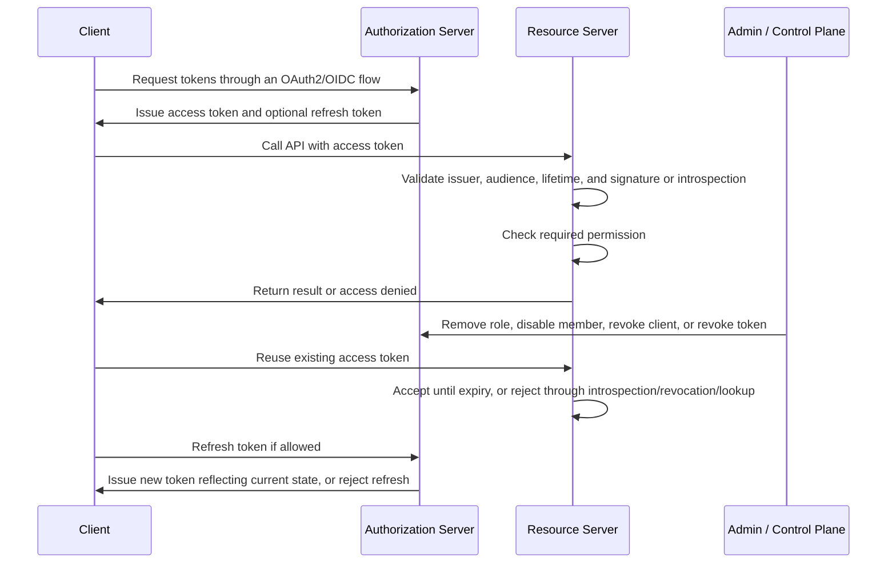

# Token Lifecycle

## What it is

Token lifecycle describes what happens to OAuth2 and OIDC tokens from the moment they are requested until they expire, are refreshed, are revoked, or stop being trusted.

The lifecycle is not just a timestamp problem. It connects authentication, authorization, browser sessions, resource-server validation, role changes, member disablement, logout, key rotation, audit logs, and incident response.

This page is conceptual wiki material. It does not choose a final token format, token lifetime, refresh-token policy, introspection strategy, identity provider, or production implementation.

## Why it matters

Tokens are bearer credentials in many OAuth2 systems. Whoever can present a valid bearer access token can often use the access it represents until the token expires or is rejected. A token lifecycle policy defines how long that access remains usable and which events can shorten or renew it.

If token lifecycle is vague, several failures become likely:

- a disabled member can keep calling APIs until a long-lived access token expires;
- a removed role can remain effective because old JWT claims still contain the role;
- a stolen refresh token can mint new access tokens after logout;
- resource servers can accept tokens from the wrong issuer or for the wrong audience;
- key rotation can break APIs or leave old signing keys trusted too long;
- audit logs cannot explain whether access was removed, expired, refreshed, or revoked.

The purpose of lifecycle design is to make those trade-offs explicit. Some systems prefer short-lived self-contained JWT access tokens and accept brief staleness. Other systems prefer opaque tokens with introspection so the authorization server can give fresher answers. Neither approach is automatically correct.

## Token types in the lifecycle

| Token or credential | Main receiver | Typical lifetime | Lifecycle concerns |
| --- | --- | --- | --- |
| Authorization code | Authorization server token endpoint | Very short, one-time use | Must be bound to the client, redirect URI, and PKCE verifier where applicable. |
| Access token | Resource server | Short | Must be validated before API use; may become stale if it contains roles or permissions. |
| ID token | Client | Short | Communicates authentication and identity information to the client; should not be used as an API access token. |
| Refresh token | Authorization server token endpoint | Longer than access tokens | More sensitive because it can request new access tokens; should be protected, rotated where appropriate, and revocable. |
| Signing key | Token issuer and resource servers | Operational rotation window | New keys must be published before use; old keys must remain available until issued tokens expire. |

See [Tokens and JWTs](./04-tokens-and-jwt.md) for token structure and validation details, and [OAuth2 Flows](./06-oauth2-flows.md) for how the main OAuth2 flows obtain tokens.

## Lifecycle stages

| Stage | What happens | Key question |
| --- | --- | --- |
| Client registration | A client is configured with allowed flows, redirect URIs, token settings, and credentials where needed. | Which clients are allowed to receive which token types? |
| Authorization request | The client starts a login or authorization flow. | Is the request bound to the expected client, redirect URI, state, nonce, and PKCE challenge? |
| Authorization code issuance | The authorization server returns a short-lived code to the client redirect URI. | Can the code be replayed, intercepted, or exchanged by the wrong client? |
| Token exchange | The client exchanges a code, refresh token, or client credential for tokens. | Was the client authenticated or bound strongly enough for this flow? |
| Token issuance | The authorization server issues access, ID, or refresh tokens. | What issuer, subject, audience, lifetime, scope, roles, permissions, and key are used? |
| Token storage | The client stores tokens or token references. | Are tokens kept out of browser-readable storage and logs? |
| API presentation | The client sends an access token to a resource server. | Is the token intended for this API and still valid? |
| Resource-server validation | The API validates the token and checks authorization. | Are issuer, audience, lifetime, signature or introspection result, and required permissions checked? |
| Refresh | The client uses a refresh token to obtain a new access token. | Does the new token reflect current member status and role assignments? |
| Access change | A member is disabled, a role is removed, or a client is revoked. | Does existing access stop immediately, at token expiry, or after a cache/introspection window? |
| Revocation or introspection | The authorization server rejects, marks inactive, or reports current token state. | Do resource servers actually consult that state, or do they validate JWTs locally? |
| Expiry | The token reaches its expiration time. | Is clock skew handled conservatively and consistently? |
| Key rotation | Signing keys are added, used, retained, and retired. | Can APIs validate tokens during rotation without trusting old keys forever? |
| Logout or session end | Local sessions, provider sessions, refresh tokens, and access tokens may end at different times. | What does "logout" mean for each layer? |

## Conceptual lifecycle flow

This diagram intentionally separates existing access tokens from future token issuance. A role removal can prevent new tokens from carrying that role while an old JWT access token may still contain it until expiry. Immediate removal requires a stronger mechanism such as short token lifetimes, introspection, revocation-aware validation, authorization lookup, session invalidation, or a combination of these controls.

## Expiry and staleness

Expiration is the simplest lifecycle control. A short-lived access token limits how long stolen or stale access can be used. It also bounds how long outdated JWT claims can remain effective after a role change.

The practical staleness window is not always just the access-token lifetime. It can include:

- access-token lifetime;
- resource-server clock skew allowance;
- JWKS or introspection cache lifetime;
- local authorization cache lifetime;
- BFF session lifetime;
- refresh-token lifetime and refresh behavior.

For example, if an API validates JWTs locally and permissions are embedded in the token, removed access may remain usable until the old token expires. If the API uses introspection, removed access may stop sooner, but the API now depends on the introspection endpoint and any cache policy.

## Role-removal latency

Role-removal latency is the time between an administrator removing access and the system actually denying that access everywhere. It is one of the most important lifecycle metrics for an authorization system.

| Runtime pattern | Typical latency driver | Operational implication |
| --- | --- | --- |
| JWT with embedded roles or permissions | Access-token lifetime plus clock skew and cache behavior. | Simple and resilient, but removed access may remain usable briefly. |
| Opaque token with introspection | Introspection result and cache lifetime. | Can reflect central state faster, but depends on the authorization server path. |
| JWT plus authorization lookup | Access-token validity plus lookup and cache behavior. | Good for high-risk operations, but adds runtime dependency and failure-mode decisions. |
| Session-only application authorization | Session invalidation and server-side permission lookup. | Can be immediate inside one app, but does not solve independent API token validation. |

The current study baseline allows removed access to expire at access-token expiry for the first version. That should be documented as an accepted staleness window, not confused with immediate revocation. If the business later requires immediate removal for administrator permissions, client management, or destructive operations, the design should add introspection, revocation-aware validation, authorization lookup, session invalidation, or shorter token lifetimes.

## Refresh-token lifecycle

Refresh tokens extend sessions without repeating the full login flow. That makes them useful for user experience and dangerous when mishandled.

A refresh-token lifecycle should define:

- which clients are allowed to receive refresh tokens;
- where refresh tokens are stored;
- whether refresh tokens rotate on each use;
- whether reuse detection is supported;
- when refresh tokens expire;
- which events revoke refresh tokens;
- whether refresh failure ends the local session;
- which refresh events are audited.

For a BFF architecture, refresh tokens should remain server-side. The browser should not store them in `localStorage`, `sessionStorage`, readable cookies, URLs, or frontend logs. See [BFF Sessions and Token Handling](../bff-sessions-and-token-handling.md) for the browser and session boundary.

## Revocation, introspection, and local JWT validation

Revocation and introspection are related but different concepts.

| Mechanism | What it does | Main trade-off |
| --- | --- | --- |
| Token expiry | The token is rejected after its `exp` time. | Simple, but not immediate. |
| Token revocation | The authorization server invalidates a token or grant where supported. | Resource servers must have a way to learn or enforce the revocation. |
| Token introspection | A resource server asks the authorization server whether a token is active and what it represents. | Fresher central state, but adds network dependency and cache decisions. |
| Local JWT validation | A resource server validates signature, issuer, audience, and lifetime without a per-request lookup. | Fast and resilient, but revocation and role changes are harder to reflect immediately. |
| Authorization lookup | A resource server validates the token and also asks a policy or IAM service for current permissions. | Useful for high-risk or high-churn permissions, but adds runtime coupling. |

Revoking a refresh token can stop future access tokens from being issued, but it does not automatically make already-issued self-contained JWT access tokens disappear from every API. That distinction is central to lifecycle design.

## Logout semantics

Logout is often misunderstood because several sessions and tokens can exist at once.

| Layer | What can end |
| --- | --- |
| Browser | Local cookie or frontend state is removed. |
| BFF | Server-side browser session is revoked. |
| Authorization server | Refresh token, grant, or provider session may be revoked or ended. |
| Resource server | Existing access tokens are rejected only if expired, introspected as inactive, revoked through a supported mechanism, or denied by an authorization lookup. |
| Identity provider | User login session may remain active unless provider logout is requested and supported. |

A user pressing "logout" should at minimum end the local application session. Whether logout also revokes refresh tokens, ends the identity provider session, or immediately invalidates access tokens is a design decision that must be documented.

## Key rotation lifecycle

JWT validation depends on signing keys. Key rotation must let new tokens use new keys without breaking APIs that still need to validate older unexpired tokens.

A typical rotation sequence is:

1. Generate or import a new signing key.
2. Publish the new public key through JWKS or provider metadata.
3. Wait long enough for resource servers to refresh key metadata.
4. Start signing new tokens with the new key.
5. Keep the previous public key available until all tokens signed with it have expired.
6. Retire the old key after its validation window is no longer needed.

Resource servers should not cache JWKS forever. They also should not accept keys from unexpected issuers or attacker-controlled metadata. Key rotation is an operational process, not only a cryptographic feature.

## Lifecycle decisions to document

| Decision | Why it matters |
| --- | --- |
| Access-token lifetime | Defines the maximum basic window for stolen or stale access. |
| Refresh-token lifetime | Defines how long a session can continue without a new login. |
| Refresh-token rotation | Reduces damage from refresh-token theft when supported and enforced. |
| Token format | JWTs favor local validation; opaque tokens usually favor central introspection. |
| Permissions in tokens | Faster API checks, but stale authorization state can persist until expiry. |
| Introspection cache duration | Reduces latency and dependency load, but can extend stale access. |
| Logout behavior | Users and operators need to know which sessions and tokens really end. |
| Member disablement behavior | Disabled users should not keep refreshing or receiving effective access. |
| Role removal behavior | Removed permissions should stop within an explicit, acceptable window. |
| Key rotation process | Prevents outages and limits trust in retired keys. |
| Audit events | Supports incident review, access review, and operational accountability. |

## Minimal PoC checks

| Check | Success condition |
| --- | --- |
| Token issuance | A client can obtain the expected token types through the selected flow. |
| API validation | A resource server rejects tokens with wrong issuer, wrong audience, invalid signature or inactive introspection result, and expired lifetime. |
| Expiry handling | An expired access token is rejected and the client behavior is predictable. |
| Refresh behavior | If refresh tokens are used, refresh succeeds under normal conditions and fails safely when the refresh token is expired or rejected. |
| Role-removal latency | Removed access stops working within the documented token lifetime, introspection window, or authorization lookup policy. |
| Member disablement | A disabled member cannot get new effective tokens, and existing access follows the documented expiry or revocation policy. |
| Logout | Local session, refresh token, provider session, and access-token behavior are each documented and tested where in scope. |
| Token storage | Tokens are not present in browser-readable storage, URLs, or logs. |
| Key rotation | Resource servers can validate tokens during a simulated or documented signing-key rotation window. |
| Audit evidence | Token revocation, refresh failure, logout, member disablement, and privileged access changes are auditable where supported. |

## Common mistakes

Do not assume a valid login means every later API request is authorized.

Do not use ID tokens as access tokens for APIs.

Do not make access tokens long-lived just to avoid implementing refresh or reauthentication behavior.

Do not store access tokens or refresh tokens in browser-readable storage for a BFF-based browser application.

Do not assume revoking a refresh token immediately invalidates already-issued JWT access tokens.

Do not embed high-churn authorization data in JWTs without accepting the staleness window or adding a stronger validation mechanism.

Do not cache introspection results or JWKS metadata longer than the lifecycle policy can tolerate.

Do not rotate signing keys without an overlap window for already-issued tokens.

Do not log bearer tokens, refresh tokens, authorization codes, client secrets, raw session IDs, or recovery codes.

## Related documents

- [Tokens and JWTs](./04-tokens-and-jwt.md)
- [OAuth2](./02-oauth2.md)
- [OpenID Connect](./03-openid-connect.md)
- [OAuth2 Flows](./06-oauth2-flows.md)
- [RBAC](./05-rbac.md)
- [Security Best Practices](./09-security-best-practices.md)
- [Auditability, Access Reviews, and Operational Ownership](./10-auditability-access-reviews-operational-ownership.md)
- [BFF Sessions and Token Handling](../bff-sessions-and-token-handling.md)
- [Member Lifecycle](../member-lifecycle.md)

## References

- [RFC 6749 - The OAuth 2.0 Authorization Framework](https://www.rfc-editor.org/rfc/rfc6749)
- [RFC 6750 - The OAuth 2.0 Authorization Framework: Bearer Token Usage](https://www.rfc-editor.org/rfc/rfc6750)
- [RFC 7009 - OAuth 2.0 Token Revocation](https://www.rfc-editor.org/rfc/rfc7009)
- [RFC 7519 - JSON Web Token](https://www.rfc-editor.org/rfc/rfc7519)
- [RFC 7662 - OAuth 2.0 Token Introspection](https://www.rfc-editor.org/rfc/rfc7662)
- [RFC 9068 - JSON Web Token (JWT) Profile for OAuth 2.0 Access Tokens](https://www.rfc-editor.org/rfc/rfc9068)
- [RFC 9700 - Best Current Practice for OAuth 2.0 Security](https://www.rfc-editor.org/rfc/rfc9700)
- [OpenID Connect Core 1.0](https://openid.net/specs/openid-connect-core-1_0.html)
- [OpenID Connect RP-Initiated Logout 1.0](https://openid.net/specs/openid-connect-rpinitiated-1_0.html)
