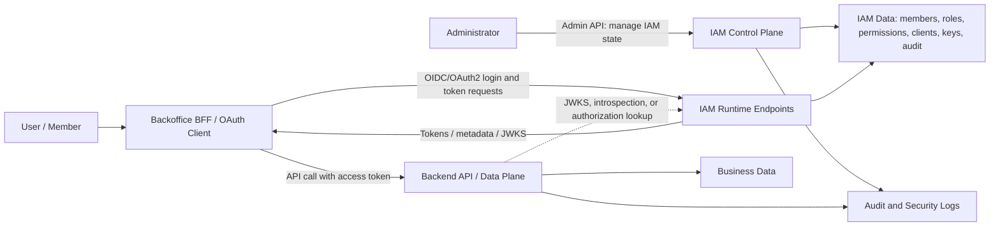

# IAM Control Plane vs Data Plane

This page explains how IAM control-plane and data-plane concepts fit together, how cloud IAM systems usually structure identity and authorization, and how existing industry solution families solve the root problems that appear when many applications, APIs, services, users, roles, and credentials need to be managed consistently.

This is conceptual study material. It does not choose a vendor, product, hosting model, database, implementation stack, or final architecture.

## Short version

An **IAM Control Plane** is the authority that manages identity and access state. It owns users or members, groups, roles, permissions, policies, OAuth2/OIDC clients, service accounts, key material, administrator operations, audit events, and sometimes policy decision APIs.

A **data plane** is where protected work happens. A data-plane service receives a request, validates the caller, checks whether the caller is allowed to perform the operation, and then executes or rejects the operation.

In small systems, the same application may own both planes. In larger or multi-service systems, the control plane is separated so every backend service does not reinvent identity, role assignment, token issuance, access review, audit logging, and credential lifecycle.

## Should it include IdP and OAuth2/OIDC?

For this study, yes. The IAM Control Plane should include the **IdP** and **OAuth2/OIDC authorization server** responsibilities because they are part of the same trust boundary: the central place that authenticates subjects, issues tokens, owns access state, and exposes administrative control over that state.

That does not mean every responsibility must be implemented by one custom codebase. "Include" means the IAM Control Plane owns the architecture responsibility and integration contract. The actual implementation might be:

- one product that provides IdP, OAuth2/OIDC, users, roles, clients, admin APIs, and audit logs;
- a managed identity provider plus a custom admin layer;
- a self-hosted identity platform plus project-specific permission modeling;
- an authorization server library plus custom member, role, audit, and admin behavior;
- a split design where authentication is delegated to an external IdP, while the local IAM Control Plane still owns application roles, clients, service permissions, and audit requirements.

The reason to keep these responsibilities under one IAM Control Plane concept is that login, token issuance, client registration, role assignment, and API authorization are coupled in real system behavior. A backend API cannot safely decide access unless it knows which issuer to trust, which audience the token is for, which subject or client is represented, where roles and permissions come from, how stale those permissions may be, and how privileged changes are audited.

| Responsibility | Why it belongs in the IAM Control Plane concept |
| --- | --- |
| IdP / authentication | The system must know who the human user, administrator, or external identity is before access can be evaluated. |
| OpenID Connect | OIDC standardizes login, identity tokens, user claims, provider metadata, and discovery for clients that rely on the provider. |
| OAuth2 authorization server | OAuth2 standardizes how clients obtain access tokens, how audiences and scopes are represented, and how APIs receive bearer credentials. |
| OAuth2/OIDC client management | Redirect URIs, grants, secrets, client keys, and allowed audiences directly affect token issuance and API trust. |
| Roles and permissions | Authentication alone is not enough; the system must define what authenticated subjects may do. |
| Admin APIs | IAM state changes are privileged operations and need server-side authorization, auditability, and clear ownership. |
| Audit and lifecycle | Access changes, account disablement, token policy changes, and client changes must be traceable. |

The useful mental model is:

```text
IAM Control Plane
  = IdP responsibilities
  + OAuth2/OIDC authorization server responsibilities
  + Admin Control Plane responsibilities
  + IAM data ownership and auditability
```

Use the narrower names when precision matters. Say `IdP` when discussing authentication and identity assertions. Say `authorization server` when discussing OAuth2 token issuance and protocol endpoints. Say `IAM Control Plane` when discussing the whole authority that owns identity, token issuance, access administration, and IAM auditability.

## Why the split exists

IAM grows painful because access decisions need data from several places:

| Root problem | What goes wrong without a control plane | What the control plane centralizes |
| --- | --- | --- |
| Identity sprawl | Each service invents its own users, groups, passwords, service accounts, and lifecycle states. | One identity source for members, administrators, clients, and machine identities. |
| Inconsistent authorization | Services interpret roles and permissions differently. | Shared role, permission, policy, or entitlement vocabulary. |
| Privilege drift | Users keep old access after changing jobs or projects. | Central assignment, review, disablement, and revocation workflows. |
| Unsafe administration | Privileged operations are hidden behind UI checks or scattered scripts. | Explicit admin APIs, operation-level permissions, and audit trails. |
| Token and key confusion | APIs trust the wrong token, skip issuer or audience validation, or cannot rotate keys cleanly. | Issuer metadata, JWKS, token lifetimes, client registration, revocation, and introspection behavior. |
| Weak machine identity | Services share static secrets or pretend to be human users. | Service clients, client credentials, key rotation, and separate machine permissions. |
| Poor auditability | There is no reliable answer to who granted access, who used it, or why a request was denied. | Administrative audit events, runtime authorization logs, and access review evidence. |
| Tight coupling | Business services read IAM tables directly and become coupled to identity schema details. | Stable token, metadata, introspection, authorization-check, or policy-decision contracts. |

The control plane does not remove authorization from backend services. It gives them trusted inputs and shared rules. The backend service still enforces access for its own operations.

## Control plane, runtime plane, and data plane

The word "data plane" can mean slightly different things depending on the system. Cloud providers often describe the data plane as the regional request path that authenticates and authorizes API calls using already-configured IAM data. In an application architecture, "data plane" usually means the protected application APIs and workers that perform business operations.

For this study, use three logical buckets:

| Plane | Owns | Typical operations | Main risk if confused |
| --- | --- | --- | --- |
| IAM control plane | IAM source-of-truth and privileged configuration. | Create member, disable member, create role, assign role, register client, rotate client secret, change token policy, review audit logs. | Every service invents its own IAM model, or admin operations become unaudited business endpoints. |
| IAM runtime/protocol plane | Runtime identity and authorization protocol behavior backed by control-plane state. | Login, authorization code exchange, token issuance, token refresh, token introspection, JWKS publication, OIDC discovery. | Login or tokens are treated as proof of every application permission. |
| Application data plane | Business APIs, workers, and protected resources. | Read report, update order, disable customer account, export data, run backoffice operation. | APIs trust frontend state or unvalidated claims instead of enforcing server-side permissions. |

These planes may be implemented by one product, several products, managed services, self-hosted services, libraries, or application code. The split is about responsibility, not necessarily about physical deployment.

## Basic architecture



The important design rule is that the backend API is not a passive database gateway. It validates the request and checks authorization before touching business data.

## What the IAM Control Plane owns

A complete IAM Control Plane does not need to be large, but it needs clear ownership boundaries.

| Domain | Control-plane responsibility | Data-plane consumption |
| --- | --- | --- |
| Members and users | Lifecycle state, identity attributes, administrator-managed creation, disablement, and deletion rules. | APIs use stable subject identifiers and active/inactive signals from tokens, introspection, or authorization lookups. |
| Authentication | Password, passkey, MFA, external IdP, recovery, login risk, and session policy where in scope. | APIs should not reauthenticate users; they rely on validated tokens or sessions. |
| OAuth2/OIDC clients | Client IDs, redirect URIs, grants, audiences, scopes, secrets, keys, and rotation. | BFFs and services use registered clients to obtain tokens. |
| Tokens and keys | Issuer, signing keys, JWKS, token lifetimes, claims, refresh, revocation, and introspection. | APIs validate issuer, audience, signature or introspection result, expiry, and required claims. |
| Roles and permissions | Role definitions, permission catalog, assignments, inheritance or grouping rules, and reviews. | APIs enforce operation-specific permissions such as `members:disable` or `reports:export`. |
| Machine identity | Service clients, service accounts, credentials, allowed audiences, and service permissions. | Workers and services obtain tokens as themselves, not as fake human users. |
| Admin APIs | Privileged operations for members, roles, permissions, clients, service accounts, access checks, and policy settings. | Backoffice UI or BFF calls admin APIs; admin APIs enforce permissions server-side. |
| Audit and evidence | Who changed IAM state, when, target, result, request context, and sometimes reason or ticket. | Security and operations teams review changes, investigate incidents, and prove control effectiveness. |

## What the data plane owns

The data plane owns business behavior. Even when an IAM Control Plane exists, each protected API must know what permission is required for each operation.

Examples:

| Data-plane operation | IAM input | Local data-plane responsibility |
| --- | --- | --- |
| `GET /members/{id}` | Caller subject and `members:read` permission. | Validate the token, check permission, apply any local data rules, return only allowed member data. |
| `POST /members/{id}/disable` | Caller subject and `members:disable` permission. | Prevent unsafe self-disablement if required, write business result, emit audit context. |
| `GET /reports/export` | Caller subject and `reports:export` permission. | Check export permission, enforce report-level rules, prevent data leakage. |
| Background billing sync | Service client identity and service permission. | Ensure the token represents the billing sync client, not a human admin; enforce least privilege. |

This is why "we use an IdP" is not enough. The IdP may prove who the user is. The resource server still decides whether that user may perform this specific operation.

## Token validation vs authorization

Token validation answers whether the token can be trusted. Authorization answers whether the trusted subject can perform the operation.

| Step | Question | Typical checks |
| --- | --- | --- |
| Token validation | Is this token valid for this API? | Issuer, audience, signature or introspection result, expiry, token type, algorithm constraints, client and subject claims. |
| Authorization | Can this caller perform this action? | Required permission, role assignment, scopes, resource ownership, service account grants, policy conditions, local business constraints. |

A valid token can still be unauthorized for a specific operation. A user can be authenticated and still lack `members:disable`.

## Common access-decision patterns

There are several ways for data-plane services to get authorization information. None is universally best.

| Pattern | How it works | Strengths | Trade-offs |
| --- | --- | --- | --- |
| JWT claims | Roles or permissions are embedded in signed access tokens. APIs validate tokens locally. | Fast, simple runtime path, fewer network calls. | Access changes may be stale until token expiry; tokens can grow; every API must validate carefully. |
| Opaque token plus introspection | APIs call an introspection endpoint to learn token state and claims. | Central state can be fresher; token contents are hidden from clients. | Adds network dependency and cache decisions. |
| Authorization check API | API asks the IAM Control Plane whether subject X can do action Y on resource Z. | Central policy decision and fresher assignment state. | Tighter runtime dependency; needs careful latency, caching, and failure behavior. |
| Local policy plus central identity | APIs validate token identity but keep operation policies locally. | Keeps business-specific rules near business code. | Can fragment policy vocabulary if not governed. |
| External policy engine | API sends structured input to a policy decision point such as OPA or a managed authorization service. | Separates policy decision from application code; supports richer rules. | Requires policy lifecycle, testing, deployment, and observability. |

For this study's expected scale, the goal is not to maximize sophistication. The goal is to choose the least complex pattern that still gives reliable enforcement, auditability, and maintainable administration.

## Cloud IAM architecture

Cloud providers generally need IAM because they expose many APIs across many services and regions. They need a stable answer to:

- who is making the request;
- what resource the request targets;
- what action is requested;
- what roles, policies, or assignments apply;
- whether deny rules, conditions, or boundaries apply;
- how to audit the decision.

Cloud IAM systems usually contain these pieces:

| Piece | Meaning |
| --- | --- |
| Principal | A user, group, service account, application, role, or workload identity that can be granted access. |
| Resource | Something protected, such as a project, bucket, virtual machine, database, API, or application object. |
| Permission/action | A specific operation, often named like `service.resource.verb` or `resource:action`. |
| Role | A named bundle of permissions. |
| Policy or role binding | The statement that grants or denies a principal a role, permission, or action on a resource or scope. |
| Scope/resource hierarchy | The level where access applies, such as organization, folder, project, subscription, resource group, or resource. |
| Policy evaluation | The runtime algorithm that combines identity, action, resource, inherited grants, denies, conditions, and context. |
| Audit trail | Records for changes to IAM state and sometimes runtime access decisions. |

Cloud IAM is usually more advanced than a small internal backoffice needs, but it teaches the key architecture pattern: centralize the policy source of truth, distribute only what runtime systems need, and make enforcement explicit.

## Industry examples

The following examples are not recommendations. They show common solution families and the root problem each family is designed to solve.

| Family | Examples | What it solves | What it usually does not solve alone |
| --- | --- | --- | --- |
| Cloud-provider IAM | AWS IAM, Google Cloud IAM, Azure RBAC with Microsoft Entra identities. | Access to cloud resources across many services, accounts, projects, subscriptions, roles, scopes, and service identities. | Product-specific application member lifecycle and business permissions unless modeled separately. |
| Workforce and application identity platforms | Microsoft Entra ID, Auth0, Okta, similar managed IdP platforms. | User authentication, federation, MFA, application login, app assignment, groups, provisioning, and often admin APIs. | Fine-grained per-operation business authorization unless roles, permissions, custom claims, or a separate authorization layer are designed. |
| Self-hosted identity platforms | Keycloak and similar self-hosted identity products. | Running your own identity provider, OIDC/OAuth2, users, clients, roles or groups, admin surface, and integration with internal apps. | Operational burden, upgrades, backups, hardening, and any product-specific gaps in permission modeling or admin API fit. |
| Authorization server libraries | Spring Authorization Server, OpenIddict, node-oidc-provider. | Standards-compliant OAuth2/OIDC protocol engine with high customization control. | Full IAM product behavior: user lifecycle, admin UI/API, audit logs, role management, MFA, recovery, operations, and security hardening. |
| Fine-grained authorization systems | Amazon Verified Permissions, OPA, Cedar-based systems, policy engines. | Central policy decision-making for application authorization, RBAC/ABAC, policy testing, and decoupling decisions from application code. | User authentication, OIDC login, token issuance, account lifecycle, and full identity administration. |
| Application-owned local IAM | A conventional backend with users, roles, sessions, permissions, and audit tables. | Simplicity for one application with no independent API boundary or SSO requirement. | Cross-service tokens, federation, reusable SSO, standardized OAuth2/OIDC integration, and independent service authorization. |

## How industry solutions solve the root problems

### AWS IAM style

AWS IAM separates management of IAM resources from regional runtime authorization behavior. AWS documents IAM resources such as roles and policies as control-plane configuration, and regional IAM data planes as the path that performs authentication and authorization for requests. This solves a cloud-scale availability problem: runtime authorization should keep working regionally even when management APIs or propagation paths have issues.

The lesson for application IAM is not that a small backoffice needs AWS-scale replication. The lesson is to separate "who can change IAM state" from "how protected requests are evaluated" and to define expected consistency. If an administrator removes access, the design should state whether APIs observe that immediately, after token expiry, after cache expiry, or after policy propagation.

### Google Cloud IAM style

Google Cloud IAM frames access around principals, roles, permissions, resources, allow policies, and a resource hierarchy. This solves the problem of assigning permissions consistently across many services without creating one-off ACL models for every API.

The lesson for application IAM is to name permissions as operations and bind them to principals through roles or policies. "Can access billing" is vague. `billing:reports:read` and `billing:reports:export` are enforceable and auditable.

### Azure RBAC and Microsoft Entra style

Azure RBAC models access as a role assignment with a security principal, role definition, and scope. Microsoft Entra ID manages user identities and access to applications, data, and resources. Together, they illustrate the split between identity source, application identities, roles, scopes, and resource authorization.

The lesson for application IAM is to distinguish identity management from resource authorization. A user existing in the directory is not the same as the user having permission to perform an operation on a protected service.

### Keycloak and self-hosted IdP style

Keycloak uses realms to manage users, credentials, roles, groups, and clients. This solves the problem of operating a standards-based identity provider without building every OAuth2/OIDC and account-management behavior from scratch.

The lesson for application IAM is that a self-hosted IdP can cover a large part of the IAM Control Plane, but the team still needs to verify how its roles, groups, admin APIs, audit behavior, storage, and operational model map to the application's permissions and lifecycle rules.

### Managed application identity platform style

Managed platforms such as Auth0 or Microsoft Entra ID reduce the burden of authentication, federation, MFA, user management, hosted login, and protocol correctness. They often provide dashboards and management APIs for users, roles, permissions, applications, and organizations.

The lesson for application IAM is to avoid rebuilding commodity identity behavior unless the project has a strong reason. The remaining work is integration design: token audiences, claim shape, role and permission mapping, admin workflows, audit evidence, and how backend APIs enforce access.

### Authorization library style

Libraries such as Spring Authorization Server, OpenIddict, and node-oidc-provider solve the protocol-engine problem. They help implement OAuth2/OIDC endpoints, token issuance, metadata, JWKS, revocation, introspection, and client behavior.

The lesson is ownership. A library can be excellent for the protocol layer while still leaving the product layer to the team: member storage, passwords or external identities, MFA, admin APIs, role assignment, audit logs, operational dashboards, break-glass access, backup, and incident response.

### Fine-grained authorization service or policy engine style

Authorization services and policy engines separate policy decisions from application code. Amazon Verified Permissions, for example, externalizes authorization and centralizes policy management for custom applications. OPA similarly decouples policy decision-making from enforcement.

The lesson is that policy engines solve "can this subject do this action on this resource in this context?" They do not automatically solve login, user lifecycle, OAuth2/OIDC token issuance, or administrator account management. They are usually a complement to an IAM Control Plane, not a replacement for one.

## Design questions to ask

Use these questions when studying any IAM approach:

| Question | Why it matters |
| --- | --- |
| What is the source of truth for members, administrators, roles, permissions, clients, and service accounts? | Prevents duplicate IAM databases and unclear ownership. |
| Which operations are control-plane mutations? | Identifies what must be strongly authorized and audited. |
| Which operations are data-plane business operations? | Keeps business enforcement in protected services. |
| How do APIs validate tokens? | Prevents accepting tokens from the wrong issuer, audience, algorithm, or client. |
| Where are permissions evaluated? | Determines latency, consistency, cache, outage, and audit behavior. |
| How fast do access changes take effect? | Defines stale-access windows and revocation expectations. |
| How are administrator actions audited? | Supports incident investigation and access governance. |
| How are machine identities represented? | Prevents services from sharing secrets or impersonating human users. |
| What happens during IAM outage or degraded mode? | Defines whether APIs fail closed, use cache, introspect, or accept existing sessions. |
| What is product-owned vs provider-owned? | Clarifies whether a solution is a complete product, a managed platform, a self-hosted service, or a library requiring custom product work. |

## Common mistakes

Do not use `IdP` as a name for the whole domain when the system also owns roles, permissions, clients, admin APIs, and audit trails. `IdP` is useful for the authentication and identity-provider part.

Do not treat the IAM Control Plane as the only authorization enforcement layer. Backend APIs still need operation-level checks.

Do not treat a valid ID token as permission to call APIs. ID tokens describe authentication to a client. APIs should use access tokens or another explicit authorization mechanism.

Do not put every authorization decision in JWT claims without accepting the stale-access window. If permissions must change immediately, design for short token lifetimes, introspection, policy checks, or revocation-aware behavior.

Do not build a custom authorization server just to avoid learning IAM concepts. Libraries reduce protocol implementation work, but they do not remove the need to design lifecycle, admin, audit, and operations.

Do not adopt a cloud-scale IAM pattern blindly. Cloud IAM systems solve multi-account, multi-region, multi-service, and hierarchical resource problems. A small internal backoffice may need the same concepts but much less machinery.

## Related pages

- [Authentication vs Authorization](./01-authentication-vs-authorization.md)
- [OAuth2](./02-oauth2.md)
- [OpenID Connect](./03-openid-connect.md)
- [Tokens and JWTs](./04-tokens-and-jwt.md)
- [RBAC](./05-rbac.md)
- [OAuth2 Flows](./06-oauth2-flows.md)
- [Service-to-Service Authentication](./07-service-to-service-authentication.md)
- [Admin API](./08-admin-api.md)
- [Token Lifecycle](./12-token-lifecycle.md)
- [OAuth Client Management](./13-oauth-client-management.md)
- [IAM Architecture](./15-iam-architecture.md)
- [IAM Responsibility Model](./16-iam-responsibility-model.md)
- [IAM Data Model](./22-iam-data-model.md)
- [Key Management and Signing Keys](./23-key-management-and-signing-keys.md)
- [Web Sessions, Cookies, and BFF Pattern](./24-web-sessions-cookies-and-bff.md)

## References

- [RFC 6749 - The OAuth 2.0 Authorization Framework](https://www.rfc-editor.org/rfc/rfc6749)
- [RFC 6750 - The OAuth 2.0 Authorization Framework: Bearer Token Usage](https://www.rfc-editor.org/rfc/rfc6750)
- [RFC 7009 - OAuth 2.0 Token Revocation](https://www.rfc-editor.org/rfc/rfc7009)
- [RFC 7662 - OAuth 2.0 Token Introspection](https://www.rfc-editor.org/rfc/rfc7662)
- [RFC 8414 - OAuth 2.0 Authorization Server Metadata](https://www.rfc-editor.org/rfc/rfc8414)
- [RFC 9700 - Best Current Practice for OAuth 2.0 Security](https://www.rfc-editor.org/rfc/rfc9700)
- [OpenID Connect Core 1.0](https://openid.net/specs/openid-connect-core-1_0.html)
- [OpenID Connect Discovery 1.0](https://openid.net/specs/openid-connect-discovery-1_0.html)
- [AWS IAM - Resilience in AWS Identity and Access Management](https://docs.aws.amazon.com/IAM/latest/UserGuide/disaster-recovery-resiliency.html)
- [AWS IAM - How permissions and policies provide access management](https://docs.aws.amazon.com/IAM/latest/UserGuide/introduction_access-management.html)
- [Google Cloud IAM overview](https://cloud.google.com/iam/docs/overview)
- [Google Cloud IAM roles and permissions](https://cloud.google.com/iam/docs/roles-overview)
- [Microsoft Entra ID documentation](https://learn.microsoft.com/en-us/entra/identity/)
- [Azure role-based access control overview](https://learn.microsoft.com/en-us/azure/role-based-access-control/overview)
- [Keycloak Server Administration Guide](https://www.keycloak.org/docs/latest/server_admin/)
- [Auth0 - Manage Role-Based Access Control Roles](https://auth0.com/docs/manage-users/access-control/configure-core-rbac/roles)
- [Spring Authorization Server - Overview](https://docs.spring.io/spring-authorization-server/reference/overview.html)
- [OpenIddict - Introduction](https://documentation.openiddict.com/introduction)
- [node-oidc-provider](https://github.com/panva/node-oidc-provider)
- [Amazon Verified Permissions - What is Amazon Verified Permissions?](https://docs.aws.amazon.com/verifiedpermissions/latest/userguide/what-is-avp.html)
- [Open Policy Agent documentation](https://www.openpolicyagent.org/docs)
- [Kubernetes Components](https://kubernetes.io/docs/concepts/overview/components/)
