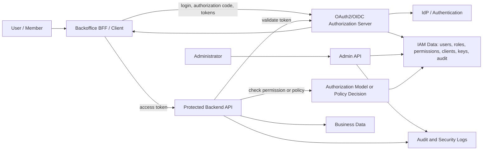

# IAM Architecture

IAM architecture is the full design of how identities, applications, services, credentials, tokens, permissions, policies, administrator operations, audit trails, and protected resources work together.

There is no single official term that perfectly means "IAM control plane plus data plane plus runtime protocol behavior." In industry writing, the umbrella term is usually one of:

- **IAM architecture** when discussing the overall system design;
- **IAM system** when discussing the deployed capability as a whole;
- **IAM platform** or **identity platform** when discussing a product or internal platform that provides shared identity and access capabilities;
- **authorization system** when discussing the permission-decision side specifically.

This page explains those terms, maps the major IAM architecture domains, and critiques common working industry solution families. It is conceptual study material and does not choose a vendor, product, hosting model, implementation stack, or final architecture.

## Vocabulary

| Term | Best use | Why it matters |
| --- | --- | --- |
| IAM architecture | The whole design: identity, authentication, authorization, administration, runtime enforcement, audit, and operations. | Best umbrella term for system design discussions. |
| IAM system | A deployed system or capability that implements IAM responsibilities. | Neutral; can mean one service, multiple services, or a product ecosystem. |
| IAM platform | A reusable internal or vendor platform for identity and access management. | Useful when the IAM capability is shared across applications. |
| Identity platform | Vendor-friendly term for login, user management, federation, MFA, apps, clients, and often token services. | Common in managed IdP and CIAM products, but may understate application authorization complexity. |
| Authorization system | The part that decides whether a principal may perform an action on a resource. | Useful for policy engines, ReBAC systems, and fine-grained authorization. |
| IAM Control Plane | The authority that owns IAM state and privileged IAM operations. | Good project shorthand for IdP, OAuth2/OIDC authorization server, admin APIs, IAM data, and audit. |
| IAM data plane or runtime plane | The runtime path that authenticates, issues tokens, validates tokens, or evaluates authorization using control-plane state. | Important for latency, availability, consistency, caching, and revocation behavior. |
| Application data plane | Business APIs and workers that use IAM inputs to enforce access before doing protected work. | Prevents the mistake of relying only on login or frontend checks. |

The important point is not the label. The important point is to keep the responsibilities separate enough that design decisions are clear.

## Critique of common umbrella terms

| Candidate term | Strength | Weakness |
| --- | --- | --- |
| IAM architecture | Most accurate for the whole domain. Includes control plane, runtime behavior, data-plane enforcement, governance, and operations. | Sounds like a document or discipline, not necessarily a product or service name. |
| IAM system | Simple and widely understood. | Vague; does not say whether it includes login, token issuance, authorization, or governance. |
| IAM platform | Good for an internal shared capability or vendor platform. | Can imply more maturity, self-service, and operational ownership than a small project has. |
| Identity platform | Common in industry and vendor language. Good when the biggest problem is login, federation, MFA, and user lifecycle. | Too identity-heavy if the main risk is backend authorization, admin APIs, permissions, and auditability. |
| Authorization system | Precise when the focus is policy definition, policy evaluation, RBAC, ABAC, ReBAC, or entitlements. | Too narrow for user authentication, OAuth2/OIDC login, account recovery, MFA, and client lifecycle. |
| IdP | Precise for user authentication and identity assertions. | Too narrow for this study because it does not naturally include admin APIs, OAuth2 client management, permission catalog, or audit requirements. |
| Authorization server | Precise for OAuth2/OIDC token issuance. | Too protocol-focused; does not naturally include member lifecycle, roles, admin APIs, or operational ownership. |

For this repository, use **IAM Control Plane** for the central component under study, and **IAM architecture** for the overall design that includes BFF, protected APIs, enforcement, audit, and operations.

## Domain map

An industrial IAM architecture usually crosses several domains:

| Domain | Core questions |
| --- | --- |
| Identity source | Where do human users, administrators, service accounts, and workload identities come from? |
| Authentication | How does the system verify a human or machine identity? Password, passkey, MFA, SSO, certificate, client secret, private key? |
| Federation | Does the system delegate login to another IdP using OIDC, SAML, social login, or enterprise SSO? |
| OAuth2/OIDC protocol | Which clients can request tokens? Which grants, scopes, audiences, claims, issuers, keys, and lifetimes are allowed? |
| Session model | Where are browser sessions stored? Are tokens exposed to the browser or kept server-side by a BFF? |
| Authorization model | Is access represented as roles, permissions, scopes, attributes, relationships, policies, or entitlements? |
| Enforcement | Where is authorization checked: in APIs, gateways, BFF, policy engine, token claims, introspection, or all of these? |
| Administration | Who can create users, disable accounts, assign roles, register clients, rotate secrets, and review access? |
| Audit and governance | Can the team explain who had access, who changed it, when, why, and what evidence exists? |
| Operations | How are keys rotated, secrets protected, backups restored, outages handled, migrations run, and incidents investigated? |

The architecture is weak if any domain is "some library handles it" without an explicit ownership answer.

## Reference architecture



This diagram shows logical responsibilities, not required deployment units. A single product may implement most boxes. A hybrid design may split them across a managed IdP, a custom admin service, a policy engine, and application APIs.

## What industrial-grade means

An industrial IAM architecture is not just "login works." It has answers for reliability, security, governance, and change.

| Capability | Industrial-grade expectation |
| --- | --- |
| Protocol correctness | OAuth2/OIDC endpoints, redirect URI validation, issuer metadata, JWKS, PKCE, token audience, token lifetime, revocation, and introspection behavior are correct and documented. |
| Credential protection | Passwords, client secrets, private keys, refresh tokens, and admin credentials are stored and rotated safely. |
| Least privilege | Roles, permissions, scopes, clients, and admin capabilities are narrow enough to review and enforce. |
| Admin safety | Privileged actions require server-side checks, are audited, and avoid self-escalation or accidental broad assignment. |
| Runtime enforcement | APIs validate tokens and check operation-level authorization independently of frontend UI state. |
| Auditability | Administrative changes and high-risk decisions produce useful evidence: actor, target, action, result, timestamp, request context. |
| Consistency model | The team knows how quickly access changes take effect and what stale-access windows exist. |
| Availability model | The team knows whether protected APIs fail closed, use cached token validation, call introspection, or call a policy service during IAM outages. |
| Migration path | Users, roles, clients, secrets, and audit data can be migrated or exported if the solution changes. |
| Operational ownership | Someone owns upgrades, backups, incident response, key rotation, rate limits, provider limits, and support paths. |

## Industry solution families

The following categories describe working solution families. They overlap in practice.

### 1. Application-owned local IAM

In this model, one application owns users, credentials or external identities, roles, permissions, sessions, and audit logs in its own database.

**Solves well**

- Small systems with one application and no independent API trust boundary.
- Simple administrator-created users.
- Tight coupling between business operations and authorization rules.
- Low infrastructure footprint.

**Critique**

- The team owns password security, MFA, recovery, session security, CSRF protection, audit integrity, and privileged admin safety.
- It does not naturally provide OAuth2/OIDC integration for other services.
- It can become painful once multiple APIs, UIs, service accounts, or external identity integrations appear.
- It is easy to end up with implicit permissions hidden in application code.

**Industrial lesson**

This can be the best simple architecture when the product is truly one backend. It becomes a liability when it pretends to be a reusable IAM platform without the operational and security controls of one.

### 2. Managed identity platform

Examples include Auth0, Okta Customer Identity, Amazon Cognito user pools, Microsoft Entra External ID, and similar products.

These platforms commonly provide hosted login, user management, MFA, federation, OAuth2/OIDC, application registration, token issuance, management APIs, and varying levels of roles, groups, permissions, organizations, or tenant concepts.

**Solves well**

- Avoiding custom login, password storage, MFA, account recovery, and standards maintenance.
- Federating to social, enterprise, SAML, or OIDC identity providers.
- Issuing OIDC ID tokens and OAuth2 access tokens to applications.
- Managing application clients and hosted login UX.
- Delegating commodity identity operations to a provider with operational maturity.

**Critique**

- Business authorization still needs design. Vendor roles, groups, scopes, and permissions may not map cleanly to operation-level backend permissions.
- Token-claim authorization can introduce stale-access windows.
- Pricing, quotas, tenant limits, management API limits, data residency, export behavior, and customization boundaries matter.
- Some features are plan-dependent. Do not assume that organizations, machine-to-machine access, fine-grained authorization, or advanced admin APIs are available in every tier.
- Vendor dashboards can hide important configuration drift unless infrastructure-as-code or configuration export is used.

**Industrial lesson**

Managed identity platforms are strong when the root problem is authentication, federation, MFA, hosted login, and user lifecycle. They are not automatically a complete application authorization model.

### 3. Workforce IAM and cloud identity

Examples include Microsoft Entra ID, Okta Workforce Identity, Google Workspace/Cloud Identity, and IAM Identity Center for workforce access to cloud accounts.

**Solves well**

- Employee identity, SSO, MFA, conditional access, device or risk-based access, app assignment, lifecycle, and governance.
- Centralized workforce login across many SaaS and internal applications.
- Integration with HR and directory processes.

**Critique**

- Workforce IAM is not the same thing as application-specific authorization.
- A user being in the company directory does not mean they can perform `members:disable` in a backoffice API.
- Groups can be too coarse or too reused across systems to serve as fine-grained product permissions.
- Governance workflows may be excellent for enterprise access reviews but too heavy for a small internal backoffice if copied blindly.

**Industrial lesson**

Use workforce IAM as an identity source where it exists. Still define the application's roles, permissions, token audiences, and backend enforcement.

### 4. Cloud-provider IAM

Examples include AWS IAM, Google Cloud IAM, and Azure RBAC.

Cloud IAM systems authorize access to cloud resources. They model principals, roles or policies, permissions, resource hierarchy, scopes, and audit trails.

**Solves well**

- Access to infrastructure and cloud APIs across accounts, projects, subscriptions, folders, organizations, and resources.
- Machine and workload identities for cloud services.
- Fine-grained delegation for cloud operations.
- Large-scale audit and policy evaluation for infrastructure changes.

**Critique**

- Cloud IAM does not automatically become the authorization model for a custom business application.
- Cloud permissions are usually infrastructure permissions, not product permissions.
- The resource hierarchy can be too complex for a small backoffice domain.
- Cloud IAM patterns can be misleading if copied into an application without the same scale, resource model, or operational needs.

**Industrial lesson**

Cloud IAM is one of the clearest examples of mature IAM architecture, but it should be treated as a reference model, not copied mechanically.

### 5. Self-hosted identity platform

Examples include Keycloak, ZITADEL, authentik-style products, and modular Ory deployments.

These systems usually provide OIDC/OAuth2, users, clients, groups or roles, admin UI or APIs, federation, and deployment control. Some are full identity platforms. Some are intentionally modular, where user management, OAuth2 server behavior, and authorization are separate components.

**Solves well**

- Avoiding SaaS lock-in while still not building every identity feature from scratch.
- Keeping identity infrastructure under team or infrastructure control.
- Supporting OIDC/OAuth2 and enterprise integration patterns.
- Customizing deployment, database, network, and operational posture.

**Critique**

- Self-hosting moves operational burden to the team: upgrades, backups, database maintenance, key rotation, monitoring, incident response, and security hardening.
- The product's role/group model may not match the application's permission catalog.
- Admin API and audit behavior must be verified, not assumed.
- High availability and disaster recovery are project responsibilities.

**Industrial lesson**

Self-hosted platforms can be excellent when the organization accepts IAM operations as a real responsibility. They are risky when chosen only because they are open source.

### 6. Authorization server library or framework

Examples include Spring Authorization Server, OpenIddict, node-oidc-provider, and Ory Hydra when used as a protocol server integrated with external identity systems.

These solve the OAuth2/OIDC protocol engine problem: endpoints, grants, tokens, metadata, clients, keys, revocation, introspection, and discovery.

**Solves well**

- Building a custom OAuth2/OIDC authorization server with control over storage, login, consent, claims, and integration behavior.
- Avoiding a large product when only protocol machinery is needed.
- Fitting identity behavior into an existing application stack.

**Critique**

- A protocol engine is not a complete IAM product.
- The team still owns user lifecycle, credentials or federation, MFA, admin APIs, role assignment, audit logs, UI, data model, operations, and security review.
- Protocol libraries can create a false sense of completeness because token issuance works before the surrounding IAM governance exists.
- Maintainer health, versioning, security updates, and framework lifecycle matter.

**Industrial lesson**

Libraries are powerful when the team deliberately wants to own IAM product behavior. They are not a shortcut around IAM architecture.

### 7. Externalized policy engine

Examples include OPA/Rego, Cedar, and Amazon Verified Permissions.

These systems separate policy decision-making from application code. The application passes structured input such as principal, action, resource, and context. The engine returns an allow or deny decision.

**Solves well**

- Centralizing policy logic.
- Auditing and testing authorization rules outside application code.
- Supporting ABAC, contextual decisions, and policy-as-code workflows.
- Avoiding duplicated authorization logic across many services.

**Critique**

- Policy engines usually do not authenticate users, issue OIDC tokens, manage user lifecycle, or replace an IdP.
- Application teams must still define the entity model, request context, policy data, policy lifecycle, deployment, testing, and observability.
- Runtime dependency on a policy engine introduces latency and outage questions.
- A policy language can become another expert-only system if governance is weak.

**Industrial lesson**

Policy engines are best when authorization logic is complex enough to justify externalization. For simple RBAC, they may be unnecessary machinery.

### 8. Zanzibar-style relationship authorization

Examples include Google's Zanzibar paper, SpiceDB, OpenFGA, and Ory Keto-style systems.

These systems model authorization as relationships between subjects and objects. They are strong when access depends on ownership, group membership, hierarchy, sharing, organization membership, parent-child resources, or nested collaboration.

**Solves well**

- Fine-grained authorization over many resource objects.
- Document sharing, workspace membership, nested teams, inherited access, and collaboration models.
- Central permission checks across multiple applications.
- Some consistency problems around permissions changing while content changes.

**Critique**

- ReBAC is conceptually different from simple RBAC and requires modeling discipline.
- Applications must keep relationship data synchronized with business data.
- Operationally, the authorization store becomes a critical low-latency dependency.
- It is often too much for a small internal backoffice if permissions are only coarse roles.

**Industrial lesson**

Zanzibar-style systems are not "better RBAC" by default. They solve relationship-heavy authorization. Use them when the resource model needs that power.

### 9. API gateway or service mesh authorization

API gateways and service meshes can enforce coarse-grained access rules, validate JWTs, require mTLS, and route requests based on policy.

**Solves well**

- Edge validation, coarse routing protection, mTLS enforcement, and consistent token validation at boundaries.
- Reducing duplicated middleware setup across services.
- Blocking obviously invalid requests before they reach application code.

**Critique**

- Gateways rarely know enough business context to authorize individual operations safely.
- Fine-grained checks still belong in backend services or a dedicated authorization decision path.
- Gateway policies can diverge from application logic unless carefully governed.

**Industrial lesson**

Gateways are useful enforcement points, not a replacement for application authorization.

### 10. Hybrid IAM architecture

Most real systems are hybrids. A common industry shape is:

```text
Managed or self-hosted IdP
    + OAuth2/OIDC token service
    + application-owned permission catalog
    + admin API for product-specific IAM state
    + backend APIs enforcing operation permissions
    + optional policy engine for complex decisions
```

**Solves well**

- Uses mature identity products for commodity identity.
- Keeps product-specific permissions close to the application domain.
- Allows a small system to start simple and later introduce policy engines or ReBAC only when justified.

**Critique**

- Ownership boundaries must be explicit.
- Duplicate roles may appear in the IdP, application database, and tokens.
- Token claim design, stale access, and admin audit must be deliberately managed.

**Industrial lesson**

Hybrid is often the realistic architecture. The hard part is writing down which component owns each IAM fact.

## How to read vendor claims critically

Vendor documentation is useful because it describes working products, but it is not the same as architecture fit.

| Vendor claim | Architecture question to ask |
| --- | --- |
| "Supports OAuth2/OIDC" | Which flows, token types, claims, audiences, issuer metadata, revocation, introspection, and client-auth methods are supported? |
| "Supports RBAC" | Are roles global, per application, per API, per organization, or per resource? Can permissions be reviewed and exported? |
| "Supports organizations" | Does this mean B2B tenants, customer organizations, internal departments, or authorization scopes? |
| "Has an admin API" | Can it manage exactly the entities and operations this backoffice needs, with least privilege and audit events? |
| "Fine-grained authorization" | Is it RBAC, ABAC, ReBAC, policy-as-code, or token scopes? Where is enforcement performed? |
| "Serverless or managed" | What are the limits, quotas, rate limits, outage behavior, region options, and data export story? |
| "Open source" | Who operates it, patches it, backs it up, monitors it, and responds during an incident? |
| "Scales globally" | Does this project need that scale, and what complexity comes with it? |

## Practical architecture checklist

Before evaluating a product or library, answer these:

1. What is the top-level term for the overall design: IAM architecture, IAM system, IAM platform, or identity platform?
2. What is the central IAM authority in the design?
3. Does the central authority include IdP, OAuth2/OIDC authorization server, admin APIs, and IAM data ownership?
4. Which parts are delegated to a provider, and which parts are product-owned?
5. Which backend operations require which permissions?
6. Are permissions stored in tokens, read from an introspection endpoint, checked through an authorization API, or evaluated locally?
7. How quickly do role and permission changes take effect?
8. How are client secrets, signing keys, refresh tokens, and admin credentials rotated?
9. Who can perform privileged IAM changes?
10. What audit events prove that access was granted, used, reviewed, changed, or revoked?
11. What fails if the IdP, token service, admin API, or policy engine is down?
12. How can the system be migrated away from the chosen provider or implementation?

## What this means for this study

For this repository:

- use **IAM architecture** for the overall system design;
- use **IAM Control Plane** for the central component under study;
- keep **IdP** for authentication and identity-provider behavior;
- keep **Authorization Server** for OAuth2/OIDC token issuance behavior;
- keep **Admin Control Plane** or **Admin API** for privileged IAM management;
- keep **Authorization System** for policy and permission evaluation when discussing that narrower domain.

The current study should not assume that one product must own everything. It should define the required responsibilities first, then evaluate whether a managed platform, self-hosted platform, library-based implementation, policy engine, or hybrid can satisfy them with acceptable complexity.

## Common mistakes

Do not choose a term because it sounds mature. "Platform" implies operational maturity and reusable capabilities. If the project is still a single service, say "system" or "component."

Do not collapse authentication and authorization into "IdP." The IdP can authenticate a user while the API still needs to decide whether that user can perform an operation.

Do not treat OAuth2 scopes as a complete authorization model without checking whether they represent user permissions, client delegation, API operation grants, or just token request vocabulary.

Do not assume vendor RBAC means application RBAC. The role's scope, lifecycle, token behavior, and assignment model matter.

Do not outsource the root problem to a library. A library can implement protocol endpoints, but the architecture still needs lifecycle, admin, audit, operations, and data ownership.

Do not copy cloud IAM complexity into a small backoffice unless the requirements actually need cloud-style resource hierarchy, inheritance, deny policies, or global propagation.

## Related pages

- [Authentication vs Authorization](./01-authentication-vs-authorization.md)
- [OAuth2](./02-oauth2.md)
- [OpenID Connect](./03-openid-connect.md)
- [Tokens and JWTs](./04-tokens-and-jwt.md)
- [RBAC](./05-rbac.md)
- [OAuth2 Flows](./06-oauth2-flows.md)
- [Service-to-Service Authentication](./07-service-to-service-authentication.md)
- [Admin API](./08-admin-api.md)
- [Token Lifecycle](./12-token-lifecycle.md)
- [OAuth Client Management](./13-oauth-client-management.md)
- [IAM Control Plane vs Data Plane](./14-iam-control-plane-vs-data-plane.md)
- [IAM Responsibility Model](./16-iam-responsibility-model.md)
- [Authorization Models](./18-authorization-models.md)
- [Policy Engines and Fine-Grained Authorization](./21-policy-engines-and-fine-grained-authorization.md)
- [IAM Data Model](./22-iam-data-model.md)
- [Key Management and Signing Keys](./23-key-management-and-signing-keys.md)
- [Web Sessions, Cookies, and BFF Pattern](./24-web-sessions-cookies-and-bff.md)

## References

- [AWS IAM - Resilience in AWS Identity and Access Management](https://docs.aws.amazon.com/IAM/latest/UserGuide/disaster-recovery-resiliency.html)
- [AWS IAM - How permissions and policies provide access management](https://docs.aws.amazon.com/IAM/latest/UserGuide/introduction_access-management.html)
- [AWS IAM Identity Center - Permission sets](https://docs.aws.amazon.com/singlesignon/latest/userguide/permissionsets.html)
- [Amazon Cognito user pools](https://docs.aws.amazon.com/cognito/latest/developerguide/cognito-user-pools.html)
- [Amazon Cognito user pool endpoints and managed login reference](https://docs.aws.amazon.com/cognito/latest/developerguide/cognito-userpools-server-contract-reference.html)
- [Google Cloud IAM overview](https://cloud.google.com/iam/docs/overview)
- [Google Cloud IAM roles and permissions](https://cloud.google.com/iam/docs/roles-overview)
- [Google Cloud IAM resource hierarchy access control](https://cloud.google.com/iam/docs/resource-hierarchy-access-control)
- [Microsoft Entra ID documentation](https://learn.microsoft.com/en-us/entra/identity/)
- [What is Microsoft Entra?](https://learn.microsoft.com/en-us/entra/fundamentals/what-is-entra)
- [Azure role-based access control overview](https://learn.microsoft.com/en-us/azure/role-based-access-control/overview)
- [Azure role assignments](https://learn.microsoft.com/en-us/azure/role-based-access-control/role-assignments)
- [Okta - API Access Management](https://developer.okta.com/docs/concepts/api-access-management/)
- [Okta - Authorization servers](https://developer.okta.com/docs/concepts/auth-servers/)
- [Auth0 Organizations](https://auth0.com/docs/organizations)
- [Auth0 - Configure Core RBAC](https://auth0.com/docs/manage-users/access-control/configure-core-rbac)
- [Auth0 - Enable RBAC for APIs](https://auth0.com/docs/get-started/apis/enable-role-based-access-control-for-apis)
- [Keycloak Server Administration Guide](https://www.keycloak.org/docs/latest/server_admin/)
- [ZITADEL documentation](https://zitadel.com/docs)
- [ZITADEL API reference overview](https://zitadel.com/docs/apis/introduction)
- [Ory Open Source IAM and CIAM](https://www.ory.com/open-source/)
- [Ory Hydra](https://www.ory.com/hydra)
- [Ory Keto](https://www.ory.com/keto)
- [Spring Authorization Server - Overview](https://docs.spring.io/spring-authorization-server/reference/overview.html)
- [OpenIddict - Introduction](https://documentation.openiddict.com/introduction)
- [node-oidc-provider](https://github.com/panva/node-oidc-provider)
- [Open Policy Agent documentation](https://www.openpolicyagent.org/docs/latest)
- [Amazon Verified Permissions - What is Amazon Verified Permissions?](https://docs.aws.amazon.com/verifiedpermissions/latest/userguide/what-is-avp.html)
- [Cedar Policy Language Reference Guide](https://docs.cedarpolicy.com/)
- [Google Zanzibar paper](https://research.google/pubs/zanzibar-googles-consistent-global-authorization-system/)
- [OpenFGA Introduction](https://openfga.dev/docs/fga)
- [OpenFGA Concepts](https://openfga.dev/docs/concepts)
- [SpiceDB Documentation](https://authzed.com/docs)
