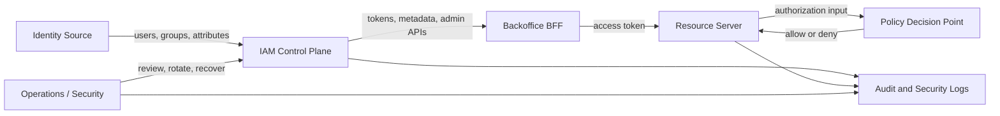

# IAM Responsibility Model

## What it is

An IAM responsibility model assigns each IAM fact and operation to a clear owner across products, services, teams, and runtime components.

It prevents vague statements such as "the IdP handles it" or "the IAM platform handles it" when the actual responsibility may belong to a backend API, BFF, policy engine, admin API, operations team, or vendor.

Use this page to identify responsibility boundaries before comparing managed, self-hosted, minimal-library, or hybrid approaches.

## Why it matters

IAM failures often happen at ownership boundaries:

- an IdP authenticates a user, but nobody owns application permissions;
- a backend API trusts token claims, but nobody owns claim freshness;
- a BFF hides admin buttons, but the admin API lacks server-side authorization;
- a vendor stores users, but the product stores roles in a separate database with no reconciliation;
- a policy engine returns decisions, but no team owns policy tests or policy deployment;
- audit logs exist, but they do not record enough context to answer who changed access and why.

A responsibility model makes these boundaries explicit before implementation or candidate evaluation.

## Responsibility matrix

| Responsibility | Typical owner | Best practice | Worst practice |
| --- | --- | --- | --- |
| Human identity source | Workforce directory, managed IdP, self-hosted IdP, or application IAM database. | Use one authoritative source for member identity and stable subject identifiers. | Let each service create unrelated user records with incompatible lifecycle states. |
| User authentication | IdP or authentication service. | Centralize login, MFA, recovery, lockout, and credential policy. | Reimplement passwords and MFA separately in every application. |
| OAuth2/OIDC token issuance | Authorization server or identity platform. | Register clients, restrict grants, validate redirect URIs, use PKCE where needed, publish issuer metadata and JWKS. | Treat any token from any provider as valid because it "looks like JWT." |
| Browser session | BFF or frontend-serving backend. | Use HttpOnly, Secure cookies; keep OAuth tokens server-side when using a BFF. | Store access tokens or refresh tokens in browser localStorage for an internal admin app. |
| OAuth2/OIDC client registry | IAM Control Plane or identity platform. | Track client owner, grant types, redirect URIs, secrets/keys, rotation, and allowed audiences. | Use one shared client and secret for all services. |
| Permission catalog | IAM Control Plane with input from service owners. | Name operation-level permissions and keep them reviewable. | Use vague service names such as `admin` or `billing_access` for unrelated operations. |
| Role definitions | IAM Control Plane, product security owner, or access governance process. | Keep roles small enough to review; map roles to explicit permissions. | Create broad permanent roles because they are easier during development. |
| Role assignment | Admin API, access request workflow, or directory group sync. | Enforce assignment permissions server-side and audit every privileged change. | Let frontend UI or manual database edits assign privileges. |
| Runtime token validation | Each resource server, gateway, or shared middleware. | Validate issuer, audience, signature or introspection result, expiry, token type, and relevant claims. | Decode JWTs without verification or skip audience validation. |
| Runtime authorization enforcement | Resource server or policy enforcement point. | Check authorization for every protected operation on the server side. | Rely on hidden buttons or route guards in the frontend. |
| Policy decision | Local code, IAM authorization API, OPA, Cedar, Verified Permissions, OpenFGA, SpiceDB, or similar. | Make input shape, decision semantics, consistency, and failure behavior explicit. | Add a policy engine without owning policy lifecycle, tests, or data synchronization. |
| Machine identity | IAM Control Plane, cloud IAM, workload identity system, or service account registry. | Model services as non-human principals with least privilege and rotation. | Model services as fake human administrator accounts. |
| Admin API | IAM Control Plane. | Protect admin operations with strong authorization, MFA or step-up where needed, audit, and rate controls. | Expose admin APIs as ordinary APIs with only frontend gating. |
| Audit events | IAM Control Plane, resource servers, and logging platform. | Record actor, target, action, result, timestamp, request context, and correlation ID. | Log only free-form strings or only successful changes. |
| Key management | Authorization server, IdP, KMS, secrets manager, or operations team. | Rotate signing keys, client secrets, private keys, and refresh-token encryption keys safely. | Keep long-lived secrets in source control or unmanaged environment variables. |
| Incident response | Owning engineering and operations teams. | Define disablement, revocation, break-glass, key rotation, and audit review procedures. | Discover during an incident that nobody owns token revocation or admin recovery. |

## Logical ownership map

The diagram is conceptual. A single vendor product may implement the directory, IAM Control Plane, and policy decision point. A custom build may split them into several services. The responsibility still needs a named owner.

## Industry patterns

| Pattern | Responsibility shape | Common risk |
| --- | --- | --- |
| Managed identity platform | Vendor owns authentication, hosted login, token service, client registry, and some role or permission features. Product owns API enforcement and product-specific authorization semantics. | Assuming vendor roles equal business permissions. |
| Workforce IAM plus application IAM | Workforce directory owns employees and SSO. Application IAM owns product roles, permissions, admin API, and API enforcement. | Reusing directory groups as application permissions without review. |
| Self-hosted IAM platform | Internal team operates IdP, token service, users, groups, roles, clients, and admin surface. | Underestimating operational burden. |
| Library-based authorization server | Team owns nearly everything except low-level protocol machinery. | Treating protocol compliance as a complete IAM product. |
| External policy engine | Policy engine owns decision logic. App and IAM services own identity, attributes, entities, relationship data, and enforcement. | Failing to synchronize policy data with business data. |
| Application-owned IAM | One application owns identity, sessions, roles, permissions, and audit. | Scaling poorly once multiple services or clients appear. |

## Best practices

- Write an ownership table before evaluating products.
- Separate identity, token issuance, permission administration, policy decision, and enforcement responsibilities.
- Give every IAM mutation a privileged API owner and an audit event.
- Treat each backend API as responsible for enforcing its own operations.
- Define stale-access expectations for token claims, caches, introspection, and authorization checks.
- Prefer stable subject IDs over mutable email addresses in internal records.
- Name permissions after operations, not screens.
- Include operations ownership: backups, upgrades, keys, logs, support, migration, and incident response.

## Common mistakes

- Assuming `authenticated = authorized`.
- Assuming `IdP = complete IAM architecture`.
- Assigning broad roles because fine-grained permissions are inconvenient.
- Letting resource servers read IAM database tables directly.
- Creating duplicate users and roles in every service.
- Depending on frontend-only checks for admin actions.
- Using one shared OAuth client for every application.
- Adding a policy engine without policy tests and version control.
- Treating audit logs as optional because the user count is small.

## Study questions

| Question | Why it matters |
| --- | --- |
| Which component owns member lifecycle? | Prevents duplicate user state. |
| Which component owns role and permission definitions? | Prevents inconsistent authorization vocabulary. |
| Which component owns role assignment? | Determines admin API and audit requirements. |
| Which component issues tokens? | Defines issuer, audience, keys, and client registration. |
| Which component enforces backend permissions? | Prevents frontend-only authorization. |
| Which component logs IAM changes? | Enables incident investigation and access review. |
| Which component owns service accounts? | Prevents fake human service users. |
| Which team owns operations? | Makes self-hosting cost visible. |

## Related pages

- [IAM Architecture](./15-iam-architecture.md)
- [IAM Control Plane vs Data Plane](./14-iam-control-plane-vs-data-plane.md)
- [Administration APIs](./08-admin-api.md)
- [RBAC](./05-rbac.md)
- [OAuth Client Management](./13-oauth-client-management.md)
- [Auditability, Access Reviews, and Operational Ownership](./10-auditability-access-reviews-operational-ownership.md)

## References

- [AWS IAM - Resilience in AWS Identity and Access Management](https://docs.aws.amazon.com/IAM/latest/UserGuide/disaster-recovery-resiliency.html)
- [AWS IAM - How permissions and policies provide access management](https://docs.aws.amazon.com/IAM/latest/UserGuide/introduction_access-management.html)
- [Google Cloud IAM overview](https://cloud.google.com/iam/docs/overview)
- [Microsoft Entra ID documentation](https://learn.microsoft.com/en-us/entra/identity/)
- [Okta - API Access Management](https://developer.okta.com/docs/concepts/api-access-management/)
- [Auth0 - Configure Core RBAC](https://auth0.com/docs/manage-users/access-control/configure-core-rbac)
- [Keycloak Server Administration Guide](https://www.keycloak.org/docs/latest/server_admin/)
- [OWASP Authorization Cheat Sheet](https://cheatsheetseries.owasp.org/cheatsheets/Authorization_Cheat_Sheet.html)
