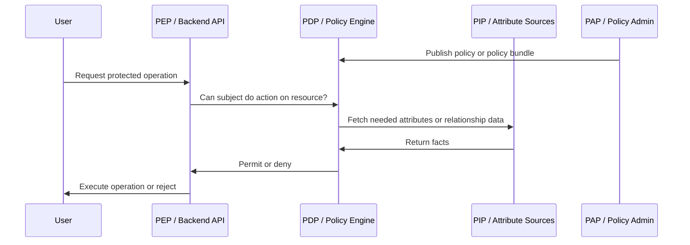

# PDP, PEP, PIP, and PAP

## What it is

PDP, PEP, PIP, and PAP are authorization architecture terms for separating policy administration, policy decisions, attribute sources, and enforcement points.

These terms come from policy-based access control architecture, especially XACML, but they remain useful even when the system does not use XACML. They help explain modern IAM systems, policy engines, API gateways, backend services, service meshes, and internal admin APIs.

## Why it matters

These terms make authorization boundaries visible. They help prevent policy authoring, decision-making, attribute lookup, and enforcement from being mixed into the wrong layer.

They are especially useful when evaluating OPA, Cedar, Amazon Verified Permissions, OpenFGA, SpiceDB, API gateways, service meshes, or custom authorization services.

For the dedicated product-family and trade-off discussion, see [Policy Engines and Fine-Grained Authorization](./21-policy-engines-and-fine-grained-authorization.md).

## Core terms

| Term | Full name | Responsibility |
| --- | --- | --- |
| PAP | Policy Administration Point | Creates, edits, validates, publishes, and governs policies. |
| PDP | Policy Decision Point | Evaluates a request against policy and returns an authorization decision. |
| PIP | Policy Information Point | Supplies attributes or facts needed by the decision, such as user attributes, group membership, resource metadata, risk, or tenant context. |
| PEP | Policy Enforcement Point | Intercepts a protected request, asks for or computes a decision, and enforces allow or deny. |

The same physical component can play multiple roles. A backend API may be the PEP and also contain a local PDP. A managed authorization service may be the PAP and PDP. An IdP can be a PIP when token claims supply user attributes.

## Basic authorization flow

## Mapping to IAM architecture

| IAM component | Possible role |
| --- | --- |
| Backoffice BFF | PEP for UI-facing admin routes; client to IAM Control Plane; sometimes not the final PEP for backend business actions. |
| Backend API | Primary PEP for business operations. It must enforce operation-level authorization. |
| API gateway | Coarse PEP for token presence, signature validation, routes, and broad access rules. |
| IAM Control Plane Admin API | PAP for roles, permissions, policies, clients, service accounts, and assignments. |
| OPA, Cedar, Verified Permissions | PDP, and sometimes part of the PAP depending on how policies are managed. |
| OpenFGA, SpiceDB, Ory Keto | PDP for relationship-based authorization; also store relationship data used for decisions. |
| IdP or authorization server | PIP when token claims provide subject, client, group, or attribute information. |
| Business database | PIP when authorization depends on resource ownership, status, tenant, or local business state. |
| Directory or HR system | PIP for employment status, department, manager, or group membership. |

## Best practices

- Treat backend APIs as PEPs even when a gateway validates tokens.
- Keep PEP input explicit: subject, action, resource, context.
- Keep decisions narrow: `allow` for one action on one resource, not a broad "is admin" answer when the operation is specific.
- Version policies and test them like code.
- Log enough decision context to investigate denials and suspicious approvals.
- Define fail-closed, fail-open, and cache behavior explicitly.
- Avoid making the PEP assemble fragile, undocumented context.
- Keep PIP data fresh enough for the risk of the decision.
- Make policy deployment reviewable and reversible.

## Common mistakes

- Treating the frontend as the PEP for protected operations.
- Having a PDP return allow while the PEP ignores obligations or resource constraints.
- Hiding business authorization inside token generation and never checking it at the API.
- Calling a PDP without a stable action and resource vocabulary.
- Fetching attributes from many services at decision time without latency and outage design.
- Using a policy engine for every trivial check before simpler local enforcement has been considered.
- Letting policies drift outside source control and audit.
- Assuming a gateway can authorize object-level business operations without business context.

## Industry patterns

| Pattern | Example systems | Practical critique |
| --- | --- | --- |
| Embedded local PDP | Application code, framework authorization, local RBAC middleware. | Simple and fast, but can duplicate logic across services. |
| Sidecar or centralized policy PDP | OPA sidecar, OPA service, custom policy service. | Good policy separation, but needs policy distribution, input discipline, and operational ownership. |
| Managed PDP | Amazon Verified Permissions with Cedar. | Reduces policy-service operations, but introduces provider dependency and integration constraints. |
| Relationship PDP | OpenFGA, SpiceDB, Ory Keto. | Strong for object relationships and sharing, but requires relationship modeling and data synchronization. |
| Gateway PEP | API gateway, ingress, service mesh. | Good for coarse checks; insufficient for business-level authorization alone. |
| Token-claim PDP-ish pattern | Authorization server embeds roles or permissions in JWTs. | Very fast at runtime, but stale until token expiry and not a substitute for local operation checks. |

## How this applies to the study

For an internal backoffice IAM design:

- the backend API should be the PEP for protected business operations;
- the IAM Control Plane Admin API should be the PEP for IAM mutations;
- the IAM Control Plane may contain a PDP for access checks;
- the IdP or authorization server can be a PIP through token claims;
- a future policy engine may become the PDP only if requirements justify it;
- the BFF can improve browser security and UX, but it should not be the only PEP for backend APIs.

## Related pages

- [IAM Architecture](./15-iam-architecture.md)
- [IAM Control Plane vs Data Plane](./14-iam-control-plane-vs-data-plane.md)
- [Authorization Models](./18-authorization-models.md)
- [Policy Engines and Fine-Grained Authorization](./21-policy-engines-and-fine-grained-authorization.md)
- [Tokens and JWTs](./04-tokens-and-jwt.md)
- [Administration APIs](./08-admin-api.md)
- [Security Best Practices](./09-security-best-practices.md)

## References

- [OASIS XACML 3.0 Core Specification](https://docs.oasis-open.org/xacml/3.0/xacml-3.0-core-spec-cos01-en.html)
- [OASIS XACML v3.0 Standard](https://www.oasis-open.org/standard/xacmlv3-0/)
- [Open Policy Agent documentation](https://www.openpolicyagent.org/docs/latest)
- [Amazon Verified Permissions - What is Amazon Verified Permissions?](https://docs.aws.amazon.com/verifiedpermissions/latest/userguide/what-is-avp.html)
- [Cedar Policy Language Reference Guide](https://docs.cedarpolicy.com/)
- [OpenFGA Concepts](https://openfga.dev/docs/concepts)
- [SpiceDB Documentation](https://authzed.com/docs)
- [OWASP Authorization Cheat Sheet](https://cheatsheetseries.owasp.org/cheatsheets/Authorization_Cheat_Sheet.html)
