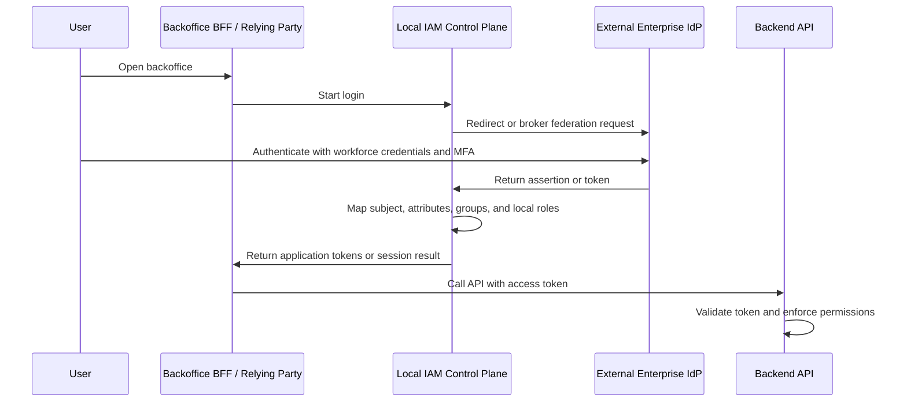

# Federation and Enterprise SSO

Federation lets one system trust another system for authentication or identity information. Enterprise SSO lets a workforce user sign in through a central corporate identity provider and then access multiple applications without each application owning a separate password database.

This page explains how federation and enterprise SSO fit into IAM architecture, how OIDC and SAML differ, and what problems are solved or left unsolved by industry SSO products.

## Why it matters

"Use SSO" is not a complete IAM architecture. SSO can solve login, MFA, and workforce identity integration, but the application still needs answers for tokens, sessions, user lifecycle, application roles, permissions, administration APIs, provisioning, and audit.

This page is for engineers, architects, security teams, IT administrators, and technical decision makers evaluating whether an internal backoffice should use an external IdP, managed identity platform, self-hosted IdP, or application-local authentication.

## Core terms

| Term | Meaning |
| --- | --- |
| Federation | A trust relationship where one system accepts identity assertions or tokens from another system. |
| Enterprise SSO | Workforce login through a central corporate IdP across multiple applications. |
| IdP | Identity Provider. Authenticates the user and issues identity assertions or tokens. |
| Service Provider | In SAML, the application relying on the IdP assertion. |
| Relying Party | In OIDC, the client application relying on the OpenID Provider. |
| OpenID Provider | OIDC provider that authenticates users and issues ID tokens. |
| Identity broker | A component that sits between applications and external IdPs, translating or routing identity flows. |
| Just-in-time provisioning | Creating or updating a local user record when a federated user first signs in. |
| Account linking | Connecting an external identity to an existing local account. |
| Assertion | A signed SAML statement about authentication and attributes. |
| ID token | A signed OIDC token containing authentication and identity claims for the client. |

## Federation flow

The external IdP proves who the workforce user is. The local IAM Control Plane may still own application-specific roles, permissions, clients, audit events, and token contracts for internal APIs.

## OIDC vs SAML

OIDC and SAML can both support enterprise SSO, but they come from different eras and integration models.

| Topic | OIDC | SAML 2.0 |
| --- | --- | --- |
| Built on | OAuth2. | XML-based SAML specifications. |
| Common artifact | ID token, access token, UserInfo response, discovery metadata. | SAML assertion and metadata. |
| Common modern use | Web and API-centric applications, mobile apps, modern IdP integrations. | Enterprise SaaS SSO, legacy workforce integrations, established IT environments. |
| Client term | Relying Party / OAuth client. | Service Provider. |
| Provider term | OpenID Provider. | Identity Provider. |
| API access fit | Natural fit with OAuth2 access tokens. | Usually needs separate token exchange or application session handling for APIs. |
| Operational concerns | Redirect URI validation, client registration, scopes, claims, JWKS, issuer, nonce, PKCE. | ACS URLs, entity IDs, certificates, signed assertions, metadata, NameID, clock skew. |

OIDC is usually more natural when the same platform needs login plus OAuth2 access tokens for APIs. SAML remains common in enterprise SSO because many workforce IdPs and SaaS applications support it deeply.

## What enterprise SSO solves

| Problem | How enterprise SSO helps |
| --- | --- |
| Password sprawl | Users authenticate through one workforce identity system instead of separate application passwords. |
| MFA and conditional access | Central IdP can enforce MFA, device, network, risk, or session policies consistently. |
| Workforce lifecycle | Joiner, mover, and leaver processes can disable or remove application access through one identity program. |
| Helpdesk and recovery | Account recovery and credential reset move to a mature identity operations process. |
| User experience | Users can access multiple applications without repeated credential prompts. |
| Central visibility | IT and security teams can see application assignments, sign-in logs, risk events, and access changes. |

## What enterprise SSO does not solve alone

| Remaining problem | Why it still needs design |
| --- | --- |
| Application permissions | Being an employee does not imply permission to disable members, export reports, or rotate OAuth clients. |
| Backend enforcement | APIs still need token validation and operation-level authorization. |
| Local admin APIs | IAM mutations need server-side authorization and audit even when login is federated. |
| Token audience and claims | Each API must know which issuer, audience, and claims it trusts. |
| User provisioning | The application may still need local member records, lifecycle state, and role assignments. |
| Group mapping | Directory groups may not map cleanly to application roles. |
| Deprovisioning | JIT login creates users, but does not automatically remove access when group membership changes unless designed. |
| Audit evidence | The application still needs to record privileged changes and protected operations. |

SSO answers "how does this user authenticate?" It does not fully answer "what can this user do inside this backoffice?"

## Federation patterns

| Pattern | How it works | Best fit | Main risk |
| --- | --- | --- | --- |
| Direct OIDC to workforce IdP | The backoffice app or IAM Control Plane trusts the workforce OIDC provider. | Modern internal apps and APIs. | Application-specific permissions still need local modeling. |
| Direct SAML to workforce IdP | The application is a SAML service provider. | Enterprise SaaS-style SSO and environments standardized on SAML. | API authorization and token model may need extra design. |
| Identity broker | A local IdP accepts multiple external IdPs and normalizes users, claims, and sessions. | Multiple IdPs, migrations, customer or partner IdPs, self-hosted identity platform. | Broker configuration becomes security-critical. |
| Managed identity platform | A vendor hosts login, federation, MFA, OIDC/SAML integrations, and management APIs. | Avoiding custom authentication and protocol operations. | Product authorization and provider limits remain. |
| Workforce IdP plus local IAM Control Plane | Enterprise IdP owns authentication; local IAM owns application roles, clients, permissions, and audit. | Internal backoffice where workforce SSO exists or may arrive later. | Duplicate users and group mappings if ownership is vague. |
| Application-local authentication | The application owns passwords, sessions, MFA, and users. | Small standalone system without enterprise SSO. | Team owns sensitive authentication operations. |

## Provisioning and JIT login

Federated login and provisioning are related but different.

| Mechanism | What it does | Caution |
| --- | --- | --- |
| JIT provisioning | Creates or updates the local account when the user signs in through the IdP. | Does not handle users who never sign in again after losing access unless disablement is also synchronized. |
| Directory group mapping | Maps IdP groups or claims to local roles. | Group semantics must be reviewed; broad groups can grant too much. |
| SCIM provisioning | Pushes user and group lifecycle changes from IdP to application. | Requires robust deprovisioning, idempotency, and audit. |
| Manual admin provisioning | Administrators create users and roles in the local IAM Control Plane. | Simple, but must be audited and reviewed. |

For more detail, see [Identity Provisioning and SCIM](./20-identity-provisioning-and-scim.md).

## Best practices

- Use federation to delegate authentication to a mature IdP when workforce SSO exists and the scope fits.
- Keep stable local subject IDs; do not rely only on mutable email addresses.
- Validate issuer, audience, signature, expiry, nonce, and token type for OIDC artifacts.
- Validate SAML signatures, issuer, audience or recipient, destination, time bounds, and replay protections.
- Map external identities to local member records deliberately.
- Keep application roles and permissions reviewable even when groups come from an enterprise directory.
- Use least privilege for application assignments and admin roles.
- Log federated login, account linking, provisioning changes, role mapping changes, and high-risk admin actions.
- Define what happens when the external IdP is unavailable.
- Prefer modern OIDC Authorization Code Flow with PKCE for browser-facing OAuth2/OIDC clients.

## Common mistakes

- Saying "we have SSO" and skipping backend authorization design.
- Accepting tokens or assertions from any issuer because the email domain matches.
- Using email as the only stable identity key.
- Mapping every employee group to a broad application administrator role.
- Letting JIT provisioning create active users without deprovisioning or access review.
- Allowing IdP-initiated flows without understanding relay state, audience, recipient, and replay protections.
- Trusting unverified SAML assertions or unsigned tokens.
- Treating directory groups, OAuth2 scopes, application roles, and product permissions as interchangeable.
- Duplicating local and external accounts without account-linking controls.
- Leaving break-glass administrator access undefined.

## Industry solution notes

| Solution family | What it commonly provides | Practical critique |
| --- | --- | --- |
| Microsoft Entra ID | Workforce identity, app registration, SSO, conditional access, MFA, provisioning, groups, enterprise app assignment. | Strong workforce control plane; application-specific authorization still needs local roles and API enforcement. |
| Okta Workforce Identity | Workforce SSO, app integrations, lifecycle, MFA, groups, SAML/OIDC integrations. | Good enterprise SSO fit; app permissions and token contracts still need product design. |
| Auth0 | Hosted login, enterprise connections, OIDC/SAML federation, MFA, organizations, API authorization features. | Useful managed identity layer; plan features, management API limits, and RBAC semantics need verification. |
| Keycloak | Self-hosted realms, identity brokering, SAML/OIDC, clients, roles, groups, admin APIs. | Flexible and open source; operations, upgrades, high availability, and role mapping are team-owned. |
| Cloud IAM federation | Workload identity federation and cloud workforce federation patterns. | Excellent for cloud resource access; not automatically a business application permission model. |

## What this means for this study

The study currently assumes no existing enterprise SSO. That means "use SSO" is not a free shortcut. It would mean adopting or operating an identity system that provides SSO behavior, then still defining:

- local member lifecycle;
- application roles and permissions;
- OAuth2/OIDC clients and token contracts;
- Admin API authorization;
- backend API enforcement;
- audit and access review;
- provisioning and deprovisioning.

The useful architecture stance is to keep authentication federation optional. The IAM Control Plane can support local authentication first, external IdP federation later, or a managed IdP from the start, but the application authorization model still needs explicit ownership.

## Related pages

- [OpenID Connect](./03-openid-connect.md)
- [OAuth2](./02-oauth2.md)
- [OAuth2 Flows](./06-oauth2-flows.md)
- [IAM Architecture](./15-iam-architecture.md)
- [IAM Control Plane vs Data Plane](./14-iam-control-plane-vs-data-plane.md)
- [IAM Responsibility Model](./16-iam-responsibility-model.md)
- [Identity Provisioning and SCIM](./20-identity-provisioning-and-scim.md)
- [Security Best Practices](./09-security-best-practices.md)

## References

- [OpenID Connect Core 1.0](https://openid.net/specs/openid-connect-core-1_0.html)
- [OpenID Connect Discovery 1.0](https://openid.net/specs/openid-connect-discovery-1_0.html)
- [OpenID Connect Federation 1.0](https://openid.net/specs/openid-connect-federation-1_0.html)
- [OASIS Security Assertion Markup Language (SAML) V2.0](https://www.oasis-open.org/standard/saml/)
- [OASIS SAML 2.0 Core Specification](https://docs.oasis-open.org/security/saml/v2.0/saml-core-2.0-os.pdf)
- [NIST SP 800-63C - Federation and Assertions](https://pages.nist.gov/800-63-4/sp800-63c.html)
- [Microsoft Entra ID documentation](https://learn.microsoft.com/en-us/entra/identity/)
- [Microsoft Entra - Single sign-on to applications](https://learn.microsoft.com/en-us/entra/identity/enterprise-apps/what-is-single-sign-on)
- [Okta - SAML concepts](https://developer.okta.com/docs/concepts/saml/)
- [Auth0 - Enterprise Connections](https://auth0.com/docs/authenticate/identity-providers/enterprise-identity-providers)
- [Keycloak Server Administration Guide - Identity brokering](https://www.keycloak.org/docs/latest/server_admin/#_identity_broker)
- [OWASP Authentication Cheat Sheet](https://cheatsheetseries.owasp.org/cheatsheets/Authentication_Cheat_Sheet.html)
- [OWASP Authorization Cheat Sheet](https://cheatsheetseries.owasp.org/cheatsheets/Authorization_Cheat_Sheet.html)
