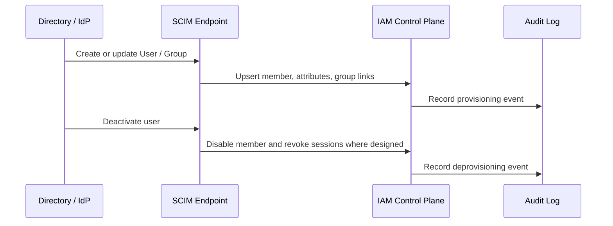

# Identity Provisioning and SCIM

## What it is

Identity provisioning is the process of creating, updating, disabling, deleting, or synchronizing user and group records between identity systems and applications.

SCIM, the System for Cross-domain Identity Management, is a standardized HTTP and JSON protocol for provisioning and managing identity data across domains. SCIM 2.0 defines common schemas for users and groups, plus protocol operations for creating, reading, updating, searching, and deleting those resources.

Provisioning is related to authentication and SSO, but it is not the same thing. SSO answers how a user signs in. Provisioning answers how the application receives, updates, and removes the local identity records it needs to make access decisions and run administration workflows.

## Why it matters

Internal applications often fail at offboarding and access cleanup. A user may lose access in the workforce directory, but still remain active in an application database. A group may be renamed in the IdP, but the application keeps old role mappings. An account may be deleted instead of disabled, making audit history harder to interpret.

For an IAM Control Plane, provisioning matters because member lifecycle, local roles, permissions, external identities, and audit records need a reliable ownership model. Even if authentication is delegated to an external IdP, the backoffice may still need local member records, role assignments, service-specific permissions, and administrative audit evidence.

## Core terms

| Term | Meaning |
| --- | --- |
| Provisioning | Creating or updating an identity record in a target system. |
| Deprovisioning | Removing or disabling access in a target system. |
| Source system | The authoritative system for identity data, such as HR, a directory, or an IdP. |
| Target system | The application or IAM system receiving identity data. |
| SCIM client | The system sending SCIM requests, often a workforce IdP or directory service. |
| SCIM service provider | The system exposing SCIM endpoints for users and groups. |
| JIT provisioning | Creating or updating a local account at login time. |
| Directory sync | Synchronizing users, groups, and attributes from a directory into an application. |
| Attribute mapping | Mapping source attributes to target attributes. |
| Stable identifier | An immutable ID used to link records across systems. |

## How SCIM works

In a common enterprise setup, the workforce IdP or directory acts as the SCIM client. The application, identity platform, or IAM Control Plane exposes a SCIM service provider endpoint.

SCIM does not decide whether a user can perform `members:disable` or `reports:export`. It moves identity and group data. The application still needs a local authorization model that maps users, groups, attributes, or roles to enforceable permissions.

## Common provisioning patterns

| Pattern | How it works | Best fit | Main risk |
| --- | --- | --- | --- |
| Manual administration | Administrators create and disable members in the IAM Control Plane. | Small systems and first internal backoffice versions. | Offboarding depends on process discipline. |
| JIT provisioning | A local member is created or updated when the user signs in through SSO. | Simple SSO integration with low setup overhead. | Users who never sign in again may not be deactivated automatically. |
| SCIM inbound provisioning | External IdP pushes users and groups into the application or IAM Control Plane. | Enterprise SSO, automated joiner/mover/leaver workflows. | SCIM endpoint security, attribute mapping, and deprovisioning semantics must be correct. |
| Directory group mapping | External groups map to local application roles. | Workforce-driven app assignment and broad role assignment. | Directory groups may be too coarse for application permissions. |
| Hybrid provisioning | External identity is synced, while local IAM owns product roles and permissions. | Internal apps that need SSO plus app-specific authorization. | Duplicate ownership if source-of-truth boundaries are vague. |

## SCIM resources and operations

SCIM 2.0 commonly uses these resources:

| Resource | Purpose |
| --- | --- |
| `User` | Represents a human user with attributes such as user name, name, email, active state, and extension attributes. |
| `Group` | Represents a group and membership list. |
| `ServiceProviderConfig` | Describes supported SCIM features. |
| `ResourceType` | Describes available resource types. |
| `Schema` | Describes supported schemas and attributes. |

Common operations include:

| Operation | Meaning |
| --- | --- |
| `POST /Users` | Create a user. |
| `GET /Users/{id}` | Retrieve a user. |
| `GET /Users?filter=...` | Search for users. |
| `PUT /Users/{id}` | Replace a user resource. |
| `PATCH /Users/{id}` | Partially update a user, often used for status or group changes. |
| `DELETE /Users/{id}` | Delete or remove a user according to the service provider's semantics. |
| `POST /Groups` | Create a group. |
| `PATCH /Groups/{id}` | Update group attributes or membership. |

Implementations vary. A product may support users but not groups, may treat delete as deactivate, or may have plan-specific SCIM support. Those behaviors must be verified during evaluation.

## Lifecycle semantics

Provisioning design should distinguish these states and operations:

| Concept | Meaning | Design note |
| --- | --- | --- |
| Active user | User can authenticate or be authorized, subject to policy. | SCIM's `active` attribute is commonly used for this state. |
| Disabled user | User cannot access the application, but history remains. | Often safer than hard deletion for internal systems. |
| Deleted user | User record is removed or anonymized. | Can complicate audit evidence if stable historical IDs are not retained. |
| Suspended user | Temporarily blocked pending investigation or review. | May need different audit and recovery semantics than ordinary disablement. |
| Reprovisioned user | A previously disabled identity becomes active again. | Requires careful account linking and stale role review. |

For an internal backoffice, disabling is usually the safer default lifecycle operation because it preserves audit history while stopping access. Deletion may still be needed for privacy or retention reasons, but it should be explicit and controlled.

## Provisioning and authorization

Provisioning feeds authorization, but it should not be confused with authorization.

| Provisioning fact | Possible use | Caution |
| --- | --- | --- |
| User exists | Create or maintain local member record. | Existence does not imply access to every app function. |
| User is active | Allow login or token issuance if other controls pass. | Active state is necessary but not enough for authorization. |
| Group membership | Map to local roles or app assignment. | Groups should be reviewed before granting privileged roles. |
| Department or title | Use as ABAC input or review context. | Job titles are often too unstable for direct security policy. |
| Manager | Route approvals or access reviews. | Manager data can be stale or unsuitable for enforcement. |
| External ID | Link source and target records. | Must be stable and protected from account-takeover mapping errors. |

If external groups are mapped to local roles, the mapping becomes security-critical. A broad directory group such as `Employees` should not map to an IAM administrator role.

## SCIM endpoint security

A SCIM endpoint is an administration surface. It can create, update, disable, and sometimes delete identities. Treat it like a privileged API.

Useful controls include:

- authenticate SCIM clients with strong bearer tokens, OAuth2 client credentials, private key JWT, mTLS, or a provider-supported secure mechanism;
- rotate SCIM credentials and record their owners;
- restrict each SCIM token to the smallest supported operation set;
- validate every incoming resource and attribute;
- log create, update, deactivate, delete, group membership, and mapping failures;
- avoid logging SCIM bearer tokens or sensitive identity attributes unnecessarily;
- make operations idempotent where possible;
- handle retries and duplicate requests safely;
- define rate-limit behavior and retry responses;
- test with the actual IdP implementation, not only the RFC happy path.

## Best practices

- Define the identity source of truth before integrating provisioning.
- Use stable immutable IDs for account linking.
- Prefer disablement over hard deletion when audit history matters.
- Keep local application roles and permissions explicit even when users come from SCIM.
- Treat group-to-role mappings as privileged configuration.
- Audit provisioning changes with actor or client ID, target user, operation, result, timestamp, and source system.
- Revoke sessions or refresh tokens when deprovisioning needs immediate effect.
- Test create, update, deactivate, reactivation, duplicate user, rename, group removal, and retry cases.
- Document which attributes are authoritative and which are locally managed.
- Verify product-specific SCIM limitations before assuming group sync, role sync, or deletion semantics.

## Common mistakes

Treating SSO as provisioning leaves stale accounts in local systems.

Treating provisioning as authorization grants access just because a user exists.

Using email as the only account-linking key creates risk when email addresses change or are reused.

Mapping broad directory groups directly to privileged application roles creates excessive access.

Ignoring deprovisioning semantics leaves disabled employees with active local sessions, refresh tokens, or role assignments.

Hard-deleting users without preserving stable audit references weakens investigation and access-review evidence.

Assuming every IdP implements SCIM exactly the same way causes integration bugs around filters, PATCH behavior, group membership, delete behavior, rate limits, and retries.

Storing SCIM tokens in tickets, emails, logs, or source control turns provisioning credentials into an incident source.

## What this means for this study

The current project does not require company-wide workforce SSO or SCIM in the initial scope. SCIM is still important conceptual material because it explains how the architecture could later integrate with a workforce IdP or managed identity platform.

For the minimal backoffice IAM Control Plane, the study should answer:

- Are members created only by internal administrators, or can an external IdP provision them?
- If external SSO is added later, will local accounts be created through JIT login, SCIM, manual approval, or a hybrid?
- Which system owns active or disabled state?
- Which system owns application roles and permissions?
- Can deprovisioning revoke sessions or refresh tokens quickly enough?
- How are provisioning events audited and reviewed?
- Are group mappings narrow enough for privileged backoffice access?

## Related pages

- [Federation and Enterprise SSO](./19-federation-and-enterprise-sso.md)
- [IAM Responsibility Model](./16-iam-responsibility-model.md)
- [Member Lifecycle](../requirements-member-lifecycle.md)
- [RBAC](./05-rbac.md)
- [Admin API](./08-admin-api.md)
- [Token Lifecycle](./12-token-lifecycle.md)
- [Auditability, Access Reviews, and Operational Ownership](./10-auditability-access-reviews-operational-ownership.md)

## References

- [RFC 7643 - System for Cross-domain Identity Management: Core Schema](https://www.rfc-editor.org/rfc/rfc7643)
- [RFC 7644 - System for Cross-domain Identity Management: Protocol](https://www.rfc-editor.org/rfc/rfc7644)
- [Microsoft Entra - Develop and plan provisioning for a SCIM endpoint](https://learn.microsoft.com/en-us/entra/identity/app-provisioning/use-scim-to-provision-users-and-groups)
- [Okta - Understanding SCIM](https://developer.okta.com/docs/concepts/scim/)
- [Okta - SCIM Protocol](https://developer.okta.com/docs/api/openapi/okta-scim/guides/)
- [Auth0 - Configure Inbound SCIM](https://auth0.com/docs/authenticate/protocols/scim/configure-inbound-scim)
- [OWASP Authorization Cheat Sheet](https://cheatsheetseries.owasp.org/cheatsheets/Authorization_Cheat_Sheet.html)
