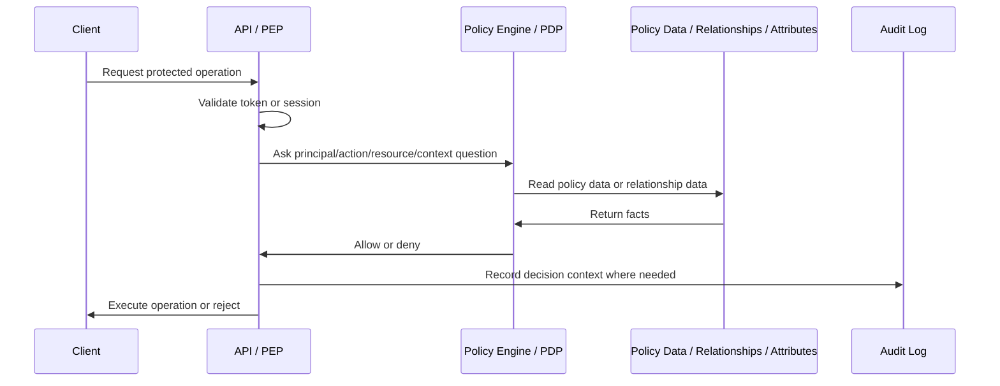

# Policy Engines and Fine-Grained Authorization

## What it is

A policy engine is a component that evaluates authorization rules outside ordinary business logic. It receives structured input such as principal, action, resource, and context, then returns an authorization decision.

Fine-grained authorization is authorization at a more precise level than "is this user logged in?" or "is this user an admin?". It may include operation-level permissions, resource ownership, organization membership, object relationships, attributes, risk signals, or policy rules.

This page explains OPA, Cedar, Amazon Verified Permissions, OpenFGA, SpiceDB, and Zanzibar-style systems as industry solution families. It is conceptual study material and does not choose a final product or architecture.

## Why it matters

Many systems start with simple RBAC and then discover more detailed authorization needs:

- a support agent may view only assigned cases;
- a finance user may export only reports for their region;
- a project administrator may manage only projects inside one organization;
- a user may edit a document because they own it, belong to a team, or inherit access from a parent folder;
- a service account may call one operation but not another;
- high-risk actions may require stronger authentication or extra context.

Those rules can live in application code, token claims, a database lookup, a policy engine, or a relationship authorization service. The goal is not to use a policy engine by default. The goal is to know when authorization complexity has outgrown simple local checks.

## Core terms

| Term | Meaning |
| --- | --- |
| Policy | A rule that permits, denies, or constrains access. |
| Policy engine | Software that evaluates policy rules and returns a decision. |
| Fine-grained authorization | Authorization at operation, object, relationship, or context level. |
| PDP | Policy Decision Point. Evaluates a request and returns a decision. |
| PEP | Policy Enforcement Point. Enforces the decision in the API, gateway, BFF, or service. |
| Entity | A modeled object used by an authorization system, such as user, group, document, organization, or service account. |
| Relationship tuple | A statement such as `document:abc#viewer@user:123`, common in Zanzibar-style systems. |
| Policy-as-code | Storing, testing, reviewing, and deploying policies like code. |
| ReBAC | Relationship-Based Access Control. Access depends on relationships between subjects and objects. |
| ABAC | Attribute-Based Access Control. Access depends on subject, resource, action, or environment attributes. |

See [PDP, PEP, PIP, and PAP](./17-pdp-pep-pip-pap.md) for the classic architecture terms and [Authorization Models](./18-authorization-models.md) for the model comparison.

## Basic decision shape

Most policy engines expect the caller to ask a precise question:

```text
Can principal P perform action A on resource R in context C?
```

Example:

```json
{
  "principal": "member:123",
  "action": "members:disable",
  "resource": "member:456",
  "context": {
    "session_assurance": "mfa",
    "source": "backoffice"
  }
}
```

The policy engine answers `allow`, `deny`, or an equivalent decision. The application still enforces the answer. A policy engine that returns `allow` does not protect anything if the API ignores the decision.

## Common architecture



The API remains the PEP. The policy engine is the PDP. Identity providers, directories, IAM databases, and business databases may act as PIPs when they supply claims, attributes, groups, ownership, tenant, or relationship data.

## Solution families

| Family | Examples | Good fit | Main caution |
| --- | --- | --- | --- |
| General policy engine | OPA / Rego | Policy-as-code across APIs, infrastructure, Kubernetes, CI/CD, gateways, and microservices. | Very flexible; input discipline and policy ownership are essential. |
| Cedar-based policy engine | Cedar, Amazon Verified Permissions | Application authorization using principals, actions, resources, entities, context, policies, and schemas. | Does not replace authentication, token issuance, or member lifecycle. |
| Zanzibar-style relationship authorization | Google Zanzibar, OpenFGA, SpiceDB | Object-level sharing, hierarchies, teams, organizations, inherited access, "who can access this?" queries. | Requires relationship modeling, data synchronization, consistency choices, and a runtime dependency. |
| Local application authorization | Framework middleware, local RBAC code | Simple internal apps and low-complexity permission checks. | Logic can duplicate across services and become hard to review. |
| Managed authorization service | Amazon Verified Permissions, hosted OpenFGA or SpiceDB variants | Externalized decision service with less operational burden. | Provider limits, pricing, latency, region, and integration behavior must be evaluated. |

## OPA and Rego

Open Policy Agent is a general-purpose policy engine. It accepts structured data as input and evaluates policies written in Rego. OPA is commonly used for Kubernetes admission control, infrastructure policy, microservice authorization, API gateways, and CI/CD checks.

OPA is powerful because it is domain-agnostic. That is also the risk. The team must define the input shape, data loading, policy package structure, deployment flow, tests, and decision semantics.

Good uses:

- shared policy-as-code across several services;
- infrastructure and deployment policy;
- API authorization when input data is well modeled;
- policy testing and review workflows.

Poor uses:

- replacing simple RBAC with a complex language before complexity exists;
- calling OPA with unstable, undocumented input;
- letting policies drift outside version control;
- treating OPA as an IdP or token issuer.

## Cedar and Amazon Verified Permissions

Cedar is a policy language for authorization decisions. Amazon Verified Permissions is a managed authorization service that uses Cedar for fine-grained permissions in custom applications.

Cedar and Verified Permissions are oriented around principals, actions, resources, entity data, context, schemas, and policies. The application asks whether a principal can perform an action on a resource, and the service or engine evaluates applicable policies.

Good uses:

- centralizing application authorization policies;
- RBAC and ABAC-style rules that benefit from a schema;
- managed policy storage and evaluation;
- auditing and testing authorization rules.

Poor uses:

- assuming the service authenticates users for the application;
- skipping local PEP enforcement in APIs;
- sending incomplete context and expecting correct decisions;
- adopting managed fine-grained authorization without understanding latency, outages, limits, and data modeling.

## Zanzibar-style systems

Google Zanzibar is an industry reference for large-scale relationship authorization. Zanzibar-style systems store relationship data and compute whether a subject has a relation or permission on an object. OpenFGA and SpiceDB are open-source systems inspired by Zanzibar.

The model is often object-relation-subject:

```text
document:budget#viewer@user:alice
document:budget#viewer@group:finance#member
folder:reports#parent@workspace:internal
```

This is strong when access comes from relationships:

- document sharing;
- organization membership;
- project roles;
- team membership;
- parent-folder inheritance;
- resource ownership;
- "list all resources this user can access" or "list all users who can access this resource".

It is usually unnecessary when the only requirement is coarse internal backoffice RBAC such as `support_agent` or `iam_admin`.

## How policy engines solve root problems

| Root problem | How a policy engine can help |
| --- | --- |
| Authorization logic duplicated across services | Centralizes or standardizes decision logic. |
| Rules are hard to audit | Policies can be reviewed, tested, and versioned. |
| Authorization is more complex than role membership | Supports attributes, relationships, context, and conditions. |
| Product needs object-level sharing | Relationship systems model object-to-subject grants directly. |
| Security team needs policy visibility | Policies and decision logs can become review evidence. |
| Services need consistent decisions | A shared PDP can reduce divergent local interpretations. |

## What policy engines do not solve

Policy engines usually do not solve:

- user authentication;
- OIDC login;
- OAuth2 token issuance;
- password storage;
- MFA enrollment;
- member lifecycle;
- SCIM provisioning;
- OAuth client registration;
- browser sessions;
- backend API enforcement;
- audit event design for every application operation.

They are usually a complement to an IAM Control Plane, not a replacement for one.

## Best practices

- Start with the authorization question: principal, action, resource, context.
- Keep the API as the enforcement point for business operations.
- Use stable identifiers for principals and resources.
- Define the policy data source of truth before adding a policy engine.
- Version and test policies like code.
- Include negative tests and privilege-escalation tests.
- Log enough decision context to debug denials and suspicious approvals.
- Define cache, timeout, fail-closed, and outage behavior.
- Keep policy vocabulary close to API operation vocabulary.
- Use a relationship system only when relationships are the real source of access.

## Common mistakes

- Adding a policy engine because it sounds mature, not because the rules need it.
- Treating a policy engine as an identity provider.
- Treating the frontend as the only PEP.
- Calling the PDP with vague actions such as `access` or `admin`.
- Fetching many attributes at decision time without latency and failure-mode design.
- Storing relationship data but failing to synchronize it with business data.
- Embedding broad authorization outcomes in long-lived tokens and assuming decisions are fresh.
- Letting policy changes bypass code review and audit.
- Using a gateway-only check for object-level business authorization.

## What this means for this study

For the internal backoffice IAM Control Plane study, a policy engine or Zanzibar-style system should be evaluated only if requirements show real need:

- object-level sharing or inherited access;
- many services requiring common policy governance;
- authorization rules that depend heavily on attributes or context;
- immediate or centralized authorization decisions that token claims cannot handle;
- strong requirements for policy simulation, testing, and audit.

For simple internal RBAC with fewer than 1,000 users, a policy engine may be unnecessary operational weight. That is not a final recommendation; it is an evaluation criterion for later phases.

## Related pages

- [Authorization Models](./18-authorization-models.md)
- [PDP, PEP, PIP, and PAP](./17-pdp-pep-pip-pap.md)
- [IAM Data Model](./22-iam-data-model.md)
- [IAM Architecture](./15-iam-architecture.md)
- [IAM Responsibility Model](./16-iam-responsibility-model.md)
- [RBAC](./05-rbac.md)
- [Security Best Practices](./09-security-best-practices.md)

## References

- [Open Policy Agent documentation](https://www.openpolicyagent.org/docs)
- [Open Policy Agent - Policy Language](https://www.openpolicyagent.org/docs/policy-language)
- [Cedar Policy Language Reference Guide](https://docs.cedarpolicy.com/)
- [Amazon Verified Permissions - What is Amazon Verified Permissions?](https://docs.aws.amazon.com/verifiedpermissions/latest/userguide/what-is-avp.html)
- [Amazon Verified Permissions and Cedar terms and concepts](https://docs.aws.amazon.com/verifiedpermissions/latest/userguide/terminology.html)
- [Google Zanzibar paper](https://research.google/pubs/zanzibar-googles-consistent-global-authorization-system/)
- [OpenFGA Introduction](https://openfga.dev/docs/fga)
- [OpenFGA Authorization Concepts](https://openfga.dev/docs/authorization-concepts)
- [SpiceDB Documentation](https://authzed.com/docs)
- [SpiceDB Schema Language Reference](https://authzed.com/docs/spicedb/concepts/schema)
- [OWASP Authorization Cheat Sheet](https://cheatsheetseries.owasp.org/cheatsheets/Authorization_Cheat_Sheet.html)
