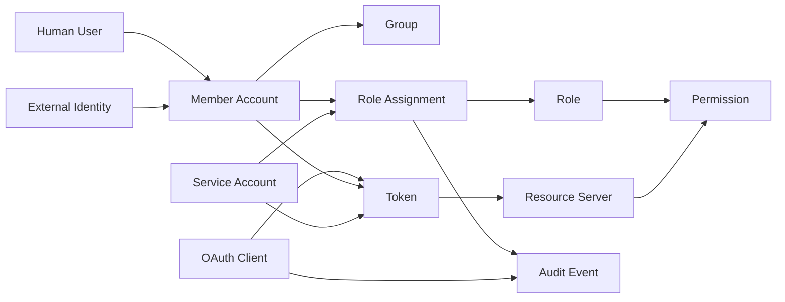

# IAM Data Model

## What it is

An IAM data model defines the core entities, identifiers, relationships, lifecycle states, and ownership rules used by an identity and access management system.

It answers questions such as:

- What is a user, member, account, subject, and principal?
- What is the difference between a role, permission, group, scope, and claim?
- Which system owns users, clients, service accounts, sessions, tokens, groups, roles, and audit events?
- Which identifiers are stable enough for authorization, audit, and migration?
- Which data belongs in the IAM Control Plane and which belongs in business services?

This page sharpens vocabulary for the internal backoffice IAM Control Plane study. It is conceptual and does not choose a database schema or product data model.

## Why it matters

IAM data models fail quietly when words are vague. If one service treats `user` as a human login and another treats `user` as a local profile row, audit and authorization become muddy. If an email address is used as a stable subject ID, renames and reuse create risk. If groups, roles, permissions, scopes, and claims are treated as the same thing, APIs become hard to secure and review.

A clear data model helps the team:

- avoid duplicate sources of truth;
- keep authorization decisions explainable;
- preserve audit evidence after renames and disablement;
- compare products without being fooled by similar labels;
- design migration and export paths;
- keep business data out of the IAM database.

## Core entity types

| Entity | Meaning | Typical owner |
| --- | --- | --- |
| Identity | A representation of who or what an actor is. | IdP, directory, IAM Control Plane, or external provider. |
| Account | A record that can authenticate or be provisioned in a system. | IAM Control Plane, application, or external IdP. |
| User | Human actor using the system. | Conceptual actor; represented by one or more accounts or identities. |
| Member | Company-managed human account in this backoffice IAM domain. | IAM Control Plane. |
| Subject | The thing a token, policy, or authorization decision is about. | Token issuer or authorization system. |
| Principal | The authenticated actor making a request, human or machine. | Runtime security context. |
| Group | Collection of identities or accounts, often from a directory. | Directory, IdP, or IAM Control Plane. |
| Role | Business-level bundle of permissions. | IAM Control Plane or application authorization owner. |
| Permission | Granular capability enforced by an API or service. | Service owner and IAM Control Plane. |
| Role assignment | Fact that a subject has a role. | IAM Control Plane or access governance workflow. |
| Client | OAuth2/OIDC application registered with the authorization server. | IAM Control Plane or identity platform. |
| Service account | Non-human subject used by a service, worker, or automation. | IAM Control Plane, cloud IAM, or workload identity system. |
| Session | Server-side or provider-side continuity state for a browser or user interaction. | BFF, application, IdP, or authorization server. |
| Token | Credential issued by an authorization server or IdP. | Authorization server. |
| Tenant or organization | Boundary for grouping users, resources, policies, or customers. | Product/application or identity platform. |
| Resource | Protected object or API capability. | Business service or IAM system depending on resource type. |
| Policy | Rule that grants, denies, or constrains access. | IAM Control Plane, policy engine, or application owner. |
| Audit event | Evidence that something security-relevant happened. | IAM Control Plane, resource servers, and logging platform. |

## User, member, subject, and principal

These terms overlap, but they are not interchangeable.

| Term | Use it when discussing | Example |
| --- | --- | --- |
| User | The human person using the system. | Alice from support. |
| Member | Alice's company-managed account in the internal backoffice IAM system. | `member_123`. |
| Identity | An external or internal representation of Alice. | Entra object ID, OIDC subject, local member ID. |
| Account | The login-capable or provisioned record in a system. | Local member account, external IdP account. |
| Subject | The identifier in a token or policy decision. | `sub=member_123`. |
| Principal | The actor as authenticated for a request. | Alice's session, `service:billing-sync`. |

Practical rule: use stable opaque IDs for subjects and audit records. Use email and display name as attributes, not primary identifiers.

## Human and machine identities

Human and machine actors should be separate.

| Actor type | Typical representation | Mistake to avoid |
| --- | --- | --- |
| Human user | Member, external identity, browser session, OIDC subject. | Giving automation a human administrator account. |
| Service | Service account, OAuth client, workload identity, client credential. | Sharing one service account across unrelated services. |
| Application client | OAuth2/OIDC client registration. | Treating `client_id` as a secret or a human identity. |
| Administrator | Member with privileged roles or permissions. | Making every internal user a broad admin. |

A service account can be a principal and a subject. It is not a user. Its credentials, owner, purpose, lifecycle, and audit trail should be distinct.

## Roles, permissions, groups, scopes, and claims

These concepts often get blurred.

| Concept | Main purpose | Owned by | Example |
| --- | --- | --- | --- |
| Group | Organize identities, often for directory or workforce management. | Directory or IdP. | `engineering`, `finance`. |
| Role | Bundle permissions around a job or access purpose. | IAM Control Plane or application. | `support_agent`. |
| Permission | API-enforceable capability. | Service owner and IAM Control Plane. | `members:disable`. |
| Scope | Delegated access a client may request or receive. | Authorization server. | `members.read`. |
| Claim | Assertion carried in a token. | Token issuer. | `sub`, `aud`, `roles`. |

A group may map to a role. A role may contain permissions. A token may carry role or permission claims. A scope may be related to an API permission. None of these mappings should be assumed without explicit design.

## Conceptual data model

The diagram shows conceptual relationships, not database foreign keys. Some products combine several entities. Some systems store groups externally. Some systems store permissions in code and role assignments in an IdP. The important question is which component is the source of truth.

## IAM Control Plane data

The IAM Control Plane may own:

| Data | Why it belongs near IAM |
| --- | --- |
| Members and lifecycle state | Determines who can authenticate or receive access. |
| External identity links | Connects federated identities to local members. |
| Roles and permissions | Defines what subjects may do. |
| Role assignments | Grants access and needs auditability. |
| OAuth clients | Controls who may request tokens and through which flows. |
| Service accounts | Represents non-human actors and credentials. |
| Token metadata | Issuer, keys, token policy, refresh grants, revocation state. |
| Signing keys and public key metadata | Resource servers need trusted validation material. |
| Admin audit events | Explains privileged IAM changes. |

The IAM Control Plane should not own backend business data such as reports, invoices, tickets, orders, or customer records. It may store references to resource identifiers only when needed for authorization, audit, or policy decisions.

## Resource server data

Backend services own business resources and local business rules:

| Data | Owner |
| --- | --- |
| Report contents | Reporting service. |
| Ticket assignment | Support service. |
| Billing records | Billing service. |
| Local resource ownership | Service that owns the resource. |
| Operation-to-permission mapping | Service owner, coordinated with IAM vocabulary. |

If authorization depends on business data, the backend service may need to act as the PEP and PIP. For example, the IAM system may know Alice has `tickets:read`, while the ticket service knows whether ticket `T123` is assigned to Alice's team.

## Tenants and organizations

Tenants and organizations are overloaded terms. Use them carefully.

| Term | Possible meaning | Risk |
| --- | --- | --- |
| Tenant | A hard isolation boundary in a SaaS system. | Too heavy if the app is only one internal company. |
| Organization | Business grouping of users or resources. | May mean customer org, department, workspace, or IdP organization depending on product. |
| Realm | Isolated identity namespace in products such as Keycloak. | Product-specific semantics can leak into architecture language. |
| Workspace | Collaboration or product resource grouping. | May require ReBAC or resource-level policies if access is inherited. |

For the current internal backoffice study, tenant or organization concepts should not be added unless a real requirement needs them.

## Source-of-truth rules

| Data | Good source-of-truth question |
| --- | --- |
| Member identity | Which system owns the stable member ID and lifecycle state? |
| External identity | Which external subject maps to which local member? |
| Groups | Are groups authoritative in a directory, IdP, or local IAM database? |
| Roles | Are roles defined locally, in a provider, or in code? |
| Permissions | Which service owns each permission meaning? |
| Assignments | Who can grant, revoke, expire, and review access? |
| Clients | Who owns redirect URIs, grant types, secrets, and allowed audiences? |
| Service accounts | Which team owns purpose, credentials, and rotation? |
| Policies | Are policies stored in code, database, provider, or policy engine? |
| Audit | Which log is authoritative for privileged changes? |

If the same fact is stored in several places, define the master and reconciliation process. Duplicate IAM state without reconciliation is a slow incident.

## Best practices

- Use stable opaque IDs for authorization and audit.
- Treat email, display name, title, and department as mutable attributes.
- Separate human members from service accounts.
- Separate roles from permissions.
- Separate OAuth scopes from application permissions unless a mapping is explicitly defined.
- Keep business data out of the IAM database.
- Record owner, purpose, lifecycle state, and audit metadata for privileged entities.
- Preserve historical references after disablement or deletion.
- Make role assignments auditable records, not invisible join rows.
- Define source of truth before integrating external IdPs, SCIM, or policy engines.

## Common mistakes

- Using email as the primary authorization key.
- Treating groups, roles, scopes, permissions, and claims as interchangeable.
- Letting every service create its own unrelated user table and role table.
- Modeling service accounts as fake human users.
- Storing business resource state in the IAM database because it is convenient.
- Hard-deleting identities in a way that breaks audit trails.
- Copying a vendor's terminology into project language without checking semantics.
- Creating tenants, organizations, realms, or workspaces before the access model needs them.
- Failing to define who owns role and permission vocabulary.

## What this means for this study

The minimal IAM Control Plane should define a small, explicit data vocabulary before choosing products:

- `member` for company-managed human accounts;
- `service_account` or `client` for non-human actors, when in scope;
- `role` for reviewable business access bundles;
- `permission` for API-enforced capabilities;
- `assignment` for auditable grants;
- `client` for OAuth2/OIDC applications;
- stable IDs for subjects and audit;
- clear source-of-truth boundaries for external identity and local authorization.

This page does not define a database schema. It defines the vocabulary needed to evaluate schemas, providers, APIs, and proof-of-concept implementations later.

## Related pages

- [IAM Architecture](./15-iam-architecture.md)
- [IAM Responsibility Model](./16-iam-responsibility-model.md)
- [Authorization Models](./18-authorization-models.md)
- [RBAC](./05-rbac.md)
- [OAuth Client Management](./13-oauth-client-management.md)
- [Identity Provisioning and SCIM](./20-identity-provisioning-and-scim.md)
- [Policy Engines and Fine-Grained Authorization](./21-policy-engines-and-fine-grained-authorization.md)
- [Auditability, Access Reviews, and Operational Ownership](./10-auditability-access-reviews-operational-ownership.md)

## References

- [NIST SP 800-63-4 - Digital Identity Guidelines](https://pages.nist.gov/800-63-4/)
- [RFC 6749 - The OAuth 2.0 Authorization Framework](https://www.rfc-editor.org/rfc/rfc6749)
- [RFC 7643 - System for Cross-domain Identity Management: Core Schema](https://www.rfc-editor.org/rfc/rfc7643)
- [RFC 7644 - System for Cross-domain Identity Management: Protocol](https://www.rfc-editor.org/rfc/rfc7644)
- [OpenID Connect Core 1.0](https://openid.net/specs/openid-connect-core-1_0.html)
- [AWS IAM - How permissions and policies provide access management](https://docs.aws.amazon.com/IAM/latest/UserGuide/introduction_access-management.html)
- [Google Cloud IAM overview](https://cloud.google.com/iam/docs/overview)
- [Azure role-based access control overview](https://learn.microsoft.com/en-us/azure/role-based-access-control/overview)
- [Amazon Verified Permissions and Cedar terms and concepts](https://docs.aws.amazon.com/verifiedpermissions/latest/userguide/terminology.html)
- [OpenFGA Authorization Concepts](https://openfga.dev/docs/authorization-concepts)
