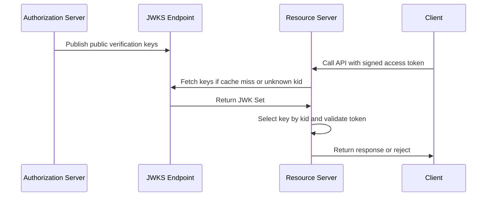

# Key Management and Signing Keys

## What it is

Key management is the lifecycle of cryptographic keys and secrets used by the IAM system: generation, storage, publication, use, rotation, revocation, retirement, audit, and incident response.

For OAuth2 and OpenID Connect systems, key management commonly includes:

- token signing keys;
- JWKS publication;
- key identifiers;
- client secrets;
- private key JWT client authentication;
- mutual TLS certificates;
- refresh-token encryption keys;
- session and CSRF secrets;
- secret storage and rotation procedures.

This page explains the concepts. It does not choose a KMS, HSM, vault, algorithm, provider, rotation period, or final implementation.

## Why it matters

Tokens and clients are trusted only because keys and secrets are trusted. Weak key management can turn a correct OAuth2/OIDC design into a compromised system:

- if a token signing key leaks, attackers may be able to mint trusted tokens;
- if APIs cache old JWKS data forever, key rotation can fail or leave retired keys trusted too long;
- if client secrets leak, an attacker may authenticate as a confidential client;
- if private keys are copied across environments, a staging leak can affect production;
- if keys are rotated without overlap, valid users may be locked out or APIs may reject valid tokens;
- if secrets are stored in source control or logs, incident response begins too late.

Key management is both a security problem and an operations problem.

## Core terms

| Term | Meaning |
| --- | --- |
| JWK | JSON Web Key. A JSON representation of a cryptographic key. |
| JWKS | JSON Web Key Set. A JSON document containing one or more JWKs. |
| `jwks_uri` | Metadata value pointing clients or resource servers to the issuer's JWK Set. |
| `kid` | Key ID used to select a key from a set. |
| `alg` | Algorithm identifier used by JOSE/JWT processing. |
| Signing key | Private key used by the issuer to sign tokens. |
| Verification key | Public key used by resource servers or clients to verify signatures. |
| Client secret | Shared secret used by a confidential OAuth client. |
| Private key JWT | Client authentication method where the client signs a JWT assertion with a private key. |
| mTLS | Mutual TLS. Client authenticates with an X.509 certificate during TLS. |
| Certificate-bound token | Token bound to a client certificate so the presenter must prove possession. |
| Key rotation | Controlled replacement of a key or secret. |
| Key revocation | Emergency or planned invalidation of a key or credential. |
| Secret store | System used to store and control access to secrets, such as a vault, KMS, HSM, or cloud secrets manager. |

## Where keys appear in IAM

| Use | Secret or key material | Main risk |
| --- | --- | --- |
| JWT access token signing | Authorization server private signing key. | Forged tokens if compromised. |
| ID token signing | OpenID Provider private signing key. | Forged login assertions if compromised. |
| JWKS publication | Public verification keys. | APIs cannot validate tokens if stale, missing, or poisoned. |
| Client secret authentication | Shared client secret. | Client impersonation if leaked. |
| Private key JWT | Client private key and registered public key. | Client impersonation if private key leaks. |
| mTLS client authentication | Client certificate and private key. | Client impersonation or rollout failures. |
| Refresh-token storage | Encryption or hashing material, depending on design. | Long-lived session compromise. |
| BFF sessions | Session signing or encryption secrets. | Session forgery or disclosure. |
| CSRF protection | CSRF token secrets or server-side state. | Forged browser state-changing requests. |

## JWKS and token validation

For signed JWTs, the issuer signs tokens with a private key. Resource servers fetch public verification keys from the issuer's JWKS endpoint, usually discovered through OIDC Discovery or OAuth2 Authorization Server Metadata.

The API must still validate issuer, audience, expiry, algorithm, token type, and required authorization data. Finding a matching key is only one part of token validation.

## Signing-key rotation

Signing-key rotation needs overlap. If a key is removed too early, resource servers cannot validate tokens that were issued before rotation and have not expired yet.

Typical sequence:

1. Generate or import a new signing key.
2. Publish the new public key in JWKS before using it.
3. Wait for resource servers and clients to refresh metadata.
4. Start signing new tokens with the new private key.
5. Keep the old public key published until all tokens signed with it have expired.
6. Remove the old key after the validation window ends.
7. Audit the rotation and update operational records.

Emergency compromise may require a faster sequence, but that should be an incident runbook, not improvisation.

## Client secrets

Client secrets are shared credentials. They are simple, widely supported, and dangerous when treated casually.

Best-use conditions:

- the client is confidential and server-side;
- the secret is generated with high entropy;
- the secret is stored in a secret manager or equivalent protected store;
- the secret is not embedded in browser, mobile, desktop, or public code;
- rotation and disablement are operationally possible;
- access to read or change the secret is audited.

Client secrets should usually be shown only when created or rotated. Ordinary read APIs should return secret metadata, not the secret value.

## Private key JWT

With private key JWT client authentication, the client signs a short-lived JWT assertion with its private key. The authorization server validates the assertion using the client's registered public key material.

This can reduce reliance on shared secrets, but it adds key lifecycle responsibilities:

- generate a strong key pair;
- store the private key securely;
- register public key material or `jwks_uri`;
- use short assertion lifetimes;
- protect against assertion replay where supported;
- rotate keys with overlap;
- audit registration and key changes.

Private key JWT authenticates the client. It does not authenticate the human user.

## Mutual TLS and certificates

Mutual TLS lets OAuth clients authenticate with X.509 certificates. RFC 8705 also defines certificate-bound access tokens, where a protected resource can check that the token is presented by the client holding the corresponding certificate.

mTLS can be strong, but operationally heavier than shared secrets:

- certificate issuance and renewal;
- trust anchor management;
- service deployment rollout;
- load balancer and proxy behavior;
- certificate revocation or replacement;
- observability when handshakes fail.

For small internal systems, mTLS may be future material unless service-to-service security requirements justify it.

## Key and secret storage

Good key storage reduces blast radius and improves operations.

| Storage pattern | Notes |
| --- | --- |
| Environment variables | Common, but easy to leak through process dumps, logs, shells, or broad deployment access. |
| Configuration files | Risky unless protected, encrypted, and excluded from source control. |
| Cloud secrets manager | Supports central access control, audit, versioning, and rotation workflows. |
| KMS or key vault | Useful for encryption keys and controlled cryptographic operations. |
| HSM | Strong protection for high-value keys, with operational complexity. |
| Application database | Usually not ideal for raw secrets unless encrypted and access-controlled with a separate key hierarchy. |

The important rule is separation: do not store keys and the data they protect in the same weakly controlled place if the architecture can avoid it.

## Best practices

- Use maintained cryptographic and OAuth/OIDC libraries.
- Use asymmetric signing keys for issuer tokens where practical.
- Publish public verification keys through trusted issuer metadata or JWKS.
- Validate token algorithm against an allowlist.
- Rotate signing keys with an overlap window.
- Rotate client secrets and private keys through an auditable process.
- Separate production, staging, and development keys.
- Store secrets in a secrets manager, key vault, KMS, HSM, or equivalent protected system.
- Restrict who can read, write, rotate, export, or delete secrets.
- Never log client secrets, private keys, bearer tokens, refresh tokens, authorization codes, or session IDs.
- Keep incident runbooks for key compromise.

## Common mistakes

- Hardcoding secrets in source code.
- Reusing one client secret across multiple applications.
- Treating `client_id` as a secret.
- Accepting JWTs signed with attacker-selected algorithms.
- Skipping issuer or audience validation because the signature is valid.
- Rotating signing keys without publishing the new public key first.
- Removing old verification keys before old tokens expire.
- Caching JWKS forever.
- Sharing production keys with development or staging.
- Storing private keys in the same database as all IAM state without separate protection.
- Returning secret values from ordinary read endpoints.

## What this means for this study

The IAM Control Plane must eventually define:

- who owns token signing keys;
- how public keys are published;
- how resource servers refresh JWKS;
- how signing-key rotation works;
- how confidential clients authenticate;
- how client secrets or private keys are stored;
- how service-account credentials are rotated if service-to-service becomes in scope;
- how key compromise is detected, contained, and audited.

This page provides evaluation vocabulary. Later candidate comparison should verify actual product behavior: JWKS support, key rotation, client-secret rotation, private key JWT, mTLS support, auditability, and operational burden.

## Related pages

- [Tokens and JWTs](./04-tokens-and-jwt.md)
- [Token Lifecycle](./12-token-lifecycle.md)
- [OAuth Client Management](./13-oauth-client-management.md)
- [Service-to-Service Authentication](./07-service-to-service-authentication.md)
- [Security Best Practices](./09-security-best-practices.md)
- [Web Sessions, Cookies, and BFF Pattern](./24-web-sessions-cookies-and-bff.md)
- [Auditability, Access Reviews, and Operational Ownership](./10-auditability-access-reviews-operational-ownership.md)

## References

- [RFC 7517 - JSON Web Key (JWK)](https://www.rfc-editor.org/rfc/rfc7517)
- [RFC 7518 - JSON Web Algorithms (JWA)](https://www.rfc-editor.org/rfc/rfc7518)
- [RFC 7519 - JSON Web Token (JWT)](https://www.rfc-editor.org/rfc/rfc7519)
- [RFC 7523 - JSON Web Token (JWT) Profile for OAuth 2.0 Client Authentication and Authorization Grants](https://www.rfc-editor.org/rfc/rfc7523)
- [RFC 7638 - JSON Web Key (JWK) Thumbprint](https://www.rfc-editor.org/rfc/rfc7638)
- [RFC 8414 - OAuth 2.0 Authorization Server Metadata](https://www.rfc-editor.org/rfc/rfc8414)
- [RFC 8705 - OAuth 2.0 Mutual-TLS Client Authentication and Certificate-Bound Access Tokens](https://www.rfc-editor.org/rfc/rfc8705)
- [RFC 9700 - Best Current Practice for OAuth 2.0 Security](https://www.rfc-editor.org/rfc/rfc9700)
- [OpenID Connect Discovery 1.0](https://openid.net/specs/openid-connect-discovery-1_0.html)
- [OWASP Secrets Management Cheat Sheet](https://cheatsheetseries.owasp.org/cheatsheets/Secrets_Management_Cheat_Sheet.html)
- [OWASP Cryptographic Storage Cheat Sheet](https://cheatsheetseries.owasp.org/cheatsheets/Cryptographic_Storage_Cheat_Sheet.html)
