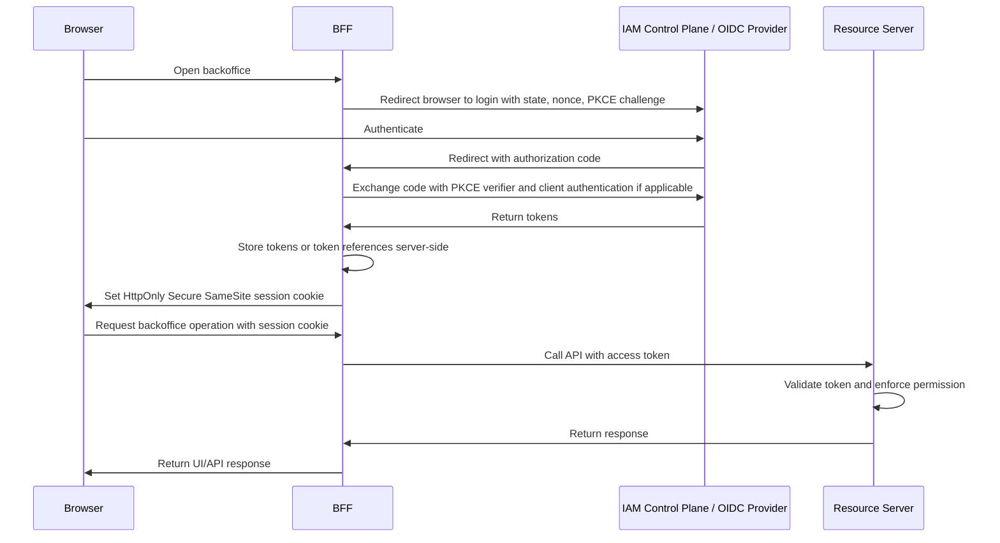

# Web Sessions, Cookies, and BFF Pattern

## What it is

A web session is server-side or provider-side state that lets a browser user remain recognized across multiple HTTP requests. Cookies are the usual browser mechanism for sending a session identifier back to the server. A BFF, or Backend-for-Frontend, is a server-side component dedicated to one frontend experience.

In an OAuth2/OIDC backoffice architecture, a BFF can handle login, callbacks, token exchange, token storage, refresh, logout, and API calls on behalf of the browser. The browser receives an application session cookie instead of directly storing OAuth access tokens or refresh tokens.

This page explains the conceptual browser security model and the trade-offs of the BFF pattern.

## Why it matters

Browsers are hostile places for long-lived OAuth credentials. JavaScript can be affected by XSS. Browser storage can be inspected by code running in the origin. Cross-site requests may automatically include cookies. Redirect-based OAuth flows need `state`, `nonce`, PKCE, and strict callback handling.

The BFF pattern exists because it moves sensitive OAuth responsibilities to a server-side component while giving the browser a conventional session cookie. This can reduce token exposure, especially for internal administration interfaces and sensitive business applications.

The trade-off is that the BFF becomes a real backend component with its own session store, CSRF controls, deployment, scaling, audit, and failure behavior.

## Core terms

| Term | Meaning |
| --- | --- |
| Session cookie | Browser cookie containing an opaque session identifier or protected session value. |
| HttpOnly | Cookie attribute that prevents JavaScript from reading the cookie through `document.cookie`. |
| Secure | Cookie attribute that instructs the browser to send the cookie only over HTTPS. |
| SameSite | Cookie attribute that influences whether cookies are sent on cross-site requests. |
| CSRF | Cross-Site Request Forgery. An attacker causes a victim browser to send an authenticated request. |
| XSS | Cross-Site Scripting. Attacker-controlled script runs in the application's origin. |
| BFF | Backend-for-Frontend. Server component that handles frontend-specific backend work. |
| Authorization code | Short-lived code returned to the OAuth client and exchanged for tokens. |
| PKCE | Proof Key for Code Exchange. Binds an authorization code flow to a code verifier. |
| Refresh token | Token used by the client to obtain new access tokens. |
| Token storage | Where access and refresh tokens are stored or referenced. |

## BFF flow

The browser never needs to read the OAuth access token or refresh token. It only sends the session cookie to the BFF.

## Browser token storage choices

| Storage pattern | Strength | Main risk |
| --- | --- | --- |
| Server-side BFF session | Keeps OAuth tokens out of browser-readable storage. | Requires BFF infrastructure, CSRF controls, session store, and proxying/API mediation. |
| HttpOnly cookie with opaque session ID | Protects session ID from direct JavaScript reads. | Browser sends cookie automatically, so CSRF must be handled. |
| Browser memory | Avoids persistence after refresh or tab close. | XSS can still use or extract tokens while running. |
| `sessionStorage` | Per-tab browser storage. | JavaScript-readable; XSS can access it. |
| `localStorage` | Persistent browser storage. | JavaScript-readable and often a poor fit for bearer tokens. |
| Readable cookie | Easy to send and read. | JavaScript-readable unless HttpOnly; also sent automatically by browser. |

For sensitive internal backoffice applications, the BFF pattern is attractive because it avoids exposing OAuth tokens directly to browser JavaScript.

## Cookies and session identifiers

An application session cookie should usually contain an opaque random identifier, not raw user data, roles, OAuth tokens, or secrets. The server uses that identifier to look up session state.

Important cookie attributes:

| Attribute | Purpose |
| --- | --- |
| `HttpOnly` | Reduces direct cookie theft through JavaScript. |
| `Secure` | Sends the cookie only over HTTPS. |
| `SameSite=Lax` or `Strict` | Reduces cross-site request behavior depending on UX needs. |
| `Path` | Limits where the cookie is sent by path, but should not be treated as a strong security boundary. |
| `Domain` | Controls host scope; broad domains can leak cookies across subdomains. |
| `Max-Age` or `Expires` | Defines browser-side cookie lifetime. |

Cookie lifetime is not the whole session lifetime. The server must also track whether the session is active, expired, revoked, or invalidated by logout, member disablement, or security policy.

## CSRF

CSRF matters because browsers automatically include cookies on matching requests. If an attacker can cause a victim browser to send a state-changing request to the BFF, the request may include the user's session cookie.

Common mitigations include:

- SameSite cookies where compatible with the flow;
- CSRF tokens for state-changing requests;
- checking `Origin` and `Referer` headers for unsafe methods;
- requiring non-simple requests with custom headers where appropriate;
- using framework-provided CSRF protection;
- avoiding state changes through `GET`;
- validating OAuth `state` for login callbacks.

SameSite is useful but not a complete CSRF strategy by itself. OAuth redirects, cross-site identity provider flows, and browser behavior must be tested with the chosen settings.

## XSS and BFF

A BFF does not make XSS harmless. If attacker-controlled JavaScript runs in the backoffice origin, it can often send requests to the BFF as the user. HttpOnly cookies prevent direct reading of the session cookie, but not request forgery from within the same origin.

The BFF reduces the impact of XSS by keeping OAuth access tokens and refresh tokens out of JavaScript-readable storage. It does not remove the need for:

- output encoding;
- content security policy where practical;
- dependency hygiene;
- avoiding unsafe HTML injection;
- server-side authorization checks;
- CSRF controls;
- audit logs for high-risk operations.

## BFF responsibilities

| Responsibility | Why it belongs in the BFF |
| --- | --- |
| OIDC redirect initiation | The BFF can store `state`, `nonce`, and PKCE verifier server-side. |
| Callback handling | The BFF receives the authorization code and exchanges it securely. |
| Token storage | Access and refresh tokens can remain server-side. |
| Browser session | The browser receives only a session cookie. |
| Token refresh | The BFF can refresh tokens without exposing refresh tokens to the browser. |
| API calls | The BFF can attach access tokens when calling backend APIs. |
| Logout | The BFF can end local sessions and revoke tokens where supported. |
| CSRF protection | The BFF is the cookie-authenticated server boundary. |

The BFF is not the IAM authority. It should not issue OAuth tokens, own global roles, or bypass backend API authorization.

## BFF vs browser-only OAuth client

| Pattern | Browser sees OAuth tokens? | Operational cost | Good fit |
| --- | --- | --- | --- |
| BFF | No, tokens stay server-side. | Higher. Requires backend session and proxy/mediation. | Sensitive business apps and internal admin UIs. |
| Token-mediating backend | Browser may receive access tokens; backend keeps refresh tokens. | Medium. | Apps that need direct API calls but want safer refresh handling. |
| Browser-only OAuth client | Yes, browser handles OAuth tokens. | Lower backend cost. | Lower-risk apps where browser token exposure is acceptable and mitigated. |

A BFF is one possible browser-facing integration pattern for an internal administration surface, not a mandatory architecture choice.

## Session lifecycle

A session design should define:

- session creation after successful OIDC callback;
- session ID generation and storage;
- idle timeout and absolute timeout;
- session renewal rules;
- token refresh behavior;
- logout behavior;
- member disablement behavior;
- role removal behavior;
- session revocation and audit;
- behavior when the IAM Control Plane is unavailable.

Ending a browser session is not always the same as revoking refresh tokens, ending the IdP session, or invalidating already-issued access tokens. See [Token Lifecycle](./12-token-lifecycle.md) for the wider token behavior.

## Best practices

- Keep OAuth access tokens and refresh tokens out of browser-readable storage when using a BFF.
- Use `HttpOnly`, `Secure`, and an appropriate `SameSite` value for session cookies.
- Use strong random session IDs.
- Store session state server-side or in a protected server-managed format.
- Protect unsafe methods with CSRF controls.
- Validate OAuth `state`, `nonce`, redirect URI, and PKCE behavior.
- Keep backend API authorization checks server-side.
- Redact session IDs, authorization codes, access tokens, and refresh tokens from logs.
- Regenerate or rotate session identifiers after login and privilege changes where appropriate.
- Define logout and member-disablement effects explicitly.

## Common mistakes

- Storing refresh tokens in `localStorage`.
- Treating HttpOnly cookies as complete XSS protection.
- Treating SameSite cookies as complete CSRF protection.
- Letting the BFF become the only authorization enforcement layer for backend APIs.
- Passing browser session cookies to backend resource servers that expect access tokens.
- Logging authorization codes, session IDs, bearer tokens, or refresh tokens.
- Using one BFF session for several unrelated trust boundaries without clear audience and permission rules.
- Assuming logout invalidates every already-issued access token.
- Using broad cookie `Domain` settings that expose session cookies to unrelated subdomains.

## What this means for this study

For the internal backoffice IAM Control Plane study:

- the browser should use a session cookie with the BFF;
- the BFF should handle OIDC callbacks and keep OAuth tokens server-side;
- backend APIs should still validate access tokens and enforce permissions;
- CSRF protection is required for cookie-authenticated state-changing requests;
- session, token, logout, and disablement behavior must be documented before implementation;
- the BFF is integration context, not the IAM Control Plane itself.

Concrete project-specific behavior should be recorded outside the conceptual wiki when a design is selected.

## Related pages

- [OAuth2 Flows](./06-oauth2-flows.md)
- [OpenID Connect](./03-openid-connect.md)
- [Tokens and JWTs](./04-tokens-and-jwt.md)
- [Token Lifecycle](./12-token-lifecycle.md)
- [Key Management and Signing Keys](./23-key-management-and-signing-keys.md)
- [Security Best Practices](./09-security-best-practices.md)
- [Authentication vs Authorization](./01-authentication-vs-authorization.md)

## References

- [RFC 6265 - HTTP State Management Mechanism](https://www.rfc-editor.org/rfc/rfc6265)
- [RFC 6749 - The OAuth 2.0 Authorization Framework](https://www.rfc-editor.org/rfc/rfc6749)
- [RFC 7636 - Proof Key for Code Exchange by OAuth Public Clients](https://www.rfc-editor.org/rfc/rfc7636)
- [RFC 9700 - Best Current Practice for OAuth 2.0 Security](https://www.rfc-editor.org/rfc/rfc9700)
- [OpenID Connect Core 1.0](https://openid.net/specs/openid-connect-core-1_0.html)
- [OAuth 2.0 for Browser-Based Applications - Active IETF Internet-Draft](https://datatracker.ietf.org/doc/draft-ietf-oauth-browser-based-apps/)
- [OWASP Session Management Cheat Sheet](https://cheatsheetseries.owasp.org/cheatsheets/Session_Management_Cheat_Sheet.html)
- [OWASP Cross-Site Request Forgery Prevention Cheat Sheet](https://cheatsheetseries.owasp.org/cheatsheets/Cross-Site_Request_Forgery_Prevention_Cheat_Sheet.html)
