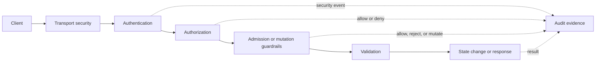

# Kubernetes API Access Control

## What it is

Kubernetes access control is a useful reference model for thinking about protected APIs. It shows access as a request pipeline rather than a single role lookup.

When a request reaches the Kubernetes API server, it passes through several conceptual stages:

1. transport security;
2. authentication;
3. authorization;
4. admission control for mutating or connecting requests;
5. object validation and persistence;
6. auditing.

This page uses Kubernetes as an architecture analogy for IAM and API authorization. It does not recommend Kubernetes as an IAM product, and it does not imply that a small backoffice system should copy Kubernetes complexity.

## Why it matters for IAM

The useful lesson is that access decisions need more than "is this user logged in?" or "does this user have the admin role?" A protected request has a caller, an action, a target resource, request context, policy data, validation rules, and audit consequences.

That framing maps cleanly to internal backoffice IAM:

| Kubernetes concept | IAM and API authorization concept |
| --- | --- |
| API server | Protected API surface that receives requests and enforces the pipeline. |
| Human user | Internal member or administrator. |
| Service account | Machine identity or future service client. |
| Authentication | Verifying the caller through certificate, bearer token, OIDC, session, or another credential. |
| Authorization | Deciding whether the authenticated subject may perform the requested action. |
| RBAC Role and RoleBinding | Role definitions and assignments that grant permissions. |
| SubjectAccessReview | Explicit authorization-check request. |
| Admission control | Extra mutation guardrails after authorization, such as validation, defaulting, or policy checks. |
| Audit event | Security-relevant evidence for actions and decisions. |

The important separation is that each stage answers a different question. Authentication identifies the caller. Authorization checks permissions. Admission-style controls decide whether an otherwise authorized mutation is valid, safe, and policy-compliant.

## Request pipeline

This diagram shows the Kubernetes-inspired access pattern in general API terms.



Read requests may not need admission-style mutation controls, but they still need authentication, authorization, safe response shaping, and sometimes audit events. Write requests usually need the full pipeline.

## Transport security

Kubernetes protects the API server with TLS. Clients must be able to trust the API server certificate, and clients may also present client certificates.

For IAM and backoffice APIs, the parallel is straightforward:

- use HTTPS for browser, BFF, IAM Control Plane, and backend API traffic;
- keep token and session material out of logs;
- validate token issuer, audience, signature or introspection result, and expiry before trusting claims;
- treat mTLS or private-key client authentication as stronger options for service clients where justified.

Transport security protects the channel. It does not replace application-layer authentication or authorization.

## Authentication

Kubernetes can authenticate requests through configured authenticator modules. If authentication succeeds, later stages receive a username and sometimes groups. Kubernetes itself does not store ordinary human users as API objects.

The broader IAM lesson is that identity proof and identity storage are separate concepts. An API may authenticate a request with:

- a browser session established by a BFF;
- an OAuth2 access token;
- an OIDC identity flow followed by token exchange;
- a client certificate;
- a service-account or workload token;
- an external identity provider mapped into local subjects.

After authentication, the system should have stable subject information for authorization and audit. For this study's vocabulary, the subject may be a member, administrator, OAuth client, or future service account. See [IAM Data Model](./22-iam-data-model.md) for the distinction between users, members, subjects, clients, and service accounts.

## Authorization

Kubernetes authorization asks whether a specific subject may perform a specific action against a specific resource. Kubernetes supports multiple authorization modes, including RBAC, ABAC, node authorization, and webhook authorization. When multiple authorizers are configured, the request is allowed if any authorizer approves it.

For a backoffice IAM system, the equivalent request should be explicit:

| Attribute | Example |
| --- | --- |
| Subject | `member_123` |
| Subject type | `member` or `service_account` |
| Action | `disable`, `assign`, `read`, `export` |
| Resource type | `member`, `role`, `client`, `report`, `service` |
| Resource ID or scope | `member_456`, `billing`, `reports-api` |
| Required permission | `members:disable`, `roles:assign`, `reports:export` |
| Context | client ID, request ID, admin route, reason, step-up state, source environment |

This is the same principle behind [PDP, PEP, PIP, and PAP](./17-pdp-pep-pip-pap.md): the protected API is the enforcement point, and the decision needs clear input. A vague "is admin" answer is weaker than "can this subject perform this operation on this target now?"

## RBAC and bindings

Kubernetes RBAC separates roles from role bindings:

- a Role or ClusterRole names allowed verbs on resources;
- a RoleBinding or ClusterRoleBinding grants that role to subjects.

The application-IAM equivalent is:

- a role is a named bundle of permissions;
- a role assignment grants that role to a member or service account;
- a protected operation declares the permission it requires.

That maps directly to [RBAC and Permission Modeling](./05-rbac.md). The main lesson is to keep permissions operation-oriented. A permission such as `members:disable` is easier to enforce and audit than a broad flag such as `admin`.

## Admission control as guardrails

Admission control is the most interesting parallel for privileged administration APIs. In Kubernetes, admission controllers can reject or modify create, update, delete, or connect requests after authorization but before persistence. They can inspect object content, not just subject/action/resource metadata.

For IAM administration, admission-style guardrails are extra checks around dangerous mutations. They are not a replacement for RBAC; they sit after the basic permission check.

Examples:

| Operation | Basic permission | Admission-style guardrail |
| --- | --- | --- |
| Disable member | `members:disable` | Reject if it removes the last usable administrator path. |
| Assign role | `roles:assign` | Reject self-escalation or grants outside the actor's grant boundary. |
| Update role | `roles:update` | Reject adding permissions the actor is not allowed to grant. |
| Register OAuth client | `clients:write` | Reject unsafe redirect URIs, broad audiences, or disallowed flows. |
| Rotate client secret | `clients:write` | Do not expose old secret; audit safe metadata only. |
| Reset authenticator | `members:recover` | Require step-up, approval, reason, or notification where policy requires it. |

For a small backoffice, these can be ordinary server-side checks in the Admin API. They do not require a Kubernetes-like admission framework. The design lesson is to name these controls separately from simple role checks.

## Auditing

Kubernetes auditing records a chronological, security-relevant sequence of actions generated by users, applications, and the control plane.

The IAM parallel is that privileged changes and sensitive denials should produce useful evidence:

- actor;
- client or session context;
- action;
- target;
- result;
- timestamp;
- request ID;
- safe reason or ticket reference;
- safe before/after metadata where useful.

Audit records should not include bearer tokens, refresh tokens, passwords, client secrets, private keys, recovery codes, or raw session identifiers. See [Auditability, Access Reviews, and Operational Ownership](./10-auditability-access-reviews-operational-ownership.md) for the broader governance model.

## Applying the model to backoffice APIs

A protected backend API request can follow the same layered shape:

```text
BFF -> Billing API: GET /reports/monthly with access token
Billing API: validate TLS and request shape
Billing API: validate token issuer, audience, signature, and expiry
Billing API: identify subject and client
Billing API: check required permission reports:read
Billing API: apply local business constraints
Billing API: return data or deny
Billing API: record safe security and audit context where required
```

An Admin API mutation should be stricter:

```text
BFF -> IAM Admin API: POST /members/{id}/disable
IAM Admin API: validate session/token and audience
IAM Admin API: authenticate actor
IAM Admin API: authorize members:disable
IAM Admin API: reject unsafe self-action or last-admin lockout
IAM Admin API: update member lifecycle state
IAM Admin API: revoke or constrain future access according to token policy
IAM Admin API: write audit event
```

The second flow shows why "has permission" is necessary but not sufficient. Some operations can reshape future authority and need extra controls.

## Control-plane lesson

Kubernetes is a control plane for cluster state. Its API server is the main protected management surface, and access to that surface is carefully layered.

An IAM Control Plane has a similar shape in a different domain:

- it owns IAM state such as members, roles, permissions, clients, keys, service accounts, and audit events;
- it exposes privileged administration operations;
- it authenticates or integrates authentication for subjects;
- it issues or validates token contracts;
- it supports runtime authorization inputs for resource servers.

The lesson is not to build an IAM system like Kubernetes. The lesson is to treat the IAM Control Plane Admin API as a high-risk control-plane API and to keep backend resource servers responsible for operation-level enforcement.

## Common mistakes

Treating authentication as authorization is the first failure mode. A logged-in member is not automatically allowed to disable another member, assign a role, or export reports.

Relying only on a frontend or BFF check leaves the real API unprotected. The protected API must enforce the rule server-side.

Putting every rule into one `admin` role hides dangerous differences between read, write, assignment, recovery, client management, and audit access.

Skipping admission-style guardrails lets authorized administrators perform unsafe mutations, such as self-escalation or last-admin lockout.

Treating service accounts as human users blurs audit trails and can give automation broader authority than intended.

Failing to audit denied privileged attempts removes useful incident-response evidence.

Copying Kubernetes complexity directly into a small backoffice can overfit the solution. Use the pipeline and vocabulary; only add mechanisms when requirements justify them.

## Related pages

- [Authentication vs Authorization](./01-authentication-vs-authorization.md)
- [RBAC and Permission Modeling](./05-rbac.md)
- [Service-to-Service Authentication](./07-service-to-service-authentication.md)
- [Administration API](./08-admin-api.md)
- [Auditability, Access Reviews, and Operational Ownership](./10-auditability-access-reviews-operational-ownership.md)
- [IAM Control Plane vs Data Plane](./14-iam-control-plane-vs-data-plane.md)
- [IAM Responsibility Model](./16-iam-responsibility-model.md)
- [PDP, PEP, PIP, and PAP](./17-pdp-pep-pip-pap.md)
- [Authorization Models](./18-authorization-models.md)
- [IAM Data Model](./22-iam-data-model.md)
- [Key Management and Signing Keys](./23-key-management-and-signing-keys.md)

## References

- [Kubernetes - Controlling Access to the Kubernetes API](https://kubernetes.io/docs/concepts/security/controlling-access/)
- [Kubernetes - Authenticating](https://kubernetes.io/docs/reference/access-authn-authz/authentication/)
- [Kubernetes - Authorization](https://kubernetes.io/docs/reference/access-authn-authz/authorization/)
- [Kubernetes - Using RBAC Authorization](https://kubernetes.io/docs/reference/access-authn-authz/rbac/)
- [Kubernetes - Admission Control](https://kubernetes.io/docs/reference/access-authn-authz/admission-controllers/)
- [Kubernetes - Auditing](https://kubernetes.io/docs/tasks/debug/debug-cluster/audit/)
- [Kubernetes - Service Accounts](https://kubernetes.io/docs/concepts/security/service-accounts/)
