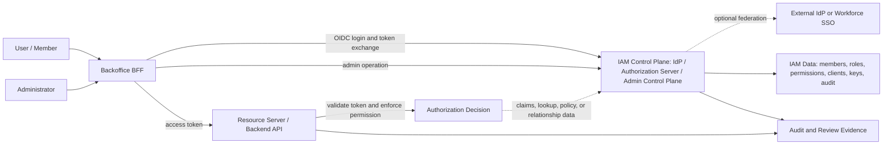
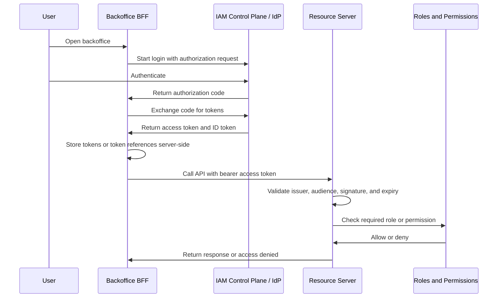

# Internal Backoffice IAM Wiki

This wiki is the conceptual IAM reference for the internal backoffice IAM Control Plane study. It explains vocabulary, protocols, authorization, security, operations, and industry architecture patterns without choosing a vendor, product, hosting model, database, or final architecture.

## Reading Path

Read the wiki in this order if you want the domain to build progressively.

### 1. Build the mental model

1. [IAM Architecture](./15-iam-architecture.md)
2. [IAM Control Plane vs Data Plane](./14-iam-control-plane-vs-data-plane.md)
3. [IAM Responsibility Model](./16-iam-responsibility-model.md)
4. [IAM Data Model](./22-iam-data-model.md)
5. [Authentication vs Authorization](./01-authentication-vs-authorization.md)

### 2. Learn the protocol foundation

1. [OAuth2](./02-oauth2.md)
2. [OpenID Connect](./03-openid-connect.md)
3. [OAuth2 Flows](./06-oauth2-flows.md)
4. [Web Sessions, Cookies, and BFF Pattern](./24-web-sessions-cookies-and-bff.md)
5. [Tokens and JWTs](./04-tokens-and-jwt.md)
6. [Token Lifecycle](./12-token-lifecycle.md)
7. [OAuth Client Management](./13-oauth-client-management.md)
8. [Key Management and Signing Keys](./23-key-management-and-signing-keys.md)

### 3. Learn authorization and enforcement

1. [RBAC](./05-rbac.md)
2. [Authorization Models](./18-authorization-models.md)
3. [PDP, PEP, PIP, and PAP](./17-pdp-pep-pip-pap.md)
4. [Kubernetes API Access Control](./25-kubernetes-api-access-control.md)
5. [Policy Engines and Fine-Grained Authorization](./21-policy-engines-and-fine-grained-authorization.md)
6. [Admin API](./08-admin-api.md)
7. [Service-to-Service Authentication](./07-service-to-service-authentication.md)

### 4. Learn identity lifecycle and enterprise integration

1. [MFA, 2FA, Passwordless, and One-Time Passwords](./11-mfa-2fa-passwordless-and-otp.md)
2. [Federation and Enterprise SSO](./19-federation-and-enterprise-sso.md)
3. [Identity Provisioning and SCIM](./20-identity-provisioning-and-scim.md)
4. [Auditability, Access Reviews, and Operational Ownership](./10-auditability-access-reviews-operational-ownership.md)

### 5. Read the security baseline

1. [Security Best Practices](./09-security-best-practices.md)

## Page Map

| Page | Read when you need to answer |
| --- | --- |
| [01 - Authentication vs Authorization](./01-authentication-vs-authorization.md) | What is the difference between proving identity and deciding access? |
| [02 - OAuth2](./02-oauth2.md) | What is OAuth2, and what are authorization servers, clients, scopes, resource owners, and resource servers? |
| [03 - OpenID Connect](./03-openid-connect.md) | How does OIDC add login and identity information on top of OAuth2? |
| [04 - Tokens and JWTs](./04-tokens-and-jwt.md) | What are access tokens, ID tokens, refresh tokens, JWTs, claims, signatures, issuers, and audiences? |
| [05 - RBAC](./05-rbac.md) | How should members, roles, permissions, assignments, and operation-level checks be modeled? |
| [06 - OAuth2 Flows](./06-oauth2-flows.md) | Which OAuth2/OIDC flows matter for browser login, BFFs, refresh, and service clients? |
| [07 - Service-to-Service Authentication](./07-service-to-service-authentication.md) | How should future machine clients and service accounts authenticate without pretending to be users? |
| [08 - Admin API](./08-admin-api.md) | What makes an IAM administration API high risk, and how should privileged mutations be controlled? |
| [09 - Security Best Practices](./09-security-best-practices.md) | What conservative security rules should guide the whole IAM design? |
| [10 - Auditability, Access Reviews, and Operational Ownership](./10-auditability-access-reviews-operational-ownership.md) | What evidence and operating model are needed to explain, review, and recover from IAM changes? |
| [11 - MFA, 2FA, Passwordless, and One-Time Passwords](./11-mfa-2fa-passwordless-and-otp.md) | How should stronger authentication, OTP, passkeys, recovery, and step-up be understood? |
| [12 - Token Lifecycle](./12-token-lifecycle.md) | How do issuance, storage, validation, refresh, revocation, logout, key rotation, and stale access fit together? |
| [13 - OAuth Client Management](./13-oauth-client-management.md) | How should OAuth2/OIDC clients, redirect URIs, grants, secrets, keys, and lifecycle be governed? |
| [14 - IAM Control Plane vs Data Plane](./14-iam-control-plane-vs-data-plane.md) | What belongs in the IAM Control Plane, what belongs in runtime enforcement, and what root problems does the split solve? |
| [15 - IAM Architecture](./15-iam-architecture.md) | What is the overall industry map across identity platforms, cloud IAM, self-hosted IdPs, libraries, policy engines, and hybrid systems? |
| [16 - IAM Responsibility Model](./16-iam-responsibility-model.md) | Which component or team owns each IAM responsibility, and where do provider boundaries end? |
| [17 - PDP, PEP, PIP, and PAP](./17-pdp-pep-pip-pap.md) | Where are policies authored, decisions made, attributes sourced, and decisions enforced? |
| [18 - Authorization Models](./18-authorization-models.md) | How do RBAC, ABAC, ReBAC, ACLs, scopes, claims, entitlements, and policy engines compare? |
| [19 - Federation and Enterprise SSO](./19-federation-and-enterprise-sso.md) | What does enterprise SSO solve, how do OIDC and SAML fit, and what remains local to the app? |
| [20 - Identity Provisioning and SCIM](./20-identity-provisioning-and-scim.md) | How are users and groups created, updated, disabled, synchronized, and deprovisioned across systems? |
| [21 - Policy Engines and Fine-Grained Authorization](./21-policy-engines-and-fine-grained-authorization.md) | How do OPA, Cedar, Verified Permissions, OpenFGA, SpiceDB, and Zanzibar-style systems solve detailed authorization problems? |
| [22 - IAM Data Model](./22-iam-data-model.md) | What are principals, subjects, users, members, identities, accounts, groups, roles, permissions, clients, service accounts, tenants, and organizations? |
| [23 - Key Management and Signing Keys](./23-key-management-and-signing-keys.md) | How do JWKS, signing keys, key rotation, client secrets, private key JWT, mTLS, certificates, and secret storage fit IAM? |
| [24 - Web Sessions, Cookies, and BFF Pattern](./24-web-sessions-cookies-and-bff.md) | How do browser sessions, cookies, CSRF, browser token storage, refresh tokens, and the BFF pattern work? |
| [25 - Kubernetes API Access Control](./25-kubernetes-api-access-control.md) | How does Kubernetes' access-control pipeline map to IAM authentication, authorization, admission-style guardrails, and audit? |

## Vocabulary

| Term | Short meaning |
| --- | --- |
| Authentication | Verifies who a user, service, or application is. |
| Authorization | Decides what an authenticated subject may access. |
| Member | Company-managed human account in the backoffice IAM domain. |
| Administrator | Privileged member who can manage IAM data. |
| Client | OAuth2/OIDC application registered with the authorization server. |
| Identity provider | Authenticates users and provides identity information. |
| Authorization server | Issues OAuth2 access tokens and runs authorization flows. |
| IAM Control Plane | Study shorthand for the central IdP / Authorization Server / Admin Control Plane. |
| BFF | Backend-for-Frontend that holds browser sessions and handles OIDC callbacks server-side. |
| Resource server | Protected API that validates tokens and enforces access. |
| Session | Continuity state for a browser or user interaction. |
| Signing key | Key used by an issuer to sign tokens. |
| JWKS | Public key set used by resource servers and clients to verify JWT signatures. |
| Role | Business-level access group. |
| Permission | Granular capability such as `members:read` or `roles:assign`. |
| Scope | OAuth2 delegated access requested by a client. |
| Claim | Token field carrying an assertion after token validation. |
| PDP | Policy Decision Point. |
| PEP | Policy Enforcement Point. |
| PIP | Policy Information Point. |
| PAP | Policy Administration Point. |
| Admission control | Post-authorization checks that can reject or modify sensitive mutating requests before state changes are persisted. |

## Model Summary

IAM combines identity, tokens, clients, APIs, authorization data, administration, and operations. These terms are easy to blur, so the wiki keeps them separate on purpose.

OAuth2 and OIDC are related but not the same thing. OAuth2 is about delegated authorization and access tokens. OIDC adds an identity layer for login and ID tokens. A system can use both: OIDC to authenticate the user and OAuth2 access tokens to call protected APIs. See [OAuth2](./02-oauth2.md) and [OpenID Connect](./03-openid-connect.md) for the detailed distinction.

## Conceptual Architecture

This diagram is a vocabulary map, not a final deployment design.

In many systems, the OAuth2 authorization server, OIDC identity provider, and administration control plane are treated as one central IAM component. This study calls that central component the IAM Control Plane. It may still be implemented by one product, multiple products, a managed provider, a self-hosted product, a library-based service, or a hybrid.

The key responsibility boundary is that IAM data is managed by the authorization and administration side. A resource server should not need to own member, role, permission, client, key, or service account records. It validates tokens and enforces access using trusted token claims, issuer metadata and keys, token introspection, local policy, or an explicit authorization lookup depending on the eventual design.

## End-to-End Login and API Flow

A typical internal backoffice login flow looks like this:

The important separation is that login is not the same as API authorization. A successful login proves the user authenticated. It does not automatically mean the user can read members, update billing data, create clients, or call an administrator-only endpoint. The resource server still needs to validate the access token and enforce the required permission for the requested operation.

For browser-based backoffice clients, the modern OAuth2 direction is Authorization Code Flow with PKCE rather than the older Implicit Flow. See [OAuth2 Flows](./06-oauth2-flows.md) and [Web Sessions, Cookies, and BFF Pattern](./24-web-sessions-cookies-and-bff.md) for why token exposure and redirect handling matter.

## Administration Flow

Administrators need privileged operations that ordinary members should never receive by accident. The administration API is the management surface for IAM data.

Examples of administration operations include:

- creating, reading, updating, disabling, and deleting members;
- creating and listing roles;
- assigning and removing roles from members;
- managing permissions and clients;
- managing service accounts or machine clients when service-to-service access is needed;
- checking whether a member has a required role or permission for a backoffice service.

The administration API must itself be protected like any other resource server, with stronger authorization because mistakes have a larger blast radius. Admin endpoints should be checked server-side, audited, rate limited where relevant, and designed so authorization decisions are explicit rather than implied by frontend UI state.

See [Admin API](./08-admin-api.md) for the dedicated page.

## Service-to-Service Flow

Service-to-service authentication is separate from human browser login. Backend services may need to call other internal services without a browser session. In OAuth2 terms, these services can be clients acting on their own behalf, commonly using Client Credentials Flow.

The service receives an access token representing the service client, then calls a resource server. The resource server validates the token and checks service-level permissions. These permissions should be modeled separately so a service account does not accidentally inherit broad human administrator privileges.

See [Service-to-Service Authentication](./07-service-to-service-authentication.md) for the dedicated page.

## Common Mistakes

Do not treat authentication as authorization. Knowing that `alice@example.com` logged in is different from knowing that Alice can perform `members:delete`.

Do not treat an ID token as an API access token. ID tokens are for the client to learn authentication and identity information about the user. APIs should validate access tokens intended for them.

Do not rely on frontend-only authorization. Hiding a button in the backoffice UI can improve usability, but the resource server must enforce the rule.

Do not confuse scopes, roles, permissions, and claims. Scopes describe delegated access requested by a client. Roles group business access for members. Permissions describe granular capabilities. Claims are token fields that may carry identity, token metadata, roles, permissions, or other assertions.

Do not skip token validation details. A resource server should validate issuer, audience, signature, expiration, and relevant token constraints before trusting token contents.

Do not expose administration APIs as ordinary APIs. They change IAM state and should require explicit administrator authorization, audit logging, and conservative operational controls.

## How Pages Connect

| If a page mentions | Go to |
| --- | --- |
| OAuth2, scopes, authorization server, client | [OAuth2](./02-oauth2.md) |
| OIDC, ID token, UserInfo, discovery | [OpenID Connect](./03-openid-connect.md) |
| JWT, issuer, audience, claim, signature | [Tokens and JWTs](./04-tokens-and-jwt.md) |
| Authorization Code Flow, PKCE, refresh tokens, client credentials | [OAuth2 Flows](./06-oauth2-flows.md) |
| Token expiry, revocation, introspection, JWKS, logout | [Token Lifecycle](./12-token-lifecycle.md) |
| Signing keys, JWKS, `kid`, client secrets, private key JWT, mTLS | [Key Management and Signing Keys](./23-key-management-and-signing-keys.md) |
| Cookies, browser sessions, CSRF, BFF, browser token storage | [Web Sessions, Cookies, and BFF Pattern](./24-web-sessions-cookies-and-bff.md) |
| Principals, subjects, members, identities, accounts, tenants | [IAM Data Model](./22-iam-data-model.md) |
| Roles, permissions, assignments | [RBAC](./05-rbac.md) and [Authorization Models](./18-authorization-models.md) |
| PEP, PDP, PIP, PAP, policy engine | [PDP, PEP, PIP, and PAP](./17-pdp-pep-pip-pap.md) and [Policy Engines and Fine-Grained Authorization](./21-policy-engines-and-fine-grained-authorization.md) |
| Kubernetes API access pipeline, admission control, SubjectAccessReview | [Kubernetes API Access Control](./25-kubernetes-api-access-control.md) |
| Admin operations, IAM mutations, privileged API | [Admin API](./08-admin-api.md) |
| Service accounts or machine clients | [Service-to-Service Authentication](./07-service-to-service-authentication.md) |
| SSO, SAML, external IdP, identity broker | [Federation and Enterprise SSO](./19-federation-and-enterprise-sso.md) |
| Provisioning, deprovisioning, groups, SCIM | [Identity Provisioning and SCIM](./20-identity-provisioning-and-scim.md) |
| Audit logs, access reviews, operations, ownership | [Auditability, Access Reviews, and Operational Ownership](./10-auditability-access-reviews-operational-ownership.md) |
