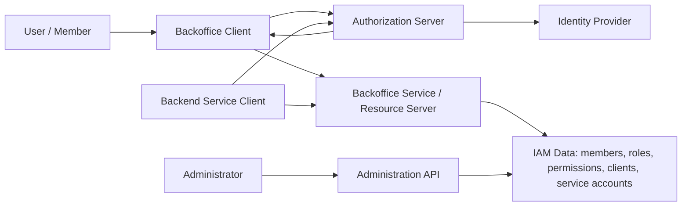
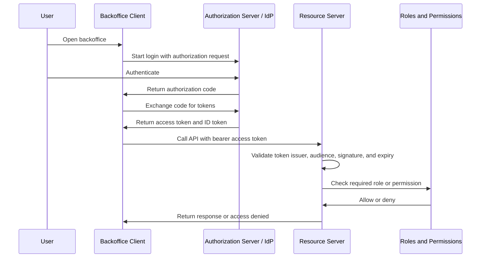

# Internal Backoffice IAM Wiki

This wiki is the Phase 1 documentation for an internal backoffice authorization server study. Its purpose is to build a shared, evidence-backed understanding of identity and access management before any product, vendor, architecture, or implementation decision is made.

The audience is senior engineers who understand backend systems, APIs, distributed systems, databases, and general security concepts, but who may not work with IAM, OAuth2, OpenID Connect, JWTs, token validation, or RBAC every day.

This page is the entry point. It introduces the big picture, shows how the main parts interact, and links to the topic pages that will fill in the details.

## Phase 1 boundary

Phase 1 is documentation-only. The wiki should explain the concepts and trade-offs needed for a later decision, but it should not recommend a final authorization server design, identity provider, vendor, hosting model, database, deployment topology, or production implementation.

For this study, the future system is assumed to protect internal backoffice services for fewer than 1,000 users. Public account registration is out of scope. Members are created and managed by administrators. RBAC is required. The goal is to keep the eventual system simple, maintainable, understandable, and operable by the internal team.

## Page map

| Page | Purpose |
| --- | --- |
| [Authentication vs Authorization](./01-authentication-vs-authorization.md) | Defines the boundary between verifying identity and deciding access. |
| [OAuth2](./02-oauth2.md) | Explains OAuth2 as an authorization framework with clients, resource owners, scopes, access tokens, authorization servers, and resource servers. |
| [OpenID Connect](./03-openid-connect.md) | Explains OIDC as an identity layer on top of OAuth2 for login, ID tokens, user claims, UserInfo, and discovery. |
| [Tokens and JWTs](./04-tokens-and-jwt.md) | Covers access tokens, ID tokens, refresh tokens, JWT structure, claims, signatures, expiration, audiences, issuers, and opaque token trade-offs. |
| [RBAC](./05-rbac.md) | Explains members, users, administrators, roles, permissions, role assignment, permission checks, and how ABAC compares. |
| [OAuth2 Flows](./06-oauth2-flows.md) | Covers Authorization Code Flow, Authorization Code Flow with PKCE, Client Credentials Flow, and Refresh Token Flow. |
| [Service-to-Service Authentication](./07-service-to-service-authentication.md) | Covers machine-to-machine authentication, service accounts, client credentials, private key JWT, mTLS, and service permissions. |
| [Admin API](./08-admin-api.md) | Covers administrator-only APIs for members, roles, permissions, clients, service accounts, audit logs, and privileged operations. |
| [Security Best Practices](./09-security-best-practices.md) | Summarizes conservative security practices for tokens, secrets, PKCE, validation, least privilege, auditability, rate limiting, and password handling. |

Some links may point to pages that are planned but not yet written.

## Big-picture model

IAM combines identity, tokens, clients, APIs, and authorization data. The terms are easy to blur, so this wiki keeps them separate:

- **Authentication** verifies who a user, service, or application is.
- **Authorization** decides what an authenticated subject may access.
- A **member** is a company-managed user account.
- A **user** is a human actor using the system.
- An **administrator** is a privileged user who manages IAM data.
- A **client** is an OAuth2/OIDC application registered with the authorization server.
- An **authorization server** issues tokens and runs OAuth2 authorization flows.
- An **identity provider** authenticates users and provides identity information.
- A **resource server** is an API or backend service that validates tokens and enforces access control.
- A **role** is a business-level access group, such as `admin`, `support`, `manager`, or `viewer`.
- A **permission** is a granular capability, such as `members:read` or `billing:write`.
- A **scope** is delegated access requested by a client.
- A **claim** is a piece of information inside a token.

OAuth2 and OIDC are related but not the same thing. OAuth2 is about delegated authorization and access tokens. OIDC adds an identity layer for login and ID tokens. A system can use both: OIDC to authenticate the user and OAuth2 access tokens to call protected APIs. See [OAuth2](./02-oauth2.md) and [OpenID Connect](./03-openid-connect.md) for the detailed distinction.

## Conceptual architecture

The diagram below is a vocabulary map, not a final architecture recommendation.

In practice, these boxes may be separate systems, modules inside one system, or capabilities provided by existing software. Phase 1 does not choose which arrangement is best. It only explains what each responsibility means and what evidence should inform later decisions.

## End-to-end login and API flow

A typical internal backoffice login flow looks like this:

The important separation is that login is not the same as API authorization. A successful login proves the user authenticated. It does not automatically mean the user can read members, update billing data, create clients, or call an administrator-only endpoint. The resource server still needs to validate the access token and enforce the required permission for the requested operation.

For browser-based backoffice clients, the modern OAuth2 direction is Authorization Code Flow with PKCE rather than the older Implicit Flow. See [OAuth2 Flows](./06-oauth2-flows.md) and the OAuth2 security best current practice for why token exposure and redirect handling matter.

## Administration flow

Administrators need privileged operations that ordinary members should never receive by accident. The administration API is the management surface for IAM data.

Examples of administration operations include:

- creating, reading, updating, disabling, and deleting members;
- listing members;
- creating and listing roles;
- assigning and removing roles from members;
- managing permissions and clients;
- managing service accounts or machine clients;
- checking whether a member has a required role or permission for a backoffice service.

The administration API must itself be protected like any other resource server, with stronger authorization because mistakes have a larger blast radius. Admin endpoints should be checked server-side, audited, rate limited where relevant, and designed so that authorization decisions are explicit rather than implied by frontend UI state.

See [Admin API](./08-admin-api.md) for the dedicated page.

## Service-to-service flow

Not every caller is a human user. Backend services may need to call other internal services without a browser session. In OAuth2 terms, these services can be clients acting on their own behalf, commonly using Client Credentials Flow.

The service receives an access token representing the service client, then calls a resource server. The resource server validates the token and checks service-level permissions. These permissions should be modeled separately enough that a service account does not accidentally inherit broad human administrator privileges.

See [Service-to-Service Authentication](./07-service-to-service-authentication.md) for the dedicated page.

## Common mistakes to avoid

Do not treat authentication as authorization. Knowing that `alice@example.com` logged in is different from knowing that Alice can perform `members:delete`.

Do not treat an ID token as an API access token. ID tokens are for the client to learn authentication and identity information about the user. APIs should validate access tokens intended for them.

Do not rely on frontend-only authorization. Hiding a button in the backoffice UI can improve usability, but the resource server must enforce the rule.

Do not confuse scopes, roles, permissions, and claims. Scopes describe delegated access requested by a client. Roles group business access for members. Permissions describe granular capabilities. Claims are token fields that may carry identity, token metadata, roles, permissions, or other assertions depending on the system.

Do not skip token validation details. A resource server should validate issuer, audience, signature, expiration, and relevant token constraints before trusting token contents. Some systems validate self-contained JWTs locally; others use opaque tokens with introspection. The trade-off belongs in the token page, not in the README.

Do not expose administration APIs as ordinary APIs. They change IAM state and should require explicit administrator authorization, audit logging, and conservative operational controls.

## References

- [RFC 6749 - The OAuth 2.0 Authorization Framework](https://www.rfc-editor.org/rfc/rfc6749)
- [RFC 6750 - The OAuth 2.0 Authorization Framework: Bearer Token Usage](https://www.rfc-editor.org/rfc/rfc6750)
- [RFC 7519 - JSON Web Token (JWT)](https://www.rfc-editor.org/rfc/rfc7519)
- [RFC 7636 - Proof Key for Code Exchange by OAuth Public Clients](https://www.rfc-editor.org/rfc/rfc7636)
- [RFC 8414 - OAuth 2.0 Authorization Server Metadata](https://www.rfc-editor.org/rfc/rfc8414)
- [RFC 9700 - Best Current Practice for OAuth 2.0 Security](https://www.rfc-editor.org/rfc/rfc9700)
- [OpenID Connect Core 1.0](https://openid.net/specs/openid-connect-core-1_0.html)
- [OpenID Connect Discovery 1.0](https://openid.net/specs/openid-connect-discovery-1_0.html)
- [OWASP API Security](https://owasp.org/API-Security/)
- [OWASP Authentication Cheat Sheet](https://cheatsheetseries.owasp.org/cheatsheets/Authentication_Cheat_Sheet.html)
- [OWASP Authorization Cheat Sheet](https://cheatsheetseries.owasp.org/cheatsheets/Authorization_Cheat_Sheet.html)
- [NIST SP 800-63-4 - Digital Identity Guidelines](https://pages.nist.gov/800-63-4/)
